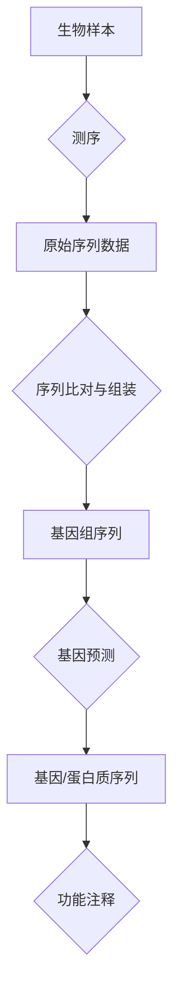

# 03.7.3 生物信息学（Bioinformatics）

## 目录

- [03.7.3 生物信息学（Bioinformatics）](#0373-生物信息学bioinformatics)
  - [目录](#目录)
  - [1. 定义与背景](#1-定义与背景)
  - [2. 核心应用](#2-核心应用)
  - [3. 与形式语言理论的关联](#3-与形式语言理论的关联)
  - [4. 多表征内容](#4-多表征内容)
    - [生物序列分析流程](#生物序列分析流程)
  - [5. 交叉引用](#5-交叉引用)
  - [6. 参考文献](#6-参考文献)
  - [批判性分析](#批判性分析)

---

## 1. 定义与背景

生物信息学是一个交叉学科领域，它开发和应用计算工具和方法来存储、检索、组织和分析生物数据。

---

## 2. 核心应用

- **序列比对 (Sequence Alignment)**: 比较DNA、RNA或蛋白质序列，以识别相似性。
- **基因预测 (Gene Finding)**: 在DNA序列中识别编码蛋白质的区域。
- **蛋白质结构预测 (Protein Structure Prediction)**: 预测蛋白质的三维结构。
- **系统发育分析 (Phylogenetic Analysis)**: 构建进化树来表示物种间的进化关系。

---

## 3. 与形式语言理论的关联

- **序列建模**: 生物序列（如DNA）可以被视为由字母表 {A, C, G, T} 构成的字符串。形式文法可以用来描述序列中存在的模式（如基因结构）。
- **模式匹配**: 正则表达式和有限自动机被广泛用于在大型生物数据库中搜索特定的序列模式。
- **结构预测**: 随机上下文无关文法（SCFG）被用于预测RNA的二级结构。

---

## 4. 多表征内容

### 生物序列分析流程

---

## 5. 交叉引用

- [语言应用总览](README.md)
- [正则语言](../03.3_Language_Hierarchy/03.3.1_Regular_Languages.md)
- [算法理论](README.md)

---

## 6. 参考文献

1. Durbin, Richard, et al. *Biological Sequence Analysis*. 1998.
2. Jones, Neil C., and Pavel A. Pevzner. *An Introduction to Bioinformatics Algorithms*. 2004.

## 批判性分析

### 多元理论视角

- 计算视角：生物信息学将生物学问题转化为计算问题，通过算法和数据结构处理大规模生物数据。
- 统计视角：利用统计学方法分析生物序列的随机性和模式，建立概率模型。
- 语言视角：将生物序列视为形式语言，应用形式语言理论进行模式识别和结构预测。
- 系统视角：从系统生物学角度研究生物分子网络的整体性质和动态行为。

### 局限性

- 数据质量依赖：分析结果高度依赖测序数据的质量和完整性。
- 模型简化：计算模型往往过度简化复杂的生物学过程。
- 计算复杂性：大规模基因组分析面临计算资源和时间限制。
- 生物学验证：计算预测需要实验验证，存在预测与实验的差距。

### 争议与分歧

- 算法选择：不同比对算法和参数设置对结果的影响争议。
- 数据隐私：基因组数据的隐私保护和伦理问题。
- 模型准确性：机器学习模型在生物预测中的可解释性和准确性。
- 标准化问题：不同数据库和工具之间的数据格式和标准不统一。

### 应用前景

- 精准医学：基于个体基因组信息的个性化医疗和药物开发。
- 合成生物学：设计和构建新的生物系统和生物元件。
- 进化生物学：通过比较基因组学研究物种进化和适应性。
- 农业生物技术：作物改良和抗性基因的识别与利用。

### 改进建议

- 发展多组学整合：结合基因组、转录组、蛋白质组等多层次数据。
- 推进人工智能：利用深度学习和机器学习提高预测准确性。
- 加强实验验证：建立计算预测与实验验证的闭环系统。
- 跨学科合作：加强生物学、计算机科学、数学等领域的深度融合。
