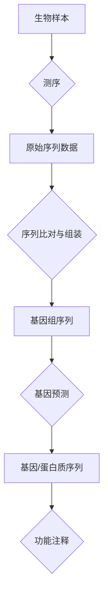

# 03.7.3 生物信息学（Bioinformatics）

## 目录

- [03.7.3 生物信息学（Bioinformatics）](#0373-生物信息学bioinformatics)
  - [目录](#目录)
  - [1. 定义与背景](#1-定义与背景)
  - [2. 核心应用](#2-核心应用)
  - [3. 与形式语言理论的关联](#3-与形式语言理论的关联)
  - [4. 多表征内容](#4-多表征内容)
    - [生物序列分析流程](#生物序列分析流程)
  - [5. 交叉引用](#5-交叉引用)
  - [6. 参考文献](#6-参考文献)
  - [批判性分析](#批判性分析)

---

## 1. 定义与背景

生物信息学是一个交叉学科领域，它开发和应用计算工具和方法来存储、检索、组织和分析生物数据。

---

## 2. 核心应用

- **序列比对 (Sequence Alignment)**: 比较DNA、RNA或蛋白质序列，以识别相似性。
- **基因预测 (Gene Finding)**: 在DNA序列中识别编码蛋白质的区域。
- **蛋白质结构预测 (Protein Structure Prediction)**: 预测蛋白质的三维结构。
- **系统发育分析 (Phylogenetic Analysis)**: 构建进化树来表示物种间的进化关系。

---

## 3. 与形式语言理论的关联

- **序列建模**: 生物序列（如DNA）可以被视为由字母表 {A, C, G, T} 构成的字符串。形式文法可以用来描述序列中存在的模式（如基因结构）。
- **模式匹配**: 正则表达式和有限自动机被广泛用于在大型生物数据库中搜索特定的序列模式。
- **结构预测**: 随机上下文无关文法（SCFG）被用于预测RNA的二级结构。

---

## 4. 多表征内容

### 生物序列分析流程

---

## 5. 交叉引用

- [语言应用总览](README.md)
- [正则语言](../03.3_Language_Hierarchy/03.3.1_Regular_Languages.md)
- [算法理论](README.md)

---

## 6. 参考文献

1. Durbin, Richard, et al. *Biological Sequence Analysis*. 1998.
2. Jones, Neil C., and Pavel A. Pevzner. *An Introduction to Bioinformatics Algorithms*. 2004.

## 批判性分析

- 本节内容待补充：请从多元理论视角、局限性、争议点、应用前景等方面进行批判性分析。
