# 形式语言理论体系

## 📋 概述

**模块**: 03. 形式语言理论  
**版本**: v1.0  
**创建时间**: 2024-12-21  
**维护状态**: 持续构建中  

## 🎯 核心目标

建立严格的形式化语言理论体系，为形式科学提供语言理论基础。

## 📚 目录结构

### 03.1 自动机理论 (01_Automata_Theory)

- [03.1.1 有限自动机](./01_Automata_Theory/03.1.1_Finite_Automata.md)
- [03.1.2 下推自动机](./01_Automata_Theory/03.1.2_Pushdown_Automata.md)
- [03.1.3 线性有界自动机](./01_Automata_Theory/03.1.3_Linear_Bounded_Automata.md)
- [03.1.4 图灵机](./01_Automata_Theory/03.1.4_Turing_Machines.md)

### 03.2 文法理论 (02_Grammar_Theory)

- [03.2.1 正则文法](./02_Grammar_Theory/03.2.1_Regular_Grammars.md)
- [03.2.2 上下文无关文法](./02_Grammar_Theory/03.2.2_Context_Free_Grammars.md)
- [03.2.3 上下文有关文法](./02_Grammar_Theory/03.2.3_Context_Sensitive_Grammars.md)
- [03.2.4 无限制文法](./02_Grammar_Theory/03.2.4_Unrestricted_Grammars.md)

### 03.3 语言层次理论 (03_Language_Hierarchy)

- [03.3.1 乔姆斯基谱系](./03_Language_Hierarchy/03.3.1_Chomsky_Hierarchy.md)
- [03.3.2 语言分类](./03_Language_Hierarchy/03.3.2_Language_Classification.md)
- [03.3.3 语言性质](./03_Language_Hierarchy/03.3.3_Language_Properties.md)
- [03.3.4 语言关系](./03_Language_Hierarchy/03.3.4_Language_Relations.md)

### 03.4 解析理论 (04_Parsing_Theory)

- [03.4.1 LL解析](./04_Parsing_Theory/03.4.1_LL_Parsing.md)
- [03.4.2 LR解析](./04_Parsing_Theory/03.4.2_LR_Parsing.md)
- [03.4.3 递归下降解析](./04_Parsing_Theory/03.4.3_Recursive_Descent_Parsing.md)
- [03.4.4 自底向上解析](./04_Parsing_Theory/03.4.4_Bottom_Up_Parsing.md)

### 03.5 语义理论 (05_Semantics_Theory)

- [03.5.1 操作语义](./05_Semantics_Theory/03.5.1_Operational_Semantics.md)
- [03.5.2 指称语义](./05_Semantics_Theory/03.5.2_Denotational_Semantics.md)
- [03.5.3 公理语义](./05_Semantics_Theory/03.5.3_Axiomatic_Semantics.md)
- [03.5.4 代数语义](./05_Semantics_Theory/03.5.4_Algebraic_Semantics.md)

### 03.6 计算理论 (06_Computation_Theory)

- [03.6.1 可计算性理论](./06_Computation_Theory/03.6.1_Computability_Theory.md)
- [03.6.2 复杂性理论](./06_Computation_Theory/03.6.2_Complexity_Theory.md)
- [03.6.3 算法分析](./06_Computation_Theory/03.6.3_Algorithm_Analysis.md)
- [03.6.4 计算模型](./06_Computation_Theory/03.6.4_Computation_Models.md)

### 03.7 语言应用 (07_Language_Applications)

- [03.7.1 编译器设计](./07_Language_Applications/03.7.1_Compiler_Design.md)
- [03.7.2 自然语言处理](./07_Language_Applications/03.7.2_Natural_Language_Processing.md)
- [03.7.3 协议设计](./07_Language_Applications/03.7.3_Protocol_Design.md)
- [03.7.4 形式验证](./07_Language_Applications/03.7.4_Formal_Verification.md)

### 03.8 语言前沿 (08_Language_Frontiers)

- [03.8.1 量子语言](./08_Language_Frontiers/03.8.1_Quantum_Languages.md)
- [03.8.2 生物语言](./08_Language_Frontiers/03.8.2_Biological_Languages.md)
- [03.8.3 神经语言](./08_Language_Frontiers/03.8.3_Neural_Languages.md)
- [03.8.4 认知语言](./08_Language_Frontiers/03.8.4_Cognitive_Languages.md)

## 🔗 快速导航

### 核心理论链接

- [自动机理论](./01_Automata_Theory/README.md)
- [文法理论](./02_Grammar_Theory/README.md)
- [语言层次理论](./03_Language_Hierarchy/README.md)
- [解析理论](./04_Parsing_Theory/README.md)
- [语义理论](./05_Semantics_Theory/README.md)
- [计算理论](./06_Computation_Theory/README.md)
- [语言应用](./07_Language_Applications/README.md)
- [语言前沿](./08_Language_Frontiers/README.md)

### 交叉领域链接

- [哲学基础理论](../01_Philosophical_Foundation/README.md)
- [数学基础理论](../02_Mathematical_Foundation/README.md)
- [类型理论](../04_Type_Theory/README.md)

## 📊 知识图谱

```mermaid
graph TD
    A[形式语言理论] --> B[自动机理论]
    A --> C[文法理论]
    A --> D[语言层次理论]
    A --> E[解析理论]
    A --> F[语义理论]
    A --> G[计算理论]
    A --> H[语言应用]
    A --> I[语言前沿]
    
    B --> B1[有限自动机]
    B --> B2[下推自动机]
    B --> B3[线性有界自动机]
    B --> B4[图灵机]
    
    C --> C1[正则文法]
    C --> C2[上下文无关文法]
    C --> C3[上下文有关文法]
    C --> C4[无限制文法]
    
    D --> D1[乔姆斯基谱系]
    D --> D2[语言分类]
    D --> D3[语言性质]
    D --> D4[语言关系]
    
    E --> E1[LL解析]
    E --> E2[LR解析]
    E --> E3[递归下降解析]
    E --> E4[自底向上解析]
    
    F --> F1[操作语义]
    F --> F2[指称语义]
    F --> F3[公理语义]
    F --> F4[代数语义]
    
    G --> G1[可计算性理论]
    G --> G2[复杂性理论]
    G --> G3[算法分析]
    G --> G4[计算模型]
    
    H --> H1[编译器设计]
    H --> H2[自然语言处理]
    H --> H3[协议设计]
    H --> H4[形式验证]
    
    I --> I1[量子语言]
    I --> I2[生物语言]
    I --> I3[神经语言]
    I --> I4[认知语言]
```

## 🎯 学习路径

### 基础路径

1. **自动机理论** → **文法理论** → **语言层次理论**
2. **解析理论** → **语义理论** → **计算理论**

### 进阶路径

1. **形式语言理论** → **类型理论** → **编程语言理论**
2. **语言应用** → **语言前沿** → **跨领域应用**

### 专业路径

1. **计算理论** → **复杂性理论** → **前沿研究方向**
2. **语义理论** → **形式验证** → **可信系统**

## 📈 进度跟踪

### 已完成模块

- [x] 目录结构建立
- [x] 导航系统建立
- [x] 知识图谱建立

### 进行中模块

- [ ] 自动机理论文档创建
- [ ] 文法理论文档创建
- [ ] 语言层次理论文档创建
- [ ] 解析理论文档创建
- [ ] 语义理论文档创建
- [ ] 计算理论文档创建
- [ ] 语言应用文档创建
- [ ] 语言前沿文档创建

### 待开发模块

- [ ] 形式语言前沿理论
- [ ] 形式语言与其他学科交叉
- [ ] 形式语言应用理论

## 🔄 持续更新

本模块将持续更新和完善，确保：

- 形式语言理论的一致性和完整性
- 内容的准确性和时效性
- 结构的清晰性和可导航性
- 交叉引用的完整性和准确性

---

**最后更新**: 2024年12月21日  
**维护者**: AI助手  
**版本**: v1.0
