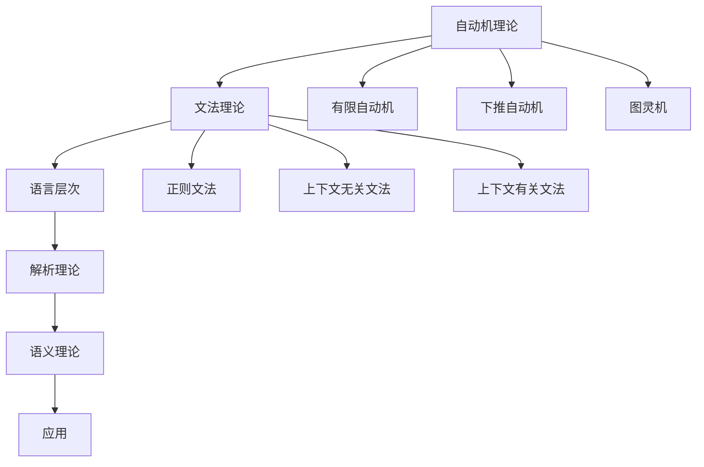

# 形式语言理论 (Formal Language Theory)

## 📚 **目录结构**

```
03_Formal_Language_Theory/
├── README.md                           # 当前文件 - 总览
├── 01_Automata_Theory/                 # 自动机理论
│   ├── README.md                       # 自动机理论总览
│   ├── 01_Finite_Automata/             # 有限自动机
│   │   ├── 01_DFA.md                   # 确定性有限自动机
│   │   ├── 02_NFA.md                   # 非确定性有限自动机
│   │   └── 03_Automata_Equivalence.md  # 自动机等价性
│   ├── 02_Pushdown_Automata/           # 下推自动机
│   │   ├── 01_PDA.md                   # 下推自动机基础
│   │   ├── 02_DPDA.md                  # 确定性下推自动机
│   │   └── 03_CFG_Equivalence.md       # 与上下文无关文法等价性
│   └── 03_Turing_Machines/             # 图灵机
│       ├── 01_Turing_Machine.md        # 图灵机基础
│       ├── 02_Universal_TM.md          # 通用图灵机
│       └── 03_Computability.md         # 可计算性理论
├── 02_Grammar_Theory/                  # 文法理论
│   ├── README.md                       # 文法理论总览
│   ├── 01_Regular_Grammars/            # 正则文法
│   │   ├── 01_Regular_Expressions.md   # 正则表达式
│   │   ├── 02_Right_Linear_Grammars.md # 右线性文法
│   │   └── 03_Left_Linear_Grammars.md  # 左线性文法
│   ├── 02_Context_Free_Grammars/       # 上下文无关文法
│   │   ├── 01_CFG_Basics.md            # CFG基础
│   │   ├── 02_Chomsky_Normal_Form.md   # 乔姆斯基范式
│   │   └── 03_Greibach_Normal_Form.md  # 格雷巴赫范式
│   └── 03_Context_Sensitive_Grammars/  # 上下文有关文法
│       ├── 01_CSG_Basics.md            # CSG基础
│       ├── 02_Linear_Bounded_Automata.md # 线性有界自动机
│       └── 03_CSG_Properties.md        # CSG性质
├── 03_Language_Hierarchy/              # 语言层次
│   ├── README.md                       # 语言层次总览
│   ├── 01_Chomsky_Hierarchy/           # 乔姆斯基层次
│   │   ├── 01_Type_0_Languages.md      # 0型语言
│   │   ├── 01_Type_1_Languages.md      # 1型语言
│   │   ├── 01_Type_2_Languages.md      # 2型语言
│   │   └── 01_Type_3_Languages.md      # 3型语言
│   ├── 02_Language_Operations/         # 语言运算
│   │   ├── 01_Union_Intersection.md    # 并集和交集
│   │   ├── 02_Concatenation.md         # 连接运算
│   │   └── 03_Kleene_Star.md           # 克莱尼星号
│   └── 03_Language_Properties/         # 语言性质
│       ├── 01_Closure_Properties.md    # 封闭性质
│       ├── 02_Decidability.md          # 可判定性
│       └── 03_Complexity.md            # 复杂性
├── 04_Parsing_Theory/                  # 解析理论
│   ├── README.md                       # 解析理论总览
│   ├── 01_Top_Down_Parsing/            # 自顶向下解析
│   │   ├── 01_LL_Parsing.md            # LL解析
│   │   ├── 02_Recursive_Descent.md     # 递归下降
│   │   └── 03_LL_Table_Construction.md # LL表构造
│   ├── 02_Bottom_Up_Parsing/           # 自底向上解析
│   │   ├── 01_LR_Parsing.md            # LR解析
│   │   ├── 02_SLR_Parsing.md           # SLR解析
│   │   └── 03_LALR_Parsing.md          # LALR解析
│   └── 03_Parser_Generators/           # 解析器生成器
│       ├── 01_Yacc_Bison.md            # Yacc/Bison
│       ├── 02_ANTLR.md                 # ANTLR
│       └── 03_Parser_Combinators.md    # 解析器组合子
├── 05_Semantic_Theory/                 # 语义理论
│   ├── README.md                       # 语义理论总览
│   ├── 01_Operational_Semantics/       # 操作语义
│   │   ├── 01_Small_Step_Semantics.md  # 小步语义
│   │   ├── 02_Big_Step_Semantics.md    # 大步语义
│   │   └── 03_Abstract_Machine.md      # 抽象机
│   ├── 02_Denotational_Semantics/      # 指称语义
│   │   ├── 01_Domain_Theory.md         # 域理论
│   │   ├── 02_Fixed_Points.md          # 不动点
│   │   └── 03_Continuity.md            # 连续性
│   └── 03_Axiomatic_Semantics/         # 公理语义
│       ├── 01_Hoare_Logic.md           # 霍尔逻辑
│       ├── 02_Weakest_Preconditions.md # 最弱前置条件
│       └── 03_Program_Verification.md  # 程序验证
└── 06_Applications/                    # 应用
    ├── README.md                       # 应用总览
    ├── 01_Compiler_Design/             # 编译器设计
    │   ├── 01_Lexical_Analysis.md      # 词法分析
    │   ├── 02_Syntax_Analysis.md       # 语法分析
    │   └── 03_Code_Generation.md       # 代码生成
    ├── 02_Programming_Languages/       # 编程语言
    │   ├── 01_Language_Design.md       # 语言设计
    │   ├── 02_Type_Systems.md          # 类型系统
    │   └── 03_Interpreter_Design.md    # 解释器设计
    └── 03_Natural_Language_Processing/ # 自然语言处理
        ├── 01_Syntax_Analysis.md       # 句法分析
        ├── 02_Semantic_Analysis.md     # 语义分析
        └── 03_Machine_Translation.md   # 机器翻译
```

## 🎯 **核心主题导航**

### 1. 自动机理论 (Automata Theory)
- [01_Automata_Theory/](01_Automata_Theory/) - 自动机理论总览
  - [有限自动机](01_Automata_Theory/01_Finite_Automata/) - DFA、NFA、等价性
  - [下推自动机](01_Automata_Theory/02_Pushdown_Automata/) - PDA、DPDA、CFG等价性
  - [图灵机](01_Automata_Theory/03_Turing_Machines/) - 图灵机、通用图灵机、可计算性

### 2. 文法理论 (Grammar Theory)
- [02_Grammar_Theory/](02_Grammar_Theory/) - 文法理论总览
  - [正则文法](02_Grammar_Theory/01_Regular_Grammars/) - 正则表达式、右线性文法、左线性文法
  - [上下文无关文法](02_Grammar_Theory/02_Context_Free_Grammars/) - CFG基础、乔姆斯基范式、格雷巴赫范式
  - [上下文有关文法](02_Grammar_Theory/03_Context_Sensitive_Grammars/) - CSG基础、线性有界自动机、CSG性质

### 3. 语言层次 (Language Hierarchy)
- [03_Language_Hierarchy/](03_Language_Hierarchy/) - 语言层次总览
  - [乔姆斯基层次](03_Language_Hierarchy/01_Chomsky_Hierarchy/) - 0型到3型语言
  - [语言运算](03_Language_Hierarchy/02_Language_Operations/) - 并集、交集、连接、克莱尼星号
  - [语言性质](03_Language_Hierarchy/03_Language_Properties/) - 封闭性质、可判定性、复杂性

### 4. 解析理论 (Parsing Theory)
- [04_Parsing_Theory/](04_Parsing_Theory/) - 解析理论总览
  - [自顶向下解析](04_Parsing_Theory/01_Top_Down_Parsing/) - LL解析、递归下降、LL表构造
  - [自底向上解析](04_Parsing_Theory/02_Bottom_Up_Parsing/) - LR解析、SLR解析、LALR解析
  - [解析器生成器](04_Parsing_Theory/03_Parser_Generators/) - Yacc/Bison、ANTLR、解析器组合子

### 5. 语义理论 (Semantic Theory)
- [05_Semantic_Theory/](05_Semantic_Theory/) - 语义理论总览
  - [操作语义](05_Semantic_Theory/01_Operational_Semantics/) - 小步语义、大步语义、抽象机
  - [指称语义](05_Semantic_Theory/02_Denotational_Semantics/) - 域理论、不动点、连续性
  - [公理语义](05_Semantic_Theory/03_Axiomatic_Semantics/) - 霍尔逻辑、最弱前置条件、程序验证

### 6. 应用 (Applications)
- [06_Applications/](06_Applications/) - 应用总览
  - [编译器设计](06_Applications/01_Compiler_Design/) - 词法分析、语法分析、代码生成
  - [编程语言](06_Applications/02_Programming_Languages/) - 语言设计、类型系统、解释器设计
  - [自然语言处理](06_Applications/03_Natural_Language_Processing/) - 句法分析、语义分析、机器翻译

## 📊 **内容统计**

| 分支 | 子主题数 | 文档数 | 完成度 | 最后更新 |
|------|----------|--------|--------|----------|
| 自动机理论 | 3 | 9 | 15% | 2024-12-20 |
| 文法理论 | 3 | 9 | 10% | 2024-12-19 |
| 语言层次 | 3 | 9 | 12% | 2024-12-19 |
| 解析理论 | 3 | 9 | 8% | 2024-12-18 |
| 语义理论 | 3 | 9 | 10% | 2024-12-18 |
| 应用 | 3 | 9 | 5% | 2024-12-17 |

## 🔗 **理论关联**

### 形式语言内部关联



### 跨学科关联

- **自动机理论** ↔ [数学基础理论](../02_Mathematical_Foundation/)
- **文法理论** ↔ [类型理论](../04_Type_Theory/)
- **解析理论** ↔ [编程语言理论](../08_Programming_Language_Theory/)
- **语义理论** ↔ [形式模型理论](../09_Formal_Model_Theory/)
- **应用** ↔ [软件工程理论](../07_Software_Engineering_Theory/)

## 📝 **形式化规范**

### 自动机表示

```rust
// 有限自动机
trait FiniteAutomaton {
    fn states(&self) -> Set<State>;
    fn alphabet(&self) -> Set<Symbol>;
    fn transitions(&self) -> Set<Transition>;
    fn initial_state(&self) -> State;
    fn accepting_states(&self) -> Set<State>;
    fn accepts(&self, input: &str) -> bool;
}

// 下推自动机
trait PushdownAutomaton {
    fn states(&self) -> Set<State>;
    fn input_alphabet(&self) -> Set<InputSymbol>;
    fn stack_alphabet(&self) -> Set<StackSymbol>;
    fn transitions(&self) -> Set<PDATransition>;
    fn initial_state(&self) -> State;
    fn initial_stack_symbol(&self) -> StackSymbol;
    fn accepting_states(&self) -> Set<State>;
    fn accepts(&self, input: &str) -> bool;
}

// 图灵机
trait TuringMachine {
    fn states(&self) -> Set<State>;
    fn alphabet(&self) -> Set<Symbol>;
    fn tape_alphabet(&self) -> Set<Symbol>;
    fn transitions(&self) -> Set<TMTransition>;
    fn initial_state(&self) -> State;
    fn accepting_states(&self) -> Set<State>;
    fn rejecting_states(&self) -> Set<State>;
    fn compute(&self, input: &str) -> ComputationResult;
}
```

### 文法表示

```haskell
-- 文法类型
data Grammar = Grammar
    { nonterminals :: Set NonTerminal
    , terminals :: Set Terminal
    , productions :: Set Production
    , startSymbol :: NonTerminal
    }

-- 产生式
data Production = Production
    { left :: NonTerminal
    , right :: [Symbol]
    }

-- 推导
data Derivation = Derivation
    { steps :: [String]
    , grammar :: Grammar
    }
```

## 🚀 **快速导航**

### 最新更新
- [DFA基础](01_Automata_Theory/01_Finite_Automata/01_DFA.md)
- [正则表达式](02_Grammar_Theory/01_Regular_Grammars/01_Regular_Expressions.md)
- [乔姆斯基层次](03_Language_Hierarchy/01_Chomsky_Hierarchy/01_Type_0_Languages.md)

### 核心概念
- [自动机基础](01_Automata_Theory/01_Finite_Automata/)
- [文法基础](02_Grammar_Theory/01_Regular_Grammars/)
- [语言层次](03_Language_Hierarchy/01_Chomsky_Hierarchy/)

### 应用领域
- [编译器设计](06_Applications/01_Compiler_Design/01_Lexical_Analysis.md)
- [编程语言](06_Applications/02_Programming_Languages/01_Language_Design.md)
- [自然语言处理](06_Applications/03_Natural_Language_Processing/01_Syntax_Analysis.md)

## 📅 **更新日志**

### 2024-12-20
- 建立形式语言理论目录结构
- 创建自动机理论基础内容
- 创建文法理论基础内容
- 建立语言层次理论框架

### 2024-12-21 (计划)
- 完成解析理论建立
- 完成语义理论建立
- 开始应用理论建立

---

**最后更新**: 2024-12-20  
**版本**: v1.0.0  
**维护者**: 形式语言理论团队
