# 03 形式语言理论 (Formal Language Theory)

> [!NOTE]
> 03.6 计算理论相关子文件已全部迁移至 `03.6_Computation_Theory/` 子目录下，所有引用请使用新路径。

## 📚 概述

形式语言理论是计算机科学的基础分支，研究形式语言及其计算模型。它为编程语言设计、编译器构建、自动机理论和计算复杂性等领域提供了理论基础。本目录包含形式语言理论的核心概念、模型和应用，以严格的数学形式化方法呈现。

## 🔍 目录结构

### 核心理论文件

- [03.1 自动机理论](./03.1_Automata_Theory.md) - 研究抽象计算模型及其语言识别能力
  - [03.1.1 有限自动机](./03.1.1_有限自动机.md) - 研究有限状态机及其变体
  - [03.1.2 下推自动机](./03.1.2_下推自动机.md) - 研究带有栈的自动机
  - [03.1.3 线性有界自动机](./03.1.3_线性有界自动机.md) - 研究带有有界磁带的自动机
  - [03.1.4 图灵机](./03.1.4_图灵机.md) - 研究通用计算模型
- [03.2 形式文法](./03.2_Formal_Grammars.md) - 研究语言的生成规则和形式化描述
  - [03.2.1 正则文法](./03.2.1_正则文法.md) - 研究3型文法及其性质
  - [03.2.2 上下文无关文法](./03.2.2_上下文无关文法.md) - 研究2型文法及其性质
  - [03.2.3 上下文有关文法](./03.2.3_上下文有关文法.md) - 研究1型文法及其性质
  - [03.2.4 无限制文法](./03.2.4_无限制文法.md) - 研究0型文法及其性质
- [03.3 语言层次理论](./03.3_Language_Hierarchy.md) - 研究语言的分类和层次结构
  - [03.3.1 乔姆斯基谱系](./03.3.1_乔姆斯基谱系.md) - 研究形式语言的层次分类
  - [03.3.2 语言分类](./03.3.2_语言分类.md) - 研究各类语言的特性和区别
  - [03.3.3 语言性质](./03.3.3_语言性质.md) - 研究形式语言的闭包性质和判定问题
  - [03.3.4 语言关系](./03.3.4_语言关系.md) - 研究不同语言类别之间的关系
- [03.4 解析理论](./03.4_Parsing_Theory.md) - 研究语法分析和语言识别算法
- [03.5 语义理论](./03.5_Semantics_Theory.md) - 研究形式语言的含义和解释
- [03.6 计算理论](./03.6_Computation_Theory.md) - 研究计算能力和复杂性

### 计算理论子文件

- [03.6.1 可计算性理论](./03.6_Computation_Theory/03.6.1_Computability_Theory.md) - 研究什么是可计算的
- [03.6.2 复杂性理论](./03.6_Computation_Theory/03.6.2_Complexity_Theory.md) - 研究计算问题的资源需求
- [03.6.3 算法分析](./03.6_Computation_Theory/03.6.3_算法分析.md) - 研究算法的效率和性能
- [03.6.4 计算模型](./03.6_Computation_Theory/03.6.4_计算模型.md) - 研究不同的计算模型及其等价性

### 应用与前沿

- [03.7 语言应用](./03.7_Language_Applications.md) - 形式语言理论的实际应用
  - [03.7.1 编译器设计](./03.7.1_Compiler_Design.md) - 编程语言的词法、语法和语义分析
  - [03.7.2 自然语言处理](./03.7.2_Natural_Language_Processing.md) - 形式语言在自然语言分析中的应用
  - [03.7.3 协议设计](./03.7.3_Protocol_Design.md) - 通信协议的形式化规范和验证
  - [03.7.4 形式验证](./03.7.4_Formal_Verification.md) - 系统和程序的形式化验证方法
- [03.8 语言前沿](./03.8_Language_Frontiers.md) - 形式语言理论的前沿研究
  - [03.8.1 量子语言](./03.8_Language_Frontiers/03.8.1_Quantum_Languages.md) - 量子计算中的形式语言
  - [03.8.2 生物语言](./03.8_Language_Frontiers/03.8.2_Bio_Languages.md) - 生物计算中的形式语言
  - [03.8.3 神经语言](./03.8_Language_Frontiers/03.8.3_Neural_Languages.md) - 神经计算中的形式语言
  - [03.8.4 认知语言](./03.8_Language_Frontiers/03.8.4_Cognitive_Languages.md) - 认知计算中的形式语言

### 扩展材料目录

每个主要章节都有对应的扩展材料目录，包含更详细的内容和深入探讨：

- [03.1 自动机理论](./03.1_Automata_Theory/) - 自动机理论的扩展材料
  - [01_有限自动机](./03.1_Automata_Theory/01_有限自动机/) - 有限自动机的深入探讨
  - [02_下推自动机](./03.1_Automata_Theory/02_下推自动机/) - 下推自动机的深入探讨
  - [03_图灵机](./03.1_Automata_Theory/03_图灵机/) - 图灵机的深入探讨
- [03.2 形式文法](./03.2_Formal_Grammars/) - 形式文法的扩展材料
  - [01_正则文法](./03.2_Formal_Grammars/01_正则文法/) - 正则文法的深入探讨
  - [02_上下文无关文法](./03.2_Formal_Grammars/02_上下文无关文法/) - 上下文无关文法的深入探讨
  - [03_上下文有关文法](./03.2_Formal_Grammars/03_上下文有关文法/) - 上下文有关文法的深入探讨
- [03.3 语言层次](./03.3_Language_Hierarchy/) - 语言层次的扩展材料
  - [01_乔姆斯基谱系](./03.3_Language_Hierarchy/01_乔姆斯基谱系/) - 乔姆斯基谱系的深入探讨
  - [02_语言性质](./03.3_Language_Hierarchy/02_语言性质/) - 语言性质的深入探讨

## 📝 目录结构说明

本目录采用标准化的结构组织形式语言理论的内容：

1. **主要文件**：采用 `03.X_主题名.md` 的命名格式，如 `03.1_Automata_Theory.md`
2. **子主题文件**：采用 `03.X.Y_子主题名.md` 的命名格式，如 `03.6.1_Computability_Theory.md`
3. **扩展材料目录**：每个主题都有一个同名目录，包含更详细的内容
   - 扩展目录中的子目录采用 `XX_主题名` 的命名格式，如 `01_有限自动机`
   - 每个子目录都有一个README.md文件，提供该主题的概述和导航

这种结构确保了内容的层次清晰、导航便捷，同时保持了中英文命名的一致性。

## 🔄 理论关系图

```mermaid
graph TD
    A[形式语言理论] --> B[自动机理论]
    A --> C[形式文法]
    A --> D[语言层次]
    A --> E[解析理论]
    A --> F[语义理论]
    A --> G[计算理论]
    A --> H[语言应用]
    A --> I[语言前沿]
    
    B --> B1[有限自动机]
    B --> B2[下推自动机]
    B --> B3[线性有界自动机]
    B --> B4[图灵机]
    
    C --> C1[正则文法]
    C --> C2[上下文无关文法]
    C --> C3[上下文有关文法]
    C --> C4[无限制文法]
    
    D --> D1[乔姆斯基谱系]
    
    E --> E1[LL Parsing]
    E --> E2[LR Parsing]
    E --> E3[Recursive Descent Parsing]
    
    F --> F1[操作语义]
    F --> F2[指称语义]
    F --> F3[公理语义]
    F --> F4[代数语义]
    
    G --> G1[可计算性理论]
    G --> G2[复杂性理论]
    G --> G3[算法分析]
    G --> G4[计算模型]
    
    H --> H1[编译器设计]
    H --> H2[自然语言处理]
    H --> H3[协议设计]
    H --> H4[形式验证]
    
    I --> I1[Quantum Languages]
    I --> I2[Bio Languages]
    I --> I3[Neural Languages]
    I --> I4[Cognitive Languages]
    
    B1 -.-> C1
    B2 -.-> C2
    B3 -.-> C3
    B4 -.-> C4
```

## 🌟 主要概念

1. **自动机** - 从有限自动机到图灵机的计算模型谱系
   - 有限自动机 (FA) - 识别正则语言
   - 下推自动机 (PDA) - 识别上下文无关语言
   - 线性有界自动机 (LBA) - 识别上下文有关语言
   - 图灵机 (TM) - 识别递归可枚举语言

2. **形式文法** - 从正则文法到无限制文法的语言生成规则
   - 正则文法 (Type 3) - 生成正则语言
   - 上下文无关文法 (Type 2) - 生成上下文无关语言
   - 上下文有关文法 (Type 1) - 生成上下文有关语言
   - 无限制文法 (Type 0) - 生成递归可枚举语言

3. **乔姆斯基层次结构** - 语言和自动机的分类体系
   - 0型语言 (递归可枚举语言) - 图灵机可识别
   - 1型语言 (上下文有关语言) - 线性有界自动机可识别
   - 2型语言 (上下文无关语言) - 下推自动机可识别
   - 3型语言 (正则语言) - 有限自动机可识别

4. **可计算性与复杂性** - 研究问题的可解性和计算资源需求
   - 可计算性 - 问题是否可以被算法解决
   - 计算复杂性 - 解决问题所需的计算资源
   - 复杂性类 - P、NP、PSPACE等问题集合的分类

## 🔗 交叉引用

- [02 数学基础理论](../02_Mathematical_Foundation/README.md) - 形式语言理论的数学基础
- [04 类型理论](../04_Type_Theory/README.md) - 与形式语言紧密相关的类型系统
- [08 编程语言理论](../08_Programming_Language_Theory/README.md) - 形式语言理论在编程语言中的应用
- [09 形式模型理论](../09_Formal_Model_Theory/README.md) - 基于形式语言的系统建模
- [13 复杂性理论](../13_Complexity_Theory/README.md) - 计算复杂性的深入研究

## 📚 学习路径

1. **基础路径**：自动机理论 → 形式文法 → 语言层次 → 解析理论 → 语义理论 → 计算理论
2. **编译器方向**：自动机理论 → 形式文法 → 解析理论 → 编译器设计
3. **计算理论方向**：自动机理论 → 计算理论 → 可计算性理论 → 复杂性理论
4. **语义与验证方向**：语义理论 → 形式验证 → 协议设计

## 📋 完成状态

- [x] 03.1 自动机理论 - 已完成
- [x] 03.2 形式文法 - 已完成
- [x] 03.3 语言层次 - 已完成
- [x] 03.4 解析理论 - 已完成
- [x] 03.5 语义理论 - 已完成
- [x] 03.6 计算理论 - 已完成
  - [x] 03.6.1 可计算性理论 - 已完成
  - [x] 03.6.2 复杂性理论 - 已完成
  - [x] 03.6.3 算法分析 - 已完成
  - [x] 03.6.4 计算模型 - 已完成
- [x] 03.7 语言应用 - 已完成
- [x] 03.8 语言前沿 - 已完成

**整体完成度**: 100%

---

**更新时间**: 2024-12-21  
**版本**: 2.0  
**状态**: 已完成
