# 形式语言理论 (Formal Language Theory)

## 🎯 **概述**

形式语言理论是计算机科学和数学的基础理论，研究符号系统的语法结构、语义解释和计算性质，为编程语言、编译器、自动机等提供理论基础。

## 📋 **目录结构**

### 1. 形式语法理论 (Formal Grammar Theory)

- **3.1_Formal_Grammar/**
  - 3.1.1 文法基本概念
  - 3.1.2 乔姆斯基层次
  - 3.1.3 上下文无关文法
  - 3.1.4 正则文法
  - 3.1.5 文法变换

### 2. 自动机理论 (Automata Theory)

- **3.2_Automata_Theory/**
  - 3.2.1 有限状态自动机
  - 3.2.2 下推自动机
  - 3.2.3 图灵机
  - 3.2.4 线性有界自动机
  - 3.2.5 自动机等价性

### 3. 计算复杂性理论 (Computational Complexity Theory)

- **3.3_Computational_Complexity/**
  - 3.3.1 时间复杂性
  - 3.3.2 空间复杂性
  - 3.3.3 P与NP问题
  - 3.3.4 复杂性类
  - 3.3.5 归约理论

### 4. 形式语义学 (Formal Semantics)

- **3.4_Formal_Semantics/**
  - 3.4.1 操作语义
  - 3.4.2 指称语义
  - 3.4.3 公理语义
  - 3.4.4 代数语义
  - 3.4.5 语义等价性

### 5. 语言层次结构 (Language Hierarchy)

- **3.5_Language_Hierarchy/**
  - 3.5.1 乔姆斯基层次结构
  - 3.5.2 语言包含关系
  - 3.5.3 语言运算
  - 3.5.4 语言闭包性质
  - 3.5.5 语言判定问题

## 🔗 **快速导航**

### 按主题分类

- [形式语法理论](3.1_Formal_Grammar/README.md)
- [自动机理论](3.2_Automata_Theory/README.md)
- [计算复杂性理论](3.3_Computational_Complexity/README.md)
- [形式语义学](3.4_Formal_Semantics/README.md)
- [语言层次结构](3.5_Language_Hierarchy/README.md)

### 按层次分类

- **基础层**: 形式语法、自动机
- **理论层**: 计算复杂性、形式语义
- **结构层**: 语言层次结构

## 📊 **形式语言理论图谱**

```mermaid
graph TB
    A[形式语言理论] --> B[形式语法理论]
    A --> C[自动机理论]
    A --> D[计算复杂性理论]
    A --> E[形式语义学]
    A --> F[语言层次结构]
    
    B --> B1[文法基本概念]
    B --> B2[乔姆斯基层次]
    B --> B3[上下文无关文法]
    B --> B4[正则文法]
    B --> B5[文法变换]
    
    C --> C1[有限状态自动机]
    C --> C2[下推自动机]
    C --> C3[图灵机]
    C --> C4[线性有界自动机]
    C --> C5[自动机等价性]
    
    D --> D1[时间复杂性]
    D --> D2[空间复杂性]
    D --> D3[P与NP问题]
    D --> D4[复杂性类]
    D --> D5[归约理论]
    
    E --> E1[操作语义]
    E --> E2[指称语义]
    E --> E3[公理语义]
    E --> E4[代数语义]
    E --> E5[语义等价性]
    
    F --> F1[乔姆斯基层次结构]
    F --> F2[语言包含关系]
    F --> F3[语言运算]
    F --> F4[语言闭包性质]
    F --> F5[语言判定问题]
```

## 🎯 **重构原则**

### 1. 形式化规范

- 严格的数学符号和公式
- 完整的证明过程
- 规范的定理定义

### 2. 多表征方式

- 文字描述
- 数学公式
- 图表说明
- 代码示例

### 3. 一致性保证

- 术语一致性
- 符号一致性
- 逻辑一致性
- 引用一致性

### 4. 系统性组织

- 层次化结构
- 模块化设计
- 交叉引用
- 索引导航

## 📈 **进度跟踪**

### 已完成模块

- [x] 目录结构设计
- [x] 导航系统构建
- [x] 理论框架建立

### 进行中模块

- [ ] 形式语法理论重构
- [ ] 自动机理论重构
- [ ] 计算复杂性理论重构

### 待完成模块

- [ ] 形式语义学重构
- [ ] 语言层次结构重构

## 🔄 **持续更新**

本文档将持续更新，反映形式语言理论重构的进度和发展。

**最后更新时间**: 2024-12-20
**版本**: v1.0.0
**状态**: 进行中
