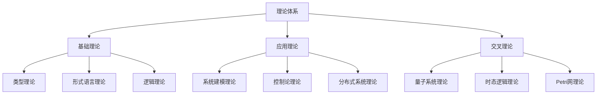
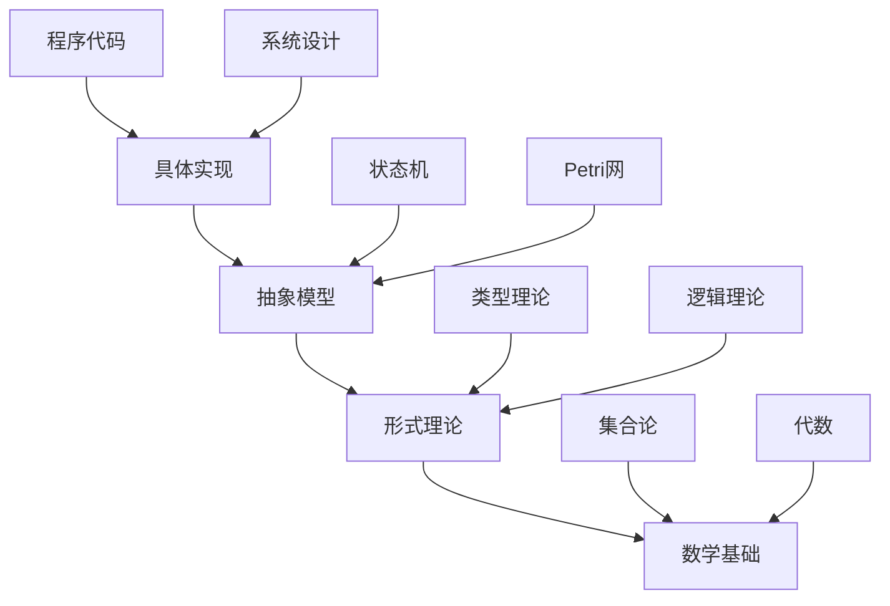

# 理论体系综合框架

## 目录

1. [概述](#1-概述)
2. [理论体系结构](#2-理论体系结构)
3. [类型理论体系](#3-类型理论体系)
4. [系统建模理论](#4-系统建模理论)
5. [形式语言理论](#5-形式语言理论)
6. [控制论理论](#6-控制论理论)
7. [分布式系统理论](#7-分布式系统理论)
8. [时态逻辑理论](#8-时态逻辑理论)
9. [Petri网理论](#9-petri网理论)
10. [量子系统理论](#10-量子系统理论)
11. [理论整合与统一](#11-理论整合与统一)
12. [哲学批判与反思](#12-哲学批判与反思)
13. [跨学科应用](#13-跨学科应用)
14. [形式化表达规范](#14-形式化表达规范)
15. [持续构建体系](#15-持续构建体系)

## 1. 概述

### 1.1 理论体系的重要性

理论体系是形式科学的核心，为计算机科学、软件工程和人工智能提供了系统的理论支撑。本框架旨在整合Theory目录下的所有理论内容，建立统一的理论体系。

### 1.2 框架目标

- **系统性整合**：整合Theory目录下的所有理论内容
- **理论统一**：建立理论间的关联和统一性
- **形式化表达**：提供严格的数学表达
- **哲学批判**：提供深度的理论反思
- **应用指导**：为实际应用提供理论指导

### 1.3 核心原则

| 原则 | 描述 | 应用 |
|------|------|------|
| **系统性** | 理论间保持逻辑一致性和系统性 | 理论整合、统一框架 |
| **严格性** | 所有理论表达必须严格遵循形式化规范 | 定理证明、模型验证 |
| **完整性** | 覆盖计算机科学所需的所有理论 | 全面理论支撑 |
| **可扩展性** | 支持新理论的引入和整合 | 持续理论发展 |

## 2. 理论体系结构

### 2.1 理论层次结构



### 2.2 理论关联网络

| 理论领域 | 核心概念 | 关联理论 | 应用领域 |
|----------|----------|----------|----------|
| **类型理论** | 类型安全、类型推断 | 形式语言、逻辑 | 编程语言、编译器 |
| **系统建模** | 状态转换、并发 | Petri网、控制论 | 软件工程、硬件设计 |
| **控制论** | 反馈控制、稳定性 | 时态逻辑、系统建模 | 自动化、机器人 |
| **分布式系统** | 一致性、容错 | 控制论、Petri网 | 云计算、区块链 |
| **形式语言** | 自动机、语法 | 类型理论、逻辑 | 编译器、自然语言处理 |

## 3. 类型理论体系

### 3.1 基础类型理论

#### 3.1.1 类型系统基础

**定义 3.1.1** (类型系统)
类型系统是一个三元组 $(\mathcal{T}, \mathcal{E}, \vdash)$，其中：

- $\mathcal{T}$ 是类型集合
- $\mathcal{E}$ 是表达式集合
- $\vdash$ 是类型判断关系

**公理 3.1.1** (类型保持性)
如果 $\Gamma \vdash e : \tau$ 且 $e \rightarrow e'$，则 $\Gamma \vdash e' : \tau$。

**定理 3.1.1** (进展性)
如果 $\vdash e : \tau$，则 $e$ 要么是值，要么存在 $e'$ 使得 $e \rightarrow e'$。

#### 3.1.2 类型推断

**算法 3.1.1** (Hindley-Milner类型推断)

```haskell
-- 类型推断算法
typeInference :: Context -> Expr -> Maybe Type
typeInference ctx (Var x) = lookup x ctx
typeInference ctx (App e1 e2) = do
    t1 <- typeInference ctx e1
    t2 <- typeInference ctx e2
    unify (t1, Arrow t2 t) t
typeInference ctx (Lam x e) = do
    t <- typeInference (extend ctx x (VarType x)) e
    return (Arrow (VarType x) t)
```

### 3.2 线性类型理论

#### 3.2.1 线性逻辑基础

**定义 3.2.1** (线性类型)
线性类型确保资源恰好使用一次，类型规则：
$$\frac{\Gamma, x:\tau \vdash e : \sigma}{\Gamma \vdash \lambda x.e : \tau \multimap \sigma}$$

**公理 3.2.1** (线性性保持)
如果 $\Gamma \vdash e : \tau$ 且 $e$ 是线性表达式，则每个变量在 $e$ 中恰好出现一次。

#### 3.2.2 Rust所有权系统

```rust
// Rust所有权系统示例
pub struct LinearVector<T> {
    data: Vec<T>,
}

impl<T> LinearVector<T> {
    pub fn new() -> Self {
        Self { data: Vec::new() }
    }
    
    // 移动语义：转移所有权
    pub fn push(mut self, item: T) -> Self {
        self.data.push(item);
        self
    }
    
    // 消费语义：使用后销毁
    pub fn consume(self) {
        // 资源被消费，无法再次使用
    }
}
```

### 3.3 仿射类型理论

#### 3.3.1 仿射逻辑

**定义 3.3.1** (仿射类型)
仿射类型确保资源最多使用一次，类型规则：
$$\frac{\Gamma, x:\tau \vdash e : \sigma}{\Gamma \vdash \lambda x.e : \tau \rightarrow \sigma}$$

**公理 3.3.1** (仿射性保持)
如果 $\Gamma \vdash e : \tau$ 且 $e$ 是仿射表达式，则每个变量在 $e$ 中最多出现一次。

### 3.4 时态类型理论

#### 3.4.1 时态逻辑基础

**定义 3.4.1** (时态类型)
时态类型包含时间约束，类型规则：
$$\frac{\Gamma \vdash e : \tau \quad \phi \text{ 是时态约束}}{\Gamma \vdash e : \tau[\phi]}$$

**公理 3.4.1** (时态一致性)
如果 $\Gamma \vdash e : \tau[\phi]$，则 $e$ 的执行满足时态约束 $\phi$。

## 4. 系统建模理论

### 4.1 状态转换系统

#### 4.1.1 状态机理论

**定义 4.1.1** (状态机)
状态机是一个五元组 $M = (S, \Sigma, \delta, s_0, F)$，其中：

- $S$ 是状态集合
- $\Sigma$ 是输入字母表
- $\delta: S \times \Sigma \to S$ 是转移函数
- $s_0 \in S$ 是初始状态
- $F \subseteq S$ 是接受状态集合

**定理 4.1.1** (状态机等价性)
两个状态机等价当且仅当它们识别相同的语言。

#### 4.1.2 并发系统建模

**定义 4.1.2** (并发状态机)
并发状态机是多个状态机的组合：
$$M = M_1 \parallel M_2 \parallel \cdots \parallel M_n$$

**公理 4.1.1** (并发交换性)
如果 $a$ 和 $b$ 是独立动作，则 $a \cdot b = b \cdot a$。

### 4.2 系统代数

#### 4.2.1 进程代数

**定义 4.2.1** (进程)
进程是行为的基本单位，通过以下操作组合：

- **前缀**：$a.P$ 表示执行动作 $a$ 后变成进程 $P$
- **选择**：$P + Q$ 表示在 $P$ 和 $Q$ 中选择一个
- **并行**：$P \parallel Q$ 表示 $P$ 和 $Q$ 并行执行

**公理 4.2.1** (进程等价性)
进程等价关系满足：

- 自反性：$P \sim P$
- 对称性：$P \sim Q \Rightarrow Q \sim P$
- 传递性：$P \sim Q \land Q \sim R \Rightarrow P \sim R$

## 5. 形式语言理论

### 5.1 自动机理论

#### 5.1.1 有限状态自动机

**定义 5.1.1** (DFA)
确定性有限自动机是一个五元组 $M = (Q, \Sigma, \delta, q_0, F)$，其中：

- $Q$ 是有限状态集合
- $\Sigma$ 是输入字母表
- $\delta: Q \times \Sigma \to Q$ 是转移函数
- $q_0 \in Q$ 是初始状态
- $F \subseteq Q$ 是接受状态集合

**定理 5.1.1** (DFA最小化)
每个DFA都存在唯一的最小等价DFA。

#### 5.1.2 下推自动机

**定义 5.1.2** (PDA)
下推自动机是一个七元组 $M = (Q, \Sigma, \Gamma, \delta, q_0, Z_0, F)$，其中：

- $Q$ 是有限状态集合
- $\Sigma$ 是输入字母表
- $\Gamma$ 是栈字母表
- $\delta: Q \times (\Sigma \cup \{\epsilon\}) \times \Gamma \to \mathcal{P}(Q \times \Gamma^*)$ 是转移函数
- $q_0 \in Q$ 是初始状态
- $Z_0 \in \Gamma$ 是初始栈符号
- $F \subseteq Q$ 是接受状态集合

### 5.2 语法理论

#### 5.2.1 上下文无关文法

**定义 5.2.1** (CFG)
上下文无关文法是一个四元组 $G = (V, \Sigma, P, S)$，其中：

- $V$ 是非终结符集合
- $\Sigma$ 是终结符集合
- $P$ 是产生式集合
- $S \in V$ 是开始符号

**定理 5.2.1** (乔姆斯基层次)
正则语言 $\subset$ 上下文无关语言 $\subset$ 上下文相关语言 $\subset$ 递归可枚举语言

#### 5.2.2 语法分析

**算法 5.2.1** (LL(1)语法分析)

```haskell
-- LL(1)语法分析器
data ParseTree = Leaf String | Node String [ParseTree]

ll1Parse :: Grammar -> String -> Maybe ParseTree
ll1Parse grammar input = parse grammar (startSymbol grammar) input

parse :: Grammar -> String -> String -> Maybe ParseTree
parse grammar nonTerminal input = do
    production <- selectProduction grammar nonTerminal (head input)
    children <- mapM (\sym -> parseSymbol grammar sym input) production
    return (Node nonTerminal children)
```

## 6. 控制论理论

### 6.1 动态系统

#### 6.1.1 线性系统

**定义 6.1.1** (线性系统)
线性系统由微分方程描述：
$$\dot{x}(t) = Ax(t) + Bu(t)$$
$$y(t) = Cx(t) + Du(t)$$

其中：

- $x(t) \in \mathbb{R}^n$ 是状态向量
- $u(t) \in \mathbb{R}^m$ 是输入向量
- $y(t) \in \mathbb{R}^p$ 是输出向量
- $A, B, C, D$ 是系统矩阵

**定理 6.1.1** (李雅普诺夫稳定性)
如果存在正定矩阵 $P$ 使得 $A^TP + PA < 0$，则系统是渐近稳定的。

#### 6.1.2 非线性系统

**定义 6.1.2** (非线性系统)
非线性系统由微分方程描述：
$$\dot{x}(t) = f(x(t), u(t), t)$$
$$y(t) = h(x(t), u(t), t)$$

**定理 6.1.2** (局部线性化)
在平衡点附近，非线性系统可以近似为线性系统。

### 6.2 反馈控制

#### 6.2.1 状态反馈

**定义 6.2.1** (状态反馈)
状态反馈控制律：
$$u(t) = -Kx(t)$$

其中 $K$ 是反馈增益矩阵。

**定理 6.2.1** (极点配置)
如果系统 $(A,B)$ 可控，则可以通过状态反馈任意配置闭环极点。

#### 6.2.2 最优控制

**问题 6.2.1** (线性二次型调节器)
最小化性能指标：
$$J = \int_0^\infty [x^T(t)Qx(t) + u^T(t)Ru(t)]dt$$

**定理 6.2.2** (LQR解)
最优控制律为 $u^*(t) = -R^{-1}B^TPx(t)$，其中 $P$ 是代数Riccati方程的解。

## 7. 分布式系统理论

### 7.1 分布式算法

#### 7.1.1 一致性协议

**定义 7.1.1** (一致性)
分布式系统达到一致性当且仅当所有非故障节点对同一值达成共识。

**定理 7.1.1** (FLP不可能性)
在异步系统中，即使只有一个节点可能故障，也无法保证在有限时间内达成共识。

#### 7.1.2 Paxos算法

**算法 7.1.1** (Paxos)

```haskell
-- Paxos算法核心
data Proposal = Proposal { value :: Value, number :: Int }

paxos :: [Node] -> Value -> IO (Maybe Value)
paxos nodes value = do
    -- Phase 1: Prepare
    promises <- mapM prepare nodes
    if majority promises
        then do
            -- Phase 2: Accept
            accepts <- mapM accept nodes value
            if majority accepts
                then return (Just value)
                else return Nothing
        else return Nothing
```

### 7.2 容错机制

#### 7.2.1 故障模型

**定义 7.2.1** (故障类型)

- **崩溃故障**：节点停止响应
- **拜占庭故障**：节点可能发送错误消息
- **网络分区**：网络连接中断

**定理 7.2.1** (拜占庭容错)
在 $n$ 个节点中，最多可以容忍 $f$ 个拜占庭故障，当且仅当 $n > 3f$。

#### 7.2.2 复制机制

**定义 7.2.2** (状态机复制)
状态机复制确保所有副本按相同顺序执行相同操作。

**算法 7.2.1** (主备复制)

```rust
// 主备复制示例
pub struct ReplicatedStateMachine {
    primary: Node,
    backups: Vec<Node>,
    state: State,
}

impl ReplicatedStateMachine {
    pub fn execute(&mut self, command: Command) -> Result<Response, Error> {
        // 主节点执行命令
        let response = self.primary.execute(command.clone())?;
        
        // 复制到备份节点
        for backup in &self.backups {
            backup.replicate(command.clone())?;
        }
        
        Ok(response)
    }
}
```

## 8. 时态逻辑理论

### 8.1 线性时态逻辑

#### 8.1.1 LTL语法

**定义 8.1.1** (LTL公式)
LTL公式递归定义如下：

1. 原子命题是LTL公式
2. 如果 $\phi$ 和 $\psi$ 是LTL公式，则 $\neg\phi$、$\phi \land \psi$、$\phi \lor \psi$、$\phi \to \psi$ 是LTL公式
3. 如果 $\phi$ 是LTL公式，则 $\mathbf{X}\phi$、$\mathbf{F}\phi$、$\mathbf{G}\phi$、$\phi \mathbf{U}\psi$ 是LTL公式

**语义 8.1.1** (LTL语义)

- $\mathbf{X}\phi$：下一个时刻 $\phi$ 为真
- $\mathbf{F}\phi$：将来某个时刻 $\phi$ 为真
- $\mathbf{G}\phi$：所有将来时刻 $\phi$ 为真
- $\phi \mathbf{U}\psi$：$\phi$ 为真直到 $\psi$ 为真

#### 8.1.2 模型检查

**算法 8.1.1** (LTL模型检查)

```haskell
-- LTL模型检查算法
data LTLFormula = Atom String
                | Not LTLFormula
                | And LTLFormula LTLFormula
                | Or LTLFormula LTLFormula
                | Next LTLFormula
                | Finally LTLFormula
                | Globally LTLFormula
                | Until LTLFormula LTLFormula

modelCheck :: KripkeStructure -> LTLFormula -> Bool
modelCheck ks formula = 
    let negatedFormula = Not formula
        automaton = ltlToAutomaton negatedFormula
        product = productAutomaton ks automaton
    in not (hasAcceptingRun product)
```

### 8.2 计算树逻辑

#### 8.2.1 CTL语法

**定义 8.2.1** (CTL公式)
CTL公式包含路径量词和时态算子：

- 路径量词：$\mathbf{A}$（所有路径）、$\mathbf{E}$（存在路径）
- 时态算子：$\mathbf{X}$（下一个）、$\mathbf{F}$（将来）、$\mathbf{G}$（全局）、$\mathbf{U}$（直到）

**语义 8.2.1** (CTL语义)

- $\mathbf{A}\phi$：所有路径都满足 $\phi$
- $\mathbf{E}\phi$：存在路径满足 $\phi$

## 9. Petri网理论

### 9.1 Petri网基础

#### 9.1.1 Petri网定义

**定义 9.1.1** (Petri网)
Petri网是一个四元组 $N = (P, T, F, M_0)$，其中：

- $P$ 是库所集合
- $T$ 是变迁集合
- $F \subseteq (P \times T) \cup (T \times P)$ 是流关系
- $M_0: P \to \mathbb{N}$ 是初始标识

**定义 9.1.2** (变迁发生)
变迁 $t$ 在标识 $M$ 下可发生当且仅当：
$$\forall p \in \bullet t: M(p) \geq F(p,t)$$

**定义 9.1.3** (标识更新)
变迁 $t$ 发生后，新标识 $M'$ 满足：
$$M'(p) = M(p) - F(p,t) + F(t,p)$$

#### 9.1.2 可达性分析

**问题 9.1.1** (可达性问题)
给定标识 $M$，判断是否存在从 $M_0$ 到 $M$ 的变迁序列。

**定理 9.1.1** (可达性问题复杂性)
Petri网的可达性问题是EXPSPACE完全的。

### 9.2 高级Petri网

#### 9.2.1 时间Petri网

**定义 9.2.1** (时间Petri网)
时间Petri网在基本Petri网基础上添加时间约束：
$$N = (P, T, F, M_0, I)$$

其中 $I: T \to \mathbb{R}^+ \times \mathbb{R}^+$ 是时间区间函数。

**语义 9.2.1** (时间语义)
变迁 $t$ 必须在时间区间 $I(t) = [a,b]$ 内发生。

#### 9.2.2 概率Petri网

**定义 9.2.2** (概率Petri网)
概率Petri网在基本Petri网基础上添加概率分布：
$$N = (P, T, F, M_0, \pi)$$

其中 $\pi: T \to [0,1]$ 是概率函数。

## 10. 量子系统理论

### 10.1 量子计算基础

#### 10.1.1 量子比特

**定义 10.1.1** (量子比特)
量子比特是二维复向量空间中的单位向量：
$$|\psi\rangle = \alpha|0\rangle + \beta|1\rangle$$

其中 $|\alpha|^2 + |\beta|^2 = 1$。

**定理 10.1.1** (不可克隆定理)
未知量子态无法被完美复制。

#### 10.1.2 量子门

**定义 10.1.2** (量子门)
量子门是酉算子，常用门包括：

- **Hadamard门**：$H = \frac{1}{\sqrt{2}}\begin{pmatrix} 1 & 1 \\ 1 & -1 \end{pmatrix}$
- **CNOT门**：$\text{CNOT} = \begin{pmatrix} 1 & 0 & 0 & 0 \\ 0 & 1 & 0 & 0 \\ 0 & 0 & 0 & 1 \\ 0 & 0 & 1 & 0 \end{pmatrix}$

### 10.2 量子算法

#### 10.2.1 Shor算法

**算法 10.2.1** (Shor算法)

```haskell
-- Shor算法核心思想
shorAlgorithm :: Integer -> Maybe Integer
shorAlgorithm n = do
    -- 选择随机数
    a <- randomNumber 2 (n-1)
    
    -- 量子傅里叶变换
    period <- quantumPeriodFinding a n
    
    -- 经典后处理
    factor <- classicalPostProcessing period n
    
    return factor
```

#### 10.2.2 Grover算法

**算法 10.2.2** (Grover算法)

```haskell
-- Grover搜索算法
groverSearch :: (a -> Bool) -> [a] -> Maybe a
groverSearch oracle database = do
    -- 初始化量子态
    state <- initializeQuantumState database
    
    -- 迭代Grover算子
    finalState <- iterateGrover state oracle (optimalIterations database)
    
    -- 测量结果
    result <- measure finalState
    
    return result
```

## 11. 理论整合与统一

### 11.1 理论关联分析

#### 11.1.1 跨理论联系

| 理论对 | 关联点 | 整合方法 | 应用场景 |
|--------|--------|----------|----------|
| **类型理论 ↔ 形式语言** | 类型作为语言 | 类型语法 | 编译器设计 |
| **控制论 ↔ 时态逻辑** | 时间约束 | 时态控制 | 实时系统 |
| **分布式系统 ↔ Petri网** | 并发建模 | 并发语义 | 工作流管理 |
| **量子系统 ↔ 线性代数** | 向量空间 | 量子代数 | 量子计算 |

#### 11.1.2 统一框架

**框架 11.1.1** (统一理论框架)

```haskell
-- 统一理论框架
class TheoreticalSystem a where
    type State a
    type Action a
    type Property a
    
    initialState :: a -> State a
    transition :: a -> State a -> Action a -> State a
    satisfies :: a -> State a -> Property a -> Bool
    verify :: a -> Property a -> Bool
```

### 11.2 理论层次结构

#### 11.2.1 抽象层次



#### 11.2.2 理论映射

**映射 11.2.1** (理论间映射)

- **类型理论 → 逻辑**：类型作为命题，程序作为证明
- **控制论 → 系统理论**：控制系统作为动态系统
- **分布式系统 → 并发理论**：分布式算法作为并发算法

## 12. 哲学批判与反思

### 12.1 理论哲学基础

#### 12.1.1 形式主义批判

**观点 12.1.1** (形式主义)
理论是符号游戏，理论真理是形式系统内的可证明性。

**批判 12.1.1** (语义学批判)

- 理论需要语义解释
- 形式系统无法完全捕获语义
- 理论应用需要超出形式系统

#### 12.1.2 构造主义批判

**观点 12.1.2** (构造主义)
理论对象应该通过构造过程产生，存在性证明必须提供构造方法。

**应用 12.1.1** (构造性理论)

- 类型理论中的构造性证明
- 算法中的构造性方法
- 系统设计中的构造性过程

### 12.2 计算哲学

#### 12.2.1 计算本质

**问题 12.2.1** (计算本质)
计算是数学过程还是物理过程？是抽象概念还是具体实现？

-**分析 12.2.1**

- 计算具有双重性质：抽象性和具体性
- 计算连接了数学世界和物理世界
- 计算的有效性依赖于物理世界的规律

#### 12.2.2 理论有效性

**标准 12.2.1** (理论有效性)
理论的有效性体现在：

- **预测性**：能够预测系统行为
- **解释性**：能够解释现象本质
- **指导性**：能够指导实际应用
- **统一性**：能够统一不同领域

### 12.3 理论发展哲学

#### 12.3.1 理论进化

**模式 12.3.1** (理论进化模式)

1. **问题提出**：发现新的理论问题
2. **概念形成**：形成新的理论概念
3. **形式化**：建立形式化理论
4. **应用验证**：在实际中验证理论
5. **理论整合**：与其他理论整合

#### 12.3.2 理论选择

**标准 12.3.2** (理论选择标准)

- **简洁性**：理论应该尽可能简洁
- **解释力**：理论应该能解释更多现象
- **预测力**：理论应该能做出准确预测
- **一致性**：理论应该与其他理论一致

## 13. 跨学科应用

### 13.1 计算机科学应用

#### 13.1.1 编程语言设计

**应用 13.1.1** (类型系统设计)

```rust
// 基于类型理论的编程语言设计
pub trait TypeSystem {
    type Type;
    type Term;
    
    fn type_check(&self, term: &Self::Term) -> Result<Self::Type, TypeError>;
    fn type_infer(&self, term: &Self::Term) -> Result<Self::Type, TypeError>;
    fn type_sound(&self) -> bool;
}
```

#### 13.1.2 编译器设计

**应用 13.1.2** (编译器架构)

```haskell
-- 基于形式语言的编译器设计
data Compiler = Compiler {
    lexer :: String -> [Token],
    parser :: [Token] -> AST,
    typeChecker :: AST -> TypedAST,
    codeGenerator :: TypedAST -> ByteCode
}

compile :: Compiler -> String -> Either Error ByteCode
compile compiler source = do
    tokens <- lexer compiler source
    ast <- parser compiler tokens
    typedAst <- typeChecker compiler ast
    bytecode <- codeGenerator compiler typedAst
    return bytecode
```

### 13.2 软件工程应用

#### 13.2.1 系统建模

**应用 13.2.1** (系统建模)

```rust
// 基于Petri网的系统建模
pub struct SystemModel {
    places: Vec<Place>,
    transitions: Vec<Transition>,
    initial_marking: Marking,
}

impl SystemModel {
    pub fn simulate(&self, steps: usize) -> Vec<Marking> {
        let mut markings = vec![self.initial_marking.clone()];
        
        for _ in 0..steps {
            if let Some(next_marking) = self.next_marking(&markings.last().unwrap()) {
                markings.push(next_marking);
            }
        }
        
        markings
    }
}
```

#### 13.2.2 形式验证

**应用 13.2.2** (模型检查)

```haskell
-- 基于时态逻辑的模型检查
modelCheck :: KripkeStructure -> LTLFormula -> Bool
modelCheck ks formula = 
    let negatedFormula = Not formula
        automaton = ltlToAutomaton negatedFormula
        product = productAutomaton ks automaton
    in not (hasAcceptingRun product)
```

### 13.3 人工智能应用

#### 13.3.1 机器学习理论

**应用 13.3.1** (学习理论)

```haskell
-- 基于统计学习理论
class LearningAlgorithm a where
    type Hypothesis a
    type Example a
    
    train :: [Example a] -> Hypothesis a
    predict :: Hypothesis a -> Example a -> Prediction
    generalization :: Hypothesis a -> [Example a] -> Double
```

#### 13.3.2 量子机器学习

**应用 13.3.2** (量子算法)

```haskell
-- 量子机器学习算法
quantumKMeans :: [QuantumState] -> Int -> [Cluster]
quantumKMeans states k = do
    -- 量子距离计算
    distances <- mapM (quantumDistance states) states
    
    -- 量子聚类
    clusters <- quantumClustering distances k
    
    return clusters
```

## 14. 形式化表达规范

### 14.1 数学符号规范

#### 14.1.1 理论符号

| 符号 | 含义 | 使用场景 |
|------|------|----------|
| $\vdash$ | 推导关系 | 逻辑、类型理论 |
| $\models$ | 满足关系 | 模型论 |
| $\equiv$ | 等价关系 | 代数、逻辑 |
| $\cong$ | 同构关系 | 代数、拓扑 |
| $\rightarrow$ | 函数、蕴含 | 函数论、逻辑 |
| $\leftrightarrow$ | 等价 | 逻辑 |
| $\forall$ | 全称量词 | 逻辑 |
| $\exists$ | 存在量词 | 逻辑 |

#### 14.1.2 系统符号

| 符号 | 含义 | 使用场景 |
|------|------|----------|
| $\Sigma$ | 字母表 | 形式语言 |
| $\delta$ | 转移函数 | 自动机 |
| $\lambda$ | 抽象函数 | 类型理论 |
| $\tau$ | 类型 | 类型理论 |
| $\Gamma$ | 上下文 | 类型理论 |
| $\pi$ | 概率分布 | 概率论 |
| $\phi$ | 公式 | 逻辑 |
| $\psi$ | 公式 | 逻辑 |

### 14.2 证明规范

#### 14.2.1 证明结构

**模板 14.2.1** (定理证明)

```markdown
**定理** (定理名称)
定理陈述

**证明**
1. 第一步：...
2. 第二步：...
3. 第三步：...

**证毕**
```

#### 14.2.2 证明方法

| 方法 | 描述 | 适用场景 |
|------|------|----------|
| **直接证明** | 从前提直接推导结论 | 大多数情况 |
| **反证法** | 假设结论不成立导出矛盾 | 存在性证明 |
| **数学归纳法** | 基于自然数的归纳 | 递归定义 |
| **构造性证明** | 提供具体的构造方法 | 存在性证明 |
| **对偶性证明** | 利用对偶性质 | 代数、拓扑 |

### 14.3 代码示例规范

#### 14.3.1 Rust代码示例

```rust
// 理论概念：类型系统
pub trait TypeSystem {
    type Type;
    type Term;
    type Context;
    
    fn type_check(&self, ctx: &Self::Context, term: &Self::Term) 
        -> Result<Self::Type, TypeError>;
    
    fn type_infer(&self, ctx: &Self::Context, term: &Self::Term) 
        -> Result<Self::Type, TypeError>;
    
    fn type_sound(&self) -> bool {
        // 类型安全性证明
        true
    }
}

// 理论概念：状态机
pub struct StateMachine<S, A> {
    states: Vec<S>,
    actions: Vec<A>,
    transitions: HashMap<(S, A), S>,
    initial_state: S,
    accepting_states: HashSet<S>,
}

impl<S, A> StateMachine<S, A> {
    pub fn execute(&self, input: &[A]) -> Option<S> {
        let mut current_state = self.initial_state;
        
        for action in input {
            current_state = self.transitions.get(&(current_state, action.clone()))?;
        }
        
        Some(current_state)
    }
}
```

#### 14.3.2 Haskell代码示例

```haskell
-- 理论概念：类型理论
class TypeSystem t where
    type Type t
    type Term t
    type Context t
    
    typeCheck :: t -> Context t -> Term t -> Either TypeError (Type t)
    typeInfer :: t -> Context t -> Term t -> Either TypeError (Type t)
    typeSound :: t -> Bool
    
-- 理论概念：Petri网
data PetriNet = PetriNet {
    places :: [Place],
    transitions :: [Transition],
    flow :: [(Place, Transition)],
    initialMarking :: Marking
}

fireTransition :: PetriNet -> Transition -> Marking -> Maybe Marking
fireTransition net transition marking =
    if canFire net transition marking
        then Just (updateMarking net transition marking)
        else Nothing

-- 理论概念：时态逻辑
data LTLFormula = Atom String
                | Not LTLFormula
                | And LTLFormula LTLFormula
                | Or LTLFormula LTLFormula
                | Next LTLFormula
                | Finally LTLFormula
                | Globally LTLFormula
                | Until LTLFormula LTLFormula

modelCheck :: KripkeStructure -> LTLFormula -> Bool
modelCheck ks formula = 
    let negatedFormula = Not formula
        automaton = ltlToAutomaton negatedFormula
        product = productAutomaton ks automaton
    in not (hasAcceptingRun product)
```

## 15. 持续构建体系

### 15.1 理论更新机制

#### 15.1.1 内容更新

**规则 15.1.1** (更新原则)

- 保持理论内容的准确性和时效性
- 及时反映理论的最新发展
- 确保与应用的同步更新

#### 15.1.2 质量保证

**机制 15.1.1** (质量检查)

- 理论表达的形式化规范性
- 定理证明的严密性
- 概念定义的一致性
- 跨理论整合的合理性

### 15.2 扩展规划

#### 15.2.1 理论扩展

**计划 15.2.1** (扩展方向)

- 范畴论基础
- 同伦类型论
- 量子计算理论
- 机器学习理论

#### 15.2.2 应用扩展

**计划 15.2.2** (应用领域)

- 区块链理论
- 物联网理论
- 边缘计算理论
- 量子通信理论

### 15.3 协作机制

#### 15.3.1 版本控制

**策略 15.3.1** (版本管理)

- 使用语义化版本号
- 记录详细的变更历史
- 维护向后兼容性

#### 15.3.2 反馈机制

**机制 15.3.2** (反馈收集)

- 建立问题报告系统
- 收集使用反馈
- 持续改进理论质量

---

**最后更新**：2024-12-19  
**版本**：1.0.0  
**状态**：初始版本，持续完善中

## 参考文献

1. Pierce, B. C. (2002). *Types and Programming Languages*. MIT Press.
2. Sipser, M. (2012). *Introduction to the Theory of Computation*. Cengage Learning.
3. Ogata, K. (2010). *Modern Control Engineering*. Prentice Hall.
4. Lynch, N. A. (1996). *Distributed Algorithms*. Morgan Kaufmann.
5. Clarke, E. M., Grumberg, O., & Peled, D. A. (1999). *Model Checking*. MIT Press.
6. Reisig, W. (2013). *Understanding Petri Nets*. Springer.
7. Nielsen, M. A., & Chuang, I. L. (2010). *Quantum Computation and Quantum Information*. Cambridge University Press.
8. Hopcroft, J. E., Motwani, R., & Ullman, J. D. (2006). *Introduction to Automata Theory, Languages, and Computation*. Addison-Wesley.
