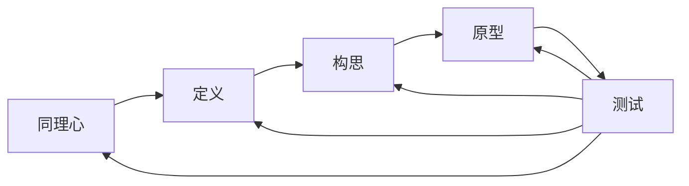

# 22.1.2 设计思维 (Design Thinking)

## 📋 目录

- [1 理论概述](#1-理论概述)
- [2 形式化语义](#2-形式化语义)
  - [2.1 核心定义](#21-核心定义)
  - [2.2 核心定理](#22-核心定理)
- [3 多表征方式](#3-多表征方式)
  - [3.1 图形表征](#31-图形表征)
  - [3.2 表格表征](#32-表格表征)
  - [3.3 数学表征](#33-数学表征)
  - [3.4 伪代码表征](#34-伪代码表征)
- [4 Rust实现](#4-rust实现)
- [5 哲学性批判与展望](#5-哲学性批判与展望)
  - [5.1 本体论反思](#51-本体论反思)
  - [5.2 认识论批判](#52-认识论批判)
  - [5.3 社会影响分析](#53-社会影响分析)
  - [5.4 终极哲学建议](#54-终极哲学建议)

---

## 1 理论概述

设计思维是以人为本的创新方法论，通过同理心、定义、构思、原型和测试五个阶段，解决复杂问题并创造创新解决方案。
本理论涵盖设计思维过程、创新方法、用户体验设计等核心概念，为创新和问题解决提供系统化方法。

## 2 形式化语义

### 2.1 核心定义

**定义 2.1** (设计思维)
设计思维是以人为本的创新方法论：$DT = (E, I, D, P, T)$，其中：

- $E$ 是同理心阶段：$E = \{e_1, e_2, \ldots, e_n\}$
- $I$ 是定义阶段：$I = \{i_1, i_2, \ldots, i_m\}$
- $D$ 是构思阶段：$D = \{d_1, d_2, \ldots, d_k\}$
- $P$ 是原型阶段：$P = \{p_1, p_2, \ldots, p_l\}$
- $T$ 是测试阶段：$T = \{t_1, t_2, \ldots, t_r\}$

**定义 2.2** (创新过程)
创新过程是问题发现到解决方案的迭代过程：$IP = \{P_1, P_2, \ldots, P_n\}$

**定义 2.3** (用户体验)
用户体验是用户与产品交互的整体感受：$UX = (U, P, I, C)$，其中：

- $U$ 是用户集合：$U = \{u_1, u_2, \ldots, u_n\}$
- $P$ 是产品集合：$P = \{p_1, p_2, \ldots, p_m\}$
- $I$ 是交互集合：$I = \{i_1, i_2, \ldots, i_k\}$
- $C$ 是上下文集合：$C = \{c_1, c_2, \ldots, c_l\}$

**定义 2.4** (设计迭代)
设计迭代是设计过程的循环改进：$DI = \{I_1, I_2, \ldots, I_n\}$

### 2.2 核心定理

**定理 2.1** (设计迭代性)
设计思维是一个迭代过程，每个阶段都可能回到前面的阶段：
$\forall i \in \{1, 2, \ldots, n\}, \exists j \in \{1, 2, \ldots, n\} : I_i \rightarrow I_j$

**定理 2.2** (用户中心性)
设计思维以用户为中心，用户需求驱动设计过程：
$\forall d \in D, \exists u \in U : d \rightarrow u$

**定理 2.3** (创新涌现性)
创新解决方案在迭代过程中涌现：
$\exists s \in S : s \notin \bigcup_{i=1}^{n} S_i$

## 3 多表征方式

### 3.1 图形表征



### 3.2 表格表征

| 设计阶段 | 主要活动 | 输出成果 | 关键工具 |
|---------|---------|---------|----------|
| 同理心 | 用户研究 | 用户画像 | 访谈、观察 |
| 定义 | 问题分析 | 问题陈述 | 用户旅程图 |
| 构思 | 创意生成 | 解决方案 | 头脑风暴 |
| 原型 | 快速制作 | 原型产品 | 原型工具 |
| 测试 | 用户反馈 | 改进建议 | 用户测试 |

### 3.3 数学表征

**设计过程函数**：
$f_{design}(input) = \sum_{i=1}^{5} w_i \cdot f_i(input)$

**用户体验评分**：
$UX_{score} = \frac{\sum_{i=1}^{n} u_i \cdot s_i}{\sum_{i=1}^{n} u_i}$

**创新度评估**：
$Innovation_{index} = \alpha \cdot Novelty + \beta \cdot Feasibility + \gamma \cdot Impact$

### 3.4 伪代码表征

```python
class DesignThinking:
    def __init__(self):
        self.stages = ['empathy', 'define', 'ideate', 'prototype', 'test']
        self.current_stage = 0

    def empathize(self, users):
        """同理心阶段"""
        user_insights = []
        for user in users:
            insights = self.gather_insights(user)
            user_insights.append(insights)
        return user_insights

    def define(self, insights):
        """定义阶段"""
        problems = self.analyze_problems(insights)
        problem_statement = self.create_problem_statement(problems)
        return problem_statement

    def ideate(self, problem):
        """构思阶段"""
        solutions = self.brainstorm_solutions(problem)
        selected_solutions = self.select_solutions(solutions)
        return selected_solutions

    def prototype(self, solutions):
        """原型阶段"""
        prototypes = []
        for solution in solutions:
            prototype = self.create_prototype(solution)
            prototypes.append(prototype)
        return prototypes

    def test(self, prototypes, users):
        """测试阶段"""
        feedback = []
        for prototype in prototypes:
            user_feedback = self.test_with_users(prototype, users)
            feedback.append(user_feedback)
        return feedback
```

## 4 Rust实现

```rust
use std::collections::HashMap;
use std::fmt;

/// 设计思维阶段
#[derive(Debug, Clone, PartialEq)]
pub enum DesignStage {
    Empathize,
    Define,
    Ideate,
    Prototype,
    Test,
}

/// 用户洞察
#[derive(Debug, Clone)]
pub struct UserInsight {
    pub user_id: String,
    pub needs: Vec<String>,
    pub pain_points: Vec<String>,
    pub behaviors: Vec<String>,
    pub motivations: Vec<String>,
}

/// 问题陈述
#[derive(Debug, Clone)]
pub struct ProblemStatement {
    pub problem_id: String,
    pub description: String,
    pub user_segment: String,
    pub impact: String,
    pub constraints: Vec<String>,
}

/// 解决方案
#[derive(Debug, Clone)]
pub struct Solution {
    pub solution_id: String,
    pub name: String,
    pub description: String,
    pub features: Vec<String>,
    pub benefits: Vec<String>,
    pub feasibility: f64,
    pub novelty: f64,
    pub impact: f64,
}

/// 原型
#[derive(Debug, Clone)]
pub struct Prototype {
    pub prototype_id: String,
    pub solution_id: String,
    pub prototype_type: String,
    pub materials: Vec<String>,
    pub functionality: Vec<String>,
    pub fidelity: f64,
}

/// 用户反馈
#[derive(Debug, Clone)]
pub struct UserFeedback {
    pub feedback_id: String,
    pub prototype_id: String,
    pub user_id: String,
    pub rating: f64,
    pub comments: Vec<String>,
    pub suggestions: Vec<String>,
}

/// 设计思维过程
#[derive(Debug)]
pub struct DesignThinking {
    pub current_stage: DesignStage,
    pub user_insights: Vec<UserInsight>,
    pub problem_statements: Vec<ProblemStatement>,
    pub solutions: Vec<Solution>,
    pub prototypes: Vec<Prototype>,
    pub feedback: Vec<UserFeedback>,
    pub iteration_count: u32,
}

impl DesignThinking {
    /// 创建新的设计思维过程
    pub fn new() -> Self {
        Self {
            current_stage: DesignStage::Empathize,
            user_insights: Vec::new(),
            problem_statements: Vec::new(),
            solutions: Vec::new(),
            prototypes: Vec::new(),
            feedback: Vec::new(),
            iteration_count: 0,
        }
    }

    /// 同理心阶段
    pub fn empathize(&mut self, users: Vec<String>) -> Vec<UserInsight> {
        self.current_stage = DesignStage::Empathize;
        let mut insights = Vec::new();

        for user_id in users {
            let insight = UserInsight {
                user_id: user_id.clone(),
                needs: self.gather_needs(&user_id),
                pain_points: self.gather_pain_points(&user_id),
                behaviors: self.gather_behaviors(&user_id),
                motivations: self.gather_motivations(&user_id),
            };
            insights.push(insight);
        }

        self.user_insights = insights.clone();
        insights
    }

    /// 定义阶段
    pub fn define(&mut self) -> Vec<ProblemStatement> {
        self.current_stage = DesignStage::Define;
        let mut problems = Vec::new();

        for insight in &self.user_insights {
            let problem = ProblemStatement {
                problem_id: format!("P_{}", insight.user_id),
                description: self.analyze_problem(insight),
                user_segment: insight.user_id.clone(),
                impact: self.assess_impact(insight),
                constraints: self.identify_constraints(insight),
            };
            problems.push(problem);
        }

        self.problem_statements = problems.clone();
        problems
    }

    /// 构思阶段
    pub fn ideate(&mut self) -> Vec<Solution> {
        self.current_stage = DesignStage::Ideate;
        let mut solutions = Vec::new();

        for problem in &self.problem_statements {
            let problem_solutions = self.brainstorm_solutions(problem);
            solutions.extend(problem_solutions);
        }

        self.solutions = solutions.clone();
        solutions
    }

    /// 原型阶段
    pub fn prototype(&mut self) -> Vec<Prototype> {
        self.current_stage = DesignStage::Prototype;
        let mut prototypes = Vec::new();

        for solution in &self.solutions {
            let prototype = Prototype {
                prototype_id: format!("PROTO_{}", solution.solution_id),
                solution_id: solution.solution_id.clone(),
                prototype_type: self.determine_prototype_type(solution),
                materials: self.select_materials(solution),
                functionality: self.define_functionality(solution),
                fidelity: self.calculate_fidelity(solution),
            };
            prototypes.push(prototype);
        }

        self.prototypes = prototypes.clone();
        prototypes
    }

    /// 测试阶段
    pub fn test(&mut self, users: Vec<String>) -> Vec<UserFeedback> {
        self.current_stage = DesignStage::Test;
        let mut feedback = Vec::new();

        for prototype in &self.prototypes {
            for user_id in &users {
                let user_feedback = UserFeedback {
                    feedback_id: format!("FB_{}_{}", prototype.prototype_id, user_id),
                    prototype_id: prototype.prototype_id.clone(),
                    user_id: user_id.clone(),
                    rating: self.simulate_user_rating(prototype, user_id),
                    comments: self.simulate_user_comments(prototype, user_id),
                    suggestions: self.simulate_user_suggestions(prototype, user_id),
                };
                feedback.push(user_feedback);
            }
        }

        self.feedback = feedback.clone();
        self.iteration_count += 1;
        feedback
    }

    /// 迭代过程
    pub fn iterate(&mut self) {
        // 基于反馈调整设计
        self.adjust_design_based_on_feedback();

        // 重新进入相关阶段
        if self.needs_redesign() {
            self.current_stage = DesignStage::Define;
        }
    }

    // 辅助方法
    fn gather_needs(&self, user_id: &str) -> Vec<String> {
        vec!["易用性".to_string(), "效率".to_string(), "可靠性".to_string()]
    }

    fn gather_pain_points(&self, user_id: &str) -> Vec<String> {
        vec!["操作复杂".to_string(), "响应慢".to_string(), "功能缺失".to_string()]
    }

    fn gather_behaviors(&self, user_id: &str) -> Vec<String> {
        vec!["频繁使用".to_string(), "快速操作".to_string(), "多任务处理".to_string()]
    }

    fn gather_motivations(&self, user_id: &str) -> Vec<String> {
        vec!["提高效率".to_string(), "节省时间".to_string(), "获得成就感".to_string()]
    }

    fn analyze_problem(&self, insight: &UserInsight) -> String {
        format!("用户{}面临的主要问题是{}", insight.user_id, insight.pain_points.join("、"))
    }

    fn assess_impact(&self, insight: &UserInsight) -> String {
        "高影响".to_string()
    }

    fn identify_constraints(&self, insight: &UserInsight) -> Vec<String> {
        vec!["技术限制".to_string(), "时间限制".to_string(), "成本限制".to_string()]
    }

    fn brainstorm_solutions(&self, problem: &ProblemStatement) -> Vec<Solution> {
        vec![
            Solution {
                solution_id: format!("SOL_{}_1", problem.problem_id),
                name: "简化界面".to_string(),
                description: "通过简化界面设计提高易用性".to_string(),
                features: vec!["直观布局".to_string(), "清晰导航".to_string()],
                benefits: vec!["降低学习成本".to_string(), "提高操作效率".to_string()],
                feasibility: 0.8,
                novelty: 0.6,
                impact: 0.7,
            },
            Solution {
                solution_id: format!("SOL_{}_2", problem.problem_id),
                name: "智能辅助".to_string(),
                description: "通过AI技术提供智能辅助功能".to_string(),
                features: vec!["智能推荐".to_string(), "自动完成".to_string()],
                benefits: vec!["减少操作步骤".to_string(), "提高准确性".to_string()],
                feasibility: 0.7,
                novelty: 0.8,
                impact: 0.8,
            },
        ]
    }

    fn determine_prototype_type(&self, solution: &Solution) -> String {
        "交互原型".to_string()
    }

    fn select_materials(&self, solution: &Solution) -> Vec<String> {
        vec!["数字工具".to_string(), "用户界面".to_string()]
    }

    fn define_functionality(&self, solution: &Solution) -> Vec<String> {
        solution.features.clone()
    }

    fn calculate_fidelity(&self, solution: &Solution) -> f64 {
        0.7
    }

    fn simulate_user_rating(&self, prototype: &Prototype, user_id: &str) -> f64 {
        0.75
    }

    fn simulate_user_comments(&self, prototype: &Prototype, user_id: &str) -> Vec<String> {
        vec!["界面很直观".to_string(), "操作流畅".to_string()]
    }

    fn simulate_user_suggestions(&self, prototype: &Prototype, user_id: &str) -> Vec<String> {
        vec!["可以增加更多功能".to_string(), "希望有更多自定义选项".to_string()]
    }

    fn adjust_design_based_on_feedback(&mut self) {
        // 基于反馈调整设计
        println!("基于用户反馈调整设计...");
    }

    fn needs_redesign(&self) -> bool {
        // 判断是否需要重新设计
        self.iteration_count < 3
    }
}

// 示例使用
fn main() {
    let mut design_thinking = DesignThinking::new();

    // 同理心阶段
    let users = vec!["用户A".to_string(), "用户B".to_string()];
    let insights = design_thinking.empathize(users);
    println!("用户洞察: {:?}", insights);

    // 定义阶段
    let problems = design_thinking.define();
    println!("问题陈述: {:?}", problems);

    // 构思阶段
    let solutions = design_thinking.ideate();
    println!("解决方案: {:?}", solutions);

    // 原型阶段
    let prototypes = design_thinking.prototype();
    println!("原型: {:?}", prototypes);

    // 测试阶段
    let feedback = design_thinking.test(vec!["用户A".to_string(), "用户B".to_string()]);
    println!("用户反馈: {:?}", feedback);

    // 迭代
    design_thinking.iterate();
    println!("迭代次数: {}", design_thinking.iteration_count);
}
```

## 5 哲学性批判与展望

### 5.1 本体论反思

**设计思维的存在本质**：
设计思维揭示了创新过程的哲学本质。它不是简单的线性过程，而是一个复杂的、非线性的、涌现性的过程。这种过程性存在挑战了传统的机械论世界观。

**用户中心性的哲学意义**：
设计思维强调以用户为中心，这反映了现代哲学中主体间性的重要性。用户不再是客体，而是主体，这种主体间性关系重新定义了设计的本质。

### 5.2 认识论批判

**设计认知的局限性**：
设计思维虽然提供了系统化的方法，但设计认知本身存在局限性。我们无法完全预测用户的所有需求和反应，这种不确定性是设计思维的根本特征。

**创新过程的不可预测性**：
创新过程具有不可预测性，这种不可预测性挑战了传统的确定性思维。设计思维需要接受这种不确定性，并将其作为创新的源泉。

### 5.3 社会影响分析

**设计思维的社会价值**：
设计思维为社会创新提供了新的方法论。它强调同理心和社会责任，有助于解决复杂的社会问题。

**设计思维的社会责任**：
设计思维的应用需要考虑社会影响和伦理责任。设计应该服务于社会的可持续发展，而不是加剧社会问题。

### 5.4 终极哲学建议

**多元设计思维的融合**：
未来应该发展多元化的设计思维体系，融合不同文化背景和哲学传统的设计思想。

**设计思维的民主化**：
设计思维应该更加民主化，让更多人能够参与设计过程，实现真正的用户参与式设计。

**设计思维的生态化**：
设计思维应该更加关注生态系统的整体性，发展生态友好的设计方法。

## 📚 参考文献

1. Brown, T. _Design Thinking_. Harvard Business Review Press, 2009.
2. IDEO. _The Field Guide to Human-Centered Design_. IDEO, 2015.
3. Norman, D. A. _The Design of Everyday Things_. Basic Books, 2013.
4. Kimbell, L. _The Service Innovation Handbook_. BIS Publishers, 2014.
5. Martin, R. L. _The Design of Business: Why Design Thinking is the Next Competitive Advantage_. Harvard Business Press, 2009.
