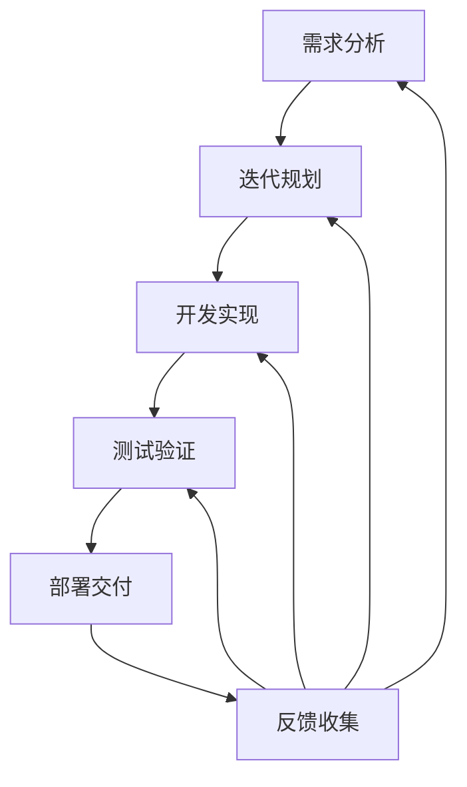

# 22.1.3 敏捷方法论 (Agile Methodology)

## 📋 目录

- [1 理论概述](#1-理论概述)
- [2 形式化语义](#2-形式化语义)
  - [2.1 核心定义](#21-核心定义)
  - [2.2 核心定理](#22-核心定理)
- [3 多表征方式](#3-多表征方式)
  - [3.1 图形表征](#31-图形表征)
  - [3.2 表格表征](#32-表格表征)
  - [3.3 数学表征](#33-数学表征)
  - [3.4 伪代码表征](#34-伪代码表征)
- [4 Rust实现](#4-rust实现)
- [5 哲学性批判与展望](#5-哲学性批判与展望)
  - [5.1 本体论反思](#51-本体论反思)
  - [5.2 认识论批判](#52-认识论批判)
  - [5.3 社会影响分析](#53-社会影响分析)
  - [5.4 终极哲学建议](#54-终极哲学建议)

---

## 1 理论概述

敏捷方法论是快速响应变化的开发方法，强调迭代、协作、适应和持续改进。
本理论涵盖敏捷价值观、迭代开发、团队协作、持续集成等核心概念，为快速响应变化和持续交付价值提供方法论支撑。

## 2 形式化语义

### 2.1 核心定义

**定义 3.1** (敏捷方法论)
敏捷方法论是快速响应变化的开发方法：$AM = (V, I, C, A)$，其中：

- $V$ 是价值观集合：$V = \{v_1, v_2, \ldots, v_n\}$
- $I$ 是迭代集合：$I = \{i_1, i_2, \ldots, i_m\}$
- $C$ 是协作集合：$C = \{c_1, c_2, \ldots, c_k\}$
- $A$ 是适应集合：$A = \{a_1, a_2, \ldots, a_l\}$

**定义 3.2** (迭代开发)
迭代开发是分阶段、增量的开发方法：$ID = \{S_1, S_2, \ldots, S_n\}$

**定义 3.3** (敏捷团队)
敏捷团队是自组织的协作团队：$AT = (M, R, P, G)$，其中：

- $M$ 是成员集合：$M = \{m_1, m_2, \ldots, m_n\}$
- $R$ 是角色集合：$R = \{r_1, r_2, \ldots, r_m\}$
- $P$ 是过程集合：$P = \{p_1, p_2, \ldots, p_k\}$
- $G$ 是目标集合：$G = \{g_1, g_2, \ldots, g_l\}$

**定义 3.4** (持续改进)
持续改进是不断优化过程的机制：$CI = \{I_1, I_2, \ldots, I_n\}$

### 2.2 核心定理

**定理 3.1** (敏捷适应性)
敏捷方法能够快速适应需求变化和环境变化：
$\forall \Delta R, \exists \Delta t : |\Delta t| < \epsilon$

**定理 3.2** (迭代收敛性)
迭代过程在有限步骤内收敛到目标：
$\lim_{n \to \infty} S_n = S^*$

**定理 3.3** (团队协作效率)
团队协作效率与沟通质量成正比：
$E_{team} \propto Q_{communication}$

## 3 多表征方式

### 3.1 图形表征



### 3.2 表格表征

| 敏捷阶段 | 主要活动 | 输出成果 | 关键指标 |
|---------|---------|---------|----------|
| 需求分析 | 用户故事 | 产品待办事项 | 需求完整性 |
| 迭代规划 | 任务分解 | 迭代计划 | 计划准确性 |
| 开发实现 | 编码实现 | 功能模块 | 代码质量 |
| 测试验证 | 单元测试 | 测试报告 | 测试覆盖率 |
| 部署交付 | 持续集成 | 可交付产品 | 部署频率 |
| 反馈收集 | 用户反馈 | 改进建议 | 用户满意度 |

### 3.3 数学表征

**迭代效率函数**：
$E_{iteration} = \frac{\sum_{i=1}^{n} v_i \cdot w_i}{\sum_{i=1}^{n} w_i}$

**团队协作函数**：
$C_{team} = \alpha \cdot Communication + \beta \cdot Coordination + \gamma \cdot Cooperation$

**适应速度函数**：
$A_{speed} = \frac{\Delta Output}{\Delta Time}$

### 3.4 伪代码表征

```python
class AgileMethodology:
    def __init__(self):
        self.values = ['个体和互动', '工作的软件', '客户合作', '响应变化']
        self.iterations = []
        self.team = AgileTeam()

    def plan_iteration(self, requirements):
        """迭代规划"""
        iteration = Iteration()
        for req in requirements:
            tasks = self.break_down_requirement(req)
            iteration.add_tasks(tasks)
        return iteration

    def execute_iteration(self, iteration):
        """执行迭代"""
        for task in iteration.tasks:
            result = self.develop_task(task)
            self.test_task(result)
            self.deploy_task(result)

    def collect_feedback(self):
        """收集反馈"""
        feedback = []
        for stakeholder in self.stakeholders:
            feedback.append(self.get_stakeholder_feedback(stakeholder))
        return feedback

    def adapt_process(self, feedback):
        """适应过程"""
        for item in feedback:
            self.improve_process(item)
```

## 4 Rust实现

```rust
use std::collections::HashMap;
use std::fmt;

/// 敏捷价值观
#[derive(Debug, Clone)]
pub struct AgileValues {
    pub individuals_and_interactions: bool,
    pub working_software: bool,
    pub customer_collaboration: bool,
    pub responding_to_change: bool,
}

/// 用户故事
#[derive(Debug, Clone)]
pub struct UserStory {
    pub id: String,
    pub title: String,
    pub description: String,
    pub acceptance_criteria: Vec<String>,
    pub priority: u32,
    pub story_points: u32,
    pub status: StoryStatus,
}

/// 故事状态
#[derive(Debug, Clone, PartialEq)]
pub enum StoryStatus {
    ToDo,
    InProgress,
    Done,
    Accepted,
}

/// 迭代
#[derive(Debug, Clone)]
pub struct Iteration {
    pub id: String,
    pub name: String,
    pub duration: u32, // 天数
    pub stories: Vec<UserStory>,
    pub velocity: f64,
    pub burndown: Vec<f64>,
}

/// 敏捷团队
#[derive(Debug, Clone)]
pub struct AgileTeam {
    pub id: String,
    pub name: String,
    pub members: Vec<TeamMember>,
    pub roles: Vec<TeamRole>,
    pub processes: Vec<Process>,
    pub goals: Vec<String>,
}

/// 团队成员
#[derive(Debug, Clone)]
pub struct TeamMember {
    pub id: String,
    pub name: String,
    pub role: String,
    pub skills: Vec<String>,
    pub availability: f64,
}

/// 团队角色
#[derive(Debug, Clone)]
pub struct TeamRole {
    pub name: String,
    pub responsibilities: Vec<String>,
    pub skills_required: Vec<String>,
}

/// 过程
#[derive(Debug, Clone)]
pub struct Process {
    pub name: String,
    pub steps: Vec<String>,
    pub metrics: Vec<String>,
}

/// 敏捷方法论
#[derive(Debug)]
pub struct AgileMethodology {
    pub values: AgileValues,
    pub iterations: Vec<Iteration>,
    pub team: AgileTeam,
    pub current_iteration: Option<String>,
    pub feedback: Vec<Feedback>,
    pub improvement_history: Vec<Improvement>,
}

/// 反馈
#[derive(Debug, Clone)]
pub struct Feedback {
    pub id: String,
    pub source: String,
    pub content: String,
    pub priority: u32,
    pub category: String,
}

/// 改进
#[derive(Debug, Clone)]
pub struct Improvement {
    pub id: String,
    pub description: String,
    pub impact: String,
    pub implementation_date: String,
}

impl AgileMethodology {
    /// 创建新的敏捷方法论
    pub fn new() -> Self {
        Self {
            values: AgileValues {
                individuals_and_interactions: true,
                working_software: true,
                customer_collaboration: true,
                responding_to_change: true,
            },
            iterations: Vec::new(),
            team: AgileTeam {
                id: "team_1".to_string(),
                name: "敏捷团队".to_string(),
                members: Vec::new(),
                roles: Vec::new(),
                processes: Vec::new(),
                goals: Vec::new(),
            },
            current_iteration: None,
            feedback: Vec::new(),
            improvement_history: Vec::new(),
        }
    }

    /// 规划迭代
    pub fn plan_iteration(&mut self, requirements: Vec<String>) -> Iteration {
        let iteration = Iteration {
            id: format!("ITER_{}", self.iterations.len() + 1),
            name: format!("迭代{}", self.iterations.len() + 1),
            duration: 14, // 2周
            stories: self.create_user_stories(requirements),
            velocity: self.calculate_velocity(),
            burndown: Vec::new(),
        };

        self.iterations.push(iteration.clone());
        self.current_iteration = Some(iteration.id.clone());
        iteration
    }

    /// 执行迭代
    pub fn execute_iteration(&mut self, iteration_id: &str) -> Vec<UserStory> {
        if let Some(iteration) = self.iterations.iter_mut().find(|i| i.id == iteration_id) {
            let mut completed_stories = Vec::new();

            for story in &mut iteration.stories {
                if story.status == StoryStatus::ToDo {
                    story.status = StoryStatus::InProgress;

                    // 模拟开发过程
                    self.develop_story(story);

                    if story.status == StoryStatus::Done {
                        completed_stories.push(story.clone());
                    }
                }
            }

            // 更新燃尽图
            self.update_burndown(iteration);

            completed_stories
        } else {
            Vec::new()
        }
    }

    /// 收集反馈
    pub fn collect_feedback(&mut self) -> Vec<Feedback> {
        let mut feedback = Vec::new();

        // 模拟收集不同来源的反馈
        let sources = vec!["用户", "团队成员", "产品经理", "测试人员"];

        for source in sources {
            let feedback_item = Feedback {
                id: format!("FB_{}", feedback.len() + 1),
                source: source.to_string(),
                content: self.simulate_feedback_content(source),
                priority: self.simulate_priority(),
                category: self.simulate_category(),
            };
            feedback.push(feedback_item);
        }

        self.feedback = feedback.clone();
        feedback
    }

    /// 适应过程
    pub fn adapt_process(&mut self) {
        for feedback in &self.feedback {
            if feedback.priority >= 3 {
                let improvement = Improvement {
                    id: format!("IMP_{}", self.improvement_history.len() + 1),
                    description: format!("基于反馈'{}'的改进", feedback.content),
                    impact: "提高团队效率".to_string(),
                    implementation_date: "立即".to_string(),
                };
                self.improvement_history.push(improvement);
            }
        }
    }

    /// 计算团队速度
    pub fn calculate_velocity(&self) -> f64 {
        if self.iterations.is_empty() {
            10.0 // 默认速度
        } else {
            let total_points: u32 = self.iterations.iter()
                .flat_map(|i| &i.stories)
                .filter(|s| s.status == StoryStatus::Done)
                .map(|s| s.story_points)
                .sum();

            let completed_iterations = self.iterations.len() as f64;
            total_points as f64 / completed_iterations
        }
    }

    /// 更新燃尽图
    pub fn update_burndown(&self, iteration: &mut Iteration) {
        let remaining_points: u32 = iteration.stories.iter()
            .filter(|s| s.status != StoryStatus::Done)
            .map(|s| s.story_points)
            .sum();

        iteration.burndown.push(remaining_points as f64);
    }

    // 辅助方法
    fn create_user_stories(&self, requirements: Vec<String>) -> Vec<UserStory> {
        requirements.into_iter().enumerate().map(|(i, req)| {
            UserStory {
                id: format!("US_{}", i + 1),
                title: req.clone(),
                description: format!("实现{}功能", req),
                acceptance_criteria: vec!["功能正常工作".to_string(), "用户界面友好".to_string()],
                priority: (i + 1) as u32,
                story_points: (i % 5 + 1) as u32,
                status: StoryStatus::ToDo,
            }
        }).collect()
    }

    fn develop_story(&self, story: &mut UserStory) {
        // 模拟开发过程
        story.status = StoryStatus::Done;
    }

    fn simulate_feedback_content(&self, source: &str) -> String {
        match source {
            "用户" => "界面需要更直观".to_string(),
            "团队成员" => "代码质量需要提高".to_string(),
            "产品经理" => "功能优先级需要调整".to_string(),
            "测试人员" => "测试覆盖率需要增加".to_string(),
            _ => "需要改进".to_string(),
        }
    }

    fn simulate_priority(&self) -> u32 {
        (rand::random::<u32>() % 5) + 1
    }

    fn simulate_category(&self) -> String {
        let categories = vec!["功能", "性能", "用户体验", "技术债务"];
        categories[rand::random::<usize>() % categories.len()].to_string()
    }
}

// 示例使用
fn main() {
    let mut agile = AgileMethodology::new();

    // 规划迭代
    let requirements = vec![
        "用户登录".to_string(),
        "产品列表".to_string(),
        "购物车功能".to_string(),
    ];

    let iteration = agile.plan_iteration(requirements);
    println!("迭代规划: {:?}", iteration);

    // 执行迭代
    let completed_stories = agile.execute_iteration(&iteration.id);
    println!("完成的故事: {:?}", completed_stories);

    // 收集反馈
    let feedback = agile.collect_feedback();
    println!("收集的反馈: {:?}", feedback);

    // 适应过程
    agile.adapt_process();
    println!("改进历史: {:?}", agile.improvement_history);

    // 计算速度
    let velocity = agile.calculate_velocity();
    println!("团队速度: {}", velocity);
}
```

## 5 哲学性批判与展望

### 5.1 本体论反思

**敏捷过程的本质**：
敏捷方法论揭示了软件开发过程的哲学本质。它不是静态的、预定义的，而是动态的、涌现的。这种过程性存在挑战了传统的瀑布式思维。

**变化的哲学意义**：
敏捷方法论强调响应变化，这反映了现代哲学中过程哲学的重要性。变化不再是异常，而是常态，这种认识重新定义了软件开发的本质。

### 5.2 认识论批判

**敏捷认知的局限性**：
敏捷方法论虽然提供了适应变化的方法，但敏捷认知本身存在局限性。我们无法完全预测所有变化，这种不确定性是敏捷方法的根本特征。

**迭代学习的本质**：
迭代过程本质上是学习过程，这种学习过程挑战了传统的确定性思维。敏捷需要接受这种不确定性，并将其作为学习和改进的源泉。

### 5.3 社会影响分析

**敏捷方法的社会价值**：
敏捷方法论为社会协作提供了新的模式。它强调团队协作和持续改进，有助于提高组织效率和创新能力。

**敏捷方法的社会责任**：
敏捷方法的应用需要考虑社会影响和伦理责任。敏捷应该服务于社会的可持续发展，而不是加剧社会问题。

### 5.4 终极哲学建议

**多元敏捷方法的融合**：
未来应该发展多元化的敏捷方法体系，融合不同文化背景和哲学传统的敏捷思想。

**敏捷方法的民主化**：
敏捷方法应该更加民主化，让更多人能够参与敏捷过程，实现真正的团队自组织。

**敏捷方法的生态化**：
敏捷方法应该更加关注生态系统的整体性，发展生态友好的敏捷实践。

## 📚 参考文献

1. Beck, K., et al. _Manifesto for Agile Software Development_. 2001.
2. Sutherland, J. _Scrum: The Art of Doing Twice the Work in Half the Time_. Crown Business, 2014.
3. Kniberg, H. _Scrum and XP from the Trenches_. InfoQ, 2007.
4. Anderson, D. J. _Kanban: Successful Evolutionary Change for Your Technology Business_. Blue Hole Press, 2010.
5. Poppendieck, M., & Poppendieck, T. _Lean Software Development: An Agile Toolkit_. Addison-Wesley, 2003.
