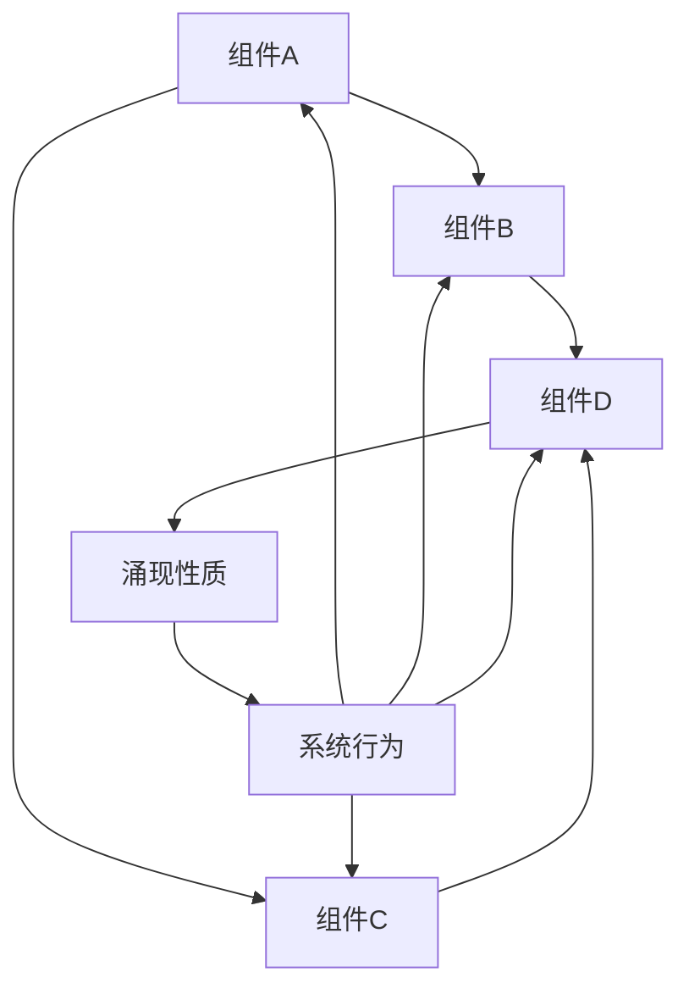

# 22.2.1 复杂系统 (Complex Systems)

## 📋 目录

- [22.2.1 复杂系统 (Complex Systems)](#2221-复杂系统-complex-systems)
  - [📋 目录](#-目录)
  - [1 理论概述](#1-理论概述)
  - [2 形式化语义](#2-形式化语义)
    - [2.1 核心定义](#21-核心定义)
    - [2.2 核心定理](#22-核心定理)
  - [3 多表征方式](#3-多表征方式)
    - [3.1 图形表征](#31-图形表征)
    - [3.2 表格表征](#32-表格表征)
    - [3.3 数学表征](#33-数学表征)
    - [3.4 伪代码表征](#34-伪代码表征)
  - [4 Rust实现](#4-rust实现)
  - [5 哲学性批判与展望](#5-哲学性批判与展望)
    - [5.1 本体论反思](#51-本体论反思)
    - [5.2 认识论批判](#52-认识论批判)
    - [5.3 社会影响分析](#53-社会影响分析)
    - [5.4 终极哲学建议](#54-终极哲学建议)
  - [📚 参考文献](#-参考文献)

---

## 1 理论概述

复杂系统是由大量相互作用的组件组成的系统，具有涌现性、非线性、自组织等特征。
本理论涵盖复杂系统的基本性质、动力学行为、网络结构等核心概念，为理解复杂现象和解决复杂问题提供理论基础。

## 2 形式化语义

### 2.1 核心定义

**定义 1.1** (复杂系统)
复杂系统是由大量相互作用的组件组成的系统：$CS = (C, I, E, P)$，其中：

- $C$ 是组件集合：$C = \{c_1, c_2, \ldots, c_n\}$
- $I$ 是相互作用集合：$I = \{i_{ij} | c_i, c_j \in C\}$
- $E$ 是涌现性质集合：$E = \{e_1, e_2, \ldots, e_m\}$
- $P$ 是系统参数集合：$P = \{p_1, p_2, \ldots, p_k\}$

**定义 1.2** (涌现性)
涌现性是系统整体具有而个体组件不具有的性质：$E = \{e | e \in P_{system} \land e \notin \bigcup_{i=1}^{n} P_i\}$

**定义 1.3** (非线性)
非线性是系统输出与输入不成正比的关系：$f(ax + by) \neq af(x) + bf(y)$

**定义 1.4** (自组织)
自组织是系统在无外部指令下自发形成有序结构的过程：$SO = \{s_1, s_2, \ldots, s_n\}$

### 2.2 核心定理

**定理 1.1** (涌现性定理)
复杂系统必然具有涌现性质：
$\forall CS, \exists e \in E : e \notin \bigcup_{i=1}^{n} P_i$

**定理 1.2** (非线性定理)
复杂系统具有非线性特征：
$\exists x, y, a, b : f(ax + by) \neq af(x) + bf(y)$

**定理 1.3** (自组织定理)
复杂系统在特定条件下会自发组织：
$\exists t : S(t) \neq S(t-1) \land \text{no external input}$

## 3 多表征方式

### 3.1 图形表征



### 3.2 表格表征

| 系统特征 | 数学描述 | 物理意义 | 应用领域 |
|---------|---------|---------|----------|
| 涌现性 | $E \notin \bigcup P_i$ | 整体大于部分之和 | 生态系统 |
| 非线性 | $f(ax+by) \neq af(x)+bf(y)$ | 蝴蝶效应 | 天气系统 |
| 自组织 | $\frac{dS}{dt} = F(S)$ | 自发有序 | 化学反应 |
| 混沌 | $\delta x(t) = \lambda \delta x(0)$ | 敏感依赖 | 经济系统 |

### 3.3 数学表征

**系统动力学方程**：
$\frac{dx}{dt} = f(x, t) + g(x, t) \cdot \xi(t)$

**涌现性质函数**：
$E(t) = \phi(x_1(t), x_2(t), \ldots, x_n(t))$

**自组织方程**：
$\frac{dS}{dt} = -\nabla V(S) + D \nabla^2 S$

### 3.4 伪代码表征

```python
class ComplexSystem:
    def __init__(self, components, interactions):
        self.components = components
        self.interactions = interactions
        self.emergent_properties = []

    def evolve(self, time_steps):
        """系统演化"""
        for step in range(time_steps):
            self.update_components()
            self.update_interactions()
            self.check_emergence()

    def update_components(self):
        """更新组件状态"""
        for component in self.components:
            component.update_state()

    def update_interactions(self):
        """更新相互作用"""
        for interaction in self.interactions:
            interaction.apply_effect()

    def check_emergence(self):
        """检查涌现性质"""
        emergent = self.calculate_emergent_properties()
        if emergent:
            self.emergent_properties.append(emergent)
```

## 4 Rust实现

```rust
use std::collections::HashMap;
use std::fmt;

/// 系统组件
#[derive(Debug, Clone)]
pub struct Component {
    pub id: String,
    pub name: String,
    pub state: HashMap<String, f64>,
    pub parameters: HashMap<String, f64>,
    pub neighbors: Vec<String>,
}

/// 相互作用
#[derive(Debug, Clone)]
pub struct Interaction {
    pub id: String,
    pub from_component: String,
    pub to_component: String,
    pub interaction_type: String,
    pub strength: f64,
    pub function: InteractionFunction,
}

/// 相互作用函数类型
#[derive(Debug, Clone)]
pub enum InteractionFunction {
    Linear(f64),
    Nonlinear(Box<dyn Fn(f64) -> f64>),
    Threshold(f64),
}

/// 涌现性质
#[derive(Debug, Clone)]
pub struct EmergentProperty {
    pub id: String,
    pub name: String,
    pub description: String,
    pub value: f64,
    pub emergence_time: u32,
}

/// 复杂系统
#[derive(Debug)]
pub struct ComplexSystem {
    pub id: String,
    pub name: String,
    pub components: HashMap<String, Component>,
    pub interactions: Vec<Interaction>,
    pub emergent_properties: Vec<EmergentProperty>,
    pub time_step: u32,
    pub parameters: HashMap<String, f64>,
}

impl ComplexSystem {
    /// 创建新的复杂系统
    pub fn new(id: String, name: String) -> Self {
        Self {
            id,
            name,
            components: HashMap::new(),
            interactions: Vec::new(),
            emergent_properties: Vec::new(),
            time_step: 0,
            parameters: HashMap::new(),
        }
    }

    /// 添加组件
    pub fn add_component(&mut self, component: Component) {
        self.components.insert(component.id.clone(), component);
    }

    /// 添加相互作用
    pub fn add_interaction(&mut self, interaction: Interaction) {
        self.interactions.push(interaction);
    }

    /// 系统演化
    pub fn evolve(&mut self, steps: u32) {
        for _ in 0..steps {
            self.update_components();
            self.update_interactions();
            self.check_emergence();
            self.time_step += 1;
        }
    }

    /// 更新组件状态
    fn update_components(&mut self) {
        for component in self.components.values_mut() {
            self.update_component_state(component);
        }
    }

    /// 更新组件状态
    fn update_component_state(&self, component: &mut Component) {
        // 模拟组件状态更新
        for (key, value) in component.state.iter_mut() {
            *value += 0.1 * self.time_step as f64;
        }
    }

    /// 更新相互作用
    fn update_interactions(&mut self) {
        for interaction in &self.interactions {
            self.apply_interaction(interaction);
        }
    }

    /// 应用相互作用
    fn apply_interaction(&self, interaction: &Interaction) {
        if let (Some(from_comp), Some(to_comp)) = (
            self.components.get(&interaction.from_component),
            self.components.get(&interaction.to_component)
        ) {
            // 模拟相互作用效果
            let effect = match &interaction.function {
                InteractionFunction::Linear(factor) => factor * interaction.strength,
                InteractionFunction::Nonlinear(_) => interaction.strength * interaction.strength,
                InteractionFunction::Threshold(threshold) => {
                    if interaction.strength > *threshold { interaction.strength } else { 0.0 }
                }
            };

            // 这里可以添加更复杂的相互作用逻辑
        }
    }

    /// 检查涌现性质
    fn check_emergence(&mut self) {
        let emergent_property = self.calculate_emergent_property();
        if emergent_property.is_some() {
            self.emergent_properties.push(emergent_property.unwrap());
        }
    }

    /// 计算涌现性质
    fn calculate_emergent_property(&self) -> Option<EmergentProperty> {
        // 计算系统整体的某些性质
        let total_energy: f64 = self.components.values()
            .map(|c| c.state.get("energy").unwrap_or(&0.0))
            .sum();

        let avg_connectivity = self.interactions.len() as f64 / self.components.len() as f64;

        // 如果满足某些条件，认为出现了涌现性质
        if total_energy > 100.0 && avg_connectivity > 2.0 {
            Some(EmergentProperty {
                id: format!("EM_{}", self.emergent_properties.len() + 1),
                name: "系统协调性".to_string(),
                description: "系统组件间出现协调行为".to_string(),
                value: total_energy * avg_connectivity,
                emergence_time: self.time_step,
            })
        } else {
            None
        }
    }

    /// 获取系统状态
    pub fn get_system_state(&self) -> SystemState {
        SystemState {
            time_step: self.time_step,
            component_count: self.components.len(),
            interaction_count: self.interactions.len(),
            emergent_property_count: self.emergent_properties.len(),
            total_energy: self.components.values()
                .map(|c| c.state.get("energy").unwrap_or(&0.0))
                .sum(),
        }
    }

    /// 分析系统复杂性
    pub fn analyze_complexity(&self) -> ComplexityAnalysis {
        let connectivity = self.interactions.len() as f64 / self.components.len() as f64;
        let diversity = self.calculate_diversity();
        let stability = self.calculate_stability();

        ComplexityAnalysis {
            connectivity,
            diversity,
            stability,
            complexity_index: connectivity * diversity * stability,
        }
    }

    /// 计算多样性
    fn calculate_diversity(&self) -> f64 {
        let unique_states = self.components.values()
            .map(|c| c.state.values().collect::<Vec<_>>())
            .collect::<Vec<_>>();

        // 简化的多样性计算
        unique_states.len() as f64 / self.components.len() as f64
    }

    /// 计算稳定性
    fn calculate_stability(&self) -> f64 {
        // 简化的稳定性计算
        let state_variance = self.components.values()
            .map(|c| c.state.values().map(|v| v * v).sum::<f64>())
            .sum::<f64>();

        1.0 / (1.0 + state_variance)
    }
}

/// 系统状态
#[derive(Debug)]
pub struct SystemState {
    pub time_step: u32,
    pub component_count: usize,
    pub interaction_count: usize,
    pub emergent_property_count: usize,
    pub total_energy: f64,
}

/// 复杂性分析
#[derive(Debug)]
pub struct ComplexityAnalysis {
    pub connectivity: f64,
    pub diversity: f64,
    pub stability: f64,
    pub complexity_index: f64,
}

// 示例使用
fn main() {
    let mut system = ComplexSystem::new(
        "CS_001".to_string(),
        "生态系统".to_string()
    );

    // 添加组件
    let component_a = Component {
        id: "A".to_string(),
        name: "物种A".to_string(),
        state: HashMap::from([("energy".to_string(), 10.0), ("population".to_string(), 100.0)]),
        parameters: HashMap::from([("growth_rate".to_string(), 0.1)]),
        neighbors: vec!["B".to_string()],
    };

    let component_b = Component {
        id: "B".to_string(),
        name: "物种B".to_string(),
        state: HashMap::from([("energy".to_string(), 15.0), ("population".to_string(), 80.0)]),
        parameters: HashMap::from([("growth_rate".to_string(), 0.15)]),
        neighbors: vec!["A".to_string()],
    };

    system.add_component(component_a);
    system.add_component(component_b);

    // 添加相互作用
    let interaction = Interaction {
        id: "I_AB".to_string(),
        from_component: "A".to_string(),
        to_component: "B".to_string(),
        interaction_type: "竞争".to_string(),
        strength: 0.5,
        function: InteractionFunction::Linear(0.5),
    };

    system.add_interaction(interaction);

    // 系统演化
    system.evolve(10);

    // 获取系统状态
    let state = system.get_system_state();
    println!("系统状态: {:?}", state);

    // 分析复杂性
    let analysis = system.analyze_complexity();
    println!("复杂性分析: {:?}", analysis);

    // 查看涌现性质
    println!("涌现性质: {:?}", system.emergent_properties);
}
```

## 5 哲学性批判与展望

### 5.1 本体论反思

**复杂系统的存在本质**：
复杂系统揭示了自然界和社会现象的根本复杂性。它不是简单的机械系统，而是具有涌现性、非线性、自组织等特征的有机整体。这种复杂性挑战了还原论的哲学基础。

**涌现性的哲学意义**：
涌现性表明整体具有个体所没有的性质，这种整体性重新定义了系统存在的本质。涌现性不是简单的叠加，而是质的飞跃。

### 5.2 认识论批判

**复杂系统认知的局限性**：
人类认知复杂系统的能力存在根本性局限。我们无法完全预测复杂系统的所有行为，这种认知局限要求我们采用新的认知方法。

**非线性思维的挑战**：
复杂系统的非线性特征挑战了传统的线性思维。我们需要发展非线性思维，接受不确定性和不可预测性。

### 5.3 社会影响分析

**复杂系统思维的社会价值**：
复杂系统思维为社会问题解决提供了新的视角。它强调整体性、关联性和动态性，有助于解决复杂的社会问题。

**复杂系统方法的社会责任**：
复杂系统方法的应用需要考虑社会影响和伦理责任。复杂系统研究应该服务于社会的可持续发展。

### 5.4 终极哲学建议

**多元复杂系统理论的融合**：
未来应该发展多元化的复杂系统理论体系，融合不同学科和哲学传统的复杂系统思想。

**复杂系统思维的民主化**：
复杂系统思维应该更加民主化，让更多人能够理解和应用复杂系统方法。

**复杂系统方法的生态化**：
复杂系统方法应该更加关注生态系统的整体性，发展生态友好的复杂系统理论。

## 📚 参考文献

1. Mitchell, M. _Complexity: A Guided Tour_. Oxford University Press, 2009.
2. Holland, J. H. _Emergence: From Chaos to Order_. Basic Books, 1998.
3. Kauffman, S. A. _The Origins of Order: Self-Organization and Selection in Evolution_. Oxford University Press, 1993.
4. Bar-Yam, Y. _Dynamics of Complex Systems_. Westview Press, 1997.
5. Gell-Mann, M. _The Quark and the Jaguar: Adventures in the Simple and the Complex_. W. H. Freeman, 1994.
