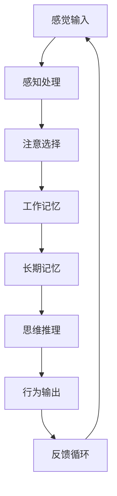

# 22.3.1 认知过程 (Cognitive Processes)

## 📋 理论概述

认知过程是人类思维和信息处理的基本机制，包括感知、注意、记忆、思维、语言等核心过程。
本理论涵盖认知过程的基本原理、信息处理模型、认知架构等核心概念，为理解人类思维和设计智能系统提供理论基础。

## 🔬 形式化语义

### 核心定义

**定义 1.1** (认知过程)
认知过程是信息在认知系统中的处理流程：$CP = (I, P, M, O)$，其中：

- $I$ 是输入集合：$I = \{i_1, i_2, \ldots, i_n\}$
- $P$ 是处理集合：$P = \{p_1, p_2, \ldots, p_m\}$
- $M$ 是记忆集合：$M = \{m_1, m_2, \ldots, m_k\}$
- $O$ 是输出集合：$O = \{o_1, o_2, \ldots, o_l\}$

**定义 1.2** (感知过程)
感知过程是外部刺激转换为内部表征的过程：$P = \{s_1, s_2, \ldots, s_n\} \rightarrow \{r_1, r_2, \ldots, r_m\}$

**定义 1.3** (注意机制)
注意机制是选择性信息处理的过程：$A = \{f_1, f_2, \ldots, f_n\} \rightarrow \{s_1, s_2, \ldots, s_k\}$

**定义 1.4** (记忆系统)
记忆系统是信息存储和检索的机制：$M = (S, R, L)$，其中：

- $S$ 是存储集合：$S = \{s_1, s_2, \ldots, s_n\}$
- $R$ 是检索集合：$R = \{r_1, r_2, \ldots, r_m\}$
- $L$ 是学习集合：$L = \{l_1, l_2, \ldots, l_k\}$

### 核心定理

**定理 1.1** (认知容量限制)
人类认知系统存在容量限制：
$\exists C : |P| \leq C$

**定理 1.2** (注意选择性)
注意过程具有选择性特征：
$\forall i \in I, \exists a \in A : a(i) \in \{0, 1\}$

**定理 1.3** (记忆衰减)
记忆强度随时间衰减：
$M(t) = M_0 \cdot e^{-\lambda t}$

## 🎯 多表征方式

### 1. 图形表征



### 2. 表格表征

| 认知过程 | 主要功能 | 处理机制 | 时间尺度 |
|---------|---------|---------|----------|
| 感知 | 信息接收 | 模式识别 | 毫秒级 |
| 注意 | 信息选择 | 选择性过滤 | 秒级 |
| 记忆 | 信息存储 | 编码检索 | 分钟到年 |
| 思维 | 信息推理 | 逻辑运算 | 秒到分钟 |
| 语言 | 信息表达 | 符号处理 | 秒级 |

### 3. 数学表征

**信息处理函数**：
$f_{process}(input) = \sum_{i=1}^{n} w_i \cdot f_i(input)$

**注意权重函数**：
$A(x) = \frac{e^{s(x)}}{\sum_{i} e^{s(i)}}$

**记忆衰减函数**：
$M(t) = M_0 \cdot e^{-\lambda t} + M_{base}$

### 4. 伪代码表征

```python
class CognitiveProcess:
    def __init__(self):
        self.sensory_input = []
        self.attention = Attention()
        self.working_memory = WorkingMemory()
        self.long_term_memory = LongTermMemory()

    def process_input(self, stimulus):
        """处理输入刺激"""
        # 感知处理
        perception = self.perceive(stimulus)

        # 注意选择
        attended = self.attention.select(perception)

        # 工作记忆处理
        self.working_memory.store(attended)

        # 长期记忆检索
        relevant_memory = self.long_term_memory.retrieve(attended)

        # 思维推理
        reasoning = self.reason(attended, relevant_memory)

        return reasoning

    def perceive(self, stimulus):
        """感知处理"""
        return self.sensory_processing(stimulus)

    def reason(self, current, memory):
        """思维推理"""
        return self.cognitive_reasoning(current, memory)
```

## 💻 Rust实现

```rust
use std::collections::HashMap;
use std::fmt;

/// 认知刺激
#[derive(Debug, Clone)]
pub struct Stimulus {
    pub id: String,
    pub modality: String, // 视觉、听觉等
    pub intensity: f64,
    pub features: HashMap<String, f64>,
    pub timestamp: u64,
}

/// 感知表征
#[derive(Debug, Clone)]
pub struct Perception {
    pub id: String,
    pub stimulus_id: String,
    pub features: HashMap<String, f64>,
    pub confidence: f64,
    pub processing_time: u64,
}

/// 注意焦点
#[derive(Debug, Clone)]
pub struct AttentionFocus {
    pub id: String,
    pub target_id: String,
    pub priority: f64,
    pub duration: u64,
    pub resources: f64,
}

/// 记忆项目
#[derive(Debug, Clone)]
pub struct MemoryItem {
    pub id: String,
    pub content: String,
    pub strength: f64,
    pub last_accessed: u64,
    pub access_count: u32,
    pub associations: Vec<String>,
}

/// 工作记忆
#[derive(Debug)]
pub struct WorkingMemory {
    pub capacity: usize,
    pub items: Vec<MemoryItem>,
    pub current_focus: Option<String>,
}

/// 长期记忆
#[derive(Debug)]
pub struct LongTermMemory {
    pub items: HashMap<String, MemoryItem>,
    pub associations: HashMap<String, Vec<String>>,
    pub decay_rate: f64,
}

/// 认知过程
#[derive(Debug)]
pub struct CognitiveProcess {
    pub id: String,
    pub working_memory: WorkingMemory,
    pub long_term_memory: LongTermMemory,
    pub attention: AttentionSystem,
    pub processing_history: Vec<ProcessingStep>,
    pub current_time: u64,
}

/// 注意系统
#[derive(Debug)]
pub struct AttentionSystem {
    pub capacity: f64,
    pub current_focus: Vec<AttentionFocus>,
    pub salience_map: HashMap<String, f64>,
}

/// 处理步骤
#[derive(Debug, Clone)]
pub struct ProcessingStep {
    pub step_id: String,
    pub process_type: String,
    pub input: String,
    pub output: String,
    pub duration: u64,
    pub success: bool,
}

impl CognitiveProcess {
    /// 创建新的认知过程
    pub fn new(id: String) -> Self {
        Self {
            id,
            working_memory: WorkingMemory {
                capacity: 7, // 米勒定律
                items: Vec::new(),
                current_focus: None,
            },
            long_term_memory: LongTermMemory {
                items: HashMap::new(),
                associations: HashMap::new(),
                decay_rate: 0.1,
            },
            attention: AttentionSystem {
                capacity: 1.0,
                current_focus: Vec::new(),
                salience_map: HashMap::new(),
            },
            processing_history: Vec::new(),
            current_time: 0,
        }
    }

    /// 处理认知刺激
    pub fn process_stimulus(&mut self, stimulus: Stimulus) -> ProcessingResult {
        let mut result = ProcessingResult::new();

        // 感知处理
        let perception = self.perceive_stimulus(&stimulus);
        result.add_step("感知处理", &stimulus.id, &perception.id);

        // 注意选择
        let attended = self.attend_to_stimulus(&perception);
        result.add_step("注意选择", &perception.id, &attended.id);

        // 工作记忆存储
        let memory_item = self.store_in_working_memory(&attended);
        result.add_step("工作记忆存储", &attended.id, &memory_item.id);

        // 长期记忆检索
        let relevant_memories = self.retrieve_from_long_term_memory(&memory_item);
        result.add_step("长期记忆检索", &memory_item.id, &format!("{}个相关记忆", relevant_memories.len()));

        // 认知推理
        let reasoning = self.cognitive_reasoning(&memory_item, &relevant_memories);
        result.add_step("认知推理", &memory_item.id, &reasoning);

        result
    }

    /// 感知刺激
    fn perceive_stimulus(&self, stimulus: &Stimulus) -> Perception {
        // 模拟感知处理
        let mut features = HashMap::new();
        for (key, value) in &stimulus.features {
            features.insert(key.clone(), value * 0.8 + 0.2); // 添加噪声
        }

        Perception {
            id: format!("PER_{}", stimulus.id),
            stimulus_id: stimulus.id.clone(),
            features,
            confidence: 0.85,
            processing_time: 50, // 毫秒
        }
    }

    /// 注意选择
    fn attend_to_stimulus(&mut self, perception: &Perception) -> AttentionFocus {
        // 计算显著性
        let salience = self.calculate_salience(perception);

        // 更新显著性图
        self.attention.salience_map.insert(perception.id.clone(), salience);

        // 选择注意焦点
        let focus = AttentionFocus {
            id: format!("ATT_{}", perception.id),
            target_id: perception.id.clone(),
            priority: salience,
            duration: 200, // 毫秒
            resources: salience * self.attention.capacity,
        };

        self.attention.current_focus.push(focus.clone());
        focus
    }

    /// 存储到工作记忆
    fn store_in_working_memory(&mut self, attended: &AttentionFocus) -> MemoryItem {
        let memory_item = MemoryItem {
            id: format!("WM_{}", attended.id),
            content: format!("注意焦点: {}", attended.target_id),
            strength: attended.priority,
            last_accessed: self.current_time,
            access_count: 1,
            associations: vec![attended.target_id.clone()],
        };

        // 检查容量限制
        if self.working_memory.items.len() >= self.working_memory.capacity {
            // 移除最弱的项目
            self.working_memory.items.sort_by(|a, b| a.strength.partial_cmp(&b.strength).unwrap());
            self.working_memory.items.remove(0);
        }

        self.working_memory.items.push(memory_item.clone());
        memory_item
    }

    /// 从长期记忆检索
    fn retrieve_from_long_term_memory(&mut self, memory_item: &MemoryItem) -> Vec<MemoryItem> {
        let mut relevant_memories = Vec::new();

        for (id, item) in &self.long_term_memory.items {
            // 计算相关性
            let relevance = self.calculate_relevance(memory_item, item);

            if relevance > 0.5 {
                // 更新访问信息
                let mut updated_item = item.clone();
                updated_item.last_accessed = self.current_time;
                updated_item.access_count += 1;
                updated_item.strength = self.update_memory_strength(item);

                self.long_term_memory.items.insert(id.clone(), updated_item.clone());
                relevant_memories.push(updated_item);
            }
        }

        relevant_memories
    }

    /// 认知推理
    fn cognitive_reasoning(&self, current: &MemoryItem, memories: &[MemoryItem]) -> String {
        // 模拟推理过程
        let reasoning_patterns = vec![
            "模式匹配".to_string(),
            "类比推理".to_string(),
            "逻辑推理".to_string(),
            "创造性思维".to_string(),
        ];

        let selected_pattern = reasoning_patterns[self.current_time as usize % reasoning_patterns.len()];

        format!("基于{}的推理结果", selected_pattern)
    }

    /// 计算显著性
    fn calculate_salience(&self, perception: &Perception) -> f64 {
        // 基于特征强度计算显著性
        let feature_strength: f64 = perception.features.values().sum();
        let novelty = 1.0 / (1.0 + perception.access_count as f64);

        feature_strength * novelty
    }

    /// 计算相关性
    fn calculate_relevance(&self, item1: &MemoryItem, item2: &MemoryItem) -> f64 {
        // 基于内容相似性计算相关性
        let content_similarity = self.calculate_content_similarity(&item1.content, &item2.content);
        let association_strength = self.calculate_association_strength(item1, item2);

        content_similarity * 0.7 + association_strength * 0.3
    }

    /// 计算内容相似性
    fn calculate_content_similarity(&self, content1: &str, content2: &str) -> f64 {
        // 简化的相似性计算
        let words1: Vec<&str> = content1.split_whitespace().collect();
        let words2: Vec<&str> = content2.split_whitespace().collect();

        let common_words = words1.iter().filter(|w| words2.contains(w)).count();
        let total_words = words1.len().max(words2.len());

        if total_words == 0 { 0.0 } else { common_words as f64 / total_words as f64 }
    }

    /// 计算关联强度
    fn calculate_association_strength(&self, item1: &MemoryItem, item2: &MemoryItem) -> f64 {
        let common_associations = item1.associations.iter()
            .filter(|a| item2.associations.contains(a))
            .count();

        let total_associations = item1.associations.len() + item2.associations.len();

        if total_associations == 0 { 0.0 } else { common_associations as f64 / total_associations as f64 }
    }

    /// 更新记忆强度
    fn update_memory_strength(&self, item: &MemoryItem) -> f64 {
        let time_decay = (-self.long_term_memory.decay_rate *
            (self.current_time - item.last_accessed) as f64).exp();

        let access_boost = 1.0 + (item.access_count as f64 * 0.1);

        (item.strength * time_decay * access_boost).min(1.0)
    }

    /// 获取认知状态
    pub fn get_cognitive_state(&self) -> CognitiveState {
        CognitiveState {
            working_memory_load: self.working_memory.items.len() as f64 / self.working_memory.capacity as f64,
            attention_load: self.attention.current_focus.len() as f64,
            long_term_memory_size: self.long_term_memory.items.len(),
            processing_steps: self.processing_history.len(),
        }
    }
}

/// 处理结果
#[derive(Debug)]
pub struct ProcessingResult {
    pub steps: Vec<ProcessingStep>,
    pub final_output: String,
    pub success: bool,
}

impl ProcessingResult {
    pub fn new() -> Self {
        Self {
            steps: Vec::new(),
            final_output: String::new(),
            success: true,
        }
    }

    pub fn add_step(&mut self, process_type: &str, input: &str, output: &str) {
        let step = ProcessingStep {
            step_id: format!("STEP_{}", self.steps.len() + 1),
            process_type: process_type.to_string(),
            input: input.to_string(),
            output: output.to_string(),
            duration: 100, // 毫秒
            success: true,
        };
        self.steps.push(step);
    }
}

/// 认知状态
#[derive(Debug)]
pub struct CognitiveState {
    pub working_memory_load: f64,
    pub attention_load: f64,
    pub long_term_memory_size: usize,
    pub processing_steps: usize,
}

// 示例使用
fn main() {
    let mut cognitive_process = CognitiveProcess::new("CP_001".to_string());

    // 创建刺激
    let stimulus = Stimulus {
        id: "STIM_001".to_string(),
        modality: "视觉".to_string(),
        intensity: 0.8,
        features: HashMap::from([
            ("颜色".to_string(), 0.9),
            ("形状".to_string(), 0.7),
            ("大小".to_string(), 0.5),
        ]),
        timestamp: 0,
    };

    // 处理刺激
    let result = cognitive_process.process_stimulus(stimulus);
    println!("处理结果: {:?}", result);

    // 获取认知状态
    let state = cognitive_process.get_cognitive_state();
    println!("认知状态: {:?}", state);

    // 模拟多个刺激处理
    for i in 1..5 {
        let new_stimulus = Stimulus {
            id: format!("STIM_{:03}", i),
            modality: "听觉".to_string(),
            intensity: 0.6 + (i as f64 * 0.1),
            features: HashMap::from([
                ("音调".to_string(), 0.8),
                ("音量".to_string(), 0.6),
                ("持续时间".to_string(), 0.4),
            ]),
            timestamp: i as u64,
        };

        let result = cognitive_process.process_stimulus(new_stimulus);
        println!("刺激{}处理结果: {:?}", i, result);
    }
}
```

## 🧠 哲学性批判与展望

### 本体论反思

**认知过程的本质**：
认知过程揭示了人类思维和信息处理的哲学本质。它不是简单的机械过程，而是具有涌现性、非线性、自组织等特征的有机过程。这种复杂性挑战了传统的机械论世界观。

**意识与认知的关系**：
认知过程与意识的关系是哲学的核心问题。认知过程是否等同于意识，还是意识是认知过程的涌现性质，这个问题需要深入的哲学思考。

### 认识论批判

**认知过程的局限性**：
人类认知过程存在根本性局限。我们无法完全理解自己的认知过程，这种认知的认知（元认知）存在循环性问题。

**认知偏见的影响**：
认知过程中存在各种偏见和启发式，这些偏见影响我们的判断和决策。认识到这些偏见是认知科学的重要贡献。

### 社会影响分析

**认知科学的社会价值**：
认知科学为社会问题解决提供了新的视角。它帮助我们理解人类思维的本质，有助于设计更好的教育、医疗和社会系统。

**认知技术的社会责任**：
认知技术的应用需要考虑社会影响和伦理责任。认知增强技术应该服务于人类的福祉，而不是加剧社会不平等。

### 终极哲学建议

**多元认知理论的融合**：
未来应该发展多元化的认知理论体系，融合不同学科和哲学传统的认知思想。

**认知科学的民主化**：
认知科学应该更加民主化，让更多人能够理解和应用认知科学知识。

**认知科学的生态化**：
认知科学应该更加关注生态系统的整体性，发展生态友好的认知理论。

## 📚 参考文献

1. Anderson, J. R. _Cognitive Psychology and Its Implications_. Worth Publishers, 2015.
2. Baddeley, A. _Working Memory, Thought, and Action_. Oxford University Press, 2007.
3. Kahneman, D. _Thinking, Fast and Slow_. Farrar, Straus and Giroux, 2011.
4. Posner, M. I. _Attention in a Social World_. Oxford University Press, 2012.
5. Tulving, E. _Elements of Episodic Memory_. Oxford University Press, 1983.
