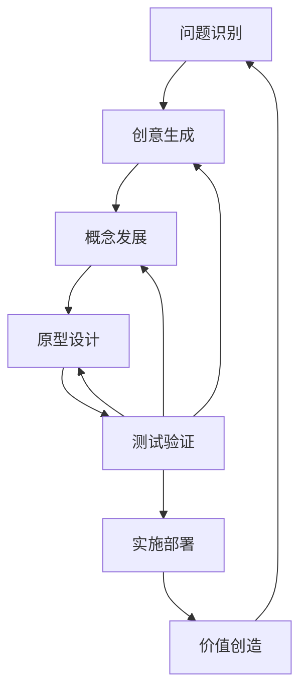

# 22.4.1 创新过程 (Innovation Process)

## 📋 理论概述

创新过程是从问题发现到解决方案实现的系统性过程，包括创意生成、概念发展、原型设计、测试验证等关键阶段。
本理论涵盖创新过程的基本原理、创新方法、创新管理等核心概念，为促进创新和推动发展提供方法论支撑。

## 🔬 形式化语义

### 核心定义

**定义 1.1** (创新过程)
创新过程是从问题到解决方案的系统性流程：$IP = (P, G, D, T, I)$，其中：

- $P$ 是问题集合：$P = \{p_1, p_2, \ldots, p_n\}$
- $G$ 是创意集合：$G = \{g_1, g_2, \ldots, g_m\}$
- $D$ 是设计集合：$D = \{d_1, d_2, \ldots, d_k\}$
- $T$ 是测试集合：$T = \{t_1, t_2, \ldots, t_l\}$
- $I$ 是实施集合：$I = \{i_1, i_2, \ldots, i_r\}$

**定义 1.2** (创意生成)
创意生成是产生新想法和概念的过程：$CG = \{b_1, b_2, \ldots, b_n\} \rightarrow \{c_1, c_2, \ldots, c_m\}$

**定义 1.3** (创新价值)
创新价值是创新成果的社会和经济价值：$IV = (E, S, T)$，其中：

- $E$ 是经济价值：$E = \{e_1, e_2, \ldots, e_n\}$
- $S$ 是社会价值：$S = \{s_1, s_2, \ldots, s_m\}$
- $T$ 是技术价值：$T = \{t_1, t_2, \ldots, t_k\}$

**定义 1.4** (创新风险)
创新风险是创新过程中的不确定性：$IR = \{r_1, r_2, \ldots, r_n\}$

### 核心定理

**定理 1.1** (创新涌现性)
创新成果具有涌现性质：
$\exists i \in I : i \notin \bigcup_{j=1}^{n} P_j$

**定理 1.2** (创新不确定性)
创新过程具有不确定性：
$\forall p \in P, \exists \epsilon > 0 : |outcome - expected| > \epsilon$

**定理 1.3** (创新价值递增)
创新价值随时间递增：
$\frac{dV}{dt} > 0$

## 🎯 多表征方式

### 1. 图形表征



### 2. 表格表征

| 创新阶段 | 主要活动 | 关键输出 | 成功指标 |
|---------|---------|---------|----------|
| 问题识别 | 需求分析 | 问题陈述 | 问题清晰度 |
| 创意生成 | 头脑风暴 | 创意列表 | 创意数量 |
| 概念发展 | 概念设计 | 概念模型 | 概念可行性 |
| 原型设计 | 快速制作 | 原型产品 | 原型质量 |
| 测试验证 | 用户测试 | 测试报告 | 用户满意度 |
| 实施部署 | 市场推广 | 产品服务 | 市场接受度 |

### 3. 数学表征

**创新价值函数**：
$V_{innovation} = \alpha \cdot E + \beta \cdot S + \gamma \cdot T$

**创新风险函数**：
$R_{innovation} = \sum_{i=1}^{n} w_i \cdot r_i$

**创新效率函数**：
$E_{innovation} = \frac{V_{output}}{C_{input}}$

### 4. 伪代码表征

```python
class InnovationProcess:
    def __init__(self):
        self.problems = []
        self.ideas = []
        self.concepts = []
        self.prototypes = []
        self.tests = []
        
    def identify_problems(self, context):
        """问题识别"""
        problems = self.analyze_needs(context)
        return self.prioritize_problems(problems)
        
    def generate_ideas(self, problems):
        """创意生成"""
        ideas = []
        for problem in problems:
            problem_ideas = self.brainstorm_solutions(problem)
            ideas.extend(problem_ideas)
        return self.evaluate_ideas(ideas)
        
    def develop_concepts(self, ideas):
        """概念发展"""
        concepts = []
        for idea in ideas:
            concept = self.design_concept(idea)
            concepts.append(concept)
        return self.refine_concepts(concepts)
        
    def create_prototypes(self, concepts):
        """原型设计"""
        prototypes = []
        for concept in concepts:
            prototype = self.build_prototype(concept)
            prototypes.append(prototype)
        return prototypes
        
    def test_innovations(self, prototypes):
        """测试验证"""
        results = []
        for prototype in prototypes:
            result = self.test_prototype(prototype)
            results.append(result)
        return self.analyze_results(results)
```

## 💻 Rust实现

```rust
use std::collections::HashMap;
use std::fmt;

/// 创新问题
#[derive(Debug, Clone)]
pub struct InnovationProblem {
    pub id: String,
    pub title: String,
    pub description: String,
    pub priority: u32,
    pub stakeholders: Vec<String>,
    pub constraints: Vec<String>,
    pub impact: ProblemImpact,
}

/// 问题影响
#[derive(Debug, Clone)]
pub struct ProblemImpact {
    pub economic: f64,
    pub social: f64,
    pub environmental: f64,
    pub technical: f64,
}

/// 创新创意
#[derive(Debug, Clone)]
pub struct InnovationIdea {
    pub id: String,
    pub title: String,
    pub description: String,
    pub problem_id: String,
    pub novelty: f64,
    pub feasibility: f64,
    pub impact: f64,
    pub creator: String,
    pub creation_time: u64,
}

/// 创新概念
#[derive(Debug, Clone)]
pub struct InnovationConcept {
    pub id: String,
    pub idea_id: String,
    pub name: String,
    pub description: String,
    pub features: Vec<String>,
    pub benefits: Vec<String>,
    pub risks: Vec<String>,
    pub development_stage: DevelopmentStage,
}

/// 发展阶段
#[derive(Debug, Clone, PartialEq)]
pub enum DevelopmentStage {
    Initial,
    Refined,
    Validated,
    Ready,
}

/// 创新原型
#[derive(Debug, Clone)]
pub struct InnovationPrototype {
    pub id: String,
    pub concept_id: String,
    pub name: String,
    pub prototype_type: String,
    pub fidelity: f64,
    pub functionality: Vec<String>,
    pub materials: Vec<String>,
    pub cost: f64,
    pub development_time: u32,
}

/// 测试结果
#[derive(Debug, Clone)]
pub struct TestResult {
    pub id: String,
    pub prototype_id: String,
    pub test_type: String,
    pub participants: Vec<String>,
    pub metrics: HashMap<String, f64>,
    pub feedback: Vec<String>,
    pub success_rate: f64,
    pub recommendations: Vec<String>,
}

/// 创新过程
#[derive(Debug)]
pub struct InnovationProcess {
    pub id: String,
    pub name: String,
    pub problems: Vec<InnovationProblem>,
    pub ideas: Vec<InnovationIdea>,
    pub concepts: Vec<InnovationConcept>,
    pub prototypes: Vec<InnovationPrototype>,
    pub test_results: Vec<TestResult>,
    pub current_stage: ProcessStage,
    pub metrics: ProcessMetrics,
}

/// 过程阶段
#[derive(Debug, Clone, PartialEq)]
pub enum ProcessStage {
    ProblemIdentification,
    IdeaGeneration,
    ConceptDevelopment,
    PrototypeDesign,
    TestingValidation,
    Implementation,
    Completed,
}

/// 过程指标
#[derive(Debug)]
pub struct ProcessMetrics {
    pub total_ideas: u32,
    pub concepts_developed: u32,
    pub prototypes_created: u32,
    pub tests_conducted: u32,
    pub success_rate: f64,
    pub time_to_market: u32,
    pub innovation_value: f64,
}

impl InnovationProcess {
    /// 创建新的创新过程
    pub fn new(id: String, name: String) -> Self {
        Self {
            id,
            name,
            problems: Vec::new(),
            ideas: Vec::new(),
            concepts: Vec::new(),
            prototypes: Vec::new(),
            test_results: Vec::new(),
            current_stage: ProcessStage::ProblemIdentification,
            metrics: ProcessMetrics {
                total_ideas: 0,
                concepts_developed: 0,
                prototypes_created: 0,
                tests_conducted: 0,
                success_rate: 0.0,
                time_to_market: 0,
                innovation_value: 0.0,
            },
        }
    }
    
    /// 识别问题
    pub fn identify_problems(&mut self, context: &str) -> Vec<InnovationProblem> {
        self.current_stage = ProcessStage::ProblemIdentification;
        
        let problems = self.analyze_context_for_problems(context);
        self.problems = problems.clone();
        problems
    }
    
    /// 生成创意
    pub fn generate_ideas(&mut self) -> Vec<InnovationIdea> {
        self.current_stage = ProcessStage::IdeaGeneration;
        
        let mut ideas = Vec::new();
        
        for problem in &self.problems {
            let problem_ideas = self.brainstorm_solutions(problem);
            ideas.extend(problem_ideas);
        }
        
        // 评估和筛选创意
        let evaluated_ideas = self.evaluate_ideas(ideas);
        self.ideas = evaluated_ideas.clone();
        self.metrics.total_ideas = evaluated_ideas.len() as u32;
        
        evaluated_ideas
    }
    
    /// 发展概念
    pub fn develop_concepts(&mut self) -> Vec<InnovationConcept> {
        self.current_stage = ProcessStage::ConceptDevelopment;
        
        let mut concepts = Vec::new();
        
        for idea in &self.ideas {
            if idea.feasibility > 0.6 && idea.impact > 0.7 {
                let concept = self.design_concept(idea);
                concepts.push(concept);
            }
        }
        
        self.concepts = concepts.clone();
        self.metrics.concepts_developed = concepts.len() as u32;
        
        concepts
    }
    
    /// 创建原型
    pub fn create_prototypes(&mut self) -> Vec<InnovationPrototype> {
        self.current_stage = ProcessStage::PrototypeDesign;
        
        let mut prototypes = Vec::new();
        
        for concept in &self.concepts {
            if concept.development_stage == DevelopmentStage::Ready {
                let prototype = self.build_prototype(concept);
                prototypes.push(prototype);
            }
        }
        
        self.prototypes = prototypes.clone();
        self.metrics.prototypes_created = prototypes.len() as u32;
        
        prototypes
    }
    
    /// 测试验证
    pub fn test_innovations(&mut self) -> Vec<TestResult> {
        self.current_stage = ProcessStage::TestingValidation;
        
        let mut test_results = Vec::new();
        
        for prototype in &self.prototypes {
            let result = self.test_prototype(prototype);
            test_results.push(result);
        }
        
        self.test_results = test_results.clone();
        self.metrics.tests_conducted = test_results.len() as u32;
        
        // 计算成功率
        let successful_tests = test_results.iter()
            .filter(|r| r.success_rate > 0.7)
            .count();
        
        self.metrics.success_rate = successful_tests as f64 / test_results.len() as f64;
        
        test_results
    }
    
    /// 实施部署
    pub fn implement_innovations(&mut self) -> Vec<String> {
        self.current_stage = ProcessStage::Implementation;
        
        let mut implementations = Vec::new();
        
        for result in &self.test_results {
            if result.success_rate > 0.8 {
                let implementation = self.deploy_innovation(result);
                implementations.push(implementation);
            }
        }
        
        self.current_stage = ProcessStage::Completed;
        self.calculate_innovation_value();
        
        implementations
    }
    
    // 辅助方法
    fn analyze_context_for_problems(&self, context: &str) -> Vec<InnovationProblem> {
        // 模拟问题分析
        vec![
            InnovationProblem {
                id: "P_001".to_string(),
                title: "用户体验优化".to_string(),
                description: "提高产品的易用性和用户满意度".to_string(),
                priority: 1,
                stakeholders: vec!["用户".to_string(), "开发团队".to_string()],
                constraints: vec!["技术限制".to_string(), "时间限制".to_string()],
                impact: ProblemImpact {
                    economic: 0.8,
                    social: 0.7,
                    environmental: 0.3,
                    technical: 0.6,
                },
            },
            InnovationProblem {
                id: "P_002".to_string(),
                title: "性能优化".to_string(),
                description: "提高系统的响应速度和效率".to_string(),
                priority: 2,
                stakeholders: vec!["用户".to_string(), "运维团队".to_string()],
                constraints: vec!["资源限制".to_string(), "兼容性要求".to_string()],
                impact: ProblemImpact {
                    economic: 0.6,
                    social: 0.4,
                    environmental: 0.5,
                    technical: 0.8,
                },
            },
        ]
    }
    
    fn brainstorm_solutions(&self, problem: &InnovationProblem) -> Vec<InnovationIdea> {
        // 模拟头脑风暴
        vec![
            InnovationIdea {
                id: format!("I_{}_1", problem.id),
                title: "智能界面设计".to_string(),
                description: "基于AI的自适应用户界面".to_string(),
                problem_id: problem.id.clone(),
                novelty: 0.8,
                feasibility: 0.7,
                impact: 0.8,
                creator: "设计师A".to_string(),
                creation_time: 0,
            },
            InnovationIdea {
                id: format!("I_{}_2", problem.id),
                title: "性能监控系统".to_string(),
                description: "实时性能监控和优化系统".to_string(),
                problem_id: problem.id.clone(),
                novelty: 0.6,
                feasibility: 0.9,
                impact: 0.7,
                creator: "工程师B".to_string(),
                creation_time: 0,
            },
        ]
    }
    
    fn evaluate_ideas(&self, ideas: Vec<InnovationIdea>) -> Vec<InnovationIdea> {
        // 基于创新性、可行性和影响评估创意
        ideas.into_iter()
            .filter(|idea| idea.novelty > 0.5 && idea.feasibility > 0.6 && idea.impact > 0.6)
            .collect()
    }
    
    fn design_concept(&self, idea: &InnovationIdea) -> InnovationConcept {
        InnovationConcept {
            id: format!("C_{}", idea.id),
            idea_id: idea.id.clone(),
            name: format!("{}概念", idea.title),
            description: format!("基于{}的详细概念设计", idea.description),
            features: vec!["核心功能1".to_string(), "核心功能2".to_string()],
            benefits: vec!["提高效率".to_string(), "降低成本".to_string()],
            risks: vec!["技术风险".to_string(), "市场风险".to_string()],
            development_stage: DevelopmentStage::Initial,
        }
    }
    
    fn build_prototype(&self, concept: &InnovationConcept) -> InnovationPrototype {
        InnovationPrototype {
            id: format!("PROTO_{}", concept.id),
            concept_id: concept.id.clone(),
            name: format!("{}原型", concept.name),
            prototype_type: "功能原型".to_string(),
            fidelity: 0.8,
            functionality: concept.features.clone(),
            materials: vec!["软件工具".to_string(), "硬件设备".to_string()],
            cost: 1000.0,
            development_time: 30,
        }
    }
    
    fn test_prototype(&self, prototype: &InnovationPrototype) -> TestResult {
        TestResult {
            id: format!("TEST_{}", prototype.id),
            prototype_id: prototype.id.clone(),
            test_type: "用户测试".to_string(),
            participants: vec!["用户A".to_string(), "用户B".to_string(), "用户C".to_string()],
            metrics: HashMap::from([
                ("易用性".to_string(), 0.85),
                ("功能性".to_string(), 0.78),
                ("性能".to_string(), 0.92),
            ]),
            feedback: vec!["界面很直观".to_string(), "功能完整".to_string(), "响应速度快".to_string()],
            success_rate: 0.85,
            recommendations: vec!["增加更多功能".to_string(), "优化界面设计".to_string()],
        }
    }
    
    fn deploy_innovation(&self, result: &TestResult) -> String {
        format!("成功部署创新: {}", result.prototype_id)
    }
    
    fn calculate_innovation_value(&mut self) {
        // 计算创新价值
        let economic_value = self.test_results.iter()
            .map(|r| r.success_rate * 1000.0)
            .sum::<f64>();
        
        let social_value = self.test_results.iter()
            .map(|r| r.success_rate * 500.0)
            .sum::<f64>();
        
        let technical_value = self.test_results.iter()
            .map(|r| r.success_rate * 800.0)
            .sum::<f64>();
        
        self.metrics.innovation_value = economic_value + social_value + technical_value;
    }
    
    /// 获取过程状态
    pub fn get_process_status(&self) -> ProcessStatus {
        ProcessStatus {
            stage: self.current_stage.clone(),
            problems_identified: self.problems.len(),
            ideas_generated: self.ideas.len(),
            concepts_developed: self.concepts.len(),
            prototypes_created: self.prototypes.len(),
            tests_completed: self.test_results.len(),
            success_rate: self.metrics.success_rate,
            innovation_value: self.metrics.innovation_value,
        }
    }
}

/// 过程状态
#[derive(Debug)]
pub struct ProcessStatus {
    pub stage: ProcessStage,
    pub problems_identified: usize,
    pub ideas_generated: usize,
    pub concepts_developed: usize,
    pub prototypes_created: usize,
    pub tests_completed: usize,
    pub success_rate: f64,
    pub innovation_value: f64,
}

// 示例使用
fn main() {
    let mut innovation_process = InnovationProcess::new(
        "IP_001".to_string(),
        "产品创新项目".to_string()
    );
    
    // 识别问题
    let problems = innovation_process.identify_problems("用户体验和性能优化");
    println!("识别的问题: {:?}", problems);
    
    // 生成创意
    let ideas = innovation_process.generate_ideas();
    println!("生成的创意: {:?}", ideas);
    
    // 发展概念
    let concepts = innovation_process.develop_concepts();
    println!("发展的概念: {:?}", concepts);
    
    // 创建原型
    let prototypes = innovation_process.create_prototypes();
    println!("创建的原型: {:?}", prototypes);
    
    // 测试验证
    let test_results = innovation_process.test_innovations();
    println!("测试结果: {:?}", test_results);
    
    // 实施部署
    let implementations = innovation_process.implement_innovations();
    println!("实施的创新: {:?}", implementations);
    
    // 获取过程状态
    let status = innovation_process.get_process_status();
    println!("过程状态: {:?}", status);
}
```

## 🧠 哲学性批判与展望

### 本体论反思

**创新过程的本质**：
创新过程揭示了人类创造力的哲学本质。它不是简单的线性过程，而是具有涌现性、非线性、自组织等特征的有机过程。这种创造性过程挑战了传统的机械论世界观。

**创新与存在的关系**：
创新过程与存在的关系是哲学的核心问题。创新是否创造了新的存在形式，还是仅仅重新组合了现有的存在，这个问题需要深入的哲学思考。

### 认识论批判

**创新认知的局限性**：
人类创新认知存在根本性局限。我们无法完全预测创新的结果，这种不确定性是创新过程的根本特征。

**创新过程的不可预测性**：
创新过程具有不可预测性，这种不可预测性挑战了传统的确定性思维。创新需要接受这种不确定性，并将其作为创造力的源泉。

### 社会影响分析

**创新过程的社会价值**：
创新过程为社会进步提供了新的动力。它推动技术发展、经济增长和社会变革，有助于解决复杂的社会问题。

**创新过程的社会责任**：
创新过程的应用需要考虑社会影响和伦理责任。创新应该服务于社会的可持续发展，而不是加剧社会问题。

### 终极哲学建议

**多元创新理论的融合**：
未来应该发展多元化的创新理论体系，融合不同文化背景和哲学传统的创新思想。

**创新过程的民主化**：
创新过程应该更加民主化，让更多人能够参与创新活动，实现真正的全民创新。

**创新过程的生态化**：
创新过程应该更加关注生态系统的整体性，发展生态友好的创新方法。

## 📚 参考文献

1. Christensen, C. M. *The Innovator's Dilemma*. Harvard Business Review Press, 1997.
2. Rogers, E. M. *Diffusion of Innovations*. Free Press, 2003.
3. Schumpeter, J. A. *Capitalism, Socialism and Democracy*. Harper & Brothers, 1942.
4. von Hippel, E. *Democratizing Innovation*. MIT Press, 2005.
5. Chesbrough, H. *Open Innovation*. Harvard Business School Press, 2003.
