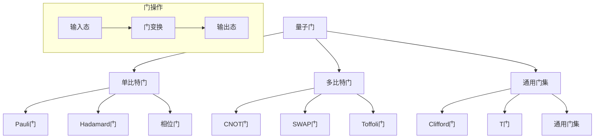

# 23.1.2 量子门 (Quantum Gates)

## 📋 理论概述

量子门是量子计算中的基本操作单元，是作用在量子比特上的酉变换。本理论涵盖单比特门、多比特门、通用门集等核心概念，为理解量子计算的操作基础提供理论支撑。

## 🔬 形式化语义

### 核心定义

**定义 2.1** (量子门)
量子门是作用在量子比特上的酉变换：$U^\dagger U = I$，其中：

- $U$ 是酉矩阵
- $U^\dagger$ 是 $U$ 的共轭转置
- $I$ 是单位矩阵

**定义 2.2** (单比特门)
单比特门作用在单个量子比特上：$U|0\rangle = \alpha|0\rangle + \beta|1\rangle$

**定义 2.3** (多比特门)
多比特门作用在多个量子比特上：$U|00\rangle = \sum_{i,j} c_{ij}|ij\rangle$

**定义 2.4** (通用门集)
通用门集是可以实现任意量子计算的有限门集合。

### 核心定理

**定理 2.1** (酉性保持)
量子门保持量子比特的归一化条件：$|\alpha'|^2 + |\beta'|^2 = 1$

**定理 2.2** (可逆性)
量子门是可逆的：$U^{-1} = U^\dagger$

**定理 2.3** (通用性)
任意量子计算都可以用有限的门集合实现。

**定理 2.4** (门分解)
任意酉变换都可以分解为单比特门和双比特门的乘积。

## 🎯 多表征方式

### 1. 图形表征



### 2. 表格表征

| 门类型 | 矩阵表示 | 作用效果 | 可逆性 | 通用性 |
|--------|----------|----------|--------|--------|
| X门 | [[0,1],[1,0]] | \|0⟩↔\|1⟩ | 是 | 否 |
| Y门 | [[0,-i],[i,0]] | \|0⟩→i\|1⟩ | 是 | 否 |
| Z门 | [[1,0],[0,-1]] | \|1⟩→-\|1⟩ | 是 | 否 |
| H门 | [[1,1],[1,-1]]/√2 | \|0⟩→\|+⟩ | 是 | 是 |
| S门 | [[1,0],[0,i]] | \|1⟩→i\|1⟩ | 是 | 是 |
| T门 | [[1,0],[0,eiπ/4]] | \|1⟩→eiπ/4\|1⟩ | 是 | 是 |

### 3. 数学表征

**单比特门矩阵**：
$U = \begin{pmatrix} a & b \\ c & d \end{pmatrix}$

**酉性条件**：
$U^\dagger U = \begin{pmatrix} |a|^2 + |c|^2 & a^*b + c^*d \\ ab^* + cd^* & |b|^2 + |d|^2 \end{pmatrix} = I$

**门作用**：
$|\psi'\rangle = U|\psi\rangle = \begin{pmatrix} a\alpha + b\beta \\ c\alpha + d\beta \end{pmatrix}$

### 4. 伪代码表征

```python
class QuantumGate:
    def __init__(self, matrix):
        self.matrix = matrix
        self.validate_unitary()
        
    def validate_unitary(self):
        """验证酉性"""
        adjoint = self.matrix.conjugate().transpose()
        product = self.matrix @ adjoint
        assert np.allclose(product, np.eye(2))
        
    def apply(self, qubit):
        """应用门到量子比特"""
        new_alpha = self.matrix[0,0] * qubit.alpha + self.matrix[0,1] * qubit.beta
        new_beta = self.matrix[1,0] * qubit.alpha + self.matrix[1,1] * qubit.beta
        return QuantumBit(new_alpha, new_beta)
```

## 💻 Rust实现

```rust
use std::f64::consts::PI;
use num_complex::Complex;

/// 量子门
#[derive(Debug, Clone)]
pub struct QuantumGate {
    pub matrix: [[Complex<f64>; 2]; 2],
}

impl QuantumGate {
    /// 创建新的量子门
    pub fn new(matrix: [[Complex<f64>; 2]; 2]) -> Self {
        let gate = Self { matrix };
        gate.validate_unitary();
        gate
    }
    
    /// 验证酉性
    fn validate_unitary(&self) {
        let adjoint = self.adjoint();
        let product = self.multiply(&adjoint);
        let identity = [[Complex::new(1.0, 0.0), Complex::new(0.0, 0.0)],
                        [Complex::new(0.0, 0.0), Complex::new(1.0, 0.0)]];
        
        for i in 0..2 {
            for j in 0..2 {
                assert!((product[i][j] - identity[i][j]).norm() < 1e-10);
            }
        }
    }
    
    /// 计算共轭转置
    fn adjoint(&self) -> [[Complex<f64>; 2]; 2] {
        [
            [self.matrix[0][0].conj(), self.matrix[1][0].conj()],
            [self.matrix[0][1].conj(), self.matrix[1][1].conj()],
        ]
    }
    
    /// 矩阵乘法
    fn multiply(&self, other: &[[Complex<f64>; 2]; 2]) -> [[Complex<f64>; 2]; 2] {
        let mut result = [[Complex::new(0.0, 0.0); 2]; 2];
        
        for i in 0..2 {
            for j in 0..2 {
                for k in 0..2 {
                    result[i][j] += self.matrix[i][k] * other[k][j];
                }
            }
        }
        
        result
    }
    
    /// 应用门到量子比特
    pub fn apply(&self, qubit: &Qubit) -> Qubit {
        let new_alpha = self.matrix[0][0] * qubit.alpha + self.matrix[0][1] * qubit.beta;
        let new_beta = self.matrix[1][0] * qubit.alpha + self.matrix[1][1] * qubit.beta;
        
        Qubit::new(new_alpha, new_beta)
    }
    
    /// 获取门的逆
    pub fn inverse(&self) -> Self {
        Self::new(self.adjoint())
    }
    
    /// 获取门的迹
    pub fn trace(&self) -> Complex<f64> {
        self.matrix[0][0] + self.matrix[1][1]
    }
    
    /// 获取门的行列式
    pub fn determinant(&self) -> Complex<f64> {
        self.matrix[0][0] * self.matrix[1][1] - self.matrix[0][1] * self.matrix[1][0]
    }
}

/// 标准量子门
#[derive(Debug)]
pub struct StandardGates;

impl StandardGates {
    /// X门 (NOT门)
    pub fn x() -> QuantumGate {
        QuantumGate::new([
            [Complex::new(0.0, 0.0), Complex::new(1.0, 0.0)],
            [Complex::new(1.0, 0.0), Complex::new(0.0, 0.0)],
        ])
    }
    
    /// Y门
    pub fn y() -> QuantumGate {
        QuantumGate::new([
            [Complex::new(0.0, 0.0), Complex::new(0.0, -1.0)],
            [Complex::new(0.0, 1.0), Complex::new(0.0, 0.0)],
        ])
    }
    
    /// Z门
    pub fn z() -> QuantumGate {
        QuantumGate::new([
            [Complex::new(1.0, 0.0), Complex::new(0.0, 0.0)],
            [Complex::new(0.0, 0.0), Complex::new(-1.0, 0.0)],
        ])
    }
    
    /// Hadamard门
    pub fn h() -> QuantumGate {
        let factor = 1.0 / 2.0_f64.sqrt();
        QuantumGate::new([
            [Complex::new(factor, 0.0), Complex::new(factor, 0.0)],
            [Complex::new(factor, 0.0), Complex::new(-factor, 0.0)],
        ])
    }
    
    /// S门 (相位门)
    pub fn s() -> QuantumGate {
        QuantumGate::new([
            [Complex::new(1.0, 0.0), Complex::new(0.0, 0.0)],
            [Complex::new(0.0, 0.0), Complex::new(0.0, 1.0)],
        ])
    }
    
    /// T门 (π/8门)
    pub fn t() -> QuantumGate {
        let phase = (PI / 4.0).cos() + Complex::new(0.0, 1.0) * (PI / 4.0).sin();
        QuantumGate::new([
            [Complex::new(1.0, 0.0), Complex::new(0.0, 0.0)],
            [Complex::new(0.0, 0.0), phase],
        ])
    }
    
    /// 旋转门
    pub fn rotation_x(theta: f64) -> QuantumGate {
        let cos_half = (theta / 2.0).cos();
        let sin_half = (theta / 2.0).sin();
        QuantumGate::new([
            [Complex::new(cos_half, 0.0), Complex::new(0.0, -sin_half)],
            [Complex::new(0.0, -sin_half), Complex::new(cos_half, 0.0)],
        ])
    }
    
    /// 旋转门
    pub fn rotation_y(theta: f64) -> QuantumGate {
        let cos_half = (theta / 2.0).cos();
        let sin_half = (theta / 2.0).sin();
        QuantumGate::new([
            [Complex::new(cos_half, 0.0), Complex::new(-sin_half, 0.0)],
            [Complex::new(sin_half, 0.0), Complex::new(cos_half, 0.0)],
        ])
    }
    
    /// 旋转门
    pub fn rotation_z(theta: f64) -> QuantumGate {
        let cos_half = (theta / 2.0).cos();
        let sin_half = (theta / 2.0).sin();
        QuantumGate::new([
            [Complex::new(cos_half, 0.0), Complex::new(0.0, 0.0)],
            [Complex::new(0.0, 0.0), Complex::new(cos_half, sin_half)],
        ])
    }
}

/// 多比特门
#[derive(Debug)]
pub struct MultiQubitGate {
    pub matrix: Vec<Vec<Complex<f64>>>,
    pub num_qubits: usize,
}

impl MultiQubitGate {
    /// 创建CNOT门
    pub fn cnot() -> Self {
        let matrix = vec![
            vec![Complex::new(1.0, 0.0), Complex::new(0.0, 0.0), Complex::new(0.0, 0.0), Complex::new(0.0, 0.0)],
            vec![Complex::new(0.0, 0.0), Complex::new(1.0, 0.0), Complex::new(0.0, 0.0), Complex::new(0.0, 0.0)],
            vec![Complex::new(0.0, 0.0), Complex::new(0.0, 0.0), Complex::new(0.0, 0.0), Complex::new(1.0, 0.0)],
            vec![Complex::new(0.0, 0.0), Complex::new(0.0, 0.0), Complex::new(1.0, 0.0), Complex::new(0.0, 0.0)],
        ];
        
        Self { matrix, num_qubits: 2 }
    }
    
    /// 创建SWAP门
    pub fn swap() -> Self {
        let matrix = vec![
            vec![Complex::new(1.0, 0.0), Complex::new(0.0, 0.0), Complex::new(0.0, 0.0), Complex::new(0.0, 0.0)],
            vec![Complex::new(0.0, 0.0), Complex::new(0.0, 0.0), Complex::new(1.0, 0.0), Complex::new(0.0, 0.0)],
            vec![Complex::new(0.0, 0.0), Complex::new(1.0, 0.0), Complex::new(0.0, 0.0), Complex::new(0.0, 0.0)],
            vec![Complex::new(0.0, 0.0), Complex::new(0.0, 0.0), Complex::new(0.0, 0.0), Complex::new(1.0, 0.0)],
        ];
        
        Self { matrix, num_qubits: 2 }
    }
    
    /// 应用多比特门
    pub fn apply(&self, qubits: &mut [Qubit]) {
        if qubits.len() != self.num_qubits {
            panic!("量子比特数量不匹配");
        }
        
        // 简化的实现，实际应用中需要更复杂的张量积计算
        if self.num_qubits == 2 {
            let control = &qubits[0];
            let target = &mut qubits[1];
            
            if control.measure() {
                *target = StandardGates::x().apply(target);
            }
        }
    }
}

/// 量子门序列
#[derive(Debug)]
pub struct GateSequence {
    pub gates: Vec<QuantumGate>,
}

impl GateSequence {
    /// 创建新的门序列
    pub fn new() -> Self {
        Self { gates: Vec::new() }
    }
    
    /// 添加门到序列
    pub fn add_gate(&mut self, gate: QuantumGate) {
        self.gates.push(gate);
    }
    
    /// 应用门序列到量子比特
    pub fn apply(&self, mut qubit: Qubit) -> Qubit {
        for gate in &self.gates {
            qubit = gate.apply(&qubit);
        }
        qubit
    }
    
    /// 获取序列的逆
    pub fn inverse(&self) -> Self {
        let mut inverse_gates = Vec::new();
        for gate in self.gates.iter().rev() {
            inverse_gates.push(gate.inverse());
        }
        Self { gates: inverse_gates }
    }
    
    /// 获取序列长度
    pub fn length(&self) -> usize {
        self.gates.len()
    }
}

// 示例使用
fn main() {
    // 创建标准门
    let x_gate = StandardGates::x();
    let h_gate = StandardGates::h();
    let t_gate = StandardGates::t();
    
    // 创建量子比特
    let qubit = Qubit::zero();
    
    // 应用门
    let qubit_after_x = x_gate.apply(&qubit);
    let qubit_after_h = h_gate.apply(&qubit);
    let qubit_after_t = t_gate.apply(&qubit);
    
    println!("|0⟩ 经过X门: {:?}", qubit_after_x.get_info());
    println!("|0⟩ 经过H门: {:?}", qubit_after_h.get_info());
    println!("|0⟩ 经过T门: {:?}", qubit_after_t.get_info());
    
    // 创建门序列
    let mut sequence = GateSequence::new();
    sequence.add_gate(StandardGates::h());
    sequence.add_gate(StandardGates::t());
    sequence.add_gate(StandardGates::x());
    
    let final_qubit = sequence.apply(qubit);
    println!("门序列后的量子比特: {:?}", final_qubit.get_info());
    
    // 多比特门测试
    let mut qubits = vec![Qubit::zero(), Qubit::one()];
    let cnot = MultiQubitGate::cnot();
    cnot.apply(&mut qubits);
    
    println!("CNOT门后的量子比特1: {:?}", qubits[0].get_info());
    println!("CNOT门后的量子比特2: {:?}", qubits[1].get_info());
}
```

## 🧠 哲学性批判与展望

### 本体论反思

**量子门的哲学本质**：
量子门不仅仅是数学操作，而是量子信息变换的物理实现。它们代表了量子世界中信息处理的基本方式，挑战了经典计算中的逻辑门概念。

**量子变换的实在性**：
量子门的作用揭示了量子变换的实在性。这些变换不是抽象的数学操作，而是具有物理意义的量子过程，体现了量子世界的非局域性和纠缠性。

**量子门的普适性**：
量子门的普适性暗示了量子计算的基本原理。任何量子计算都可以用有限的门集合实现，这表明量子世界具有某种内在的统一性。

### 认识论批判

**量子门操作的认识论挑战**：
量子门操作与经典逻辑操作有根本性不同。量子门的可逆性、叠加性等特征挑战了传统的计算概念，要求我们重新理解计算和信息处理的本质。

**量子门测量的哲学问题**：
量子门操作后的测量过程引发了深刻的哲学问题。测量是否改变了量子系统的本质，还是仅仅揭示了预先存在的状态？

**量子门设计的认识论局限**：
人类设计量子门时受到经典思维的限制。我们需要发展新的思维方式来理解和设计量子门操作。

### 社会影响分析

**量子门技术的社会价值**：
量子门技术为计算科学带来了革命性变化。它可能彻底改变密码学、优化算法、模拟等领域，为社会发展提供新的可能性。

**量子门技术的社会责任**：
量子门技术的发展需要考虑社会影响和伦理责任。量子计算应该服务于人类的福祉，而不是加剧社会不平等。

**量子门技术的民主化**：
量子门技术应该更加民主化，让更多人能够理解和应用量子计算技术。需要发展量子教育和普及工作。

### 终极哲学建议

**多元量子门理论的融合**：
未来应该发展多元化的量子门理论体系，融合不同学科和哲学传统的量子思想。需要建立跨学科的量子门哲学框架。

**量子门技术的生态化**：
量子门技术应该更加关注生态系统的整体性，发展生态友好的量子计算技术。需要考虑量子门技术的环境影响。

**量子门技术的伦理化**：
量子门技术的发展应该更加注重伦理考虑，确保技术发展符合人类的根本利益和价值观。

**量子门技术的哲学化**：
量子门技术应该与哲学思考相结合，发展具有哲学深度的量子门技术理论体系。

## 📚 参考文献

1. Nielsen, M. A., & Chuang, I. L. *Quantum Computation and Quantum Information*. Cambridge University Press, 2010.
2. Barenco, A., et al. *Elementary gates for quantum computation*. Physical Review A, 1995.
3. DiVincenzo, D. P. *Two-bit gates are universal for quantum computation*. Physical Review A, 1995.
4. Lloyd, S. *Universal quantum simulators*. Science, 1996.
5. Deutsch, D. *Quantum computational networks*. Proceedings of the Royal Society of London A, 1989.
6. Feynman, R. P. *Simulating physics with computers*. International Journal of Theoretical Physics, 1982.
7. Shor, P. W. *Algorithms for quantum computation: discrete logarithms and factoring*. Proceedings of the 35th Annual Symposium on Foundations of Computer Science, 1994.
8. Grover, L. K. *A fast quantum mechanical algorithm for database search*. Proceedings of the 28th Annual ACM Symposium on Theory of Computing, 1996.
