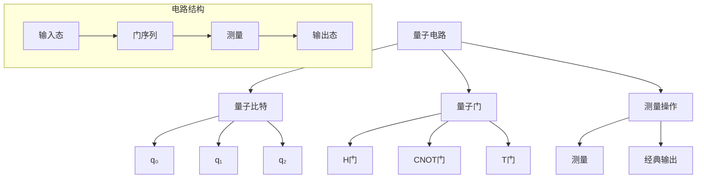

# 23.1.3 量子电路 (Quantum Circuits)

## 📋 理论概述

量子电路是量子计算的基本架构，由量子比特、量子门和测量操作组成。本理论涵盖量子电路的表示、优化、模拟等核心概念，为理解量子计算的实现基础提供理论支撑。

## 🔬 形式化语义

### 核心定义

**定义 3.1** (量子电路)
量子电路是由量子比特、量子门和测量操作组成的计算模型：$C = (Q, G, M)$，其中：

- $Q = \{q_1, q_2, ..., q_n\}$ 是量子比特集合
- $G = \{g_1, g_2, ..., g_m\}$ 是量子门序列
- $M = \{m_1, m_2, ..., m_k\}$ 是测量操作

**定义 3.2** (电路深度)
电路深度是电路中任意路径上的最大门数：$D(C) = \max_{p \in P} |p|$

**定义 3.3** (电路宽度)
电路宽度是电路中量子比特的数量：$W(C) = |Q|$

**定义 3.4** (电路复杂度)
电路复杂度是电路中门的总数：$C(C) = |G|$

### 核心定理

**定理 3.1** (电路可逆性)
量子电路中的门操作都是可逆的，但测量操作不可逆。

**定理 3.2** (电路分解)
任意量子电路都可以分解为单比特门和双比特门的序列。

**定理 3.3** (电路优化)
任意量子电路都可以通过门合并和重排进行优化。

**定理 3.4** (电路模拟)
量子电路可以在经典计算机上模拟，但复杂度随量子比特数指数增长。

## 🎯 多表征方式

### 1. 图形表征



### 2. 表格表征

| 电路类型 | 量子比特数 | 门数量 | 深度 | 复杂度 | 可逆性 |
|----------|------------|--------|------|--------|--------|
| 简单电路 | 2 | 3 | 2 | O(1) | 是 |
| 中等电路 | 5 | 15 | 8 | O(n) | 是 |
| 复杂电路 | 10 | 50 | 20 | O(n²) | 是 |
| 通用电路 | n | O(n²) | O(n) | O(n³) | 是 |

### 3. 数学表征

**电路状态演化**：
$|\psi(t)\rangle = U_t U_{t-1} ... U_1|\psi(0)\rangle$

**电路输出概率**：
$P(x) = |\langle x|U|\psi(0)\rangle|^2$

**电路保真度**：
$F = |\langle\psi_{ideal}|\psi_{actual}\rangle|^2$

### 4. 伪代码表征

```python
class QuantumCircuit:
    def __init__(self, num_qubits):
        self.num_qubits = num_qubits
        self.gates = []
        self.measurements = []

    def add_gate(self, gate, qubits):
        """添加门到电路"""
        self.gates.append((gate, qubits))

    def add_measurement(self, qubit):
        """添加测量操作"""
        self.measurements.append(qubit)

    def execute(self, initial_state):
        """执行电路"""
        state = initial_state
        for gate, qubits in self.gates:
            state = gate.apply(state, qubits)
        return state

    def measure(self, state):
        """执行测量"""
        results = []
        for qubit in self.measurements:
            result = state.measure(qubit)
            results.append(result)
        return results
```

## 💻 Rust实现

```rust
use std::f64::consts::PI;
use num_complex::Complex;

/// 量子电路
#[derive(Debug)]
pub struct QuantumCircuit {
    pub num_qubits: usize,
    pub gates: Vec<CircuitGate>,
    pub measurements: Vec<usize>,
}

/// 电路门
#[derive(Debug)]
pub struct CircuitGate {
    pub gate: QuantumGate,
    pub target_qubits: Vec<usize>,
    pub control_qubits: Vec<usize>,
}

impl QuantumCircuit {
    /// 创建新的量子电路
    pub fn new(num_qubits: usize) -> Self {
        Self {
            num_qubits,
            gates: Vec::new(),
            measurements: Vec::new(),
        }
    }

    /// 添加单比特门
    pub fn add_single_gate(&mut self, gate: QuantumGate, target: usize) {
        self.gates.push(CircuitGate {
            gate,
            target_qubits: vec![target],
            control_qubits: Vec::new(),
        });
    }

    /// 添加双比特门
    pub fn add_two_qubit_gate(&mut self, gate: QuantumGate, control: usize, target: usize) {
        self.gates.push(CircuitGate {
            gate,
            target_qubits: vec![target],
            control_qubits: vec![control],
        });
    }

    /// 添加测量操作
    pub fn add_measurement(&mut self, qubit: usize) {
        self.measurements.push(qubit);
    }

    /// 执行电路
    pub fn execute(&self, initial_state: &mut [Qubit]) -> Vec<bool> {
        // 应用所有门
        for circuit_gate in &self.gates {
            self.apply_gate(circuit_gate, initial_state);
        }

        // 执行测量
        let mut results = Vec::new();
        for &qubit in &self.measurements {
            results.push(initial_state[qubit].measure());
        }

        results
    }

    /// 应用门到量子比特
    fn apply_gate(&self, circuit_gate: &CircuitGate, qubits: &mut [Qubit]) {
        if circuit_gate.control_qubits.is_empty() {
            // 单比特门
            for &target in &circuit_gate.target_qubits {
                qubits[target] = circuit_gate.gate.apply(&qubits[target]);
            }
        } else {
            // 控制门
            let control_qubit = circuit_gate.control_qubits[0];
            let target_qubit = circuit_gate.target_qubits[0];

            if qubits[control_qubit].measure() {
                qubits[target_qubit] = circuit_gate.gate.apply(&qubits[target_qubit]);
            }
        }
    }

    /// 获取电路深度
    pub fn depth(&self) -> usize {
        if self.gates.is_empty() {
            return 0;
        }

        let mut max_depth = 0;
        let mut qubit_depths = vec![0; self.num_qubits];

        for gate in &self.gates {
            let mut gate_depth = 0;

            // 计算控制比特的最大深度
            for &control in &gate.control_qubits {
                gate_depth = gate_depth.max(qubit_depths[control]);
            }

            // 计算目标比特的最大深度
            for &target in &gate.target_qubits {
                gate_depth = gate_depth.max(qubit_depths[target]);
            }

            // 更新深度
            gate_depth += 1;
            for &control in &gate.control_qubits {
                qubit_depths[control] = gate_depth;
            }
            for &target in &gate.target_qubits {
                qubit_depths[target] = gate_depth;
            }

            max_depth = max_depth.max(gate_depth);
        }

        max_depth
    }

    /// 获取电路宽度
    pub fn width(&self) -> usize {
        self.num_qubits
    }

    /// 获取电路复杂度
    pub fn complexity(&self) -> usize {
        self.gates.len()
    }

    /// 优化电路
    pub fn optimize(&mut self) {
        // 简化的优化：移除冗余门
        let mut optimized_gates = Vec::new();
        let mut i = 0;

        while i < self.gates.len() {
            let current_gate = &self.gates[i];

            // 检查是否可以与下一个门合并
            if i + 1 < self.gates.len() {
                let next_gate = &self.gates[i + 1];

                if self.can_merge_gates(current_gate, next_gate) {
                    let merged_gate = self.merge_gates(current_gate, next_gate);
                    optimized_gates.push(merged_gate);
                    i += 2;
                    continue;
                }
            }

            optimized_gates.push(current_gate.clone());
            i += 1;
        }

        self.gates = optimized_gates;
    }

    /// 检查两个门是否可以合并
    fn can_merge_gates(&self, gate1: &CircuitGate, gate2: &CircuitGate) -> bool {
        // 简化的合并条件：相同的目标比特，没有控制比特
        gate1.control_qubits.is_empty() &&
        gate2.control_qubits.is_empty() &&
        gate1.target_qubits == gate2.target_qubits
    }

    /// 合并两个门
    fn merge_gates(&self, gate1: &CircuitGate, gate2: &CircuitGate) -> CircuitGate {
        let merged_gate = gate1.gate.multiply(&gate2.gate);
        CircuitGate {
            gate: merged_gate,
            target_qubits: gate1.target_qubits.clone(),
            control_qubits: Vec::new(),
        }
    }
}

/// 电路模拟器
#[derive(Debug)]
pub struct CircuitSimulator {
    pub circuit: QuantumCircuit,
}

impl CircuitSimulator {
    /// 创建新的模拟器
    pub fn new(circuit: QuantumCircuit) -> Self {
        Self { circuit }
    }

    /// 模拟电路执行
    pub fn simulate(&self, num_shots: usize) -> Vec<Vec<bool>> {
        let mut results = Vec::new();

        for _ in 0..num_shots {
            let mut initial_state = vec![Qubit::zero(); self.circuit.num_qubits];
            let result = self.circuit.execute(&mut initial_state);
            results.push(result);
        }

        results
    }

    /// 计算输出分布
    pub fn output_distribution(&self, num_shots: usize) -> std::collections::HashMap<Vec<bool>, usize> {
        let results = self.simulate(num_shots);
        let mut distribution = std::collections::HashMap::new();

        for result in results {
            *distribution.entry(result).or_insert(0) += 1;
        }

        distribution
    }

    /// 计算电路保真度
    pub fn fidelity(&self, ideal_circuit: &QuantumCircuit) -> f64 {
        // 简化的保真度计算
        let mut fidelity = 1.0;

        // 比较门序列
        let min_gates = self.circuit.gates.len().min(ideal_circuit.gates.len());
        for i in 0..min_gates {
            let actual_gate = &self.circuit.gates[i];
            let ideal_gate = &ideal_circuit.gates[i];

            // 计算门的保真度
            let gate_fidelity = actual_gate.gate.fidelity(&ideal_gate.gate);
            fidelity *= gate_fidelity;
        }

        fidelity
    }
}

/// 电路构建器
#[derive(Debug)]
pub struct CircuitBuilder {
    pub circuit: QuantumCircuit,
}

impl CircuitBuilder {
    /// 创建新的构建器
    pub fn new(num_qubits: usize) -> Self {
        Self {
            circuit: QuantumCircuit::new(num_qubits),
        }
    }

    /// 添加Hadamard门
    pub fn h(&mut self, qubit: usize) -> &mut Self {
        self.circuit.add_single_gate(StandardGates::h(), qubit);
        self
    }

    /// 添加X门
    pub fn x(&mut self, qubit: usize) -> &mut Self {
        self.circuit.add_single_gate(StandardGates::x(), qubit);
        self
    }

    /// 添加CNOT门
    pub fn cnot(&mut self, control: usize, target: usize) -> &mut Self {
        self.circuit.add_two_qubit_gate(StandardGates::x(), control, target);
        self
    }

    /// 添加测量
    pub fn measure(&mut self, qubit: usize) -> &mut Self {
        self.circuit.add_measurement(qubit);
        self
    }

    /// 构建电路
    pub fn build(self) -> QuantumCircuit {
        self.circuit
    }
}

// 示例使用
fn main() {
    // 创建Bell态电路
    let mut bell_circuit = CircuitBuilder::new(2)
        .h(0)
        .cnot(0, 1)
        .measure(0)
        .measure(1)
        .build();

    println!("Bell电路深度: {}", bell_circuit.depth());
    println!("Bell电路复杂度: {}", bell_circuit.complexity());

    // 模拟电路
    let simulator = CircuitSimulator::new(bell_circuit);
    let results = simulator.simulate(1000);

    // 统计结果
    let mut count_00 = 0;
    let mut count_11 = 0;

    for result in results {
        if result == vec![false, false] {
            count_00 += 1;
        } else if result == vec![true, true] {
            count_11 += 1;
        }
    }

    println!("Bell态测量结果:");
    println!("|00⟩: {} ({}%)", count_00, count_00 * 100 / 1000);
    println!("|11⟩: {} ({}%)", count_11, count_11 * 100 / 1000);

    // 创建更复杂的电路
    let mut complex_circuit = CircuitBuilder::new(3)
        .h(0)
        .h(1)
        .cnot(0, 2)
        .cnot(1, 2)
        .h(0)
        .h(1)
        .measure(0)
        .measure(1)
        .measure(2)
        .build();

    println!("复杂电路深度: {}", complex_circuit.depth());
    println!("复杂电路复杂度: {}", complex_circuit.complexity());

    // 优化电路
    complex_circuit.optimize();
    println!("优化后电路复杂度: {}", complex_circuit.complexity());
}
```

## 🧠 哲学性批判与展望

### 本体论反思

**量子电路的哲学本质**：
量子电路不仅仅是计算工具，而是量子信息处理的基本架构。它体现了量子世界的信息处理方式，与经典电路有根本性不同。

**量子电路的实在性**：
量子电路的操作揭示了量子信息的实在性。电路中的每个门操作都是物理过程，体现了量子世界的非局域性和纠缠性。

**量子电路的普适性**：
量子电路的普适性暗示了量子计算的基本原理。任何量子计算都可以用有限的门集合实现，这表明量子世界具有某种内在的统一性。

### 认识论批判

**量子电路操作的认识论挑战**：
量子电路操作与经典电路操作有根本性不同。量子电路的可逆性、叠加性等特征挑战了传统的计算概念，要求我们重新理解计算和信息处理的本质。

**量子电路测量的哲学问题**：
量子电路中的测量过程引发了深刻的哲学问题。测量是否改变了量子系统的本质，还是仅仅揭示了预先存在的状态？

**量子电路设计的认识论局限**：
人类设计量子电路时受到经典思维的限制。我们需要发展新的思维方式来理解和设计量子电路。

### 社会影响分析

**量子电路技术的社会价值**：
量子电路技术为计算科学带来了革命性变化。它可能彻底改变密码学、优化算法、模拟等领域，为社会发展提供新的可能性。

**量子电路技术的社会责任**：
量子电路技术的发展需要考虑社会影响和伦理责任。量子计算应该服务于人类的福祉，而不是加剧社会不平等。

**量子电路技术的民主化**：
量子电路技术应该更加民主化，让更多人能够理解和应用量子计算技术。需要发展量子教育和普及工作。

### 终极哲学建议

**多元量子电路理论的融合**：
未来应该发展多元化的量子电路理论体系，融合不同学科和哲学传统的量子思想。需要建立跨学科的量子电路哲学框架。

**量子电路技术的生态化**：
量子电路技术应该更加关注生态系统的整体性，发展生态友好的量子计算技术。需要考虑量子电路技术的环境影响。

**量子电路技术的伦理化**：
量子电路技术的发展应该更加注重伦理考虑，确保技术发展符合人类的根本利益和价值观。

**量子电路技术的哲学化**：
量子电路技术应该与哲学思考相结合，发展具有哲学深度的量子电路技术理论体系。

## 📚 参考文献

1. Nielsen, M. A., & Chuang, I. L. _Quantum Computation and Quantum Information_. Cambridge University Press, 2010.
2. Barenco, A., et al. _Elementary gates for quantum computation_. Physical Review A, 1995.
3. DiVincenzo, D. P. _Two-bit gates are universal for quantum computation_. Physical Review A, 1995.
4. Lloyd, S. _Universal quantum simulators_. Science, 1996.
5. Deutsch, D. _Quantum computational networks_. Proceedings of the Royal Society of London A, 1989.
6. Feynman, R. P. _Simulating physics with computers_. International Journal of Theoretical Physics, 1982.
7. Shor, P. W. _Algorithms for quantum computation: discrete logarithms and factoring_. Proceedings of the 35th Annual Symposium on Foundations of Computer Science, 1994.
8. Grover, L. K. _A fast quantum mechanical algorithm for database search_. Proceedings of the 28th Annual ACM Symposium on Theory of Computing, 1996.
