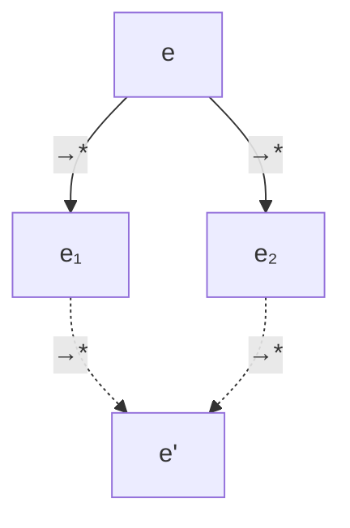
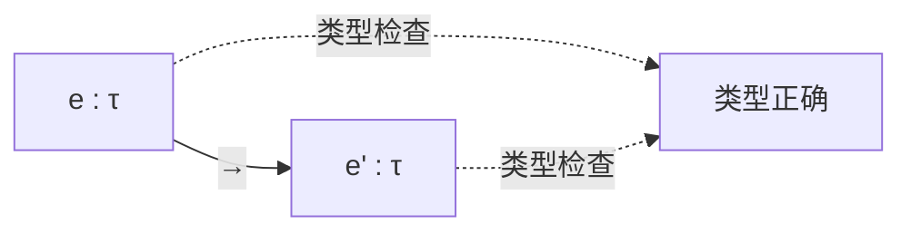

# 01.1 操作语义

---

📌 **内容摘要**

本文档深入探讨操作语义的核心原理和关键方法。内容涵盖编程语言理论领域的主要知识点，包括同步, 并发编程, 大步语义, 小步语义等关键主题。适合初学者建立基础知识体系。

**关键词**: 同步, 编程语言理论, 并发编程, 大步语义, 小步语义, 操作语义, 并行

📚 **学习目标**

- 理解操作语义的基本概念和核心原理
- 掌握相关术语和符号表示
- 建立该领域的系统性知识框架

🎯 **难度级别**: 初级

⏱️ **预计阅读时间**: 15分钟

**前置知识**: 基础数学知识

---


## 01.1.1 概述

**操作语义 (Operational Semantics)** 通过定义程序执行的具体步骤来描述程序的含义。它是最直观、最接近实际实现的语义描述方法。

### 01.1.1.1 核心思想

操作语义将程序执行视为状态转换系统：

- **配置 (Configuration)**：程序状态和执行上下文的组合
- **转换关系 (Transition Relation)**：配置之间的演化规则

### 01.1.1.2 两种主要风格

| 风格 | 描述 | 典型应用 |
|------|------|----------|
| 大步语义 | 直接给出完整求值结果 | 证明程序等价性 |
| 小步语义 | 逐步展示执行过程 | 分析并发、异常 |

---

## 01.1.2 大步语义 (Big-Step Semantics)

### 01.1.2.1 定义

**定义 01.1.1 (大步语义关系)**

设 $\mathcal{E}$ 为表达式集合，$V$ 为值集合。大步语义关系 $\Downarrow \subseteq \mathcal{E} \times V$ 定义为：

$$e \Downarrow v \iff \text{表达式 } e \text{ 求值得到值 } v$$

### 01.1.2.2 简单算术语言

**语法定义**

```haskell
-- Haskell定义
 data Expr = Num Int
           | Add Expr Expr
           | Mul Expr Expr
           | Div Expr Expr
           deriving (Show, Eq)

type Value = Int
```

```rust
// Rust定义
 enum Expr {
    Num(i32),
    Add(Box<Expr>, Box<Expr>),
    Mul(Box<Expr>, Box<Expr>),
    Div(Box<Expr>, Box<Expr>),
}

type Value = i32;
```

**大步语义规则**

$$
\frac{}{(\text{Num } n) \Downarrow n} \text{(B-Num)}
$$

$$
\frac{e_1 \Downarrow n_1 \quad e_2 \Downarrow n_2}{(\text{Add } e_1 \text{ } e_2) \Downarrow n_1 + n_2} \text{(B-Add)}
$$

$$
\frac{e_1 \Downarrow n_1 \quad e_2 \Downarrow n_2}{(\text{Mul } e_1 \text{ } e_2) \Downarrow n_1 \times n_2} \text{(B-Mul)}
$$

$$
\frac{e_1 \Downarrow n_1 \quad e_2 \Downarrow n_2 \quad n_2 \neq 0}{(\text{Div } e_1 \text{ } e_2) \Downarrow \lfloor n_1 / n_2 \rfloor} \text{(B-Div)}
$$

### 01.1.2.3 实现示例

```haskell
-- Haskell大步求值器
evalBig :: Expr -> Maybe Value
evalBig (Num n) = Just n
evalBig (Add e1 e2) = do
    n1 <- evalBig e1
    n2 <- evalBig e2
    return (n1 + n2)
evalBig (Mul e1 e2) = do
    n1 <- evalBig e1
    n2 <- evalBig e2
    return (n1 * n2)
evalBig (Div e1 e2) = do
    n1 <- evalBig e1
    n2 <- evalBig e2
    if n2 == 0 then Nothing else return (n1 `div` n2)
```

```lean4
-- Lean4形式化定义
inductive Expr : Type
  | num : Int → Expr
  | add : Expr → Expr → Expr
  | mul : Expr → Expr → Expr

inductive BigStep : Expr → Int → Prop
  | b_num (n : Int) : BigStep (.num n) n
  | b_add {e1 e2 n1 n2}
      (h1 : BigStep e1 n1) (h2 : BigStep e2 n2) :
      BigStep (.add e1 e2) (n1 + n2)
  | b_mul {e1 e2 n1 n2}
      (h1 : BigStep e1 n1) (h2 : BigStep e2 n2) :
      BigStep (.mul e1 e2) (n1 * n2)
```

### 01.1.2.4 带环境的语义

**定义 01.1.2 (环境)**

环境 $\gamma : \text{Var} \rightharpoonup \text{Value}$ 是变量到值的偏函数。

**扩展规则**

$$
\frac{\gamma(x) = v}{(x, \gamma) \Downarrow v} \text{(B-Var)}
$$

$$
\frac{(e_1, \gamma) \Downarrow v_1 \quad (e_2, \gamma[x \mapsto v_1]) \Downarrow v}{(\text{let } x = e_1 \text{ in } e_2, \gamma) \Downarrow v} \text{(B-Let)}
$$

---

## 01.1.3 小步语义 (Small-Step Semantics)

### 01.1.3.1 定义

**定义 01.1.3 (小步语义关系)**

小步语义关系 $\rightarrow \subseteq \mathcal{C} \times \mathcal{C}$ 定义为：

$$c \rightarrow c' \iff \text{配置 } c \text{ 单步演化为 } c'$$

### 01.1.3.2 归约关系

**算术表达式的小步语义**

$$
\frac{e_1 \rightarrow e_1'}{\text{Add } e_1 \text{ } e_2 \rightarrow \text{Add } e_1' \text{ } e_2} \text{(S-Add-L)}
$$

$$
\frac{e_1 \text{ 是值} \quad e_2 \rightarrow e_2'}{\text{Add } e_1 \text{ } e_2 \rightarrow \text{Add } e_1 \text{ } e_2'} \text{(S-Add-R)}
$$

$$
\frac{n = n_1 + n_2}{\text{Add } (\text{Num } n_1) \text{ } (\text{Num } n_2) \rightarrow \text{Num } n} \text{(S-Add)}
$$

### 01.1.3.3 实现示例

```rust
// Rust小步求值器
impl Expr {
    fn is_value(&self) -> bool {
        matches!(self, Expr::Num(_))
    }

    fn step(self) -> Result<Expr, String> {
        match self {
            Expr::Num(_) => Err("Already a value".to_string()),
            Expr::Add(e1, e2) => {
                if let Expr::Num(n1) = *e1 {
                    if let Expr::Num(n2) = *e2 {
                        Ok(Expr::Num(n1 + n2))
                    } else {
                        Ok(Expr::Add(Box::new(Expr::Num(n1)),
                                     Box::new(e2.step()?)))
                    }
                } else {
                    Ok(Expr::Add(Box::new(e1.step()?), e2))
                }
            }
            Expr::Mul(e1, e2) => {
                if let Expr::Num(n1) = *e1 {
                    if let Expr::Num(n2) = *e2 {
                        Ok(Expr::Num(n1 * n2))
                    } else {
                        Ok(Expr::Mul(Box::new(Expr::Num(n1)),
                                     Box::new(e2.step()?)))
                    }
                } else {
                    Ok(Expr::Mul(Box::new(e1.step()?), e2))
                }
            }
            Expr::Div(e1, e2) => {
                if let Expr::Num(n1) = *e1 {
                    if let Expr::Num(n2) = *e2 {
                        if n2 == 0 {
                            Err("Division by zero".to_string())
                        } else {
                            Ok(Expr::Num(n1 / n2))
                        }
                    } else {
                        Ok(Expr::Div(Box::new(Expr::Num(n1)),
                                     Box::new(e2.step()?)))
                    }
                } else {
                    Ok(Expr::Div(Box::new(e1.step()?), e2))
                }
            }
        }
    }

    fn eval_small(self) -> Result<Value, String> {
        let mut expr = self;
        loop {
            if let Expr::Num(n) = expr {
                return Ok(n);
            }
            expr = expr.step()?;
        }
    }
}
```

### 01.1.3.4 求值上下文

**定义 01.1.4 (求值上下文)**

求值上下文 $\mathcal{E}$ 是一个带有"洞"的表达式：

$$
\mathcal{E} ::= [] \mid \text{Add } \mathcal{E} \text{ } e \mid \text{Add } v \text{ } \mathcal{E} \mid \ldots
$$

**上下文归约规则**

$$
\frac{e \rightarrow e'}{\mathcal{E}[e] \rightarrow \mathcal{E}[e']} \text{(S-Context)}
$$

```mermaid
flowchart TD
    A[Add (Add 1 2) (Mul 3 4)] -->|S-Add-L| B[Add 3 (Mul 3 4)]
    B -->|S-Add-R| C[Add 3 12]
    C -->|S-Add| D[15]

    style A fill:#f9f
    style D fill:#9f9
```

---

## 01.1.4 语义等价性

### 01.1.4.1 大步与小步的关系

**定理 01.1.1 (语义等价)**

对于所有表达式 $e$ 和值 $v$：

$$e \Downarrow v \iff e \rightarrow^* v \land v \text{ 无法继续归约}$$

**证明概要**

$(\Rightarrow)$ 通过对 $e \Downarrow v$ 的推导进行归纳：

- 基础情形 (B-Num)：$n$ 已是值，$\rightarrow^*$ 是恒等关系
- 归纳情形 (B-Add)：假设 $e_1 \Downarrow n_1$ 且 $e_2 \Downarrow n_2$，由归纳假设有 $e_1 \rightarrow^* n_1$ 和 $e_2 \rightarrow^* n_2$。通过构造性组合可得 $(\text{Add } e_1 \text{ } e_2) \rightarrow^* n_1 + n_2$

$(\Leftarrow)$ 通过对归约序列长度进行归纳：

- 零步：$e = v$，应用 (B-Num)
- $k+1$ 步：通过分析最后应用的归约规则逆推

### 01.1.4.2 合流性

**定理 01.1.2 (Church-Rosser)**

若 $e \rightarrow^* e_1$ 且 $e \rightarrow^* e_2$，则存在 $e'$ 使得 $e_1 \rightarrow^* e'$ 且 $e_2 \rightarrow^* e'$。



---

## 01.1.5 控制流语义

### 01.1.5.1 条件表达式

```lean4
inductive Expr : Type
  | bool : Bool → Expr
  | if_ : Expr → Expr → Expr → Expr

inductive SmallStep : Expr → Expr → Prop
  | s_if_true {e1 e2} : SmallStep (.if_ (.bool true) e1 e2) e1
  | s_if_false {e1 e2} : SmallStep (.if_ (.bool false) e1 e2) e2
  | s_if {e e1 e2 e'}
      (h : SmallStep e e') :
      SmallStep (.if_ e e1 e2) (.if_ e' e1 e2)
```

### 01.1.5.2 递归函数

**不动点语义**

$$
\frac{(e[\text{fix } f.e/f], \gamma) \Downarrow v}{(\text{fix } f.e, \gamma) \Downarrow v} \text{(B-Fix)}
$$

```rust
// Rust中递归的Y组合子模拟
fn y_combinator<A, B, F>(f: F) -> impl Fn(A) -> B
where
    F: Fn(&dyn Fn(A) -> B, A) -> B + Clone,
{
    move |x| f(&y_combinator(f.clone()), x)
}
```

---

## 01.1.6 类型安全

### 01.1.6.1 进展性

**定理 01.1.3 (Progress)**

若 $\vdash e : \tau$，则要么 $e$ 是值，要么存在 $e'$ 使得 $e \rightarrow e'$。

### 01.1.6.2 保持性

**定理 01.1.4 (Preservation)**

若 $\vdash e : \tau$ 且 $e \rightarrow e'$，则 $\vdash e' : \tau$。



---

## 01.1.7 练习

1. **形式化证明**：用Lean4证明算术表达式大步语义的确定性
2. **扩展语言**：为语言添加异常处理机制，定义相应的操作语义
3. **比较分析**：比较大步语义和小步语义在处理非终止程序时的差异

---

## 01.1.8 参考文献与交叉引用

- [01.2 指称语义](./01.2_指称语义.md) —— 对比不同语义风格
- [01.3 公理语义](./01.3_公理语义.md) —— 逻辑视角的程序语义
- [04.1 λ演算](../04_函数式编程/04.1_λ演算.md) —— λ演算的操作语义
- [Winskel, 1993] _The Formal Semantics of Programming Languages_
- [Pierce, 2002] _Types and Programming Languages_

---

## 📚 延伸阅读

- [01.3 公理语义](../01_编程语言理论/01.3_公理语义.md)
- [1.3 λ演算 (Lambda Calculus)](../../02_形式语言/01_形式语言基础/01.3_λ演算.md)
- [1. 函数式基础](../04_函数式编程/04.1_函数式基础.md)
- [04.1 λ演算](../04_函数式编程/04.1_λ演算.md)
- [01.2 指称语义](../01_编程语言理论/01.2_指称语义.md)
