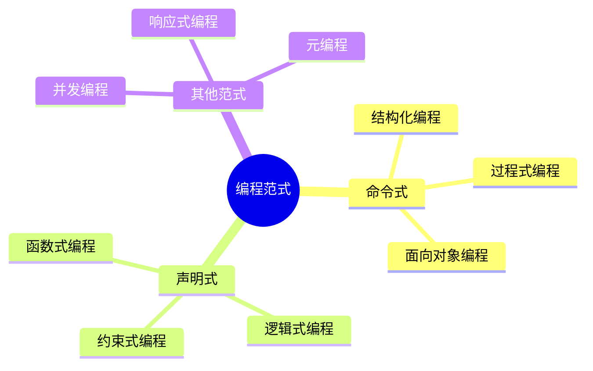
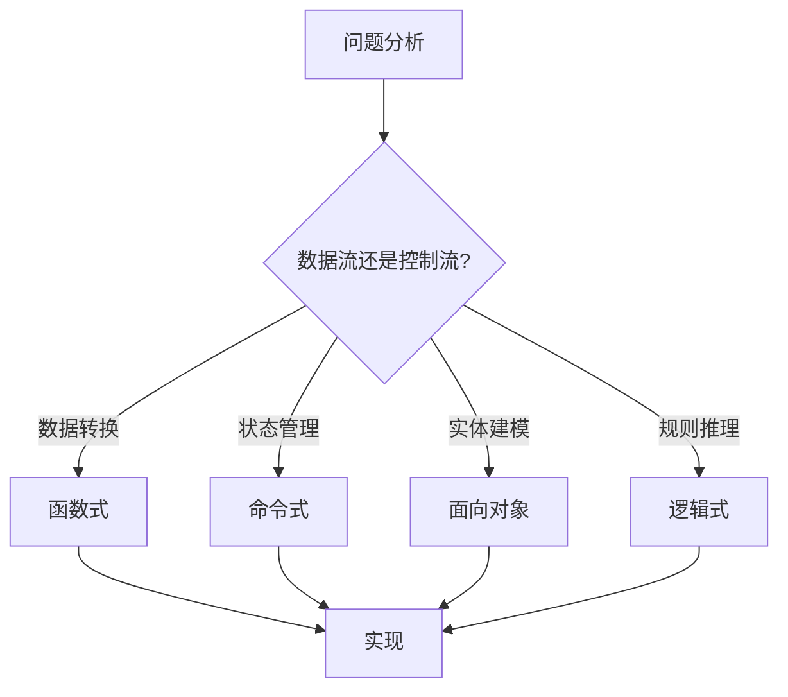

# 1. 编程范式总览

## 目录

- [1. 编程范式总览](#1-编程范式总览)
  - [目录](#目录)
  - [1.1 编程范式概述](#11-编程范式概述)
  - [1.2 命令式编程](#12-命令式编程)
    - [1.2.1 核心概念](#121-核心概念)
    - [1.2.2 结构化编程](#122-结构化编程)
  - [1.3 函数式编程](#13-函数式编程)
    - [1.3.1 核心概念](#131-核心概念)
    - [1.3.2 高阶函数与闭包](#132-高阶函数与闭包)
  - [1.4 逻辑式编程](#14-逻辑式编程)
    - [1.4.1 核心概念](#141-核心概念)
    - [1.4.2 约束求解](#142-约束求解)
  - [1.5 面向对象编程](#15-面向对象编程)
    - [1.5.1 核心概念](#151-核心概念)
    - [1.5.2 继承与组合](#152-继承与组合)
  - [1.6 范式对比与选择](#16-范式对比与选择)
    - [1.6.1 特性对比表](#161-特性对比表)
    - [1.6.2 形式化对比](#162-形式化对比)
  - [1.7 现代多范式融合](#17-现代多范式融合)
    - [1.7.1 多范式语言](#171-多范式语言)
    - [1.7.2 范式选择原则](#172-范式选择原则)

## 1.1 编程范式概述

**定义 1.1.1**：编程范式（Programming Paradigm）是编程语言的基本风格或方法论，它决定了程序员如何思考问题、组织代码以及构建解决方案。

**定义 1.1.2**：编程范式由以下要素构成：

- 计算模型：程序如何执行计算
- 数据结构：如何组织和操作数据
- 控制流：程序执行的顺序和条件
- 抽象机制：如何封装和复用代码



**定理 1.1.3**（图灵完备性）：大多数主流编程范式在计算能力上是等价的，都可以模拟通用图灵机。

$$
\forall P_1, P_2 \in \text{Paradigms}, \exists f: P_1 \xrightarrow{\text{simulate}} P_2
$$

## 1.2 命令式编程

### 1.2.1 核心概念

**定义 1.2.1**：命令式编程（Imperative Programming）通过显式地改变程序状态来描述计算过程。

形式化模型：
$$
\text{State} = Var \rightarrow Value
$$
$$
\text{Command}: State \rightarrow State
$$

**定义 1.2.2**：命令式程序的基本构造：

- 赋值语句：$x := e$
- 顺序执行：$c_1; c_2$
- 条件分支：$\text{if } b \text{ then } c_1 \text{ else } c_2$
- 循环：$\text{while } b \text{ do } c$

```rust
// Rust 命令式编程示例
fn imperative_sum(n: i32) -> i32 {
    let mut sum = 0;  // 显式状态
    let mut i = 1;
    while i <= n {   // 显式控制流
        sum = sum + i; // 状态变更
        i = i + 1;
    }
    sum
}
```

### 1.2.2 结构化编程

**定义 1.2.3**：结构化编程定理（Böhm-Jacopini 定理）：任何程序都可以只用顺序、选择和迭代三种控制结构表示。

$$
\text{Program} \equiv \text{Sequence} + \text{Selection} + \text{Iteration}
$$

```rust
// 结构化控制流
fn structured_example(x: i32) -> i32 {
    // 顺序
    let a = x * 2;
    let b = x + 10;

    // 选择
    let result = if a > b {
        a - b
    } else {
        b - a
    };

    // 迭代（结构化循环）
    let mut total = 0;
    for i in 0..result {
        total += i;
    }

    total
}
```

## 1.3 函数式编程

### 1.3.1 核心概念

**定义 1.3.1**：函数式编程（Functional Programming）将计算视为数学函数的求值，避免状态变化和可变数据。

形式化模型：
$$
\text{Expression} \rightarrow \text{Value}
$$

**定义 1.3.2**：纯函数（Pure Function）满足：

- 引用透明：相同输入总是产生相同输出
- 无副作用：不修改外部状态

$$
\forall x, f(x) = f(x) \land \text{no-side-effects}(f)
$$

```rust
// Rust 函数式风格
fn functional_sum(n: i32) -> i32 {
    (1..=n).fold(0, |acc, x| acc + x)  // 无显式状态变更
}

// 纯函数示例
fn pure_add(a: i32, b: i32) -> i32 {
    a + b  // 引用透明，无副作用
}

// Haskell 风格（伪代码概念）
// sum [1..n] = foldl (+) 0 [1..n]
```

### 1.3.2 高阶函数与闭包

**定义 1.3.3**：高阶函数（Higher-Order Function）是以函数为参数或返回值的函数。

```rust
// Rust 高阶函数
fn apply_twice<F>(f: F, x: i32) -> i32
where
    F: Fn(i32) -> i32,
{
    f(f(x))
}

// 闭包示例
fn make_adder(n: i32) -> impl Fn(i32) -> i32 {
    move |x| x + n  // 捕获 n 形成闭包
}

fn main() {
    let add_five = make_adder(5);
    assert_eq!(add_five(10), 15);
}
```

## 1.4 逻辑式编程

### 1.4.1 核心概念

**定义 1.4.1**：逻辑式编程（Logic Programming）基于形式逻辑，程序由事实和规则组成，通过逻辑推理求解问题。

形式化模型（Horn 子句）：
$$
A \leftarrow B_1 \land B_2 \land \ldots \land B_n
$$

其中 $A$ 是结论，$B_i$ 是条件。

**定义 1.4.2**：Prolog 风格的逻辑编程包含：

- 事实：$P(a, b).$
- 规则：$P(x, z) \leftarrow Q(x, y), R(y, z).$
- 查询：$\leftarrow P(a, z).$

```rust
// Rust 模拟逻辑编程（使用模式匹配）
// 逻辑推理引擎简化版

#[derive(Debug, Clone)]
enum Term {
    Var(String),
    Const(String),
    Pred(String, Vec<Term>),
}

struct KnowledgeBase {
    facts: Vec<Term>,
    rules: Vec<(Term, Vec<Term>)>, // (结论, 条件列表)
}

impl KnowledgeBase {
    fn query(&self, goal: &Term) -> Vec<Term> {
        // 合一算法简化实现
        let mut results = Vec::new();

        // 检查事实
        for fact in &self.facts {
            if self.unify(goal, fact).is_some() {
                results.push(fact.clone());
            }
        }

        results
    }

    fn unify(&self, t1: &Term, t2: &Term) -> Option<()> {
        // 合一算法（简化）
        match (t1, t2) {
            (Term::Const(a), Term::Const(b)) if a == b => Some(()),
            (Term::Var(_), _) | (_, Term::Var(_)) => Some(()),
            _ => None,
        }
    }
}
```

### 1.4.2 约束求解

**定义 1.4.3**：约束编程（Constraint Programming）通过声明变量之间的约束关系，由求解器自动寻找满足所有约束的解。

```rust
// Rust 约束求解简化示例
use std::collections::HashSet;

struct ConstraintSolver {
    domains: Vec<HashSet<i32>>,
    constraints: Vec<Box<dyn Fn(&[i32]) -> bool>>,
}

impl ConstraintSolver {
    fn solve(&self) -> Option<Vec<i32>> {
        self.backtrack(0, vec![0; self.domains.len()])
    }

    fn backtrack(&self, index: usize, assignment: Vec<i32>) -> Option<Vec<i32>> {
        if index == self.domains.len() {
            return if self.constraints.iter().all(|c| c(&assignment)) {
                Some(assignment)
            } else {
                None
            };
        }

        for &value in &self.domains[index] {
            let mut new_assignment = assignment.clone();
            new_assignment[index] = value;

            if let Some(solution) = self.backtrack(index + 1, new_assignment) {
                return Some(solution);
            }
        }

        None
    }
}
```

## 1.5 面向对象编程

### 1.5.1 核心概念

**定义 1.5.1**：面向对象编程（Object-Oriented Programming）以对象为核心，对象封装数据和行为。

形式化模型：
$$
\text{Object} = (\text{State}, \text{Behavior}, \text{Identity})
$$

**定义 1.5.2**：面向对象的四大特性：

- 封装（Encapsulation）：隐藏内部实现细节
- 继承（Inheritance）：代码复用和层次分类
- 多态（Polymorphism）：统一接口，不同实现
- 抽象（Abstraction）：提取共同特征

```rust
// Rust 的面向对象风格（使用 trait 和 struct）

// 抽象：定义接口
trait Shape {
    fn area(&self) -> f64;
    fn perimeter(&self) -> f64;
}

// 封装：数据和行为绑定
struct Circle {
    radius: f64,  // 私有字段（默认）
}

struct Rectangle {
    width: f64,
    height: f64,
}

// 多态：不同实现相同接口
impl Shape for Circle {
    fn area(&self) -> f64 {
        std::f64::consts::PI * self.radius * self.radius
    }

    fn perimeter(&self) -> f64 {
        2.0 * std::f64::consts::PI * self.radius
    }
}

impl Shape for Rectangle {
    fn area(&self) -> f64 {
        self.width * self.height
    }

    fn perimeter(&self) -> f64 {
        2.0 * (self.width + self.height)
    }
}

// 多态使用
fn print_area(shape: &dyn Shape) {
    println!("Area: {}", shape.area());
}
```

### 1.5.2 继承与组合

**定义 1.5.3**：组合优于继承原则（Composition Over Inheritance）：优先使用组合来复用代码，而非继承。

```rust
// Rust 优先使用组合
struct Engine {
    horsepower: u32,
}

impl Engine {
    fn start(&self) {
        println!("Engine started with {} HP", self.horsepower);
    }
}

// 组合而非继承
struct Car {
    engine: Engine,  // 组合
    brand: String,
}

impl Car {
    fn start(&self) {
        self.engine.start();
        println!("{} is ready to go!", self.brand);
    }
}
```

## 1.6 范式对比与选择

### 1.6.1 特性对比表

| 特性 | 命令式 | 函数式 | 逻辑式 | 面向对象 |
|------|--------|--------|--------|----------|
| 核心抽象 | 状态变更 | 函数组合 | 逻辑推理 | 对象交互 |
| 可变性 | 允许 | 避免 | 声明式 | 封装状态 |
| 并行性 | 困难 | 天然适合 | 自动推理 | 需要同步 |
| 调试难度 | 中等 | 较低 | 高 | 中等 |
| 表达能力 | 直观 | 数学优雅 | 声明式强 | 建模直观 |
| 典型语言 | C, Rust | Haskell, Lisp | Prolog | Java, C++ |

### 1.6.2 形式化对比

**定理 1.6.1**：命令式和函数式范式的表达能力等价：
$$
\text{Imperative} \cong \text{Functional} \quad \text{(in expressive power)}
$$

**定理 1.6.2**：纯函数式程序更易于并行化：
$$
\text{Pure}(f) \Rightarrow \text{Parallelizable}(f)
$$

**证明**：纯函数无副作用，不依赖共享状态，因此可以安全地在多个处理器上并行执行。

## 1.7 现代多范式融合

### 1.7.1 多范式语言

现代编程语言往往融合多种范式：

```rust
// Rust：命令式 + 函数式 + 面向对象

// 函数式：迭代器 + 闭包
let sum: i32 = (1..100)
    .filter(|x| x % 2 == 0)  // 高阶函数
    .map(|x| x * x)          // 函数组合
    .sum();                   // 聚合

// 面向对象：trait 系统
trait Drawable {
    fn draw(&self);
}

// 命令式：可变状态
fn process_data(data: &mut Vec<i32>) {
    for item in data.iter_mut() {
        *item *= 2;  // 显式状态变更
    }
}
```

### 1.7.2 范式选择原则

**原则 1.7.1**：根据问题领域选择范式：

- 数值计算 → 函数式（无副作用，易于验证）
- 业务系统 → 面向对象（建模直观）
- 规则引擎 → 逻辑式（声明式表达）
- 系统编程 → 命令式（精确控制）

**原则 1.7.2**：在同一项目中混合使用不同范式，利用各自优势。



---

**参考文档**：

- [01.2_语言设计与实现](./01.2_语言设计与实现.md)
- [04.1_函数式基础](../04_函数式编程/04.1_函数式基础.md)
- [02.1_Rust所有权系统](../02_Rust语言深入/02.1_Rust所有权系统.md)
