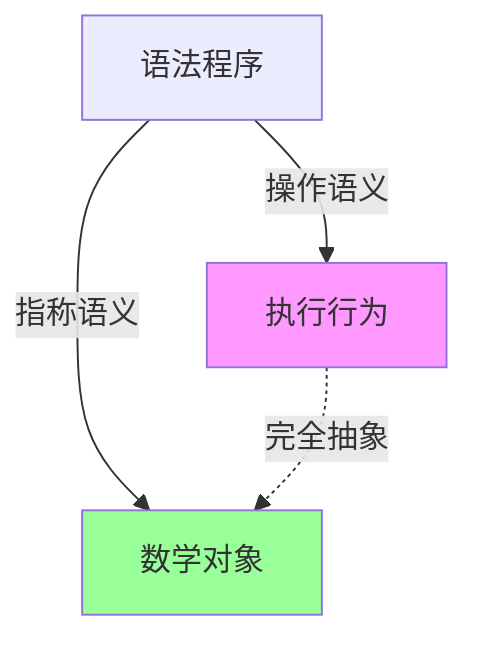

# 01.2 指称语义

---

📌 **内容摘要**

本文档深入探讨指称语义的核心原理和关键方法。内容涵盖编程语言理论领域的主要知识点，包括大步语义, 不动点, 小步语义, 操作语义等关键主题。适合初学者建立基础知识体系。

**关键词**: 编程语言理论, 大步语义, 不动点, 小步语义, 操作语义, 域论, 指称语义

📚 **学习目标**
- 理解指称语义的基本概念和核心原理
- 掌握相关术语和符号表示
- 建立该领域的系统性知识框架

🎯 **难度级别**: 初级

⏱️ **预计阅读时间**: 15分钟

**前置知识**: 基础数学知识

---


## 01.2.1 概述

**指称语义 (Denotational Semantics)** 通过将程序映射到数学对象（通常是域论中的元素）来描述程序含义。与操作语义不同，指称语义不关心"如何做"，而关注"是什么"。

### 01.2.1.1 核心思想

- **合成性 (Compositionality)**：复合表达式的含义由其组成部分的含义决定
- **抽象性**：忽略实现细节，关注数学本质
- **可计算性**：语义函数应是可计算的（或至少可定义）

### 01.2.1.2 与操作语义对比

| 特性 | 操作语义 | 指称语义 |
|------|----------|----------|
| 关注点 | 执行步骤 | 数学含义 |
| 证明适用性 | 实现相关 | 抽象推理 |
| 组合性 | 较弱 | 强 |
| 非终止处理 | 复杂 | 自然（通过⊥） |

---

## 01.2.2 域理论基础

### 01.2.2.1 偏序集与完备偏序集

**定义 01.2.1 (偏序集)**

偏序集 (Poset) $(D, \sqsubseteq)$ 满足：

- 自反性：$\forall x \in D. x \sqsubseteq x$
- 传递性：$\forall x,y,z \in D. x \sqsubseteq y \land y \sqsubseteq z \Rightarrow x \sqsubseteq z$
- 反对称性：$\forall x,y \in D. x \sqsubseteq y \land y \sqsubseteq x \Rightarrow x = y$

**定义 01.2.2 (链)**

链 (Chain) 是全序子集 $\{d_n\}_{n \in \mathbb{N}}$，满足 $d_0 \sqsubseteq d_1 \sqsubseteq d_2 \sqsubseteq \ldots$

**定义 01.2.3 (完备偏序集 CPO)**

CPO $(D, \sqsubseteq)$ 满足：

1. 有最小元 $\bot$（称为"底"或"未定义"）
2. 所有链都有最小上界 (lub)

### 01.2.2.2 连续函数

**定义 01.2.4 (单调函数)**

函数 $f: D \to E$ 是单调的，若：

$$x \sqsubseteq y \Rightarrow f(x) \sqsubseteq f(y)$$

**定义 01.2.5 (连续函数)**

函数 $f: D \to E$ 是连续的，若它保持链的上界：

$$f(\bigsqcup_{n \in \mathbb{N}} d_n) = \bigsqcup_{n \in \mathbb{N}} f(d_n)$$

```haskell
-- Haskell中CPO的直观表示
-- 所有类型都隐含地添加了一个⊥值
-- undefined :: a  表示底元素
```

### 01.2.2.3 不动点定理

**定理 01.2.1 (Kleene不动点定理)**

设 $D$ 是CPO，$f: D \to D$ 是连续函数，则 $f$ 有最小不动点：

$$\text{fix}(f) = \bigsqcup_{n \in \mathbb{N}} f^n(\bot)$$

**证明**

1. 首先证明 $\{f^n(\bot)\}$ 是链：
   - 基础：$\bot \sqsubseteq f(\bot)$（因为 $\bot$ 是最小元）
   - 归纳：若 $f^n(\bot) \sqsubseteq f^{n+1}(\bot)$，由单调性得 $f^{n+1}(\bot) \sqsubseteq f^{n+2}(\bot)$

2. 证明 $\text{fix}(f)$ 是不动点：

$$
\begin{aligned}
f(\text{fix}(f)) &= f(\bigsqcup_n f^n(\bot)) \\
&= \bigsqcup_n f(f^n(\bot)) \quad \text{（连续性）} \\
&= \bigsqcup_n f^{n+1}(\bot) \\
&= \bigsqcup_n f^n(\bot) = \text{fix}(f)
\end{aligned}
$$

1. 最小性：若 $f(d) = d$，则通过归纳可得 $\forall n. f^n(\bot) \sqsubseteq d$，因此 $\text{fix}(f) \sqsubseteq d$

---

## 01.2.3 语义函数

### 01.2.3.1 简单表达式语义

**语法**

```haskell
data Expr = Num Int
          | Add Expr Expr
          | Var Name
          | Let Name Expr Expr
```

**语义域**

$$
\begin{aligned}
\text{Val} &= \mathbb{Z}_\bot \quad \text{（整数加底）} \\
\text{Env} &= \text{Name} \to \text{Val} \quad \text{（环境）}
\end{aligned}
$$

**语义函数**

$$\mathcal{E} : \text{Expr} \to \text{Env} \to \text{Val}$$

$$
\begin{aligned}
\mathcal{E}[[\text{Num } n]]\rho &= n \\
\mathcal{E}[[\text{Add } e_1 \text{ } e_2]]\rho &=
    \text{let } n_1 = \mathcal{E}[[e_1]]\rho \\
    &\quad \text{in let } n_2 = \mathcal{E}[[e_2]]\rho \\
    &\quad \text{in } n_1 + n_2 \\
\mathcal{E}[[\text{Var } x]]\rho &= \rho(x) \\
\mathcal{E}[[\text{Let } x = e_1 \text{ in } e_2]]\rho &=
    \mathcal{E}[[e_2]](\rho[x \mapsto \mathcal{E}[[e_1]]\rho])
\end{aligned}
$$

### 01.2.3.2 Haskell实现

```haskell
type Name = String
type Val = Maybe Int  -- Nothing表示⊥
type Env = Map Name Val

sem :: Expr -> Env -> Val
sem (Num n) _ = Just n
sem (Add e1 e2) env = do
    n1 <- sem e1 env
    n2 <- sem e2 env
    return (n1 + n2)
sem (Var x) env = Map.lookup x env
sem (Let x e1 e2) env =
    let v1 = sem e1 env
    in sem e2 (Map.insert x v1 env)
```

### 01.2.3.3 函数类型的语义

**定义 01.2.6 (函数空间)**

对于CPO $D$ 和 $E$，函数空间 $D \to E$ 定义为：

- 点序：$f \sqsubseteq g \iff \forall d \in D. f(d) \sqsubseteq g(d)$
- 所有连续函数构成CPO

---

## 01.2.4 递归的语义

### 01.2.4.1 递归方程

考虑递归定义：

$$\text{letrec } f = \lambda x. e \text{ in } e'$$

这对应于不动点方程：

$$f = \lambda x. \mathcal{E}[[e]](\rho[f \mapsto f])$$

### 01.2.4.2 不动点语义

**定义 01.2.7 (递归语义)**

$$
\mathcal{E}[[\text{letrec } f = \lambda x. e \text{ in } e']]\rho =
    \text{let } F = \lambda \phi. \lambda x. \mathcal{E}[[e]](\rho[f \mapsto \phi]) \\
    \quad \text{in } \mathcal{E}[[e']](\rho[f \mapsto \text{fix}(F)])
$$

```haskell
-- Haskell中的递归语义
fix :: (a -> a) -> a
fix f = let x = f x in x

-- 或显式展开
fix' f = f (fix' f)

-- 示例：阶乘
fact = fix (\f n -> if n == 0 then 1 else n * f (n-1))
```

### 01.2.4.3 展开示例

```
fix(F) = F^0(⊥) ⊔ F^1(⊥) ⊔ F^2(⊥) ⊔ ...

其中 F(φ)(n) = if n=0 then 1 else n * φ(n-1)

F^0(⊥) = ⊥                          -- 未定义函数
F^1(⊥)(n) = if n=0 then 1 else ⊥    -- 只在0处有定义
F^2(⊥)(n) = if n≤1 then fact(n) else ⊥  -- 在0,1处有定义
...
```

---

## 01.2.5 Lean4形式化

### 01.2.5.1 域的定义

```lean4
-- CPO的形式化定义
class CPO (α : Type*) where
  bot : α
  le : α → α → Prop
  lub : (ℕ → α) → α  -- 链的上界

  -- 公理
  bot_le : ∀ x, le bot x
  le_refl : ∀ x, le x x
  le_trans : ∀ x y z, le x y → le y z → le x z
  le_antisymm : ∀ x y, le x y → le y x → x = y
  lub_ub : ∀ (c : ℕ → α) (n : ℕ), le (c n) (lub c)
  lub_least : ∀ (c : ℕ → α) (x : α),
    (∀ n, le (c n) x) → le (lub c) x

notation "⊥" => CPO.bot
infix:50 " ⊑ " => CPO.le
```

### 01.2.5.2 连续函数

```lean4
structure ContFun (α β : Type*) [CPO α] [CPO β] where
  toFun : α → β
  monotone : ∀ x y, x ⊑ y → toFun x ⊑ toFun y
  continuous : ∀ (c : ℕ → α),
    toFun (CPO.lub c) = CPO.lub (λ n => toFun (c n))
```

### 01.2.5.3 不动点定理

```lean4
theorem kleene_fixpoint {α : Type*} [CPO α]
    (f : ContFun α α) :
    ∃ x, f.toFun x = x ∧ ∀ y, f.toFun y = y → x ⊑ y := by
  let chain : ℕ → α := λ n => f.toFun^[n] ⊥
  let fixpoint := CPO.lub chain

  -- 证明这是不动点
  have is_fix : f.toFun fixpoint = fixpoint := by
    rw [f.continuous chain]
    congr
    funext n
    cases n
    · simp [chain]
    · simp [chain, Function.iterate_succ_apply']

  -- 证明最小性
  have is_least : ∀ y, f.toFun y = y → fixpoint ⊑ y := by
    intro y hy
    apply CPO.lub_least
    intro n
    induction n with
    | zero => apply CPO.bot_le
    | succ n ih =>
      rw [←hy]
      apply f.monotone
      exact ih

  exact ⟨fixpoint, is_fix, is_least⟩
```

---

## 01.2.6 类型构造的语义

### 01.2.6.1 和类型与积类型

$$
\begin{aligned}
[D + E] &= \{\text{inl}(d) \mid d \in D\} \cup \{\text{inr}(e) \mid e \in E\} \cup \{\bot\} \\
[D \times E] &= \{(d, e) \mid d \in D, e \in E\}_\bot
\end{aligned}
$$

### 01.2.6.2 递归类型

**定义 01.2.8 (递归类型)**

对于类型方程 $\tau = F(\tau)$，其解为：

$$\tau = \text{fix}(F) = \bigsqcup_{n \in \mathbb{N}} F^n(\bot)$$

**列表类型示例**

$$
\text{List}(A) = \mu X. 1 + A \times X
$$

```haskell
-- 作为不动点
newtype ListF a x = NilF | ConsF a x
    deriving Functor

type List a = Fix (ListF a)

data Fix f = Fix { unFix :: f (Fix f) }

cata :: Functor f => (f a -> a) -> Fix f -> a
cata alg = alg . fmap (cata alg) . unFix

-- 求和
sumList :: List Int -> Int
sumList = cata $ \case
    NilF -> 0
    ConsF a x -> a + x
```

---

## 01.2.7 等价性与正确性

### 01.2.7.1 语义等价

**定义 01.2.9 (上下文等价)**

$e_1 \approx e_2$ 当且仅当对所有上下文 $C$：

$$C[e_1] \Downarrow v \iff C[e_2] \Downarrow v$$

### 01.2.7.2 完全抽象

**定义 01.2.10 (完全抽象)**

语义是**完全抽象**的，若：

$$e_1 \approx e_2 \iff \mathcal{E}[[e_1]] = \mathcal{E}[[e_2]]$$



---

## 01.2.8 高级主题

### 01.2.8.1 幂域 (Powerdomains)

用于建模非确定性和并发：

- **下幂域**：可能结果集合
- **上幂域**：必然结果集合
- **凸幂域**：两者结合

### 01.2.8.2 概率语义

将值映射到概率分布：

$$\mathcal{E} : \text{Expr} \to \text{Env} \to \mathcal{D}(\text{Val})$$

---

## 01.2.9 练习

1. 证明连续函数的复合仍是连续的
2. 为带异常的语言设计指称语义
3. 用Lean4形式化简单类型λ演算的指称语义

---

## 01.2.10 参考文献与交叉引用

- [01.1 操作语义](./01.1_操作语义.md) —— 对比操作语义
- [01.3 公理语义](./01.3_公理语义.md) —— 逻辑语义
- [04.3 单子与函子](../04_函数式编程/04.3_单子与函子.md) —— 范畴论语义
- [Winskel, 1993] _The Formal Semantics of Programming Languages_, Ch. 5-8
- [Gunther, 1992] _Semantics of Programming Languages_
---

## 📋 前置知识

- [01.1 操作语义](../01_编程语言理论/01.1_操作语义.md)

---

## 📚 延伸阅读

- [04.1 范畴基本概念](./02_形式语言/04_范畴论/04.1_范畴基本概念.md)
- [4.1 范畴基础 (Category Theory Foundations)](./02_形式语言/04_范畴论/04.1_范畴基础.md)
- [01.3 公理语义](../01_编程语言理论/01.3_公理语义.md)
- [1. 单子与函子](../04_函数式编程/04.2_单子与函子.md)
- [04.3 单子与函子](../04_函数式编程/04.3_单子与函子.md)
