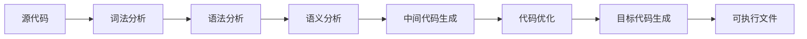
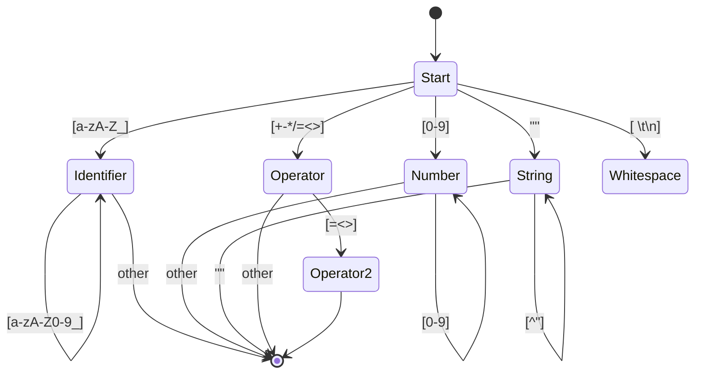
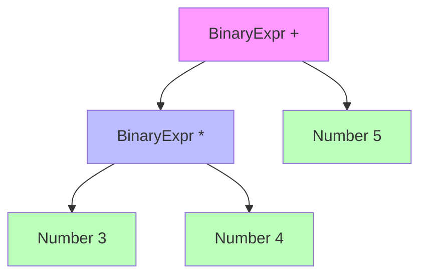
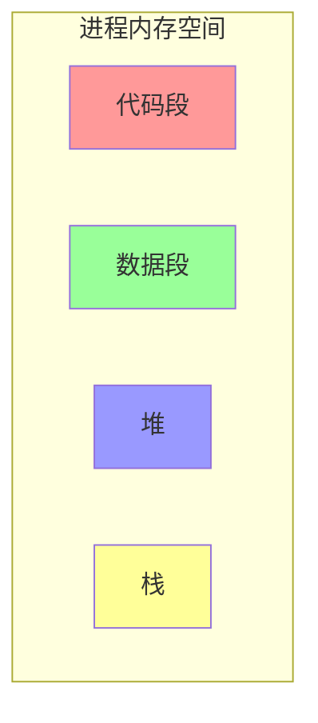

# 1. 语言设计与实现

---

📌 **内容摘要**

本文档深入探讨语言设计与实现的核心原理和关键方法。内容涵盖编程语言理论领域的主要知识点，包括有限自动机, 类型论, 类型推断, 类型系统, NFA等关键主题。适合初学者建立基础知识体系。

**关键词**: 有限自动机, 类型论, 类型推断, 类型系统, NFA, 编程语言理论, DFA

📚 **学习目标**

- 理解语言设计与实现的基本概念和核心原理
- 掌握相关术语和符号表示
- 建立该领域的系统性知识框架

🎯 **难度级别**: 初级

⏱️ **预计阅读时间**: 15分钟

**前置知识**: 基础数学知识

---


## 目录

- [1. 语言设计与实现](#1-语言设计与实现)
  - [目录](#目录)
  - [1.1 编译原理概述](#11-编译原理概述)
  - [1.2 词法分析](#12-词法分析)
    - [1.2.1 基本概念](#121-基本概念)
    - [1.2.2 有限自动机](#122-有限自动机)
  - [1.3 语法分析](#13-语法分析)
    - [1.3.1 上下文无关文法](#131-上下文无关文法)
    - [1.3.2 递归下降解析](#132-递归下降解析)
    - [1.3.3 抽象语法树（AST）](#133-抽象语法树ast)
  - [1.4 语义分析](#14-语义分析)
    - [1.4.1 类型系统](#141-类型系统)
    - [1.4.2 作用域与符号表](#142-作用域与符号表)
  - [1.5 中间表示与优化](#15-中间表示与优化)
    - [1.5.1 三地址码](#151-三地址码)
    - [1.5.2 基本优化](#152-基本优化)
  - [1.6 代码生成](#16-代码生成)
    - [1.6.1 目标代码生成](#161-目标代码生成)
    - [1.6.2 LLVM IR](#162-llvm-ir)
  - [1.7 运行时系统](#17-运行时系统)
    - [1.7.1 内存布局](#171-内存布局)
    - [1.7.2 垃圾回收](#172-垃圾回收)
  - [📚 延伸阅读](#-延伸阅读)

## 1.1 编译原理概述

**定义 1.1.1**：编译器（Compiler）是将高级语言程序转换为目标机器可执行代码的程序。



**定义 1.1.2**：编译过程的形式化描述：
$$
\text{Compile}: Source \rightarrow Target
$$

$$
\text{Compile} = \text{Lex} \circ \text{Parse} \circ \text{Sem} \circ \text{Gen}_{IR} \circ \text{Opt} \circ \text{Gen}_{Target}
$$

## 1.2 词法分析

### 1.2.1 基本概念

**定义 1.2.1**：词法分析（Lexical Analysis）将源代码字符流转换为记号（Token）序列。

形式化定义：
$$
\text{Lexer}: \Sigma^* \rightarrow Token^*
$$

**定义 1.2.2**：记号类型：

- 关键字：`let`, `fn`, `if`, `else`
- 标识符：变量名、函数名
- 字面量：整数、浮点数、字符串
- 运算符：`+`, `-`, `*`, `/`
- 分隔符：`{`, `}`, `(`, `)`, `;`

```rust
// Rust 词法分析器简化示例
#[derive(Debug, Clone, PartialEq)]
enum Token {
    Keyword(String),      // let, fn, if, else
    Identifier(String),   // 变量名
    Number(i64),          // 整数
    String(String),       // 字符串
    Operator(String),     // +, -, *, /
    Paren(char),          // ( ) { } [ ]
    Semicolon,            // ;
    EOF,                  // 文件结束
}

struct Lexer {
    input: Vec<char>,
    position: usize,
}

impl Lexer {
    fn new(input: &str) -> Self {
        Self {
            input: input.chars().collect(),
            position: 0,
        }
    }

    fn next_token(&mut self) -> Token {
        self.skip_whitespace();

        if self.position >= self.input.len() {
            return Token::EOF;
        }

        match self.current_char() {
            'a'..='z' | 'A'..='Z' | '_' => self.read_identifier(),
            '0'..='9' => self.read_number(),
            '"' => self.read_string(),
            '+' | '-' | '*' | '/' | '=' | '<' | '>' => self.read_operator(),
            '(' | ')' | '{' | '}' | '[' | ']' => {
                let ch = self.current_char();
                self.advance();
                Token::Paren(ch)
            }
            ';' => {
                self.advance();
                Token::Semicolon
            }
            _ => {
                self.advance();
                Token::EOF
            }
        }
    }

    fn read_identifier(&mut self) -> Token {
        let start = self.position;
        while self.position < self.input.len() &&
              (self.current_char().is_alphanumeric() || self.current_char() == '_') {
            self.advance();
        }

        let ident: String = self.input[start..self.position].iter().collect();

        // 检查是否是关键字
        match ident.as_str() {
            "let" | "fn" | "if" | "else" | "return" | "while" | "for" => {
                Token::Keyword(ident)
            }
            _ => Token::Identifier(ident),
        }
    }

    fn read_number(&mut self) -> Token {
        let start = self.position;
        while self.position < self.input.len() && self.current_char().is_numeric() {
            self.advance();
        }

        let num_str: String = self.input[start..self.position].iter().collect();
        Token::Number(num_str.parse().unwrap_or(0))
    }

    fn read_string(&mut self) -> Token {
        self.advance(); // 跳过开头的 "
        let start = self.position;

        while self.position < self.input.len() && self.current_char() != '"' {
            self.advance();
        }

        let content: String = self.input[start..self.position].iter().collect();
        self.advance(); // 跳过结尾的 "

        Token::String(content)
    }

    fn read_operator(&mut self) -> Token {
        let ch = self.current_char();
        self.advance();

        // 检查双字符运算符
        if self.position < self.input.len() {
            let next = self.current_char();
            let two_char: String = vec![ch, next].into_iter().collect();
            match two_char.as_str() {
                "==" | "!=" | "<=" | ">=" | "=>" | "->" => {
                    self.advance();
                    return Token::Operator(two_char);
                }
                _ => {}
            }
        }

        Token::Operator(ch.to_string())
    }

    fn current_char(&self) -> char {
        self.input[self.position]
    }

    fn advance(&mut self) {
        self.position += 1;
    }

    fn skip_whitespace(&mut self) {
        while self.position < self.input.len() && self.current_char().is_whitespace() {
            self.advance();
        }
    }
}
```

### 1.2.2 有限自动机

**定义 1.2.3**：确定有限自动机（DFA）定义为五元组 $(Q, \Sigma, \delta, q_0, F)$：

- $Q$：有限状态集合
- $\Sigma$：输入字母表
- $\delta: Q \times \Sigma \rightarrow Q$：转移函数
- $q_0 \in Q$：初始状态
- $F \subseteq Q$：接受状态集



## 1.3 语法分析

### 1.3.1 上下文无关文法

**定义 1.3.1**：上下文无关文法（CFG）定义为四元组 $G = (V, T, P, S)$：

- $V$：非终结符集合
- $T$：终结符集合
- $P$：产生式规则集合
- $S \in V$：开始符号

**定义 1.3.2**：BNF 范式表示：
$$
\begin{align}
Expr &\rightarrow Expr + Term \mid Expr - Term \mid Term \\
Term &\rightarrow Term * Factor \mid Term / Factor \mid Factor \\
Factor &\rightarrow ( Expr ) \mid Number \mid Identifier \\
Number &\rightarrow Digit \mid Digit Number \\
Digit &\rightarrow 0 \mid 1 \mid \ldots \mid 9
\end{align}
$$

### 1.3.2 递归下降解析

```rust
// Rust 递归下降解析器简化示例

#[derive(Debug, Clone)]
enum Expr {
    Number(i64),
    Identifier(String),
    Binary(Box<Expr>, String, Box<Expr>),
    Call(String, Vec<Expr>),
}

struct Parser {
    tokens: Vec<Token>,
    position: usize,
}

impl Parser {
    fn new(tokens: Vec<Token>) -> Self {
        Self {
            tokens,
            position: 0,
        }
    }

    fn parse(&mut self) -> Result<Expr, String> {
        self.parse_expression()
    }

    // 表达式解析（处理 +, -）
    fn parse_expression(&mut self) -> Result<Expr, String> {
        let mut left = self.parse_term()?;

        while let Some(Token::Operator(op)) = self.peek() {
            if op == "+" || op == "-" {
                self.advance();
                let right = self.parse_term()?;
                left = Expr::Binary(Box::new(left), op.clone(), Box::new(right));
            } else {
                break;
            }
        }

        Ok(left)
    }

    // 项解析（处理 *, /）
    fn parse_term(&mut self) -> Result<Expr, String> {
        let mut left = self.parse_factor()?;

        while let Some(Token::Operator(op)) = self.peek() {
            if op == "*" || op == "/" {
                self.advance();
                let right = self.parse_factor()?;
                left = Expr::Binary(Box::new(left), op.clone(), Box::new(right));
            } else {
                break;
            }
        }

        Ok(left)
    }

    // 因子解析
    fn parse_factor(&mut self) -> Result<Expr, String> {
        match self.peek() {
            Some(Token::Number(n)) => {
                let val = *n;
                self.advance();
                Ok(Expr::Number(val))
            }
            Some(Token::Identifier(name)) => {
                let name = name.clone();
                self.advance();

                // 检查是否是函数调用
                if self.match_token(&Token::Paren('(')) {
                    self.advance();
                    let args = self.parse_arguments()?;
                    self.expect(Token::Paren(')'))?;
                    Ok(Expr::Call(name, args))
                } else {
                    Ok(Expr::Identifier(name))
                }
            }
            Some(Token::Paren('(')) => {
                self.advance();
                let expr = self.parse_expression()?;
                self.expect(Token::Paren(')'))?;
                Ok(expr)
            }
            _ => Err("Unexpected token in factor".to_string()),
        }
    }

    fn parse_arguments(&mut self) -> Result<Vec<Expr>, String> {
        let mut args = Vec::new();

        if !self.check(&Token::Paren(')')) {
            args.push(self.parse_expression()?);
            while self.match_token(&Token::Operator(",".to_string())) {
                self.advance();
                args.push(self.parse_expression()?);
            }
        }

        Ok(args)
    }

    fn peek(&self) -> Option<&Token> {
        self.tokens.get(self.position)
    }

    fn advance(&mut self) {
        if self.position < self.tokens.len() {
            self.position += 1;
        }
    }

    fn match_token(&self, token: &Token) -> bool {
        self.peek().map(|t| t == token).unwrap_or(false)
    }

    fn check(&self, token: &Token) -> bool {
        self.match_token(token)
    }

    fn expect(&mut self, token: Token) -> Result<(), String> {
        if self.match_token(&token) {
            self.advance();
            Ok(())
        } else {
            Err(format!("Expected {:?}, got {:?}", token, self.peek()))
        }
    }
}
```

### 1.3.3 抽象语法树（AST）



## 1.4 语义分析

### 1.4.1 类型系统

**定义 1.4.1**：类型系统（Type System）是编程语言中用于分类表达式并规定类型间转换规则的规则集合。

形式化类型判断：
$$
\Gamma \vdash e : \tau
$$

其中 $\Gamma$ 是类型环境，$e$ 是表达式，$\tau$ 是类型。

```rust
// Rust 类型检查简化示例
#[derive(Debug, Clone, PartialEq)]
enum Type {
    Int,
    Bool,
    String,
    Function(Vec<Type>, Box<Type>), // (参数类型) -> 返回类型
}

struct TypeChecker {
    env: HashMap<String, Type>,
}

impl TypeChecker {
    fn new() -> Self {
        Self {
            env: HashMap::new(),
        }
    }

    fn check_expr(&self, expr: &Expr) -> Result<Type, String> {
        match expr {
            Expr::Number(_) => Ok(Type::Int),
            Expr::Identifier(name) => {
                self.env.get(name)
                    .cloned()
                    .ok_or_else(|| format!("Undefined variable: {}", name))
            }
            Expr::Binary(left, op, right) => {
                let left_type = self.check_expr(left)?;
                let right_type = self.check_expr(right)?;

                match op.as_str() {
                    "+" | "-" | "*" | "/" => {
                        if left_type == Type::Int && right_type == Type::Int {
                            Ok(Type::Int)
                        } else {
                            Err(format!("Type mismatch in arithmetic operation"))
                        }
                    }
                    "==" | "!=" | "<" | ">" | "<=" | ">=" => {
                        if left_type == right_type {
                            Ok(Type::Bool)
                        } else {
                            Err(format!("Cannot compare different types"))
                        }
                    }
                    _ => Err(format!("Unknown operator: {}", op)),
                }
            }
            Expr::Call(name, args) => {
                // 简化的函数调用检查
                Ok(Type::Int)
            }
        }
    }
}
```

### 1.4.2 作用域与符号表

**定义 1.4.2**：作用域（Scope）定义了标识符的可见性和生命周期。

```rust
// 符号表管理
struct SymbolTable {
    scopes: Vec<HashMap<String, SymbolInfo>>,
}

#[derive(Debug, Clone)]
struct SymbolInfo {
    name: String,
    ty: Type,
    mutable: bool,
}

impl SymbolTable {
    fn new() -> Self {
        Self {
            scopes: vec![HashMap::new()], // 全局作用域
        }
    }

    fn enter_scope(&mut self) {
        self.scopes.push(HashMap::new());
    }

    fn exit_scope(&mut self) {
        if self.scopes.len() > 1 {
            self.scopes.pop();
        }
    }

    fn define(&mut self, name: String, info: SymbolInfo) -> Result<(), String> {
        let current = self.scopes.last_mut().unwrap();
        if current.contains_key(&name) {
            Err(format!("Variable '{}' already defined in this scope", name))
        } else {
            current.insert(name, info);
            Ok(())
        }
    }

    fn lookup(&self, name: &str) -> Option<&SymbolInfo> {
        for scope in self.scopes.iter().rev() {
            if let Some(info) = scope.get(name) {
                return Some(info);
            }
        }
        None
    }
}
```

## 1.5 中间表示与优化

### 1.5.1 三地址码

**定义 1.5.1**：三地址码（Three-Address Code）是中间表示形式，每个指令最多包含三个操作数。

$$
\text{TAC} ::= x := y \ op \ z \mid x := op \ y \mid x := y \mid goto \ L \mid if \ x \ relop \ y \ goto \ L
$$

```rust
// 三地址码生成
#[derive(Debug, Clone)]
enum ThreeAddressCode {
    Assign(String, String),           // x := y
    Binary(String, String, String, String), // x := y op z
    Unary(String, String, String),    // x := op y
    Goto(String),                     // goto L
    IfGoto(String, String, String, String), // if x relop y goto L
    Label(String),                    // L:
    Param(String),                    // param x
    Call(String, String, i32),        // x := call f, n
    Return(Option<String>),           // return x
}

struct TACGenerator {
    code: Vec<ThreeAddressCode>,
    temp_counter: i32,
    label_counter: i32,
}

impl TACGenerator {
    fn new() -> Self {
        Self {
            code: Vec::new(),
            temp_counter: 0,
            label_counter: 0,
        }
    }

    fn new_temp(&mut self) -> String {
        let temp = format!("t{}", self.temp_counter);
        self.temp_counter += 1;
        temp
    }

    fn new_label(&mut self) -> String {
        let label = format!("L{}", self.label_counter);
        self.label_counter += 1;
        label
    }

    fn generate(&mut self, expr: &Expr) -> String {
        match expr {
            Expr::Number(n) => n.to_string(),
            Expr::Identifier(name) => name.clone(),
            Expr::Binary(left, op, right) => {
                let left_val = self.generate(left);
                let right_val = self.generate(right);
                let result = self.new_temp();
                self.code.push(ThreeAddressCode::Binary(
                    result.clone(),
                    left_val,
                    op.clone(),
                    right_val,
                ));
                result
            }
            _ => String::new(),
        }
    }
}
```

### 1.5.2 基本优化

**定理 1.5.1**：常见编译优化技术：

- 常量折叠：$3 + 4 \rightarrow 7$
- 死代码消除：删除不可达代码
- 公共子表达式消除：避免重复计算
- 循环优化：循环展开、强度削弱

```rust
// 常量折叠优化
impl TACGenerator {
    fn fold_constants(&self, code: &[ThreeAddressCode]) -> Vec<ThreeAddressCode> {
        let mut optimized = Vec::new();

        for instr in code {
            match instr {
                ThreeAddressCode::Binary(result, left, op, right) => {
                    if let (Ok(l), Ok(r)) = (left.parse::<i64>(), right.parse::<i64>()) {
                        let val = match op.as_str() {
                            "+" => l + r,
                            "-" => l - r,
                            "*" => l * r,
                            "/" => l / r,
                            _ => {
                                optimized.push(instr.clone());
                                continue;
                            }
                        };
                        optimized.push(ThreeAddressCode::Assign(
                            result.clone(),
                            val.to_string(),
                        ));
                    } else {
                        optimized.push(instr.clone());
                    }
                }
                _ => optimized.push(instr.clone()),
            }
        }

        optimized
    }
}
```

## 1.6 代码生成

### 1.6.1 目标代码生成

**定义 1.6.1**：代码生成将中间表示转换为目标机器代码。

```rust
// 简化的 x86-64 代码生成
struct CodeGenerator {
    assembly: Vec<String>,
}

impl CodeGenerator {
    fn new() -> Self {
        Self {
            assembly: Vec::new(),
        }
    }

    fn generate(&mut self, tac: &[ThreeAddressCode]) {
        self.emit(".section .text");
        self.emit(".globl main");
        self.emit("main:");
        self.emit("    pushq %rbp");
        self.emit("    movq %rsp, %rbp");

        for instr in tac {
            match instr {
                ThreeAddressCode::Assign(dest, src) => {
                    if let Ok(val) = src.parse::<i64>() {
                        self.emit(&format!("    movq ${}, %rax", val));
                        self.emit(&format!("    movq %rax, {}(%rbp)", self.get_offset(dest)));
                    }
                }
                ThreeAddressCode::Binary(dest, left, op, right) => {
                    self.emit(&format!("    movq {}(%rbp), %rax", self.get_offset(left)));
                    self.emit(&format!("    movq {}(%rbp), %rbx", self.get_offset(right)));

                    match op.as_str() {
                        "+" => self.emit("    addq %rbx, %rax"),
                        "-" => self.emit("    subq %rbx, %rax"),
                        "*" => self.emit("    imulq %rbx, %rax"),
                        _ => {}
                    }

                    self.emit(&format!("    movq %rax, {}(%rbp)", self.get_offset(dest)));
                }
                _ => {}
            }
        }

        self.emit("    movq $0, %rax");
        self.emit("    popq %rbp");
        self.emit("    ret");
    }

    fn emit(&mut self, line: &str) {
        self.assembly.push(line.to_string());
    }

    fn get_offset(&self, var: &str) -> i32 {
        // 简化的变量偏移计算
        -8
    }
}
```

### 1.6.2 LLVM IR

```llvm
; LLVM IR 示例
define i32 @add(i32 %a, i32 %b) {
entry:
    %sum = add i32 %a, %b
    ret i32 %sum
}

define i32 @main() {
entry:
    %x = call i32 @add(i32 3, i32 4)
    ret i32 %x
}
```

## 1.7 运行时系统

### 1.7.1 内存布局



### 1.7.2 垃圾回收

**定义 1.7.1**：垃圾回收（Garbage Collection）自动管理内存，回收不再使用的对象。

```rust
// Rust 内存管理（所有权系统）
// 无需垃圾回收器

fn memory_management() {
    // 栈分配
    let x = 5;

    // 堆分配
    let boxed = Box::new(10);

    // 当 boxed 离开作用域时，自动释放堆内存
    // 通过 Drop trait 实现
}
```

---

**参考文档**：

- [01.3_内存管理模型](./01.3_内存管理模型.md)
- [01.1_编程范式总览](./01.1_编程范式总览.md)
- [02.1_Rust所有权系统](../02_Rust语言深入/02.1_Rust所有权系统.md)

---

## 📚 延伸阅读

- [1. 内存管理模型](../01_编程语言理论/01.3_内存管理模型.md)
- [1. Rust 所有权系统](../02_Rust语言深入/02.1_Rust所有权系统.md)
- [02.1 所有权系统](../02_Rust语言深入/02.1_所有权系统.md)
- [01.2 有限自动机](../../02_形式语言/01_形式语言基础/01.2_有限自动机.md)
