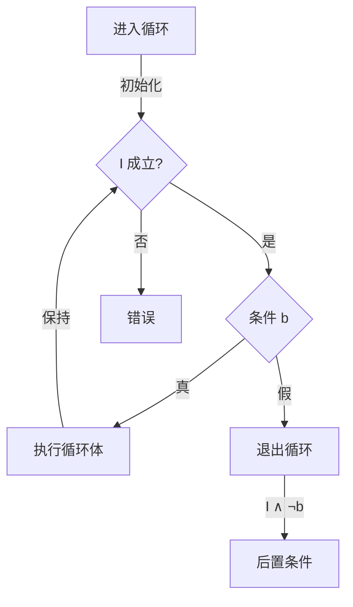

# 01.3 公理语义

---

📌 **内容摘要**

本文档深入探讨公理语义的核心原理和关键方法。内容涵盖编程语言理论领域的主要知识点，包括Hoare逻辑, 大步语义, 最弱前置条件, 不动点等关键主题。适合具备相关基础的学习者进行深入研究。

**关键词**: 编程语言理论, Hoare逻辑, 大步语义, 最弱前置条件, 不动点, 公理语义, 小步语义, 操作语义

📚 **学习目标**

- 深入理解公理语义的理论体系和形式化方法
- 能够进行相关定理的形式化证明
- 建立该领域的系统性知识框架

🎯 **难度级别**: 高级

⏱️ **预计阅读时间**: 15分钟

**前置知识**: 该领域的中级知识, 形式化方法基础

---


## 01.3.1 概述

**公理语义 (Axiomatic Semantics)** 通过逻辑断言描述程序行为，将程序正确性问题转化为逻辑证明问题。由C.A.R. Hoare于1969年提出，又称**Hoare逻辑**。

### 01.3.1.1 核心思想

- **前置条件 (Precondition)**：程序执行前必须满足的条件
- **后置条件 (Postcondition)**：程序执行后保证满足的条件
- **Hoare三元组**：$\{P\} C \{Q\}$

### 01.3.1.2 与操作/指称语义对比

| 语义风格 | 关注点 | 主要应用 |
|----------|--------|----------|
| 操作语义 | 执行步骤 | 语言实现、调试 |
| 指称语义 | 数学含义 | 语言设计、等价证明 |
| 公理语义 | 逻辑性质 | 程序验证、正确性证明 |

---

## 01.3.2 Hoare逻辑基础

### 01.3.2.1 Hoare三元组

**定义 01.3.1 (Hoare三元组)**

三元组 $\{P\} C \{Q\}$ 的含义：

> 若前置条件 $P$ 在 $C$ 执行前成立，且 $C$ 终止，则后置条件 $Q$ 在 $C$ 执行后成立。

**部分正确性 vs 完全正确性**

| 类型 | 记法 | 含义 |
|------|------|------|
| 部分正确性 | $\{P\} C \{Q\}$ | 不保证终止 |
| 完全正确性 | $[P] C [Q]$ | 保证终止且满足 $Q$ |

### 01.3.2.2 推理规则

**赋值公理**

$$\{Q[e/x]\} \ x := e \ \{Q\} \quad \text{(H-Assign)}$$

**顺序规则**

$$\frac{\{P\} C_1 \{R\} \quad \{R\} C_2 \{Q\}}{\{P\} C_1; C_2 \{Q\}} \quad \text{(H-Seq)}$$

**条件规则**

$$\frac{\{P \land b\} C_1 \{Q\} \quad \{P \land \neg b\} C_2 \{Q\}}{\{P\} \ \text{if } b \text{ then } C_1 \text{ else } C_2 \ \{Q\}} \quad \text{(H-If)}$$

**循环规则 (while)**

$$\frac{\{I \land b\} C \{I\}}{\{I\} \ \text{while } b \text{ do } C \ \{I \land \neg b\}} \quad \text{(H-While)}$$

**强化/弱化规则**

$$\frac{P' \Rightarrow P \quad \{P\} C \{Q\} \quad Q \Rightarrow Q'}{\{P'\} C \{Q'\}} \quad \text{(H-Consequence)}$$

### 01.3.2.3 推理树示例

```
证明: {x ≥ 0} y := 0; while x > 0 do y := y + x; x := x - 1 {y = sum_{i=1}^{x0} i}

取循环不变式 I: y = sum_{i=x0-x+1}^{x0} i ∧ x ≥ 0

{I ∧ x > 0} y := y + x; x := x - 1 {I}
──────────────────────────────────────────── H-Seq
{I} while x > 0 do ... {I ∧ x ≤ 0}
──────────────────────────────────────────── H-Seq
{x0 ≥ 0} y := 0; while ... {y = sum_{i=1}^{x0} i}
```

---

## 01.3.3 最弱前置条件

### 01.3.3.1 定义

**定义 01.3.2 (最弱前置条件)**

对于命令 $C$ 和后置条件 $Q$，最弱前置条件 $\text{wp}(C, Q)$ 是最大的谓词 $P$ 使得 $\{P\} C \{Q\}$ 有效。

形式化：

$$\text{wp}(C, Q)(\sigma) \iff \forall \sigma'. \langle C, \sigma \rangle \to \sigma' \Rightarrow Q(\sigma')$$

### 01.3.3.2 wp演算

$$
\begin{aligned}
\text{wp}(\text{skip}, Q) &= Q \\
\text{wp}(x := e, Q) &= Q[e/x] \\
\text{wp}(C_1; C_2, Q) &= \text{wp}(C_1, \text{wp}(C_2, Q)) \\
\text{wp}(\text{if } b \text{ then } C_1 \text{ else } C_2, Q) &= (b \Rightarrow \text{wp}(C_1, Q)) \land (\neg b \Rightarrow \text{wp}(C_2, Q)) \\
\text{wp}(\text{while } b \text{ do } C, Q) &= I \text{（通过不动点计算）}
\end{aligned}
$$

### 01.3.3.3 Rust实现

```rust
/// 谓词类型：从状态到布尔值
type Predicate<S> = Box<dyn Fn(&S) -> bool>;

/// 命令trait
trait Command<S> {
    fn wp(&self, post: Predicate<S>) -> Predicate<S>;
}

/// 赋值命令
struct Assign<F> {
    update: F,  // 状态更新函数
}

impl<S: Clone + 'static, F: Fn(&S) -> S + 'static> Command<S> for Assign<F> {
    fn wp(&self, post: Predicate<S>) -> Predicate<S> {
        let update = &self.update;
        Box::new(move |state| {
            let new_state = update(state);
            post(&new_state)
        })
    }
}

/// 顺序组合
struct Seq<S> {
    c1: Box<dyn Command<S>>,
    c2: Box<dyn Command<S>>,
}

impl<S: 'static> Command<S> for Seq<S> {
    fn wp(&self, post: Predicate<S>) -> Predicate<S> {
        let wp_c2 = self.c2.wp(post);
        self.c1.wp(wp_c2)
    }
}
```

---

## 01.3.4 循环不变式

### 01.3.4.1 定义与发现

**定义 01.3.3 (循环不变式)**

循环不变式 $I$ 是满足以下条件的谓词：

1. **初始化**：进入循环前 $I$ 成立
2. **保持**：若 $I \land b$ 成立，执行循环体后 $I$ 仍成立
3. **退出**：$I \land \neg b$ 蕴含所需的后置条件



### 01.3.4.2 常见模式

| 循环目的 | 不变式模式 |
|----------|------------|
| 求和 | 结果 = 已处理元素的和 |
| 计数 | 计数器 = 已处理元素数 |
| 搜索 | 目标不在已处理部分 |
| 排序 | 已排序前缀保持不变 |

### 01.3.4.3 示例：二分查找

```rust
/// 前置条件: arr 已排序，且 target 可能在 arr[lo..hi] 中
/// 后置条件: 返回 target 的索引，若不存在则返回 None
/// 循环不变式:
///   - arr[0..lo] < target
///   - arr[hi..] > target
fn binary_search(arr: &[i32], target: i32) -> Option<usize> {
    let mut lo = 0;
    let mut hi = arr.len();

    // 不变式: arr[0..lo] < target < arr[hi..]
    while lo < hi {
        let mid = lo + (hi - lo) / 2;
        if arr[mid] < target {
            lo = mid + 1;  // 保持: arr[0..lo] < target
        } else if arr[mid] > target {
            hi = mid;      // 保持: target < arr[hi..]
        } else {
            return Some(mid);
        }
    }
    None
}
```

---

## 01.3.5 Lean4形式化

### 01.3.5.1 Hoare逻辑形式化

```lean4
-- 程序状态
def State := String → ℕ

-- 命令归纳定义
inductive Cmd : Type
  | skip : Cmd
  | assign (x : String) (e : State → ℕ) : Cmd
  | seq (c1 c2 : Cmd) : Cmd
  | if_ (b : State → Bool) (c1 c2 : Cmd) : Cmd
  | while (b : State → Bool) (c : Cmd) : Cmd

-- 断言：从状态到Prop
def Assertion := State → Prop

-- Hoare三元组（部分正确性）
def HoareTriple (P : Assertion) (c : Cmd) (Q : Assertion) : Prop :=
  ∀ s s', P s → (c, s) ⟹ s' → Q s'

notation "{" P "} " c " {" Q "}" => HoareTriple P c Q
```

### 01.3.5.2 推理规则证明

```lean4
-- 赋值公理
theorem hoare_assign (x : String) (e : State → ℕ) (Q : Assertion) :
    {λ s => Q (fun y => if y = x then e s else s y)} (Cmd.assign x e) {Q} := by
  intros s s' hP hstep
  cases hstep
  assumption

-- 顺序规则
theorem hoare_seq {P Q R : Assertion} {c1 c2 : Cmd}
    (h1 : {P} c1 {Q}) (h2 : {Q} c2 {R}) : {P} (Cmd.seq c1 c2) {R} := by
  intros s s' hP hstep
  cases hstep with
  | eval_seq s'' hstep1 hstep2 =>
    have hQ := h1 s s'' hP hstep1
    exact h2 s'' s' hQ hstep2
```

### 01.3.5.3 wp演算形式化

```lean4
def wp : Cmd → Assertion → Assertion
  | Cmd.skip, Q => Q
  | Cmd.assign x e, Q => λ s => Q (fun y => if y = x then e s else s y)
  | Cmd.seq c1 c2, Q => wp c1 (wp c2 Q)
  | Cmd.if_ b c1 c2, Q => λ s =>
      (b s → wp c1 Q s) ∧ (¬b s → wp c2 Q s)
  | Cmd.while b c, Q => λ s => ∃ I,
      is_invariant I b c ∧ I s ∧ ∀ s', ¬b s' → I s' → Q s'

-- wp是最弱前置条件
theorem wp_is_weakest {c : Cmd} {Q : Assertion} :
    ({wp c Q} c {Q}) ∧ (∀ P, {P} c {Q} → ∀ s, P s → wp c Q s) := by
  constructor
  · -- 证明wp是有效前置条件
    induction c generalizing Q with
    | skip => intros s s' h hstep; cases hstep; exact h
    | assign x e => apply hoare_assign
    | seq c1 c2 ih1 ih2 =>
      apply hoare_seq (ih1 (wp c2 Q)) (ih2 Q)
    -- ... 其他情况
  · -- 证明wp是最弱的
    intro P hP s hPs
    -- 展开wp定义并证明
    sorry
```

---

## 01.3.6 扩展与变体

### 01.3.6.1 分离逻辑

**定义 01.3.4 (分离逻辑)**

用于验证指针程序的扩展：

- **分离合取** ($P * Q$)：堆可分割为两部分，分别满足 $P$ 和 $Q$
- **分离蕴含** ($P \-* Q$)：将满足 $P$ 的堆与当前堆组合后满足 $Q$

$$
\{P\} x := \text{alloc}(e) \{P * x \mapsto e\}
$$

### 01.3.6.2 总正确性

**定义 01.3.5 (总正确性)**

$[P] C [Q]$ 要求 $C$ 必然终止且满足 $Q$。

对于while循环，需要证明**变体 (variant)**：

$$\frac{\{P \land b \land V = n\} C \{P \land V < n\} \quad V \geq 0}{[P] \text{ while } b \text{ do } C [P \land \neg b]}$$

### 01.3.6.3 霍尔类型

将Hoare逻辑融入类型系统：

```haskell
-- 依赖类型风格的霍尔类型
data Hoare (pre : Assertion) (post : Assertion) : Type -> Type where
  Return : a -> Hoare (λ _ => True) (λ _ _ => True) a
  Bind : Hoare p q a -> (a -> Hoare q r b) -> Hoare p r b
  Assign : (x : Ref a) -> (f : State -> a) ->
           Hoare (λ s => True) (λ s s' => s' = update s x (f s)) ()
```

---

## 01.3.7 实际验证工具

### 01.3.7.1 Dafny示例

```dafny
method Find(a: array<int>, key: int) returns (index: int)
  requires forall i, j :: 0 <= i < j < a.Length ==> a[i] <= a[j]  // 已排序
  ensures 0 <= index < a.Length ==> a[index] == key
  ensures index < 0 ==> forall k :: 0 <= k < a.Length ==> a[k] != key
{
  var lo, hi := 0, a.Length;
  while lo < hi
    invariant 0 <= lo <= hi <= a.Length
    invariant forall k :: 0 <= k < lo ==> a[k] < key
    invariant forall k :: hi <= k < a.Length ==> a[k] > key
  {
    var mid := lo + (hi - lo) / 2;
    if a[mid] < key {
      lo := mid + 1;
    } else if a[mid] > key {
      hi := mid;
    } else {
      return mid;
    }
  }
  return -1;
}
```

### 01.3.7.2 F*示例

```fstar
val factorial: n:nat -> Tot nat (decreases n)
let rec factorial n =
  if n = 0 then 1 else n * factorial (n - 1)

val fibonacci: n:nat -> Tot nat (decreases n)
let rec fibonacci n =
  if n <= 1 then n
  else fibonacci (n - 1) + fibonacci (n - 2)
```

---

## 01.3.8 练习

1. 用Hoare逻辑证明欧几里得算法的正确性
2. 为快速排序算法设计并证明循环不变式
3. 在Lean4中证明分离逻辑的部分规则
4. 比较wp演算与最强后置条件的优劣

---

## 01.3.9 参考文献与交叉引用

- [01.1 操作语义](./01.1_操作语义.md) —— 操作视角的程序行为
- [01.2 指称语义](./01.2_指称语义.md) —— 数学语义基础
- [02.1 所有权系统](../02_Rust语言深入/02.1_所有权系统.md) —— Rust的所有权验证
- [Hoare, 1969] "An Axiomatic Basis for Computer Programming"
- [Reynolds, 2002] "Separation Logic: A Logic for Shared Mutable Data Structures"

---

## 📋 前置知识

- [01.2 指称语义](../01_编程语言理论/01.2_指称语义.md)

---

## 📚 延伸阅读

- [01.2 指称语义](../01_编程语言理论/01.2_指称语义.md)
- [02.3 依赖类型](../../02_形式语言/02_类型论/02.3_依赖类型.md)
- [2.3 依赖类型论 (Dependent Type Theory)](../../02_形式语言/02_类型论/02.3_依赖类型论.md)
- [01.1 操作语义](../01_编程语言理论/01.1_操作语义.md)
