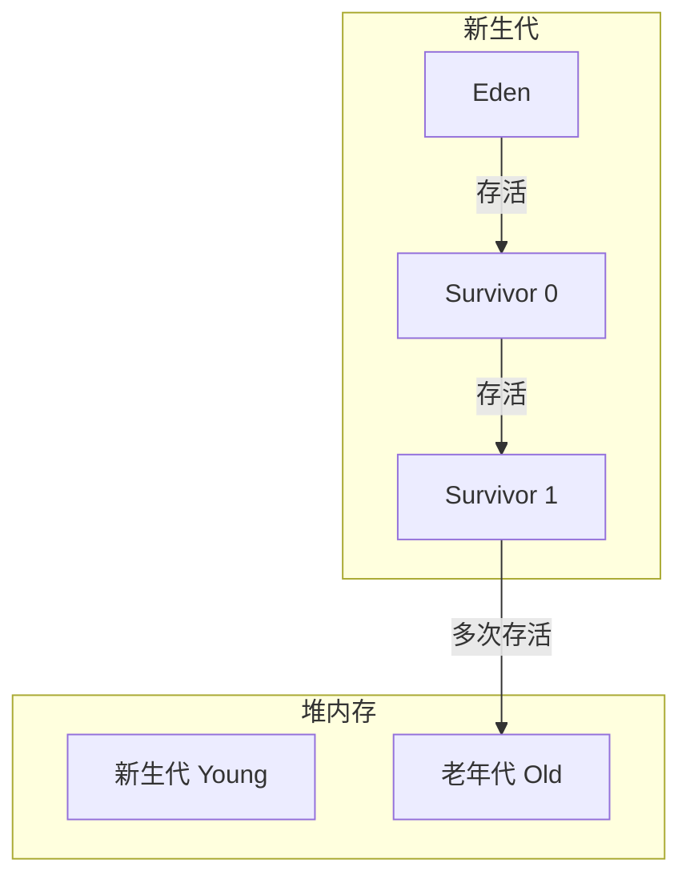
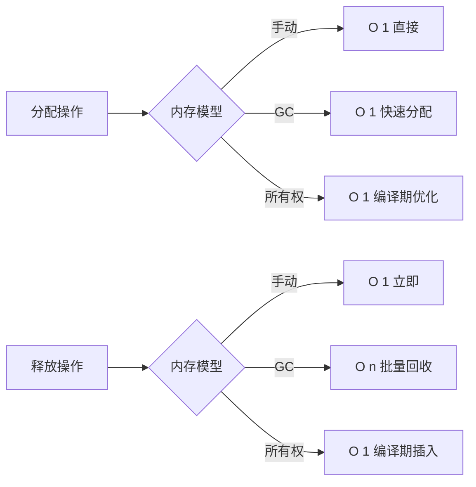

# 1. 内存管理模型

---

📌 **内容摘要**

本文档深入探讨内存管理模型的核心原理和关键方法。内容涵盖编程语言理论领域的主要知识点，包括所有权, Rust, 借用检查等关键主题。适合有一定基础的学习者系统学习。

**关键词**: 所有权, Rust, 编程语言理论, 借用检查

📚 **学习目标**
- 掌握内存管理模型的核心概念和主要方法
- 理解相关理论的应用场景
- 建立该领域的系统性知识框架

🎯 **难度级别**: 中级

⏱️ **预计阅读时间**: 15分钟

**前置知识**: 相关领域的基础概念

---


## 目录

- [1. 内存管理模型](#1-内存管理模型)
  - [目录](#目录)
  - [1.1 内存管理概述](#11-内存管理概述)
  - [1.2 手动内存管理](#12-手动内存管理)
    - [1.2.1 C/C++ 风格内存管理](#121-cc-风格内存管理)
    - [1.2.2 常见内存错误](#122-常见内存错误)
    - [1.2.3 RAII 模式](#123-raii-模式)
  - [1.3 垃圾回收机制](#13-垃圾回收机制)
    - [1.3.1 垃圾回收概述](#131-垃圾回收概述)
    - [1.3.2 标记-清除算法](#132-标记-清除算法)
    - [1.3.3 引用计数](#133-引用计数)
    - [1.3.4 分代垃圾回收](#134-分代垃圾回收)
  - [1.4 所有权系统](#14-所有权系统)
    - [1.4.1 Rust 所有权模型](#141-rust-所有权模型)
    - [1.4.2 借用与引用](#142-借用与引用)
    - [1.4.3 生命周期](#143-生命周期)
    - [1.4.4 所有权系统的形式化证明](#144-所有权系统的形式化证明)
  - [1.5 内存模型对比](#15-内存模型对比)
    - [1.5.1 特性对比](#151-特性对比)
    - [1.5.2 性能对比](#152-性能对比)
  - [1.6 形式化分析](#16-形式化分析)
    - [1.6.1 内存安全的形式化定义](#161-内存安全的形式化定义)
    - [1.6.2 类型系统的内存安全保证](#162-类型系统的内存安全保证)

## 1.1 内存管理概述

**定义 1.1.1**：内存管理（Memory Management）是编程语言运行时系统负责分配、使用和回收内存的机制。


**定义 1.1.2**：内存管理的三个核心问题：

- 分配（Allocation）：如何高效分配内存
- 使用（Usage）：如何安全访问内存
- 回收（Reclamation）：如何识别并回收无用内存

形式化模型：
$$
\text{Memory} = \text{Addr} \rightarrow \text{Value} \cup \{\text{unallocated}\}
$$

$$
\text{Allocation}: Size \rightarrow (Memory, Addr)
$$

$$
\text{Deallocation}: Addr \rightarrow Memory
$$

## 1.2 手动内存管理

### 1.2.1 C/C++ 风格内存管理

**定义 1.2.1**：手动内存管理要求程序员显式调用分配和释放操作。

```c
// C 语言手动内存管理
#include <stdlib.h>

void manual_memory_example() {
    // 堆内存分配
    int* arr = (int*)malloc(sizeof(int) * 100);

    // 使用内存
    for (int i = 0; i < 100; i++) {
        arr[i] = i;
    }

    // 必须显式释放
    free(arr);

    // 危险：使用已释放内存（悬空指针）
    // arr[0] = 10;  // 未定义行为！
}
```

```cpp
// C++ 手动内存管理
#include <iostream>

class Resource {
public:
    Resource() { std::cout << "Resource acquired\n"; }
    ~Resource() { std::cout << "Resource released\n"; }
};

void cpp_manual_management() {
    // 原始指针（危险）
    Resource* raw_ptr = new Resource();
    delete raw_ptr;  // 容易忘记！

    // 智能指针（RAII）
    std::unique_ptr<Resource> smart_ptr = std::make_unique<Resource>();
    // 自动释放，无需手动 delete
}
```

### 1.2.2 常见内存错误

**定义 1.2.2**：手动内存管理常见错误：

- 内存泄漏：分配后未释放
- 悬空指针：释放后继续使用
- 双重释放：同一块内存释放两次
- 缓冲区溢出：写入超出分配范围

```rust
// Rust 避免这些错误的示例

fn rust_safe_memory() {
    // 栈分配（自动管理）
    let stack_arr = [0; 100];

    // 堆分配（所有权跟踪）
    let heap_vec = vec![0; 100];

    // 当 heap_vec 离开作用域时，自动释放
    // 无需手动 free
}

// Rust 防止使用已释放内存
fn no_dangling_reference() {
    let data = String::from("hello");
    let ref_data = &data;  // 借用

    println!("{}", ref_data);

    // data 在这里被释放
    // ref_data 不能再使用
}
```

### 1.2.3 RAII 模式

**定义 1.2.3**：RAII（Resource Acquisition Is Initialization）将资源生命周期与对象生命周期绑定。

形式化表述：
$$
\text{Acquire}(R) \Rightarrow \text{Object}(R) \quad \land \quad \text{Destroy}(Object) \Rightarrow \text{Release}(R)
$$

```rust
// Rust 的 RAII 实现
struct FileHandle {
    fd: i32,
}

impl FileHandle {
    fn open(path: &str) -> Option<FileHandle> {
        // 打开文件...
        Some(FileHandle { fd: 1 })
    }
}

impl Drop for FileHandle {
    fn drop(&mut self) {
        // 自动关闭文件
        println!("Closing file descriptor {}", self.fd);
    }
}

fn raii_example() {
    let file = FileHandle::open("test.txt");
    // 使用文件...
    // file 离开作用域时，自动调用 drop
}
```

## 1.3 垃圾回收机制

### 1.3.1 垃圾回收概述

**定义 1.3.1**：垃圾回收（Garbage Collection, GC）自动识别和回收不再使用的内存。

**定义 1.3.2**：可达性分析（Reachability Analysis）：从根集合出发，不可达的对象即为垃圾。

$$
\text{RootSet} = \{\text{全局变量}\} \cup \{\text{栈变量}\} \cup \{\text{寄存器}\}
$$

$$
\text{Reachable}(o) \iff \exists r \in \text{RootSet}, \text{Path}(r, o)
$$

$$
\text{Garbage} = \{o \mid \neg \text{Reachable}(o)\}
$$

### 1.3.2 标记-清除算法

**算法 1.3.1**：标记-清除（Mark-Sweep）

```
MarkSweep():
    // 标记阶段
    for each root in RootSet:
        Mark(root)

    // 清除阶段
    for each object in Heap:
        if not object.marked:
            Free(object)
        else:
            object.marked = false

Mark(obj):
    if obj == null or obj.marked:
        return
    obj.marked = true
    for each child in obj.children:
        Mark(child)
```

```rust
// Rust 模拟垃圾回收（教育目的）
use std::collections::{HashSet, VecDeque};

struct GCObject {
    id: usize,
    marked: bool,
    references: Vec<usize>,
}

struct SimpleGC {
    heap: Vec<GCObject>,
    roots: HashSet<usize>,
}

impl SimpleGC {
    fn gc(&mut self) {
        // 标记阶段
        let mut queue: VecDeque<usize> = self.roots.iter().copied().collect();

        while let Some(id) = queue.pop_front() {
            if let Some(obj) = self.heap.iter_mut().find(|o| o.id == id) {
                if !obj.marked {
                    obj.marked = true;
                    for &ref_id in &obj.references {
                        queue.push_back(ref_id);
                    }
                }
            }
        }

        // 清除阶段
        self.heap.retain(|obj| {
            if obj.marked {
                true  // 保留
            } else {
                println!("Collecting object {}", obj.id);
                false  // 回收
            }
        });

        // 清除标记
        for obj in &mut self.heap {
            obj.marked = false;
        }
    }
}
```

### 1.3.3 引用计数

**定义 1.3.3**：引用计数（Reference Counting）为每个对象维护引用数量，计数为 0 时回收。

```rust
use std::rc::Rc;
use std::cell::RefCell;

struct Node {
    value: i32,
    next: Option<Rc<RefCell<Node>>>,
}

fn reference_counting_example() {
    // Rc 提供引用计数
    let node1 = Rc::new(RefCell::new(Node {
        value: 1,
        next: None,
    }));

    println!("Reference count: {}", Rc::strong_count(&node1));

    {
        let node2 = Rc::clone(&node1);  // 增加引用计数
        println!("Reference count: {}", Rc::strong_count(&node1));

        // node2 离开作用域，引用计数减少
    }

    println!("Reference count: {}", Rc::strong_count(&node1));
    // 当计数为 0 时，自动释放
}
```

**定理 1.3.4**：引用计数无法处理循环引用。

```rust
// 循环引用问题
use std::rc::Rc;
use std::cell::RefCell;

struct Person {
    name: String,
    friend: Option<Rc<RefCell<Person>>>,
}

fn circular_reference_problem() {
    let alice = Rc::new(RefCell::new(Person {
        name: "Alice".to_string(),
        friend: None,
    }));

    let bob = Rc::new(RefCell::new(Person {
        name: "Bob".to_string(),
        friend: Some(Rc::clone(&alice)),
    }));

    // 形成循环引用
    alice.borrow_mut().friend = Some(Rc::clone(&bob));

    // 即使 alice 和 bob 变量离开作用域
    // 内存也不会被释放，因为引用计数永远不为 0
}

// 解决方案：使用 Weak 引用
use std::rc::Weak;

struct PersonFixed {
    name: String,
    friend: Option<Weak<RefCell<PersonFixed>>>,
}
```

### 1.3.4 分代垃圾回收

**定义 1.3.5**：分代垃圾回收（Generational GC）基于弱分代假设：大多数对象很快死亡。



```rust
// 分代 GC 简化模拟
struct GenerationalGC {
    eden: Vec<GCObject>,
    survivor: Vec<GCObject>,
    old: Vec<GCObject>,
    age_threshold: u8,
}

impl GenerationalGC {
    fn minor_gc(&mut self) {
        // 只清理 Eden 和 Survivor
        println!("Running minor GC...");

        // 标记 Eden 中存活的对象
        let mut survivors: Vec<GCObject> = self.eden
            .drain(..)
            .filter(|obj| obj.marked)
            .map(|mut obj| {
                obj.age += 1;
                obj
            })
            .collect();

        // 晋升到 Survivor 或 Old
        for obj in survivors {
            if obj.age >= self.age_threshold {
                self.old.push(obj);
            } else {
                self.survivor.push(obj);
            }
        }
    }

    fn major_gc(&mut self) {
        // 清理整个堆
        println!("Running major GC...");
        self.old.retain(|obj| obj.marked);
    }
}
```

## 1.4 所有权系统

### 1.4.1 Rust 所有权模型

**定义 1.4.1**：所有权（Ownership）是 Rust 的内存管理机制，基于以下三条规则：

1. 每个值都有一个所有者（Owner）
2. 同一时间只能有一个所有者
3. 当所有者离开作用域时，值被丢弃

形式化模型：
$$
\text{Ownership}: Value \rightarrow Owner
$$

$$
\forall v \in Value, |\{o \mid Ownership(v) = o\}| \leq 1
$$

```rust
fn ownership_rules() {
    // 规则 1：s1 是 String 的所有者
    let s1 = String::from("hello");

    // 规则 2：所有权移动到 s2，s1 不再有效
    let s2 = s1;
    // println!("{}", s1);  // 编译错误！

    // 规则 3：s2 离开作用域时，内存自动释放
    println!("{}", s2);
}
```

### 1.4.2 借用与引用

**定义 1.4.2**：借用（Borrowing）允许临时使用值而不获取所有权。

- 不可变借用：`&T`，可以有多个
- 可变借用：`&mut T`，只能有一个

**定理 1.4.3**：借用规则：
$$
\text{借用}(v) \Rightarrow \begin{cases}
\forall i, \text{Ref}_i(v) & \text{（多个不可变借用）} \\
\text{MutRef}(v) & \text{（单个可变借用）}
\end{cases}
$$

$$
\text{MutRef}(v) \Rightarrow \neg \exists \text{Ref}(v) \land \neg \exists \text{MutRef}'(v)
$$

```rust
fn borrowing_example() {
    let mut s = String::from("hello");

    // 不可变借用
    let r1 = &s;
    let r2 = &s;
    println!("{} {}", r1, r2);  // 可以同时存在多个

    // 借用结束，可以使用可变借用
    let r3 = &mut s;
    r3.push_str(" world");
    // let r4 = &s;  // 错误：不能同时有可变和不可变借用

    println!("{}", r3);
}
```

### 1.4.3 生命周期

**定义 1.4.4**：生命周期（Lifetime）确保引用在其指向的数据有效期间有效。

形式化表述：
$$
\text{Lifetime}(r) \subseteq \text{Lifetime}(data \ pointed \ by \ r)
$$

```rust
// 显式生命周期标注
fn longest<'a>(s1: &'a str, s2: &'a str) -> &'a str {
    if s1.len() > s2.len() {
        s1
    } else {
        s2
    }
}

// 生命周期省略规则
fn first_word(s: &str) -> &str {  // 等价于 fn first_word<'a>(s: &'a str) -> &'a str
    &s[0..1]
}

// 结构体中的生命周期
struct ImportantExcerpt<'a> {
    part: &'a str,  // part 的生命周期不能超过结构体实例
}
```

### 1.4.4 所有权系统的形式化证明

**定理 1.4.5**（内存安全）：Rust 的所有权系统保证没有数据竞争。

**证明**：

1. 同时只能有一个可变引用，排除了写-写竞争
2. 可变引用和不可变引用不能共存，排除了读-写竞争
3. 引用不能比数据活得长，排除了悬空指针

```rust
// Rust 编译器防止的竞争条件
unsafe fn potential_race_condition() {
    let mut data = 0;
    let ptr1 = &mut data as *mut i32;
    let ptr2 = &mut data as *mut i32;  // 编译错误！

    // 在 unsafe 块中可以产生竞争
    *ptr1 = 1;
    *ptr2 = 2;
}
```

## 1.5 内存模型对比

### 1.5.1 特性对比

| 特性 | 手动管理 | 垃圾回收 | 所有权系统 |
|------|----------|----------|------------|
| 内存安全 | 依赖程序员 | 自动保证 | 编译时保证 |
| 运行时开销 | 无 | 显著 | 无 |
| 延迟确定性 | 立即 | 不确定 | 立即 |
| 学习曲线 | 中等 | 低 | 陡峭 |
| 适用场景 | 系统编程 | 应用开发 | 系统编程 |
| 循环引用 | 可能 | 自动处理 | 编译错误 |

### 1.5.2 性能对比



## 1.6 形式化分析

### 1.6.1 内存安全的形式化定义

**定义 1.6.1**：内存安全（Memory Safety）包括：

- 无悬空指针（Dangling Pointer）：指针指向已释放内存
- 无缓冲区溢出（Buffer Overflow）：访问超出分配范围
- 无 use-after-free：释放后继续使用
- 无双重释放（Double Free）：重复释放同一内存

形式化表述：
$$
\text{MemorySafe}(P) \iff \forall t, \forall a \in \text{Access}_t(P), \text{Valid}(a)
$$

### 1.6.2 类型系统的内存安全保证

**定理 1.6.2**：Rust 的类型系统保证内存安全。

证明概要：

1. 所有权系统确保每个值只有一个所有者
2. 借用检查器确保引用有效性
3. 生命周期系统确保引用不活得比数据长
4. 这些检查都在编译期完成，无运行时开销

```lean
-- Lean 风格的形式化证明框架
-- 所有权系统的形式化表示

def Owner := String

def Value := String

structure OwnershipState where
  owner_map : Value → Option Owner
  borrowed : Value → List Owner

-- 所有权规则的形式化
def valid_ownership (s : OwnershipState) : Prop :=
  ∀ v : Value,
    (s.owner_map v).isSome →
    (s.borrowed v).length ≤ 1 ∨
    (∀ o ∈ s.borrowed v, ¬(s.owner_map v = some o))
```

---

**参考文档**：

- [02.1_Rust所有权系统](../02_Rust语言深入/02.1_Rust所有权系统.md)
- [01.4_并发编程模型](./01.4_并发编程模型.md)
- [02.2_Rust类型系统](../02_Rust语言深入/02.2_Rust类型系统.md)
---

## 📚 延伸阅读

- [1. Rust 类型系统](../02_Rust语言深入/02.2_Rust类型系统.md)
- [02.2 类型系统](../02_Rust语言深入/02.2_类型系统.md)
- [1. Rust 所有权系统](../02_Rust语言深入/02.1_Rust所有权系统.md)
- [02.1 所有权系统](../02_Rust语言深入/02.1_所有权系统.md)
- [02.3 内存安全形式化](../02_Rust语言深入/02.3_内存安全形式化.md)
