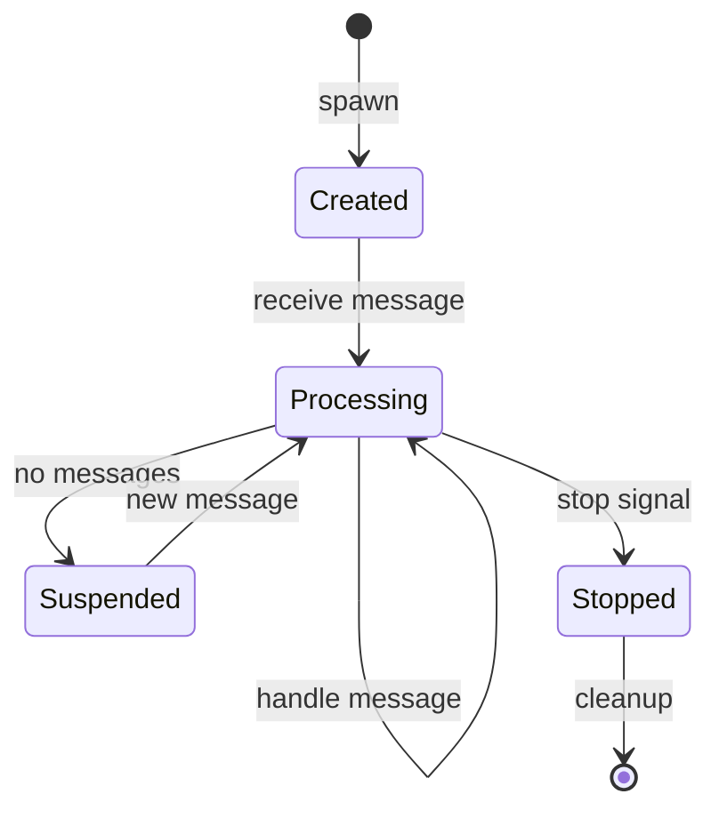
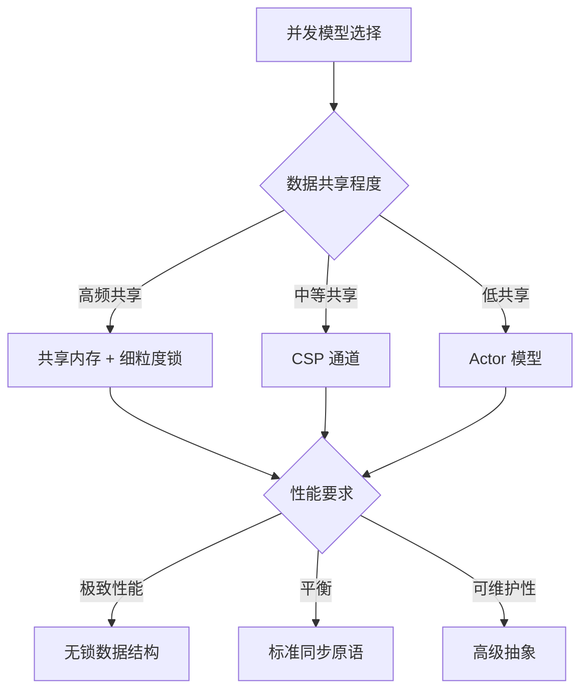

# 1. 并发编程模型

---

📌 **内容摘要**

本文档深入探讨并发编程模型的核心原理和关键方法。内容涵盖编程语言理论领域的主要知识点，包括同步, 并行, 并发编程等关键主题。适合有一定基础的学习者系统学习。

**关键词**: 同步, 编程语言理论, 并行, 并发编程

📚 **学习目标**
- 掌握并发编程模型的核心概念和主要方法
- 理解相关理论的应用场景
- 建立该领域的系统性知识框架

🎯 **难度级别**: 中级

⏱️ **预计阅读时间**: 15分钟

**前置知识**: 相关领域的基础概念

---


## 目录

- [1. 并发编程模型](#1-并发编程模型)
  - [目录](#目录)
  - [1.1 并发基础](#11-并发基础)
    - [1.1.1 竞态条件](#111-竞态条件)
  - [1.2 共享内存模型](#12-共享内存模型)
    - [1.2.1 互斥锁](#121-互斥锁)
    - [1.2.2 读写锁](#122-读写锁)
    - [1.2.3 条件变量](#123-条件变量)
  - [1.3 消息传递模型](#13-消息传递模型)
    - [1.3.1 通道基础](#131-通道基础)
    - [1.3.2 多生产者单消费者](#132-多生产者单消费者)
  - [1.4 CSP 模型](#14-csp-模型)
    - [1.4.1 CSP 理论基础](#141-csp-理论基础)
    - [1.4.2 Go 风格的 CSP](#142-go-风格的-csp)
  - [1.5 Actor 模型](#15-actor-模型)
    - [1.5.1 Actor 理论基础](#151-actor-理论基础)
    - [1.5.2 Actor 生命周期](#152-actor-生命周期)
    - [1.5.3 Actor 监督树](#153-actor-监督树)
  - [1.6 并发模型对比](#16-并发模型对比)
    - [1.6.1 特性对比](#161-特性对比)
    - [1.6.2 性能对比](#162-性能对比)
  - [1.7 形式化分析](#17-形式化分析)
    - [1.7.1 死锁的形式化定义](#171-死锁的形式化定义)
    - [1.7.2 防止死锁](#172-防止死锁)
    - [1.7.3 线性一致性](#173-线性一致性)

## 1.1 并发基础

**定义 1.1.1**：并发（Concurrency）是多个任务在同一时间段内交替执行的能力；并行（Parallelism）是多个任务同时执行的能力。

形式化定义：
$$
\text{Concurrency}: \text{Tasks} \times \text{Time} \rightarrow \text{Interleaving}
$$

$$
\text{Parallelism}: \text{Tasks} \times \text{Processors} \rightarrow \text{Simultaneous\ Execution}
$$



```mermaid
gantt
    title 并发 vs 并行
    dateFormat X
    axisFormat %s

    section 并发（单核）
    Task A : 0, 3
    Task B : 3, 6
    Task A : 6, 9
    Task B : 9, 12

    section 并行（多核）
    Task A : 0, 6
    Task B : 0, 6
```

**定义 1.1.2**：并发编程的挑战：

- 竞态条件（Race Condition）：执行顺序影响结果
- 死锁（Deadlock）：循环等待资源
- 活锁（Livelock）：持续改变状态但无进展
- 饥饿（Starvation）：某些线程长期得不到执行

### 1.1.1 竞态条件

**定义 1.1.3**：竞态条件是指程序的结果依赖于事件或线程的执行时序。

形式化定义：
$$
\exists t_1, t_2, \text{Result}(t_1 \prec t_2) \neq \text{Result}(t_2 \prec t_1)
$$

```rust
// Rust 中防止竞态条件
use std::sync::{Arc, Mutex};
use std::thread;

fn race_condition_prevented() {
    let counter = Arc::new(Mutex::new(0));
    let mut handles = vec![];

    for _ in 0..10 {
        let counter = Arc::clone(&counter);
        let handle = thread::spawn(move || {
            let mut num = counter.lock().unwrap();
            *num += 1;
            // 锁在这里自动释放
        });
        handles.push(handle);
    }

    for handle in handles {
        handle.join().unwrap();
    }

    println!("Result: {}", *counter.lock().unwrap());
}
```

## 1.2 共享内存模型

### 1.2.1 互斥锁

**定义 1.2.1**：互斥锁（Mutex）确保同一时间只有一个线程可以访问临界区。

形式化定义：
$$
\text{Mutex}: \text{CriticalSection} \rightarrow \text{MutualExclusion}
$$

$$
\forall t_1, t_2, \neg(t_1 \in CS \land t_2 \in CS)
$$

```rust
use std::sync::{Arc, Mutex};
use std::thread;

fn mutex_example() {
    let data = Arc::new(Mutex::new(vec![1, 2, 3]));
    let mut handles = vec![];

    for i in 0..3 {
        let data = Arc::clone(&data);
        let handle = thread::spawn(move || {
            let mut vec = data.lock().unwrap();
            vec.push(i);
            println!("Thread {} pushed data", i);
        });
        handles.push(handle);
    }

    for handle in handles {
        handle.join().unwrap();
    }
}
```

### 1.2.2 读写锁

**定义 1.2.2**：读写锁（RwLock）允许多个读者或一个写者访问数据。

```rust
use std::sync::{Arc, RwLock};

fn rwlock_example() {
    let data = Arc::new(RwLock::new(HashMap::new()));

    // 多个读线程
    let data_clone = Arc::clone(&data);
    let reader = thread::spawn(move || {
        let map = data_clone.read().unwrap();
        println!("Reading: {:?}", map.get("key"));
    });

    // 单个写线程
    let data_clone = Arc::clone(&data);
    let writer = thread::spawn(move || {
        let mut map = data_clone.write().unwrap();
        map.insert("key", "value");
    });

    reader.join().unwrap();
    writer.join().unwrap();
}
```

### 1.2.3 条件变量

**定义 1.2.3**：条件变量（Condition Variable）允许线程等待特定条件发生。

```rust
use std::sync::{Arc, Condvar, Mutex};

fn condition_variable_example() {
    let pair = Arc::new((Mutex::new(false), Condvar::new()));
    let pair2 = Arc::clone(&pair);

    // 等待线程
    thread::spawn(move || {
        let (lock, cvar) = &*pair2;
        let mut started = lock.lock().unwrap();
        while !*started {
            started = cvar.wait(started).unwrap();
        }
        println!("Worker started!");
    });

    // 主线程通知
    let (lock, cvar) = &*pair;
    let mut started = lock.lock().unwrap();
    *started = true;
    cvar.notify_one();
}
```

## 1.3 消息传递模型

### 1.3.1 通道基础

**定义 1.3.1**：通道（Channel）提供线程间的单向通信机制。

形式化定义：
$$
\text{Channel}: T \times \text{Sender} \times \text{Receiver} \rightarrow \text{Communication}
$$

```rust
use std::sync::mpsc;
use std::thread;

fn channel_example() {
    // 创建通道
    let (tx, rx) = mpsc::channel();

    // 发送线程
    thread::spawn(move || {
        let vals = vec![
            String::from("hi"),
            String::from("from"),
            String::from("the"),
            String::from("thread"),
        ];

        for val in vals {
            tx.send(val).unwrap();
            thread::sleep(Duration::from_secs(1));
        }
    });

    // 接收
    for received in rx {
        println!("Got: {}", received);
    }
}
```

### 1.3.2 多生产者单消费者

```rust
use std::sync::mpsc;
use std::thread;

fn mpsc_example() {
    let (tx, rx) = mpsc::channel();
    let tx1 = tx.clone();

    // 生产者 1
    thread::spawn(move || {
        let vals = vec![1, 2, 3];
        for val in vals {
            tx.send(val).unwrap();
        }
    });

    // 生产者 2
    thread::spawn(move || {
        let vals = vec![4, 5, 6];
        for val in vals {
            tx1.send(val).unwrap();
        }
    });

    // 消费者
    for received in rx {
        println!("Received: {}", received);
    }
}
```

## 1.4 CSP 模型

### 1.4.1 CSP 理论基础

**定义 1.4.1**：CSP（Communicating Sequential Processes）由 Tony Hoare 提出，通过通道通信而非共享内存来组织并发。

形式化定义：
$$
P ::= \text{STOP} \mid \text{SKIP} \mid a \rightarrow P \mid P \Box Q \mid P \sqcap Q \mid P \parallel Q
$$

其中：

- $\rightarrow$：前缀操作（事件后执行）
- $\Box$：外部选择
- $\sqcap$：内部选择
- $\parallel$：并行组合

**定理 1.4.2**：CSP 的核心原则：
$$
\text{Do not communicate by sharing memory; instead, share memory by communicating.}
$$

```rust
// Rust 中的 CSP 风格
use std::sync::mpsc;

fn csp_style() {
    let (tx1, rx1) = mpsc::channel();
    let (tx2, rx2) = mpsc::channel();

    // 进程 A：接收数据，处理后发送
    thread::spawn(move || {
        while let Ok(data) = rx1.recv() {
            let processed = process(data);
            tx2.send(processed).unwrap();
        }
    });

    // 进程 B：使用处理后的数据
    thread::spawn(move || {
        while let Ok(result) = rx2.recv() {
            consume(result);
        }
    });
}

fn process(data: i32) -> i32 {
    data * 2
}

fn consume(result: i32) {
    println!("Consumed: {}", result);
}
```

### 1.4.2 Go 风格的 CSP

```go
// Go 语言 CSP 示例
package main

import "fmt"

func producer(ch chan<- int) {
    for i := 0; i < 5; i++ {
        ch <- i
    }
    close(ch)
}

func consumer(ch <-chan int, done chan<- bool) {
    for num := range ch {
        fmt.Println("Received:", num)
    }
    done <- true
}

func main() {
    ch := make(chan int)
    done := make(chan bool)

    go producer(ch)
    go consumer(ch, done)

    <-done
}
```

## 1.5 Actor 模型

### 1.5.1 Actor 理论基础

**定义 1.5.1**：Actor 模型由 Carl Hewitt 提出，Actor 是并发计算的基本单元，通过异步消息传递通信。

形式化定义：
$$
\text{Actor} = (\text{State}, \text{Behavior}, \text{Mailbox})
$$

**定义 1.5.2**：Actor 的三个基本操作：

- 创建新的 Actor
- 向其他 Actor 发送消息
- 改变自身状态和行为

```rust
// Rust 使用 actix 框架实现 Actor
use actix::prelude::*;

// 定义消息
struct Greet(String);
impl Message for Greet {
    type Result = ();
}

// 定义 Actor
struct MyActor {
    name: String,
}

impl Actor for MyActor {
    type Context = Context<Self>;
}

// 处理消息
impl Handler<Greet> for MyActor {
    type Result = ();

    fn handle(&mut self, msg: Greet, _: &mut Context<Self>) {
        println!("Hello {}, I'm {}", msg.0, self.name);
    }
}

fn main() {
    let sys = System::new("example");

    let addr = MyActor { name: "Actor1".to_string() }.start();

    addr.do_send(Greet("World".to_string()));

    sys.run();
}
```

### 1.5.2 Actor 生命周期



### 1.5.3 Actor 监督树

```rust
// Actor 监督示例
use actix::prelude::*;

// 定义监督策略
enum SupervisionStrategy {
    OneForOne,  // 一个子 Actor 失败，只重启它
    OneForAll,  // 一个失败，重启所有
    RestForOne, // 重启失败的及其之后启动的
}

// 父 Actor 监督子 Actor
trait Supervisor {
    fn handle_failure(&mut self, child: Addr<dyn Actor>, error: Box<dyn std::error::Error>);
}

// 示例：实现简单的监督
struct ParentActor {
    children: Vec<Addr<ChildActor>>,
    strategy: SupervisionStrategy,
}

struct ChildActor;

impl Actor for ChildActor {
    type Context = Context<Self>;
}

impl ChildActor {
    fn new() -> Self {
        ChildActor
    }
}
```

## 1.6 并发模型对比

### 1.6.1 特性对比

| 特性 | 共享内存 | 消息传递 | CSP | Actor |
|------|----------|----------|-----|-------|
| 通信方式 | 共享变量 | 通道 | 同步通道 | 异步消息 |
| 同步方式 | 锁/原子 | 阻塞/非阻塞 | 同步 | 异步 |
| 耦合度 | 高 | 中 | 中 | 低 |
| 容错性 | 低 | 中 | 中 | 高 |
| 扩展性 | 难 | 中 | 好 | 优秀 |
| 适用场景 | 细粒度共享 | 任务协调 | 流水线 | 分布式系统 |

### 1.6.2 性能对比



## 1.7 形式化分析

### 1.7.1 死锁的形式化定义

**定义 1.7.1**：死锁（Deadlock）的四个必要条件（Coffman 条件）：

1. 互斥（Mutual Exclusion）：资源不可共享
2. 占有并等待（Hold and Wait）：持有资源同时等待新资源
3. 非抢占（No Preemption）：资源不能被强制释放
4. 循环等待（Circular Wait）：等待关系形成环

形式化定义：
$$
\text{Deadlock} \iff \exists C = \{t_1, t_2, \ldots, t_n\}, \forall t_i \in C, t_i \text{ waits for } t_{(i+1) \mod n}
$$

### 1.7.2 防止死锁

**定理 1.7.2**：破坏死锁四条件之一即可防止死锁。

```rust
// Rust 防止死锁的策略

// 1. 锁有序（破坏循环等待）
fn ordered_locking() {
    let lock1 = Arc::new(Mutex::new(0));
    let lock2 = Arc::new(Mutex::new(0));

    // 总是按照相同顺序获取锁
    let mut guard1 = lock1.lock().unwrap();
    let mut guard2 = lock2.lock().unwrap();

    *guard1 += 1;
    *guard2 += 1;
}

// 2. 超时机制（破坏占有并等待）
fn timeout_locking() {
    let lock = Mutex::new(0);

    match lock.try_lock_for(Duration::from_secs(1)) {
        Some(guard) => { /* 使用资源 */ }
        None => { /* 超时处理 */ }
    }
}

// 3. 无锁数据结构（破坏互斥）
use std::sync::atomic::{AtomicUsize, Ordering};

fn lock_free() {
    let counter = AtomicUsize::new(0);

    // CAS 操作，无锁
    counter.fetch_add(1, Ordering::SeqCst);
}
```

### 1.7.3 线性一致性

**定义 1.7.3**：线性一致性（Linearizability）是并发系统的正确性条件，要求每个操作看起来在某个瞬间原子地完成。

形式化定义：
$$
\forall o_1, o_2, \text{Response}(o_1) \prec \text{Invoke}(o_2) \Rightarrow o_1 \prec_{hist} o_2
$$

```rust
// Rust 实现线性一致的数据结构
use std::sync::atomic::{AtomicPtr, Ordering};
use std::ptr;

struct LockFreeStack<T> {
    head: AtomicPtr<Node<T>>,
}

struct Node<T> {
    data: T,
    next: *mut Node<T>,
}

impl<T> LockFreeStack<T> {
    fn new() -> Self {
        LockFreeStack {
            head: AtomicPtr::new(ptr::null_mut()),
        }
    }

    fn push(&self, data: T) {
        let new_node = Box::into_raw(Box::new(Node {
            data,
            next: ptr::null_mut(),
        }));

        loop {
            let head = self.head.load(Ordering::Relaxed);
            unsafe { (*new_node).next = head; }

            // CAS 操作保证线性一致性
            match self.head.compare_exchange(
                head,
                new_node,
                Ordering::Release,
                Ordering::Relaxed,
            ) {
                Ok(_) => break,
                Err(_) => continue,  // 重试
            }
        }
    }
}
```

---

**参考文档**：

- [03.1_异步编程基础](../03_异步编程模型/03.1_异步编程基础.md)
- [03.2_Tokio运行时](../03_异步编程模型/03.2_Tokio运行时.md)
- [02.1_Rust所有权系统](../02_Rust语言深入/02.1_Rust所有权系统.md)
---

## 📋 前置知识

- [1. 内存管理模型](../01_编程语言理论/01.3_内存管理模型.md)

---

## 📚 延伸阅读

- [1. 异步编程基础](../03_异步编程模型/03.1_异步编程基础.md)
- [03.1 并发模型对比](../03_异步编程模型/03.1_并发模型对比.md)
- [1. Rust 所有权系统](../02_Rust语言深入/02.1_Rust所有权系统.md)
- [02.1 所有权系统](../02_Rust语言深入/02.1_所有权系统.md)
- [1. Tokio 运行时](../03_异步编程模型/03.2_Tokio运行时.md)
