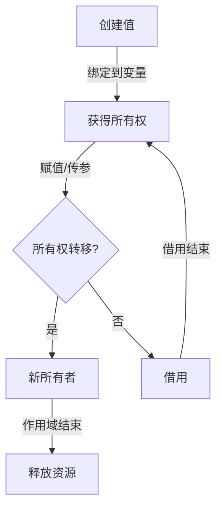
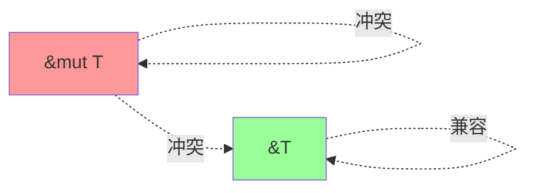
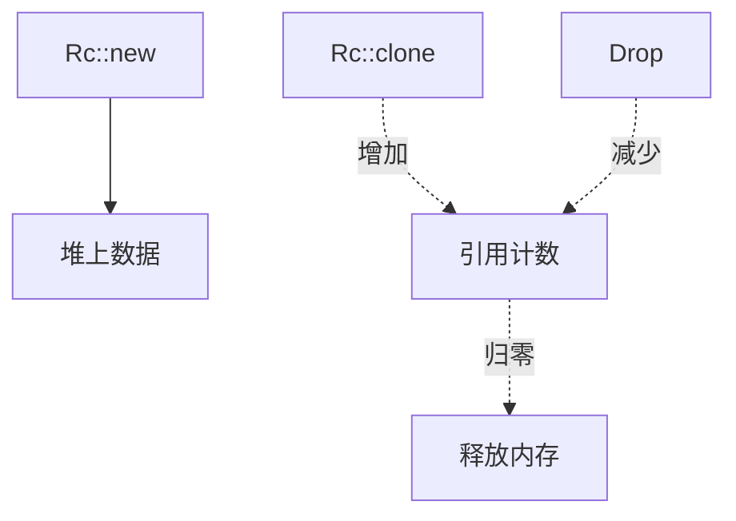

# 02.1 所有权系统

## 02.1.1 概述

**所有权 (Ownership)** 是Rust最核心的创新，它在编译时保证内存安全，无需垃圾回收器。所有权系统通过一套严格的规则在编译期追踪资源的生命周期。

### 02.1.1.1 核心原则

| 原则 | 说明 |
|------|------|
| 唯一所有权 | 每个值有且只有一个所有者 |
| 移动语义 | 赋值时所有权转移，原所有者失效 |
| 作用域释放 | 所有者离开作用域时，值被释放 |

### 02.1.1.2 内存安全保证

- **无悬垂指针**：编译器阻止引用失效数据
- **无双重释放**：所有权确保只有一个释放点
- **无内存泄漏**：RAII模式确保资源释放



---

## 02.1.2 所有权规则

### 02.1.2.1 形式化定义

**定义 02.1.1 (所有权状态)**

对于值 $v$ 和变量 $x$，定义所有权状态：

$$
\text{own}(v, x) \iff x \text{ 是 } v \text{ 的当前所有者}
$$

**所有权公理**

1. **唯一性**：$\forall v. \exists! x. \text{own}(v, x) \lor v \text{ 已被释放}$
2. **移动**：$\text{own}(v, x) \land (y = x) \Rightarrow \text{own}(v, y) \land \neg\text{own}(v, x)$
3. **释放**：$\text{own}(v, x) \land x \text{ 离开作用域} \Rightarrow v \text{ 被释放}$

### 02.1.2.2 移动语义示例

```rust
fn main() {
    let s1 = String::from("hello");  // s1 获得所有权
    let s2 = s1;                      // 所有权移动到 s2

    // println!("{}", s1);            // 错误：s1 已失效
    println!("{}", s2);               // OK：s2 是有效所有者
} // s2 离开作用域，String 被释放
```

**内存模型可视化**

```
步骤 1: let s1 = String::from("hello");

栈:           堆:
┌─────────┐   ┌─────────┬─────────┐
│ s1      │──▶│ ptr     │ ────────┼──▶ "hello"
│ len: 5  │   │ len: 5  │
│ cap: 5  │   │ cap: 5  │
└─────────┘   └─────────┴─────────┘

步骤 2: let s2 = s1;

栈:           堆:
┌─────────┐   ┌─────────┬─────────┐
│ s1      │   │ ptr     │ ────────┼──▶ "hello"
│ (无效)  │   │ len: 5  │    ▲
├─────────┤   │ cap: 5  │    │
│ s2      │──▶└─────────┴────┘
│ len: 5  │
│ cap: 5  │
└─────────┘
```

### 02.1.2.3 Copy类型

**定义 02.1.2 (Copy特征)**

实现 `Copy` trait 的类型具有复制语义而非移动语义：

```rust
// 标量类型自动实现Copy
trait Copy: Clone {}

impl Copy for i8/i16/i32/i64/isize {}
impl Copy for u8/u16/u32/u64/usize {}
impl Copy for f32/f64 {}
impl Copy for bool {}
impl Copy for char {}
impl Copy for () {}
impl<T: Copy, const N: usize> Copy for [T; N] {}
impl<T: Copy> Copy for Option<T> {}
impl<T: Copy, E: Copy> Copy for Result<T, E> {}
```

```rust
fn main() {
    let x = 5;           // i32 实现 Copy
    let y = x;           // x 被复制，不是移动

    println!("x = {}, y = {}", x, y);  // OK：两者都有效
}
```

---

## 02.1.3 借用 (Borrowing)

### 02.1.3.1 不可变借用

**定义 02.1.3 (不可变引用)**

不可变引用 `&T` 允许只读访问，无所有权转移。

```rust
fn main() {
    let s = String::from("hello");

    let len = calculate_length(&s);  // 借用 s

    println!("'{}' 的长度是 {}", s, len);  // OK：s 仍有效
}

fn calculate_length(s: &String) -> usize {
    s.len()
} // s 离开作用域，但所有权不返回（从未获得）
```

### 02.1.3.2 可变借用

**定义 02.1.4 (可变引用)**

可变引用 `&mut T` 允许修改，但受严格限制：

```rust
fn main() {
    let mut s = String::from("hello");

    change(&mut s);

    println!("{}", s);  // "hello, world"
}

fn change(s: &mut String) {
    s.push_str(", world");
}
```

### 02.1.3.3 借用规则

**定理 02.1.1 (借用约束)**

在任意作用域内：

1. 可以有一个可变引用 **或** 任意数量的不可变引用
2. 引用必须总是有效的

```rust
let mut s = String::from("hello");

let r1 = &s;     // OK：不可变引用
let r2 = &s;     // OK：多个不可变引用
// let r3 = &mut s;  // 错误：不能同时有可变和不可变引用

println!("{} {}", r1, r2);  // r1, r2 最后一次使用

let r3 = &mut s;  // OK：r1, r2 不再使用
```



---

## 02.1.4 生命周期

### 02.1.4.1 生命周期注解

**定义 02.1.5 (生命周期)**

生命周期 `'a` 表示引用的有效范围：

```rust
// 显式生命周期注解
fn longest<'a>(x: &'a str, y: &'a str) -> &'a str {
    if x.len() > y.len() { x } else { y }
}

// 生命周期省略规则
fn first_word(s: &str) -> &str { ... }
// 等价于：
fn first_word<'a>(s: &'a str) -> &'a str { ... }
```

### 02.1.4.2 生命周期省略规则

1. **每个引用参数有自己的生命周期**：

   ```rust
   fn foo(x: &i32, y: &i32) → fn foo<'a, 'b>(x: &'a i32, y: &'b i32)
   ```

2. **只有一个输入生命周期时，它赋给所有输出生命周期**：

   ```rust
   fn foo(x: &i32) -> &i32 → fn foo<'a>(x: &'a i32) -> &'a i32
   ```

3. **多个输入生命周期但一个是&self或&mut self，self的生命周期赋给输出**：

   ```rust
   fn foo(&self, x: &T) -> &U → fn foo<'a, 'b>(&'a self, x: &'b T) -> &'a U
   ```

### 02.1.4.3 生命周期界限

```rust
// 'static 生命周期
let s: &'static str = "永远有效";  // 编译时常量

// 结构体生命周期
struct ImportantExcerpt<'a> {
    part: &'a str,  // part 不能比结构体活得长
}

impl<'a> ImportantExcerpt<'a> {
    fn level(&self) -> i32 { 3 }

    // 返回生命周期与self相同
    fn announce_and_return_part(&self, announcement: &str) -> &str {
        println!("注意：{}", announcement);
        self.part
    }
}
```

---

## 02.1.5 形式化模型

### 02.1.5.1 RustBelt核心思想

RustBelt使用**Iris框架**形式化证明Rust类型系统的安全性：

**定义 02.1.6 (资源代数)**

资源 $(\mathcal{R}, \cdot, \varepsilon)$ 满足：

- 结合律：$(a \cdot b) \cdot c = a \cdot (b \cdot c)$
- 单位元：$\varepsilon \cdot a = a \cdot \varepsilon = a$
- 交换律：$a \cdot b = b \cdot a$

**所有权表示**

```
Own(ℓ, v)          -- 拥有位置ℓ，存储值v
Shared(ℓ, P)       -- 共享读取权限，满足谓词P
Mutable(ℓ, P)      -- 独占写入权限，满足谓词P
```

### 02.1.5.2 借用展开

```rust
// 源码
let mut x = 0;
let r = &mut x;
*r = 1;
println!("{}", x);
```

形式化表示：

```
1. 创建 Mutable(x, λv. v: i32)
2. 绑定 r 到 &mut x
3. *r = 1 展开为：
   - 获得 Mutable(x, λv. True)
   - 写入 1
   - 释放 Mutable(x, λv. v = 1)
4. 检查 x 满足后置条件
```

---

## 02.1.6 智能指针与所有权

### 02.1.6.1 Box<T>

**堆分配，单一所有权**：

```rust
let b = Box::new(5);  // 在堆上分配
println!("{}", b);     // 解引用
// b 离开作用域时自动释放
```

### 02.1.6.2 Rc<T> — 引用计数

**共享所有权**：

```rust
use std::rc::Rc;

let data = Rc::new(String::from("共享数据"));
let data2 = Rc::clone(&data);  // 引用计数+1
let data3 = Rc::clone(&data);  // 引用计数+1

println!("引用计数: {}", Rc::strong_count(&data));  // 3

// data, data2, data3 离开作用域时，计数归零才释放
```



### 02.1.6.3 RefCell<T> — 内部可变性

**运行时借用检查**：

```rust
use std::cell::RefCell;

let cell = RefCell::new(5);

{
    let mut v = cell.borrow_mut();  // 获得可变借用
    *v += 1;
} // 借用结束

println!("{}", cell.borrow());  // 6

// 运行时panic，不是编译错误：
// let mut v1 = cell.borrow_mut();
// let v2 = cell.borrow();  // panic!
```

---

## 02.1.7 常见模式

### 02.1.7.1 RAII模式

```rust
struct FileGuard {
    fd: RawFd,
}

impl FileGuard {
    fn open(path: &str) -> io::Result<Self> {
        let fd = unsafe { libc::open(...) };
        if fd < 0 {
            return Err(...);
        }
        Ok(FileGuard { fd })
    }
}

impl Drop for FileGuard {
    fn drop(&mut self) {
        unsafe { libc::close(self.fd); }
    }
}

// 使用
{
    let file = FileGuard::open("test.txt")?;
    // 使用 file
} // 自动调用 drop，关闭文件描述符
```

### 02.1.7.2 迭代器与所有权

```rust
let v = vec![1, 2, 3];

// into_iter: 消费所有权
for x in v.into_iter() {
    println!("{}", x);
}
// v 不再可用

let v = vec![1, 2, 3];
// iter: 不可变借用
for x in v.iter() {
    println!("{}", x);
}
// v 仍可用

// iter_mut: 可变借用
for x in v.iter_mut() {
    *x *= 2;
}
```

---

## 02.1.8 练习

1. 实现一个带生命周期的链表
2. 使用 `Rc<RefCell<T>>` 构建双向链表
3. 分析以下代码的生命周期：

   ```rust
   fn return_str() -> &str {
       let s = String::from("hello");
       &s
   }
   ```

4. 为自定义类型实现 `Copy` trait，分析安全性

---

## 02.1.9 参考文献与交叉引用

- [02.2 类型系统](./02.2_类型系统.md) —— Trait系统与泛型
- [02.3 内存安全形式化](./02.3_内存安全形式化.md) —— 形式化验证
- [02.4 Rust与线性类型](./02.4_Rust与线性类型.md) —— 线性类型理论基础
- [Rust Book] "Ownership and Borrowing"
- [RustBelt] "RustBelt: Securing the Foundations of the Rust Programming Language" (Jung et al., 2018)
- [Stacked Borrows] "Stacked Borrows: An Aliasing Model for Rust" (Jung, 2020)
