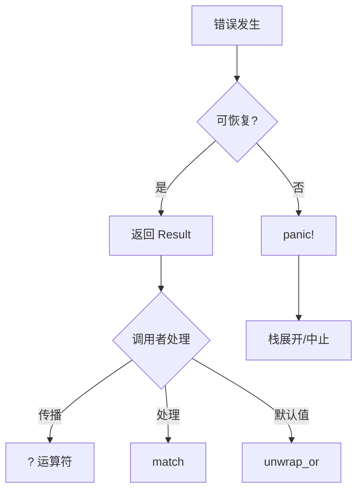

# 1. Rust 错误处理

## 目录

- [1. Rust 错误处理](#1-rust-错误处理)
  - [目录](#目录)
  - [1.1 错误处理哲学](#11-错误处理哲学)
    - [1.1.1 错误分类](#111-错误分类)
    - [1.1.2 错误处理原则](#112-错误处理原则)
  - [1.2 Result 类型](#12-result-类型)
    - [1.2.1 Result 定义](#121-result-定义)
    - [1.2.2 Result 方法](#122-result-方法)
    - [1.2.3 组合操作](#123-组合操作)
  - [1.3 Option 类型](#13-option-类型)
    - [1.3.1 Option 定义](#131-option-定义)
    - [1.3.2 Option 与 Result 转换](#132-option-与-result-转换)
    - [1.3.3 Option 组合](#133-option-组合)
  - [1.4 ? 运算符](#14--运算符)
    - [1.4.1 ? 运算符基础](#141--运算符基础)
    - [1.4.2 ? 与 From trait](#142--与-from-trait)
    - [1.4.3 try 块（实验性）](#143-try-块实验性)
  - [1.5 自定义错误](#15-自定义错误)
    - [1.5.1 实现 Error trait](#151-实现-error-trait)
    - [1.5.2 thiserror 宏](#152-thiserror-宏)
    - [1.5.3 anyhow 库](#153-anyhow-库)
  - [1.6 错误处理模式](#16-错误处理模式)
    - [1.6.1 错误传播](#161-错误传播)
    - [1.6.2 错误恢复](#162-错误恢复)
    - [1.6.3 错误收集](#163-错误收集)
    - [1.6.4 形式化错误处理](#164-形式化错误处理)

## 1.1 错误处理哲学

### 1.1.1 错误分类

**定义 1.1.1**：Rust 将错误分为两类：

- **可恢复错误（Recoverable）**：程序可以处理的错误，如文件未找到
- **不可恢复错误（Unrecoverable）**：程序 bug，如数组越界

形式化定义：
$$
\text{Error} = \text{Recoverable} \cup \text{Unrecoverable}
$$

```rust
// 可恢复错误：使用 Result
fn read_file(path: &str) -> Result<String, io::Error> {
    fs::read_to_string(path)
}

// 不可恢复错误：使用 panic
fn get_element(arr: &[i32], index: usize) -> i32 {
    if index >= arr.len() {
        panic!("Index out of bounds!");  // 编程错误
    }
    arr[index]
}
```

### 1.1.2 错误处理原则

**原则 1.1.2**：

1. 库代码应返回 `Result`，让调用者决定如何处理
2. 使用 `panic!` 处理不可恢复的错误状态
3. 错误信息应清晰、有用、可操作



## 1.2 Result 类型

### 1.2.1 Result 定义

**定义 1.2.1**：`Result<T, E>` 表示可能失败的操作，包含成功值或错误。

形式化定义：
$$
\text{Result}\langle T, E \rangle = \text{Ok}(T) \mid \text{Err}(E)
$$

```rust
enum Result<T, E> {
    Ok(T),
    Err(E),
}
```

```rust
use std::fs::File;
use std::io::{self, Read};

fn read_username_from_file() -> Result<String, io::Error> {
    let f = File::open("hello.txt");

    let mut f = match f {
        Ok(file) => file,
        Err(e) => return Err(e),
    };

    let mut s = String::new();

    match f.read_to_string(&mut s) {
        Ok(_) => Ok(s),
        Err(e) => Err(e),
    }
}
```

### 1.2.2 Result 方法

```rust
fn result_methods() {
    let result: Result<i32, &str> = Ok(42);

    // unwrap：获取值或 panic
    let value = result.unwrap();  // 42

    // expect：带消息的 unwrap
    let value = result.expect("Should have a value");  // 42

    // unwrap_or：提供默认值
    let result: Result<i32, &str> = Err("error");
    let value = result.unwrap_or(0);  // 0

    // unwrap_or_else：惰性计算默认值
    let value = result.unwrap_or_else(|e| {
        println!("Error: {}", e);
        0
    });

    // map：转换成功值
    let result: Result<i32, &str> = Ok(5);
    let mapped = result.map(|x| x * 2);  // Ok(10)

    // map_err：转换错误
    let result: Result<i32, &str> = Err("error");
    let mapped = result.map_err(|e| e.to_uppercase());

    // and_then：链式操作
    let result: Result<i32, &str> = Ok(5);
    let result = result.and_then(|x| {
        if x > 0 {
            Ok(x * 2)
        } else {
            Err("non-positive")
        }
    });
}
```

### 1.2.3 组合操作

```rust
fn combinators_example() -> Result<i32, Box<dyn Error>> {
    let result1 = may_fail_1()?;
    let result2 = may_fail_2()?;

    // 使用组合子
    let result: Result<i32, _> = may_fail_1()
        .and_then(|x| {
            may_fail_2().map(|y| x + y)
        });

    // 或使用 ? 运算符
    let sum = may_fail_1()? + may_fail_2()?;

    Ok(sum)
}

fn may_fail_1() -> Result<i32, String> {
    Ok(10)
}

fn may_fail_2() -> Result<i32, String> {
    Ok(20)
}
```

## 1.3 Option 类型

### 1.3.1 Option 定义

**定义 1.3.1**：`Option<T>` 表示可能不存在的值。

形式化定义：
$$
\text{Option}\langle T \rangle = \text{Some}(T) \mid \text{None}
$$

```rust
enum Option<T> {
    Some(T),
    None,
}
```

```rust
fn option_examples() {
    let some_number: Option<i32> = Some(5);
    let absent_number: Option<i32> = None;

    // 模式匹配
    match some_number {
        Some(n) => println!("Number: {}", n),
        None => println!("No number"),
    }

    // if let
    if let Some(n) = some_number {
        println!("Number: {}", n);
    }
}
```

### 1.3.2 Option 与 Result 转换

```rust
fn conversions() {
    let option: Option<i32> = Some(5);

    // Option -> Result
    let result: Result<i32, &str> = option.ok_or("no value");

    // Result -> Option
    let result: Result<i32, &str> = Ok(5);
    let option: Option<i32> = result.ok();

    // 处理 None
    let value = option.unwrap_or(0);
    let value = option.unwrap_or_else(|| compute_default());

    // map
    let doubled = option.map(|x| x * 2);

    // and_then（flat_map）
    let result = option.and_then(|x| {
        if x > 0 { Some(x) } else { None }
    });
}

fn compute_default() -> i32 {
    42
}
```

### 1.3.3 Option 组合

```rust
fn option_combinators() {
    let a = Some(1);
    let b = Some(2);
    let c: Option<i32> = None;

    // zip：组合两个 Option
    let zipped = a.zip(b);  // Some((1, 2))

    // unzip：拆分
    let (x, y) = (Some(1), Some(2));
    let unzipped: Option<(i32, i32)> = x.zip(y);

    // filter
    let filtered = a.filter(|&x| x > 0);  // Some(1)

    // or / or_else
    let result = c.or(a);  // Some(1)
    let result = c.or_else(|| Some(3));  // Some(3)

    // xor
    let result = a.xor(b);  // None（两者都有值）
    let result = a.xor(c);  // Some(1)
}
```

## 1.4 ? 运算符

### 1.4.1 ? 运算符基础

**定义 1.4.1**：`?` 运算符用于传播错误，相当于 `match` 的简写。

形式化：
$$
expr? \equiv match \ expr \ { \ Ok(v) \Rightarrow v, \ Err(e) \Rightarrow return \ Err(e) \ }
$$

```rust
// 使用 match
fn read_username_match() -> Result<String, io::Error> {
    let mut f = match File::open("hello.txt") {
        Ok(file) => file,
        Err(e) => return Err(e),
    };

    let mut s = String::new();
    match f.read_to_string(&mut s) {
        Ok(_) => Ok(s),
        Err(e) => Err(e),
    }
}

// 使用 ? 运算符
fn read_username_ergonomic() -> Result<String, io::Error> {
    let mut f = File::open("hello.txt")?;
    let mut s = String::new();
    f.read_to_string(&mut s)?;
    Ok(s)
}

// 链式使用 ?
fn read_username_chained() -> Result<String, io::Error> {
    let mut s = String::new();
    File::open("hello.txt")?.read_to_string(&mut s)?;
    Ok(s)
}
```

### 1.4.2 ? 与 From trait

**定义 1.4.2**：`?` 运算符自动调用 `From::from` 进行错误转换。

```rust
use std::fs::File;
use std::io::{self, Read};
use std::num::ParseIntError;

#[derive(Debug)]
enum MyError {
    Io(io::Error),
    Parse(ParseIntError),
}

impl From<io::Error> for MyError {
    fn from(e: io::Error) -> MyError {
        MyError::Io(e)
    }
}

impl From<ParseIntError> for MyError {
    fn from(e: ParseIntError) -> MyError {
        MyError::Parse(e)
    }
}

fn read_and_parse() -> Result<i32, MyError> {
    let mut s = String::new();
    File::open("number.txt")?.read_to_string(&mut s)?;
    let n: i32 = s.trim().parse()?;  // 自动转换为 MyError
    Ok(n)
}
```

### 1.4.3 try 块（实验性）

```rust
// 使用闭包模拟 try 块
fn try_block_simulation() -> Result<i32, MyError> {
    (|| -> Result<i32, MyError> {
        let a = may_fail_a()?;
        let b = may_fail_b()?;
        Ok(a + b)
    })()
}

fn may_fail_a() -> Result<i32, MyError> {
    Ok(1)
}

fn may_fail_b() -> Result<i32, MyError> {
    Ok(2)
}
```

## 1.5 自定义错误

### 1.5.1 实现 Error trait

```rust
use std::error::Error;
use std::fmt;

#[derive(Debug)]
struct MyError {
    message: String,
}

impl fmt::Display for MyError {
    fn fmt(&self, f: &mut fmt::Formatter) -> fmt::Result {
        write!(f, "{}", self.message)
    }
}

impl Error for MyError {}

impl MyError {
    fn new(msg: &str) -> MyError {
        MyError {
            message: msg.to_string(),
        }
    }
}
```

### 1.5.2 thiserror 宏

```rust
use thiserror::Error;

#[derive(Error, Debug)]
enum DataStoreError {
    #[error("data store disconnected")]
    Disconnect(#[from] io::Error),

    #[error("the data for key `{0}` is not available")]
    Redaction(String),

    #[error("invalid header (expected {expected:?}, found {found:?})")]
    InvalidHeader {
        expected: String,
        found: String,
    },

    #[error("unknown data store error")]
    Unknown,
}
```

### 1.5.3 anyhow 库

```rust
use anyhow::{Context, Result};

fn get_cluster_info() -> Result<ClusterInfo> {
    let config = std::fs::read_to_string("cluster.json")
        .context("failed to read cluster config")?;

    let info: ClusterInfo = serde_json::from_str(&config)
        .context("failed to parse cluster config")?;

    Ok(info)
}
```

## 1.6 错误处理模式

### 1.6.1 错误传播

```rust
// 分层错误传播
fn high_level_operation() -> Result<Output, TopLevelError> {
    let data = fetch_data()?;
    let processed = process_data(data)?;
    let result = save_result(processed)?;
    Ok(result)
}

fn fetch_data() -> Result<Data, FetchError> { /* ... */ }
fn process_data(d: Data) -> Result<Processed, ProcessError> { /* ... */ }
fn save_result(p: Processed) -> Result<Output, SaveError> { /* ... */ }
```

### 1.6.2 错误恢复

```rust
fn error_recovery() -> Result<Data, Error> {
    // 尝试主要方法
    match try_primary() {
        Ok(data) => return Ok(data),
        Err(e) => log::warn!("Primary failed: {}", e),
    }

    // 尝试备选方法
    match try_fallback() {
        Ok(data) => return Ok(data),
        Err(e) => log::error!("Fallback failed: {}", e),
    }

    // 使用默认值
    Ok(default_data())
}
```

### 1.6.3 错误收集

```rust
fn collect_errors() -> Result<Vec<Output>, Vec<Error>> {
    let inputs = vec![1, 2, 3, 4, 5];
    let mut outputs = Vec::new();
    let mut errors = Vec::new();

    for input in inputs {
        match process(input) {
            Ok(output) => outputs.push(output),
            Err(e) => errors.push(e),
        }
    }

    if errors.is_empty() {
        Ok(outputs)
    } else {
        Err(errors)
    }
}
```

### 1.6.4 形式化错误处理

**定理 1.6.1**：Result 类型构成单子（Monad）。

形式化定义：
$$
\begin{align}
\text{return} &: T \rightarrow \text{Result}\langle T, E \rangle \\
\text{return}(x) &= \text{Ok}(x) \\
\text{bind} &: \text{Result}\langle T, E \rangle \times (T \rightarrow \text{Result}\langle U, E \rangle) \rightarrow \text{Result}\langle U, E \rangle \\
\text{bind}(r, f) &= \begin{cases}
f(x) & \text{if } r = \text{Ok}(x) \\
\text{Err}(e) & \text{if } r = \text{Err}(e)
\end{cases}
\end{align}
$$

```haskell
-- Haskell 风格的 Result Monad
instance Monad (Either e) where
    return = Right
    Left l >>= _ = Left l
    Right r >>= k = k r

-- Rust 对应
trait ResultMonad<T, E> {
    fn bind<U, F>(self, f: F) -> Result<U, E>
    where F: FnOnce(T) -> Result<U, E>;
}

impl<T, E> ResultMonad<T, E> for Result<T, E> {
    fn bind<U, F>(self, f: F) -> Result<U, E>
    where F: FnOnce(T) -> Result<U, E> {
        match self {
            Ok(t) => f(t),
            Err(e) => Err(e),
        }
    }
}
```

---

**参考文档**：

- [02.2_Rust类型系统](./02.2_Rust类型系统.md)
- [02.1_Rust所有权系统](./02.1_Rust所有权系统.md)
- [04.2_单子与函子](../04_函数式编程/04.2_单子与函子.md)
