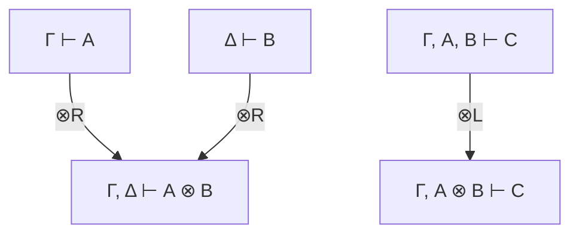

# 02.4 Rust与线性类型

---

📌 **内容摘要**

本文档深入探讨Rust与线性类型的核心原理和关键方法。内容涵盖Rust语言领域的主要知识点，包括类型论, 类型推断, 类型系统, 借用检查等关键主题。适合具备相关基础的学习者进行深入研究。

**关键词**: 类型论, Rust语言, 类型推断, 类型系统, 借用检查, 所有权, Rust

📚 **学习目标**

- 深入理解Rust与线性类型的理论体系和形式化方法
- 能够进行相关定理的形式化证明
- 建立该领域的系统性知识框架

🎯 **难度级别**: 高级

⏱️ **预计阅读时间**: 15分钟

**前置知识**: 该领域的中级知识, 形式化方法基础

---


## 02.4.1 概述

**线性类型 (Linear Types)** 要求值必须被**恰好使用一次**。Rust的所有权系统是线性类型的**仿射变体**（值可使用0次或1次）。

### 02.4.1.1 类型系统分类

| 类型系统 | 使用次数 | 示例 |
|----------|----------|------|
| 常规类型 | 任意 | `i32`, `String`（复制后） |
| 仿射类型 | 0或1次 | Rust所有权类型 |
| 线性类型 | 恰好1次 | 纯线性类型系统 |
| 相关类型 | 依赖值 | 数组长度 |

### 02.4.1.2 线性逻辑

**线性逻辑**由Girard (1987) 提出，区别于经典逻辑：

| 逻辑 | 结构规则 | 含义 |
|------|----------|------|
| 经典逻辑 | 弱化、收缩、交换 | 真理永恒 |
| 线性逻辑 | 仅交换 | 资源消耗 |

```
线性蕴含 A ⊸ B：消耗A，产生B
经典蕴含 A → B：A成立则B成立
```

---

## 02.4.2 线性逻辑基础

### 02.4.2.1 连接词

**乘法连接词**

$$
\begin{aligned}
A \otimes B &\quad \text{张量积：同时使用A和B} \\
A ⅋ B &\quad \text{par：任选其一} \\
1 &\quad \text{单位元：无资源} \\
\bot &\quad \text{对偶单位元}
\end{aligned}
$$

**加法连接词**

$$
\begin{aligned}
A \& B &\quad \text{with：外部选择} \\
A \oplus B &\quad \text{oplus：内部选择} \\
\top &\quad \text{顶部：可满足任何需求} \\
0 &\quad \text{底部：无法满足}
\end{aligned}
$$

**模态**

$$
\begin{aligned}
!A &\quad \text{of course：可复制的资源} \\
?A &\quad \text{why not：可丢弃的责任}
\end{aligned}
$$

### 02.4.2.2  sequent演算

$$
\frac{\Gamma \vdash A \quad \Delta \vdash B}{\Gamma, \Delta \vdash A \otimes B} \otimes_R
$$

$$
\frac{\Gamma, A, B \vdash C}{\Gamma, A \otimes B \vdash C} \otimes_L
$$



---

## 02.4.3 Rust作为仿射类型系统

### 02.4.3.1 所有权即线性性

```rust
// 线性使用
let s = String::from("hello");  // 获得资源
let s2 = s;                      // 转移所有权（移动）
// s 不再可用

// 非线性使用（复制）
let n = 5;
let n2 = n;  // 复制，不是移动
// n 仍然可用（因为 i32: Copy）
```

**形式化对应**

| Rust概念 | 线性逻辑 |
|----------|----------|
| 所有权转移 | $A \vdash B$（消耗A产生B） |
| 借用 | $!A \multimap B$（临时访问） |
| Drop | 隐式线性解构 |
| Copy | $!A$（可复制资源） |

### 02.4.3.2 借用作为线性模态

```rust
// &T 对应 !A（可共享）
// &mut T 对应 A（独占）

fn share<T>(x: &T) { }  // !A ⊸ ()
fn consume<T>(x: T) { } // A ⊸ ()
```

### 02.4.3.3 类型状态模式

```rust
// 线性类型实现协议状态机
struct OpenFile;
struct ClosedFile;

struct File<State> {
    fd: i32,
    _state: PhantomData<State>,
}

impl File<ClosedFile> {
    fn open(path: &str) -> File<OpenFile> { ... }
}

impl File<OpenFile> {
    fn read(&mut self, buf: &mut [u8]) -> usize { ... }
    fn close(self) -> File<ClosedFile> { ... }  // 消耗self
}

// 使用
let file = File::open("test.txt");
let mut buf = [0u8; 1024];
file.read(&mut buf);
let file = file.close();
// file.read(...);  // 编译错误！
```

---

## 02.4.4 纯线性类型系统

### 02.4.4.1 Haskell Linear Types扩展

```haskell
{-# LANGUAGE LinearTypes #-}

-- 线性函数类型
consume :: a %1 -> ()  -- %1 表示线性使用
consume x = ()

-- 非线性函数
discard :: a -> ()     -- 可忽略参数
discard _ = ()

-- 数据类型
data File %1 where
    File :: Int %1 -> File

open :: String -> File
close :: File %1 -> ()

-- 使用示例
process :: String %1 -> ()
process path =
    let file = open path
    in consumeFile file
  where
    consumeFile :: File %1 -> ()
    consumeFile f = close f
```

### 02.4.4.2 线性类型编码

```haskell
-- 线性对（必须同时使用两个分量）
data Pair a b where
    Pair :: a %1 -> b %1 -> Pair a b

-- 线性Either（必须处理两个分支）
data Either' a b where
    Left'  :: a %1 -> Either' a b
    Right' :: b %1 -> Either' a b

-- 线性列表（必须遍历所有元素）
data List a where
    Nil  :: List a
    Cons :: a %1 -> List a %1 -> List a
```

---

## 02.4.5 资源管理与RAII

### 02.4.5.1 线性资源管理

```rust
// 线性保证：资源必须被显式处理
struct DatabaseConnection {
    conn_id: u64,
}

impl DatabaseConnection {
    fn new() -> Self {
        // 建立连接
        Self { conn_id: alloc_conn() }
    }

    fn query(self, sql: &str) -> QueryResult<Self> {
        // 执行查询，返回结果和新状态
        QueryResult { conn: self }
    }

    fn close(self) {
        // 显式关闭
        free_conn(self.conn_id);
    }
}

struct QueryResult<C> {
    conn: C,
}

impl<C> QueryResult<C> {
    fn commit(self) -> C {
        // 提交事务，返回连接
        self.conn
    }
}

// 使用：强制正确处理
let conn = DatabaseConnection::new();
let result = conn.query("SELECT * FROM users");
let conn = result.commit();
conn.close();  // 必须调用
```

### 02.4.5.2 线性类型与错误处理

```rust
enum Result<T, E> {
    Ok(T),
    Err(E),
}

// 线性使用要求处理所有情况
fn process() -> Result<(), Error> {
    let resource = acquire()?;  // 若失败，无资源泄漏

    let result = do_work(resource)?;

    // 必须显式处理
    match result {
        Ok(data) => {
            save(data)?;
            Ok(())
        }
        Err(e) => {
            // 清理资源
            cleanup();
            Err(e)
        }
    }
}
```

---

## 02.4.6 形式化对应

### 02.4.6.1 Curry-Howard对应

```
逻辑          类型          程序
────────────────────────────────────────
A ⊸ B        A %1 -> B    线性函数
A ⊗ B        (A, B)       对（同时）
A & B        未直接支持   外部选择
A ⊕ B        Either A B   内部选择
!A           Copy A       可复制类型
```

### 02.4.6.2 线性类型规则

```lean4
-- 线性上下文分离
inductive LinearTy : Type
  | unit : LinearTy
  | tensor : LinearTy → LinearTy → LinearTy  -- ⊗
  | lolli : LinearTy → LinearTy → LinearTy   -- ⊸
  | bang : LinearTy → LinearTy               -- !

-- 线性判断：Γ ⊢ e : A
-- Γ中的每个变量必须恰好使用一次
inductive LinearHasType : LinearCtx → LinearExpr → LinearTy → Prop
  | t_var {x A} :
      LinearHasType [(x, A)] (.var x) A

  | t_lam {Γ x e A B}
      (h : LinearHasType ((x, A) :: Γ) e B) :
      LinearHasType Γ (.lam x e) (.lolli A B)

  | t_app {Γ1 Γ2 e1 e2 A B}
      (h1 : LinearHasType Γ1 e1 (.lolli A B))
      (h2 : LinearHasType Γ2 e2 A)
      (hdisj : Disjoint Γ1 Γ2) :
      LinearHasType (Γ1 ++ Γ2) (.app e1 e2) B

  | t_tensor {Γ1 Γ2 e1 e2 A B}
      (h1 : LinearHasType Γ1 e1 A)
      (h2 : LinearHasType Γ2 e2 B)
      (hdisj : Disjoint Γ1 Γ2) :
      LinearHasType (Γ1 ++ Γ2) (.pair e1 e2) (.tensor A B)

  | t_bang {Γ e A}
      (h : NonLinear Γ)  -- Γ中无线性资源
      (h2 : LinearHasType Γ e A) :
      LinearHasType Γ (.bang e) (.bang A)
```

---

## 02.4.7 高级应用

### 02.4.7.1 会话类型

```rust
// 线性通道实现会话类型
struct Send<T, S>(PhantomData<(T, S)>);
struct Recv<T, S>(PhantomData<(T, S)>);
struct End;

struct Channel<S> {
    inner: RawChannel,
    _state: PhantomData<S>,
}

impl<T, S> Channel<Send<T, S>> {
    fn send(self, value: T) -> Channel<S> {
        self.inner.send(value);
        Channel {
            inner: self.inner,
            _state: PhantomData
        }
    }
}

impl<T, S> Channel<Recv<T, S>> {
    fn recv(self) -> (T, Channel<S>) {
        let value = self.inner.recv();
        (value, Channel {
            inner: self.inner,
            _state: PhantomData
        })
    }
}

// 协议定义
type ClientProtocol = Send<String, Recv<i32, End>>;
type ServerProtocol = Recv<String, Send<i32, End>>;

fn client(ch: Channel<ClientProtocol>) {
    let ch = ch.send("query".to_string());
    let (result, ch) = ch.recv();
    println!("{}", result);
    // ch 必须被消耗，协议完成
}
```

### 02.4.7.2 唯一引用

```rust
// 编译时保证唯一性
struct Unique<T> {
    ptr: NonNull<T>,
    _marker: PhantomData<T>,
}

impl<T> Unique<T> {
    fn new(ptr: *mut T) -> Option<Self> {
        NonNull::new(ptr).map(|nn| Self {
            ptr: nn,
            _marker: PhantomData,
        })
    }

    // 获取引用（消费所有权）
    fn as_mut(&mut self) -> &mut T {
        unsafe { self.ptr.as_mut() }
    }

    // 转换为Box（转移所有权）
    fn into_box(self) -> Box<T> {
        unsafe { Box::from_raw(self.ptr.as_ptr()) }
    }
}

// 线性使用
let unique = Unique::new(Box::into_raw(Box::new(5))).unwrap();
// 无法复制 unique
let boxed = unique.into_box();  // unique 被消耗
```

---

## 02.4.8 练习

1. 实现一个线性类型的文件句柄，强制调用close
2. 用类型状态模式实现TCP连接状态机
3. 比较Rust所有权与纯线性类型的表达能力

---

## 02.4.9 参考文献与交叉引用

- [02.1 所有权系统](./02.1_所有权系统.md)
- [02.3 内存安全形式化](./02.3_内存安全形式化.md)
- [Girard, 1987] "Linear Logic"
- [Wadler, 1990] "Linear Types can Change the World"
- [Bernardy et al., 2018] "Linear Haskell: Practical Linearity in a Higher-Order Polymorphic Language"

---

## 📋 前置知识

- [02.4 类型论与逻辑](../../02_形式语言/02_类型论/02.4_类型论与逻辑.md)

---

## 📚 延伸阅读

- [11.2 系统分类](../../11_系统科学/01_一般系统论/01.2_系统分类.md)
- [1. Rust 所有权系统](../02_Rust语言深入/02.1_Rust所有权系统.md)
- [02.1 所有权系统](../02_Rust语言深入/02.1_所有权系统.md)
- [02.3 内存安全形式化](../02_Rust语言深入/02.3_内存安全形式化.md)
