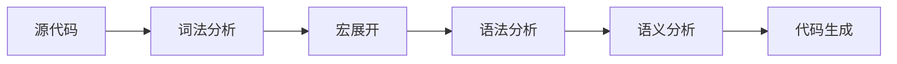

# 1. Rust 宏系统

---

📌 **内容摘要**

本文档深入探讨Rust 宏系统的核心原理和关键方法。内容涵盖Rust语言领域的主要知识点，包括相关理论、方法及应用。适合具备相关基础的学习者进行深入研究。

**关键词**: Rust语言

📚 **学习目标**
- 深入理解Rust 宏系统的理论体系和形式化方法
- 能够进行相关定理的形式化证明
- 建立该领域的系统性知识框架

🎯 **难度级别**: 高级

⏱️ **预计阅读时间**: 15分钟

**前置知识**: 该领域的中级知识, 形式化方法基础

---


## 目录

- [1. Rust 宏系统](#1-rust-宏系统)
  - [目录](#目录)
  - [1.1 宏系统概述](#11-宏系统概述)
  - [1.2 声明宏](#12-声明宏)
    - [1.2.1 macro\_rules! 基础](#121-macro_rules-基础)
    - [1.2.2 模式匹配](#122-模式匹配)
    - [1.2.3 重复模式](#123-重复模式)
    - [1.2.4 递归宏](#124-递归宏)
    - [1.2.5 高级声明宏](#125-高级声明宏)
  - [1.3 过程宏](#13-过程宏)
    - [1.3.1 过程宏基础](#131-过程宏基础)
    - [1.3.2 Token 操作](#132-token-操作)
  - [1.4 派生宏](#14-派生宏)
    - [1.4.1 自定义 Derive](#141-自定义-derive)
    - [1.4.2 使用派生宏](#142-使用派生宏)
  - [1.5 属性宏](#15-属性宏)
    - [1.5.1 自定义属性](#151-自定义属性)
    - [1.5.2 使用属性宏](#152-使用属性宏)
  - [1.6 函数式宏](#16-函数式宏)
    - [1.6.1 自定义函数宏](#161-自定义函数宏)
    - [1.6.2 使用函数宏](#162-使用函数宏)
  - [1.7 宏编程最佳实践](#17-宏编程最佳实践)
    - [1.7.1 宏设计原则](#171-宏设计原则)
    - [1.7.2 调试宏](#172-调试宏)
    - [1.7.3 宏的形式化](#173-宏的形式化)

## 1.1 宏系统概述

**定义 1.1.1**：宏（Macro）是元编程的工具，在编译期进行代码转换。

形式化定义：
$$
\text{Macro}: \text{TokenStream} \rightarrow \text{TokenStream}
$$



**定义 1.1.2**：Rust 宏的分类：

- **声明宏（Declarative Macros）**：`macro_rules!`
- **过程宏（Procedural Macros）**：
  - 派生宏（Derive Macros）
  - 属性宏（Attribute Macros）
  - 函数式宏（Function-like Macros）

## 1.2 声明宏

### 1.2.1 macro_rules! 基础

**定义 1.2.1**：声明宏使用模式匹配进行代码生成。

```rust
// 简单的 vec! 宏
macro_rules! my_vec {
    // 匹配逗号分隔的表达式
    ($($x:expr),*) => {
        {
            let mut temp_vec = Vec::new();
            $(
                temp_vec.push($x);
            )*
            temp_vec
        }
    };
}

// 使用
fn use_macro() {
    let v = my_vec![1, 2, 3];
    println!("{:?}", v);
}
```

### 1.2.2 模式匹配

```rust
macro_rules! complex_patterns {
    // 单个值
    ($x:expr) => {
        println!("Single: {}", $x);
    };

    // 多个值
    ($($x:expr),+ $(,)?) => {
        $(
            println!("Value: {}", $x);
        )+
    };

    // 键值对
    ($($key:ident => $value:expr),* $(,)?) => {
        $(
            println!("{} => {}", stringify!($key), $value);
        )*
    };
}

fn pattern_examples() {
    complex_patterns!(42);
    complex_patterns!(1, 2, 3);
    complex_patterns!(name => "Alice", age => 30);
}
```

### 1.2.3 重复模式

**定义 1.2.2**：重复操作符：

- `*`：零次或多次
- `+`：一次或多次
- `?`：零次或一次

```rust
macro_rules! calculate {
    // 累加
    (sum $($x:expr),*) => {
        {
            let mut result = 0;
            $(
                result += $x;
            )*
            result
        }
    };

    // 构建哈希表
    (map {$($key:expr => $value:expr),* $(,)?}) => {
        {
            let mut map = ::std::collections::HashMap::new();
            $(
                map.insert($key, $value);
            )*
            map
        }
    };
}

fn repetition_examples() {
    let sum = calculate!(sum 1, 2, 3, 4, 5);
    println!("Sum: {}", sum);

    let map = calculate!(map {
        "a" => 1,
        "b" => 2,
    });
    println!("{:?}", map);
}
```

### 1.2.4 递归宏

```rust
macro_rules! vec_of_strings {
    // 基础情况
    () => {
        Vec::new()
    };

    // 递归情况
    ($first:expr $(, $rest:expr)*) => {
        {
            let mut v = vec_of_strings!($($rest),*);
            v.push($first.to_string());
            v
        }
    };
}

fn recursive_macro() {
    let v = vec_of_strings!("a", "b", "c");
    println!("{:?}", v);
}
```

### 1.2.5 高级声明宏

```rust
// 实现类似 vec! 的完整功能
macro_rules! vector {
    // vec![elem; len]
    ($elem:expr; $n:expr) => {
        ::std::vec::from_elem($elem, $n)
    };

    // vec![a, b, c]
    ($($x:expr),+ $(,)?) => {
        <[_]>::into_vec(Box::new([$($x),+]))
    };

    // vec![]
    () => {
        Vec::new()
    };
}

// 实现类似 println! 的宏
macro_rules! log {
    // log!(target: "module", level: Level::Info, "message")
    (target: $target:expr, $lvl:expr, $($arg:tt)+) => {
        {
            use ::std::io::Write;
            let _ = writeln!(
                ::std::io::stderr(),
                "[{}][{}] {}",
                $target,
                $lvl,
                format!($($arg)+)
            );
        }
    };

    // log!(Level::Info, "message")
    ($lvl:expr, $($arg:tt)+) => {
        log!(target: module_path!(), $lvl, $($arg)+)
    };
}
```

## 1.3 过程宏

### 1.3.1 过程宏基础

**定义 1.3.1**：过程宏接收 TokenStream，输出 TokenStream，使用 Rust 代码操作。

```rust
// Cargo.toml 依赖
// [dependencies]
// proc-macro2 = "1.0"
// quote = "1.0"
// syn = { version = "2.0", features = ["full"] }

use proc_macro::TokenStream;
use quote::quote;
use syn::{parse_macro_input, DeriveInput};

#[proc_macro_derive(MyDerive)]
pub fn my_derive(input: TokenStream) -> TokenStream {
    let input = parse_macro_input!(input as DeriveInput);

    let name = input.ident;
    let expanded = quote! {
        impl #name {
            fn hello(&self) {
                println!("Hello from {}", stringify!(#name));
            }
        }
    };

    TokenStream::from(expanded)
}
```

### 1.3.2 Token 操作

```rust
use proc_macro2::{Ident, Span, TokenStream};
use quote::{format_ident, quote};

fn token_manipulation() {
    // 创建标识符
    let name = format_ident!("MyStruct");

    // 构建代码
    let tokens: TokenStream = quote! {
        struct #name {
            field: i32,
        }

        impl #name {
            fn new() -> Self {
                Self { field: 0 }
            }
        }
    };

    println!("{}", tokens);
}
```

## 1.4 派生宏

### 1.4.1 自定义 Derive

```rust
use proc_macro::TokenStream;
use quote::quote;
use syn::{parse_macro_input, Data, DeriveInput, Fields};

#[proc_macro_derive(Builder)]
pub fn derive_builder(input: TokenStream) -> TokenStream {
    let input = parse_macro_input!(input as DeriveInput);
    let name = input.ident;
    let builder_name = format_ident!("{}Builder", name);

    let fields = match input.data {
        Data::Struct(data) => match data.fields {
            Fields::Named(fields) => fields.named,
            _ => panic!("Only named fields are supported"),
        },
        _ => panic!("Only structs are supported"),
    };

    let builder_fields = fields.iter().map(|f| {
        let name = &f.ident;
        let ty = &f.ty;
        quote! { #name: Option<#ty> }
    });

    let builder_methods = fields.iter().map(|f| {
        let name = &f.ident;
        let ty = &f.ty;
        quote! {
            pub fn #name(mut self, value: #ty) -> Self {
                self.#name = Some(value);
                self
            }
        }
    });

    let build_fields = fields.iter().map(|f| {
        let name = &f.ident;
        quote! {
            #name: self.#name.ok_or(concat!(stringify!(#name), " is not set"))?
        }
    });

    let expanded = quote! {
        pub struct #builder_name {
            #(#builder_fields,)*
        }

        impl #builder_name {
            pub fn new() -> Self {
                Self {
                    #(#name: None,)*
                }
            }

            #(#builder_methods)*

            pub fn build(self) -> Result<#name, Box<dyn std::error::Error>> {
                Ok(#name {
                    #(#build_fields,)*
                })
            }
        }

        impl #name {
            pub fn builder() -> #builder_name {
                #builder_name::new()
            }
        }
    };

    TokenStream::from(expanded)
}
```

### 1.4.2 使用派生宏

```rust
// 使用生成的 Builder
#[derive(Builder)]
struct Command {
    executable: String,
    args: Vec<String>,
    current_dir: String,
}

fn use_builder() {
    let cmd = Command::builder()
        .executable("cargo".to_string())
        .args(vec!["build".to_string(), "--release".to_string()])
        .current_dir(".".to_string())
        .build()
        .unwrap();
}
```

## 1.5 属性宏

### 1.5.1 自定义属性

```rust
use proc_macro::TokenStream;
use quote::quote;
use syn::{parse_macro_input, ItemFn};

#[proc_macro_attribute]
pub fn timed(attr: TokenStream, item: TokenStream) -> TokenStream {
    let input_fn = parse_macro_input!(item as ItemFn);
    let fn_name = &input_fn.sig.ident;
    let fn_body = &input_fn.block;
    let fn_vis = &input_fn.vis;
    let fn_sig = &input_fn.sig;

    // 解析属性参数
    let label = if attr.is_empty() {
        format!("{}", fn_name)
    } else {
        attr.to_string()
    };

    let expanded = quote! {
        #fn_vis #fn_sig {
            let __start = ::std::time::Instant::now();
            let __result = #fn_body;
            let __elapsed = __start.elapsed();
            println!("[{}] took {:?}", #label, __elapsed);
            __result
        }
    };

    TokenStream::from(expanded)
}
```

### 1.5.2 使用属性宏

```rust
// 使用 timed 属性
#[timed("expensive operation")]
fn expensive_computation() -> i32 {
    let mut sum = 0;
    for i in 0..1_000_000 {
        sum += i;
    }
    sum
}

#[timed]
fn another_function() {
    std::thread::sleep(std::time::Duration::from_millis(100));
}
```

## 1.6 函数式宏

### 1.6.1 自定义函数宏

```rust
use proc_macro::TokenStream;
use quote::quote;
use syn::{parse::Parser, punctuated::Punctuated, Expr, Token};

#[proc_macro]
pub fn sql(input: TokenStream) -> TokenStream {
    // 解析 SQL 语句
    let parser = Punctuated::<Expr, Token![,]>::parse_terminated;
    let exprs = parser.parse(input).unwrap();

    let query_parts: Vec<_> = exprs.iter().map(|expr| {
        quote! { #expr }
    }).collect();

    let expanded = quote! {
        {
            let mut query = String::new();
            #(query.push_str(&format!("{}", #query_parts));)*
            query
        }
    };

    TokenStream::from(expanded)
}
```

### 1.6.2 使用函数宏

```rust
// 使用 sql! 宏
fn use_sql_macro() {
    let table = "users";
    let id = 42;

    let query = sql!("SELECT * FROM ", table, " WHERE id = ", id);
    println!("{}", query);
}
```

## 1.7 宏编程最佳实践

### 1.7.1 宏设计原则

**原则 1.7.1**：

1. **最小惊讶原则**：宏的行为应该直观
2. **卫生宏**：避免命名冲突
3. **良好的错误信息**：编译错误应指向正确的位置
4. **文档化**：宏的行为应该有清晰的文档

```rust
// 卫生的宏
macro_rules! hygienic_macro {
    ($x:expr) => {{
        // 使用独特的变量名避免冲突
        let __macro_internal_var = $x;
        __macro_internal_var * 2
    }};
}

fn hygiene_demo() {
    let __macro_internal_var = 5;
    let result = hygienic_macro!(__macro_internal_var);
    // __macro_internal_var 仍然是 5，不是 10
    println!("{}", result);  // 10
    println!("{}", __macro_internal_var);  // 5
}
```

### 1.7.2 调试宏

```rust
// 打印宏展开结果
macro_rules! debug_macro {
    ($($tokens:tt)*) => {{
        // 在编译时打印
        const _: &str = stringify!($($tokens)*);
        $($tokens)*
    }};
}

// 使用 cargo expand 查看展开结果
// cargo install cargo-expand
// cargo expand
```

### 1.7.3 宏的形式化

**定义 1.7.2**：宏系统可以形式化为重写系统：

$$
\text{MacroExpansion}: T^* \xrightarrow{\text{match}} T^* \xrightarrow{\text{transform}} T^*
$$

其中：

- $T$ 是 Token 集合
- 匹配：模式匹配输入 Token
- 转换：根据模板生成输出 Token

```lean
-- Lean 风格的宏形式化
inductive Token
  | ident (s : String)
  | lit (n : Nat)
  | punct (c : Char)

inductive Pattern
  | var (name : String)
  | repeat (p : Pattern)
  | seq (ps : List Pattern)

inductive Macro
  | mk (name : String) (pattern : Pattern) (template : List Token)

-- 宏展开
def expand (macro : Macro) (input : List Token) : Option (List Token) :=
  match match_pattern macro.pattern input with
  | some bindings => Some (substitute macro.template bindings)
  | none => None
```

---

**参考文档**：

- [02.2_Rust类型系统](./02.2_Rust类型系统.md)
- [02.3_Rust错误处理](./02.3_Rust错误处理.md)
- [04.1_函数式基础](../04_函数式编程/04.1_函数式基础.md)
---

## 📚 延伸阅读

- [1. 函数式基础](../04_函数式编程/04.1_函数式基础.md)
- [04.1 λ演算](../04_函数式编程/04.1_λ演算.md)
- [1. Rust 类型系统](../02_Rust语言深入/02.2_Rust类型系统.md)
- [02.2 类型系统](../02_Rust语言深入/02.2_类型系统.md)
- [1. Rust 错误处理](../02_Rust语言深入/02.3_Rust错误处理.md)
