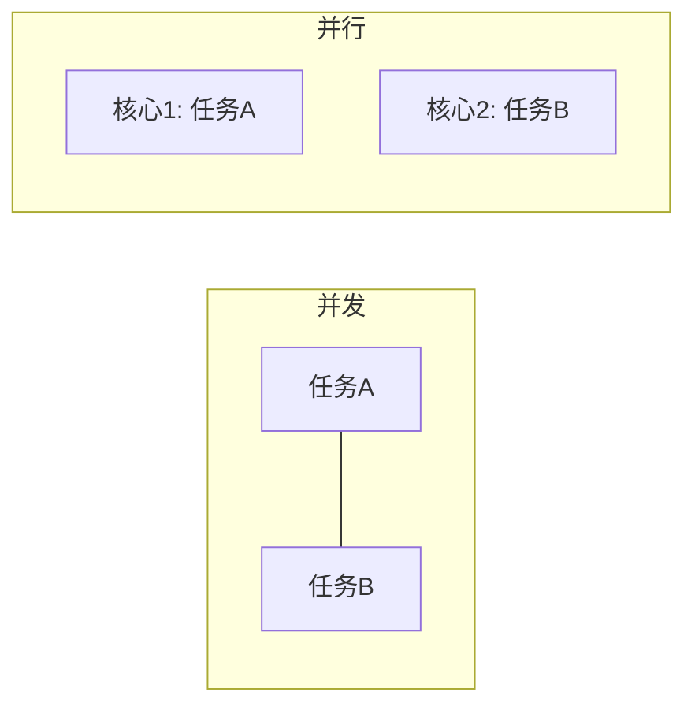
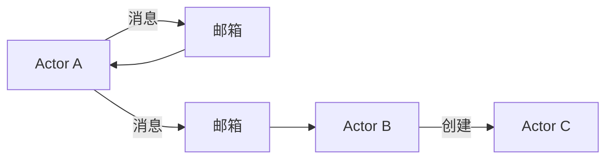
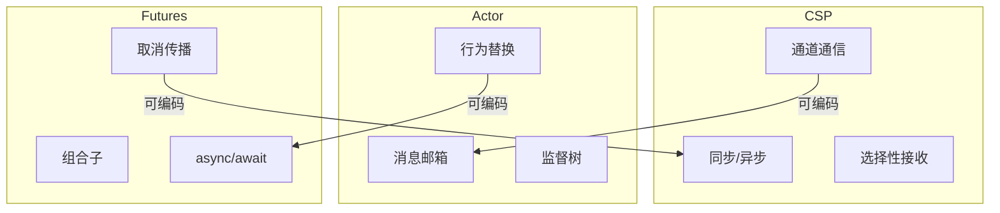
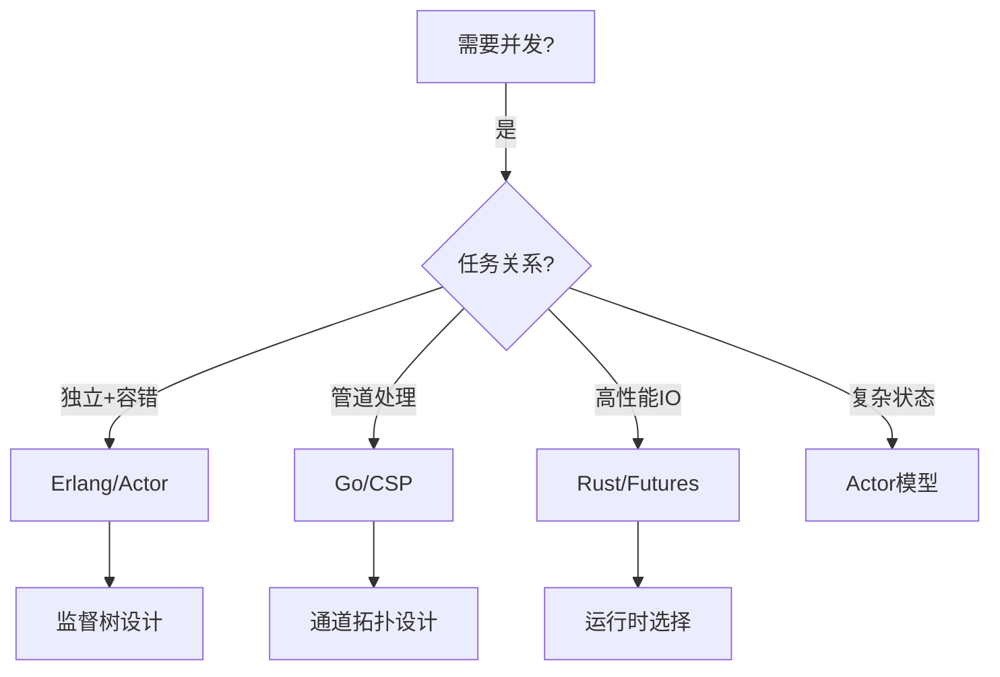

# 03.1 并发模型对比

---

📌 **内容摘要**

本文档深入探讨并发模型对比的核心原理和关键方法。内容涵盖异步编程领域的主要知识点，包括同步, 并行, 并发编程等关键主题。适合有一定基础的学习者系统学习。

**关键词**: 异步编程, 同步, 并行, 并发编程

📚 **学习目标**
- 掌握并发模型对比的核心概念和主要方法
- 理解相关理论的应用场景
- 建立该领域的系统性知识框架

🎯 **难度级别**: 中级

⏱️ **预计阅读时间**: 15分钟

**前置知识**: 相关领域的基础概念

---


## 03.1.1 概述

并发编程模型定义了多个计算单元如何交互和协调。主要模型包括：

- **CSP (Communicating Sequential Processes)**：通道通信
- **Actor模型**：消息传递
- **Futures/Promises**：异步计算

### 03.1.1.1 并发vs并行

| 概念 | 定义 | 关注点 |
|------|------|--------|
| 并发 (Concurrency) | 多个任务交替执行 | 结构、任务分解 |
| 并行 (Parallelism) | 多个任务同时执行 | 性能、资源利用 |



---

## 03.1.2 CSP模型

### 03.1.2.1 理论基础

**CSP**由Hoare (1978) 提出，核心思想：

> "不要通过共享内存通信，而是通过通信共享内存"

**基本操作**

$$
\begin{aligned}
c!v &\quad \text{向通道c发送值v} \\
c?x &\quad \text{从通道c接收值到x} \\
P \parallel Q &\quad \text{P和Q并行执行} \\
P \square Q &\quad \text{外部选择}
\end{aligned}
$$

### 03.1.2.2 Go实现

```go
package main

import "fmt"

func worker(id int, jobs <-chan int, results chan<- int) {
    for j := range jobs {
        // 处理任务
        results <- j * 2
    }
}

func main() {
    jobs := make(chan int, 100)
    results := make(chan int, 100)

    // 启动3个worker
    for w := 1; w <= 3; w++ {
        go worker(w, jobs, results)
    }

    // 发送任务
    for j := 1; j <= 9; j++ {
        jobs <- j
    }
    close(jobs)

    // 收集结果
    for a := 1; a <= 9; a++ {
        <-results
    }
}
```

### 03.1.2.3 Rust实现

```rust
use std::sync::mpsc;
use std::thread;

fn main() {
    let (tx, rx) = mpsc::channel();

    // 生产者线程
    let tx2 = tx.clone();
    thread::spawn(move || {
        for i in 0..5 {
            tx.send(format!("A-{}", i)).unwrap();
        }
    });

    // 另一个生产者
    thread::spawn(move || {
        for i in 0..5 {
            tx2.send(format!("B-{}", i)).unwrap();
        }
    });

    // 消费者
    drop(tx);  // 关闭原始发送端

    for msg in rx {
        println!("收到: {}", msg);
    }
}
```

### 03.1.2.4 形式化语义

**定义 03.1.1 (CSP进程)**

进程 $P$ 的语法：

$$
P, Q ::= \text{STOP} \mid \text{SKIP} \mid a \to P \mid P \square Q \mid P \parallel Q \mid P \setminus A
$$

**操作语义**

$$
\frac{}{(a \to P) \xrightarrow{a} P} \text{(Prefix)}
$$

$$
\frac{P \xrightarrow{a} P'}{P \square Q \xrightarrow{a} P'} \text{(Ext-Choice-L)}
$$

$$
\frac{P \xrightarrow{a} P' \quad Q \xrightarrow{a} Q'}{P \parallel Q \xrightarrow{a} P' \parallel Q'} \text{(Par)}
$$

---

## 03.1.3 Actor模型

### 03.1.3.1 理论基础

**Actor模型**由Hewitt (1973) 提出，核心原则：

1. **Actor**是计算的基本单元
2. Actor之间通过**异步消息传递**通信
3. 每个Actor有**邮箱**存储消息
4. 处理消息时可**创建新Actor**、**发送消息**、**改变行为**



### 03.1.3.2 Erlang实现

```erlang
-module(counter).
-export([start/0, increment/1, get/1]).

start() ->
    spawn(fun() -> loop(0) end).

increment(Pid) ->
    Pid ! increment.

get(Pid) ->
    Pid ! {get, self()},
    receive
        {value, Value} -> Value
    end.

loop(Count) ->
    receive
        increment ->
            loop(Count + 1);
        {get, From} ->
            From ! {value, Count},
            loop(Count);
        stop ->
            ok
    end.

% 使用
% Pid = counter:start(),
% counter:increment(Pid),
% counter:get(Pid).  % 返回 1
```

### 03.1.3.3 Rust (Actix)实现

```rust
use actix::prelude::*;

// 定义消息
struct Increment;
impl Message for Increment {
    type Result = ();
}

struct GetValue;
impl Message for GetValue {
    type Result = i32;
}

// 定义Actor
struct Counter {
    value: i32,
}

impl Actor for Counter {
    type Context = Context<Self>;
}

// 处理消息
impl Handler<Increment> for Counter {
    type Result = ();

    fn handle(&mut self, _msg: Increment, _ctx: &mut Context<Self>) {
        self.value += 1;
    }
}

impl Handler<GetValue> for Counter {
    type Result = i32;

    fn handle(&mut self, _msg: GetValue, _ctx: &mut Context<Self>) -> i32 {
        self.value
    }
}

#[actix::main]
async fn main() {
    let addr = Counter { value: 0 }.start();

    addr.send(Increment).await.unwrap();
    addr.send(Increment).await.unwrap();

    let value = addr.send(GetValue).await.unwrap();
    println!("值: {}", value);  // 2
}
```

### 03.1.3.4 Actor代数

**定义 03.1.2 (Actor行为)**

行为 $B$ 映射消息到反应：

$$
B : \text{Msg} \to \text{Reaction}
$$

其中反应包括：

- 发送消息给其他Actor
- 创建子Actor
- 更新本地状态
- 替换行为

---

## 03.1.4 Futures模型

### 03.1.4.1 核心概念

**Future**代表一个尚未完成的计算：

```rust
pub trait Future {
    type Output;

    fn poll(self: Pin<&mut Self>, cx: &mut Context<'_>)
        -> Poll<Self::Output>;
}

pub enum Poll<T> {
    Ready(T),
    Pending,
}
```

### 03.1.4.2 异步/等待

```rust
async fn fetch_data(url: &str) -> Result<String, Error> {
    let response = reqwest::get(url).await?;
    let text = response.text().await?;
    Ok(text)
}

async fn process() {
    // 顺序执行
    let data1 = fetch_data("http://api1.com").await;
    let data2 = fetch_data("http://api2.com").await;

    // 并发执行
    let (r1, r2) = tokio::join!(
        fetch_data("http://api1.com"),
        fetch_data("http://api2.com")
    );
}
```

### 03.1.4.3 Promise/Future对比

| 特性 | JavaScript Promise | Rust Future |
|------|-------------------|-------------|
| 立即执行 | 创建时开始 | 惰性，poll时推进 |
| 取消 | 无法真正取消 | 支持Drop取消 |
| 组合 | `.then()`链 | `async/await` |
| 运行时 | 内置事件循环 | 需Tokio等运行时 |

```javascript
// JavaScript Promise
const promise = fetch('/api')
    .then(r => r.json())
    .then(data => console.log(data))
    .catch(e => console.error(e));
```

```rust
// Rust Future (等价)
async {
    let r = fetch("/api").await?;
    let data = r.json().await?;
    println!("{:?}", data);
    Ok::<_, Error>(())
}
```

---

## 03.1.5 模型对比

### 03.1.5.1 特性对比表

| 特性 | CSP | Actor | Futures |
|------|-----|-------|---------|
| 通信方式 | 同步/异步通道 | 异步消息 | 共享状态/通道 |
| 耦合度 | 中（通道端点） | 低（地址） | 高（直接调用） |
| 错误隔离 | 进程级别 | Actor级别 | 任务级别 |
| 容错 | 依赖实现 | 监督树 | 依赖实现 |
| 典型语言 | Go, Rust | Erlang, Akka | Rust, JS, C# |

### 03.1.5.2 表达能力



### 03.1.5.3 形式化关系

**定理 03.1.1 (模型等价性)**

CSP、Actor和Futures在表达能力上等价（在合理约束下）：

$$
\text{CSP} \cong \text{Actor} \cong \text{Futures} \quad \text{(图灵完备)}
$$

但**语义差异**影响：

- 公平性保证
- 死锁检测
- 性能特征

---

## 03.1.6 混合模型

### 03.1.6.1 Rust的融合

Rust结合了多种模型：

```rust
// 1. 线程 + 通道 (CSP风格)
use std::sync::mpsc;
use std::thread;

let (tx, rx) = mpsc::channel();
thread::spawn(move || {
    tx.send(42).unwrap();
});

// 2. Actor风格 (Tokio)
use tokio::sync::mpsc;

async fn actor(mut rx: mpsc::Receiver<Msg>) {
    while let Some(msg) = rx.recv().await {
        handle(msg).await;
    }
}

// 3. Futures组合
use futures::future::join_all;

async fn parallel() {
    let futures = vec![
        fetch("url1"),
        fetch("url2"),
        fetch("url3"),
    ];
    let results = join_all(futures).await;
}
```

### 03.1.6.2 选择指南



---

## 03.1.7 练习

1. 用CSP风格实现生产者-消费者
2. 用Actor模型实现银行转账（避免死锁）
3. 比较相同算法在三种模型下的代码复杂度

---

## 03.1.8 参考文献与交叉引用

- [03.2 Future与Promise](./03.2_Future与Promise.md)
- [03.3 Tokio运行时](./03.3_Tokio运行时.md)
- [Hoare, 1978] "Communicating Sequential Processes"
- [Hewitt et al., 1973] "A Universal Modular Actor Formalism"
- [Goetz, 2006] "Java Concurrency in Practice"
---

## 📚 延伸阅读

- [1. Tokio 运行时](../03_异步编程模型/03.2_Tokio运行时.md)
- [03.3 Tokio运行时](../03_异步编程模型/03.3_Tokio运行时.md)
- [03.2 Future与Promise](../03_异步编程模型/03.2_Future与Promise.md)
- [1. 并发编程模型](../01_编程语言理论/01.4_并发编程模型.md)
- [01.1 操作语义](../01_编程语言理论/01.1_操作语义.md)
