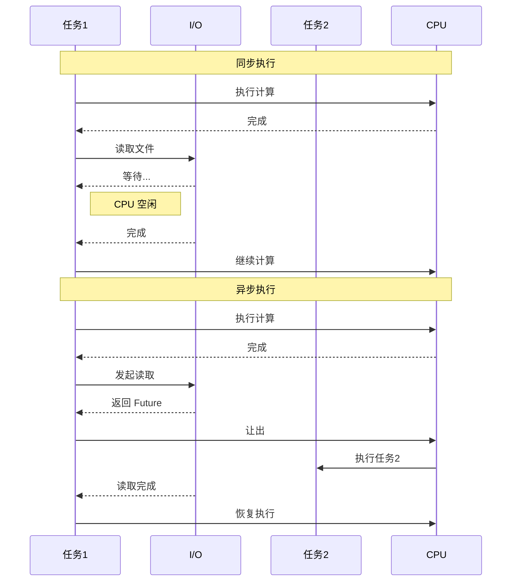

# 1. 异步编程基础

## 目录

- [1. 异步编程基础](#1-异步编程基础)
  - [目录](#目录)
  - [1.1 异步编程概述](#11-异步编程概述)
    - [1.1.1 为什么需要异步](#111-为什么需要异步)
    - [1.1.2 异步 vs 多线程](#112-异步-vs-多线程)
  - [1.2 Future 与 Promise](#12-future-与-promise)
    - [1.2.1 Future 定义](#121-future-定义)
    - [1.2.2 实现自定义 Future](#122-实现自定义-future)
    - [1.2.3 Promise 模式](#123-promise-模式)
  - [1.3 async/await 语法](#13-asyncawait-语法)
    - [1.3.1 async 函数](#131-async-函数)
    - [1.3.2 await 表达式](#132-await-表达式)
    - [1.3.3 错误处理](#133-错误处理)
  - [1.4 执行器与运行时](#14-执行器与运行时)
    - [1.4.1 执行器职责](#141-执行器职责)
    - [1.4.2 使用 Tokio 运行时](#142-使用-tokio-运行时)
  - [1.5 状态机转换](#15-状态机转换)
    - [1.5.1 async 的状态机模型](#151-async-的状态机模型)
    - [1.5.2 Pin 与自引用](#152-pin-与自引用)
  - [1.6 异步与并发](#16-异步与并发)
    - [1.6.1 异步并发模式](#161-异步并发模式)
    - [1.6.2 流处理](#162-流处理)
    - [1.6.3 形式化模型](#163-形式化模型)

## 1.1 异步编程概述

### 1.1.1 为什么需要异步

**定义 1.1.1**：异步编程（Asynchronous Programming）允许在等待 I/O 操作时执行其他任务，提高资源利用率。



### 1.1.2 异步 vs 多线程

| 特性 | 多线程 | 异步 |
|------|--------|------|
| 内存开销 | 大（MB 级栈空间） | 小（KB 级） |
| 切换开销 | 高（内核态） | 低（用户态） |
| 数据共享 | 复杂（需要同步） | 简单（协作式） |
| 适用场景 | CPU 密集型 | I/O 密集型 |
| 调试难度 | 难（竞争条件） | 中等 |

## 1.2 Future 与 Promise

### 1.2.1 Future 定义

**定义 1.2.1**：Future 是表示异步计算的 trait，可能在将来某个时刻完成。

形式化定义：
$$
\text{Future}: \text{State} \times \text{Waker} \rightarrow \text{Poll}\langle Output \rangle
$$

```rust
use std::future::Future;
use std::pin::Pin;
use std::task::{Context, Poll};

// Future trait 定义
pub trait Future {
    type Output;

    fn poll(self: Pin<&mut Self>, cx: &mut Context<'_>) -> Poll<Self::Output>;
}

pub enum Poll<T> {
    Ready(T),
    Pending,
}
```

### 1.2.2 实现自定义 Future

```rust
use std::future::Future;
use std::pin::Pin;
use std::task::{Context, Poll};
use std::time::{Duration, Instant};

struct Delay {
    when: Instant,
}

impl Future for Delay {
    type Output = &'static str;

    fn poll(self: Pin<&mut Self>, cx: &mut Context<'_>) -> Poll<Self::Output> {
        if Instant::now() >= self.when {
            println!("Delay completed!");
            Poll::Ready("done")
        } else {
            // 注册 waker，让定时器在到期时唤醒任务
            cx.waker().wake_by_ref();
            Poll::Pending
        }
    }
}

// 使用自定义 Future
async fn use_delay() {
    let delay = Delay {
        when: Instant::now() + Duration::from_millis(100),
    };

    let result = delay.await;
    println!("Result: {}", result);
}
```

### 1.2.3 Promise 模式

**定义 1.2.2**：Promise/Future 对提供了一种创建异步值的机制。

```rust
use std::sync::Arc;
use tokio::sync::oneshot;

async fn promise_pattern() {
    // 创建 Promise/Future 对
    let (tx, rx) = oneshot::channel::<i32>();

    // 在另一个任务中完成 Promise
    tokio::spawn(async move {
        // 模拟一些工作
        tokio::time::sleep(Duration::from_millis(100)).await;
        tx.send(42).unwrap();
    });

    // 等待 Future 完成
    let result = rx.await.unwrap();
    println!("Received: {}", result);
}
```

## 1.3 async/await 语法

### 1.3.1 async 函数

**定义 1.3.1**：`async fn` 创建一个返回 Future 的函数。

```rust
// async 函数返回 impl Future
async fn hello_async() -> String {
    String::from("Hello, async!")
}

// 等价于
fn hello_async_desugared() -> impl Future<Output = String> {
    async {
        String::from("Hello, async!")
    }
}

// async 块
fn use_async_block() -> impl Future<Output = i32> {
    async {
        let x = 5;
        x * 2
    }
}
```

### 1.3.2 await 表达式

**定义 1.3.2**：`.await` 暂停当前异步函数，等待 Future 完成。

形式化：
$$
await(f) = \begin{cases}
return \ v & \text{if } f = \text{Ready}(v) \\
suspend \ \land \ \text{register}(waker) & \text{if } f = \text{Pending}
\end{cases}
$$

```rust
async fn async_operations() {
    // 串行 await
    let result1 = do_something().await;
    let result2 = do_something_else().await;

    println!("Results: {}, {}", result1, result2);
}

async fn do_something() -> i32 {
    42
}

async fn do_something_else() -> i32 {
    24
}

// 并发 await
async fn concurrent_operations() {
    // join! 宏等待多个 Future 同时完成
    let (result1, result2) = tokio::join!(
        do_something(),
        do_something_else(),
    );

    println!("Results: {}, {}", result1, result2);
}
```

### 1.3.3 错误处理

```rust
use std::io;

async fn async_error_handling() -> Result<String, io::Error> {
    // ? 运算符在 async 中工作
    let content = tokio::fs::read_to_string("file.txt").await?;

    // 处理 Option
    let first_line = content.lines().next()
        .ok_or_else(|| io::Error::new(io::ErrorKind::InvalidData, "Empty file"))?;

    Ok(first_line.to_string())
}
```

## 1.4 执行器与运行时

### 1.4.1 执行器职责

**定义 1.4.1**：执行器（Executor）负责轮询和调度 Future。

```rust
// 简化的执行器概念
use std::collections::VecDeque;
use std::future::Future;
use std::pin::Pin;
use std::sync::{Arc, Mutex};
use std::task::{Context, Poll, Waker, RawWaker, RawWakerVTable};

struct SimpleExecutor {
    task_queue: Arc<Mutex<VecDeque<Task>>>,
}

type Task = Pin<Box<dyn Future<Output = ()> + Send>>;

impl SimpleExecutor {
    fn new() -> Self {
        SimpleExecutor {
            task_queue: Arc::new(Mutex::new(VecDeque::new())),
        }
    }

    fn spawn(&self, task: impl Future<Output = ()> + Send + 'static) {
        self.task_queue.lock().unwrap().push_back(Box::pin(task));
    }

    fn run(&self) {
        while let Some(mut task) = self.task_queue.lock().unwrap().pop_front() {
            // 创建 waker
            let waker = create_waker(self.task_queue.clone());
            let mut context = Context::from_waker(&waker);

            // 轮询任务
            match task.as_mut().poll(&mut context) {
                Poll::Ready(()) => {},
                Poll::Pending => {
                    // 任务未完成，稍后重新调度
                    self.task_queue.lock().unwrap().push_back(task);
                }
            }
        }
    }
}

fn create_waker(queue: Arc<Mutex<VecDeque<Task>>>) -> Waker {
    // 简化实现
    unsafe { Waker::from_raw(RawWaker::new(
        Arc::into_raw(queue) as *const (),
        &VTABLE,
    ))}
}

static VTABLE: RawWakerVTable = RawWakerVTable::new(
    |data| unsafe { RawWaker::new(data, &VTABLE) },
    |_data| {},
    |_data| {},
    |_data| {},
);
```

### 1.4.2 使用 Tokio 运行时

```rust
use tokio::runtime::Runtime;

fn main() {
    // 创建运行时
    let rt = Runtime::new().unwrap();

    // 阻塞当前线程执行异步代码
    rt.block_on(async {
        println!("Hello from async!");
    });
}

// 或使用宏
#[tokio::main]
async fn main_macro() {
    println!("Hello from async!");
}

// 多线程运行时
#[tokio::main(flavor = "multi_thread", worker_threads = 4)]
async fn main_multi_thread() {
    println!("Running on {} threads", 4);
}
```

## 1.5 状态机转换

### 1.5.1 async 的状态机模型

**定理 1.5.1**：每个 async 函数/块被编译器转换为状态机。

形式化：
$$
\text{async fn} \xrightarrow{\text{desugar}} \text{StateMachine} = \{S_0, S_1, \ldots, S_n\}
$$

```rust
// 原始 async 代码
async fn example() -> i32 {
    let x = step1().await;
    let y = step2().await;
    x + y
}

// 概念上的状态机转换
enum ExampleStateMachine {
    Start,
    Waiting1(/* 保存的局部变量 */),
    Waiting2(/* 保存的局部变量 */),
    Done,
}

impl Future for ExampleStateMachine {
    type Output = i32;

    fn poll(mut self: Pin<&mut Self>, cx: &mut Context<'_>) -> Poll<i32> {
        loop {
            match *self {
                ExampleStateMachine::Start => {
                    // 开始 step1
                    *self = ExampleStateMachine::Waiting1(/* ... */);
                }
                ExampleStateMachine::Waiting1(/* ... */) => {
                    // 检查 step1 是否完成
                    // 如果完成，开始 step2
                    *self = ExampleStateMachine::Waiting2(/* ... */);
                }
                ExampleStateMachine::Waiting2(/* ... */) => {
                    // 检查 step2 是否完成
                    // 如果完成，返回结果
                    return Poll::Ready(/* x + y */);
                }
                ExampleStateMachine::Done => panic!("polled after completion"),
            }
        }
    }
}
```

### 1.5.2 Pin 与自引用

**定义 1.5.2**：`Pin` 保证内存位置不变，允许自引用结构。

```rust
use std::pin::Pin;

// 自引用结构示例
struct SelfReferential {
    data: String,
    // 这个指针指向 data
    ptr_to_data: *const String,
}

// async 状态机可能包含自引用
async fn self_referential_example() {
    let data = vec![1, 2, 3];

    // 借用 data 的引用
    let ref_to_data = &data;

    // .await 点，状态机需要保存这个引用
    some_async_op().await;

    // 使用保存的引用
    println!("{:?}", ref_to_data);
}

async fn some_async_op() {}
```

## 1.6 异步与并发

### 1.6.1 异步并发模式

```rust
use tokio::task;

async fn concurrency_patterns() {
    // 1. join! - 等待所有完成
    let (a, b) = tokio::join!(
        async_task_a(),
        async_task_b(),
    );

    // 2. select! - 等待任意一个完成
    tokio::select! {
        result = async_task_a() => {
            println!("A finished first: {}", result);
        }
        result = async_task_b() => {
            println!("B finished first: {}", result);
        }
    }

    // 3. spawn - 创建新任务
    let handle = tokio::spawn(async {
        // 在后台运行
        "task result"
    });

    let result = handle.await.unwrap();
    println!("Spawned task: {}", result);
}

async fn async_task_a() -> &'static str {
    tokio::time::sleep(Duration::from_millis(100)).await;
    "A"
}

async fn async_task_b() -> &'static str {
    tokio::time::sleep(Duration::from_millis(200)).await;
    "B"
}
```

### 1.6.2 流处理

```rust
use tokio_stream::StreamExt;

async fn stream_processing() {
    let mut stream = tokio_stream::iter(vec![1, 2, 3, 4, 5]);

    while let Some(value) = stream.next().await {
        println!("Received: {}", value);
    }
}

// 异步迭代器
async fn async_iteration() {
    let stream = tokio_stream::iter(vec![1, 2, 3])
        .map(|x| x * 2)
        .filter(|x| *x > 2);

    stream.for_each(|x| async move {
        println!("{}", x);
    }).await;
}
```

### 1.6.3 形式化模型

**定义 1.6.1**：异步计算的 $\pi$-演算模型：

$$
\begin{align}
P &::= \bar{x}\langle y \rangle.P \mid x(y).P \mid P|Q \mid (\nu x)P \\
&\mid !P \mid 0 \mid \text{await}(F).P
\end{align}
$$

```lean
-- Lean 风格的异步形式化
inductive Async (M : Type → Type) (α : Type)
  | pure : α → Async M α
  | bind : Async M α → (α → Async M β) → Async M β
  | async : M α → Async M α
  | await : Async M α → Async M α

-- Future 单子定律
class AsyncMonad (M : Type → Type) extends Monad M where
  async : M α → M α
  await : M α → M α

  -- 定律
  await_async : await (async ma) = ma
  async_pure : async (pure a) = pure a
  bind_async : (async ma) >>= f = async (ma >>= f)
```

---

**参考文档**：

- [03.2_Tokio运行时](./03.2_Tokio运行时.md)
- [03.3_异步模式](./03.3_异步模式.md)
- [03.4_异步形式化](./03.4_异步形式化.md)
- [01.4_并发编程模型](../01_编程语言理论/01.4_并发编程模型.md)
