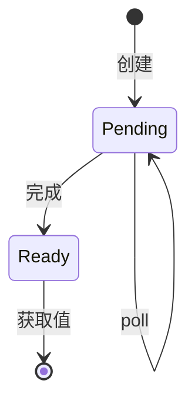

# 03.2 Future与Promise

---

📌 **内容摘要**

本文档深入探讨Future与Promise的核心原理和关键方法。内容涵盖异步编程领域的主要知识点，包括同步, Promise, 并发编程, Future等关键主题。适合有一定基础的学习者系统学习。

**关键词**: 同步, Promise, 并发编程, 异步编程, Future, 并行

📚 **学习目标**
- 掌握Future与Promise的核心概念和主要方法
- 理解相关理论的应用场景
- 建立该领域的系统性知识框架

🎯 **难度级别**: 中级

⏱️ **预计阅读时间**: 15分钟

**前置知识**: 相关领域的基础概念

---


## 03.2.1 概述

**Future**（或**Promise**）代表一个**尚未完成但将在未来完成**的计算。它是异步编程的核心抽象，允许非阻塞地表达并发操作。

### 03.2.1.1 基本概念

| 术语 | 含义 | 状态 |
|------|------|------|
| Pending | 计算进行中 | 未完成 |
| Resolved/Fulfilled | 计算成功完成 | 完成，有值 |
| Rejected | 计算失败 | 完成，有错误 |



---

## 03.2.2 Future抽象

### 03.2.2.1 Rust Future定义

```rust
use std::pin::Pin;
use std::task::{Context, Poll};

pub trait Future {
    type Output;

    /// 尝试推进Future到完成
    /// - Ready(T): 已完成，返回结果
    /// - Pending: 需要等待，已注册唤醒
    fn poll(self: Pin<&mut Self>, cx: &mut Context<'_>)
        -> Poll<Self::Output>;
}

pub enum Poll<T> {
    Ready(T),
    Pending,
}
```

### 03.2.2.2 惰性求值

Rust的Future是**惰性**的：

```rust
// 创建Future，但不执行
let future = async {
    println!("执行!");
    42
};

// future 此时未被poll

// 需要运行时来驱动
let result = future.await;  // 在此处开始执行
```

对比JavaScript的立即执行：

```javascript
// Promise立即开始执行
const promise = new Promise((resolve) => {
    console.log("立即执行!");  // 创建时打印
    resolve(42);
});
```

### 03.2.2.3 自引用与Pin

**定义 03.2.1 (Pin)**

`Pin<P>`保证指针指向的值不会被移动：

```rust
// 自引用结构
struct SelfReferential {
    data: String,
    // 指向data的指针
    ptr_to_data: *const String,
}

// Future可能包含自引用
async fn example() {
    let local = String::from("局部");
    let reference = &local;  // 借用跨越await点
    some_async().await;       // 可能暂停，引用必须有效
    println!("{}", reference);
}
```

```mermaid
flowchart LR
    subgraph "移动前"
        D1[data: "hello"]
        P1[ptr_to_data] --> D1
    end

    subgraph "移动后（不安全）"
        D2[data: "hello"]
        P2[ptr_to_data] -.x.-> D1
    end

    subgraph "Pin保证"
        D3[data: "hello"]
        P3[ptr_to_data] --> D3
        style D3 fill:#9f9
    end
```

---

## 03.2.3 异步计算模型

### 03.2.3.1 状态机转换

async函数编译为状态机：

```rust
// 源码
async fn example(x: i32) -> i32 {
    let y = step1(x).await;
    let z = step2(y).await;
    z
}
```

展开后近似：

```rust
enum ExampleFuture {
    Start(i32),
    AfterStep1 { y: i32 },
    AfterStep2 { z: i32 },
    Complete,
}

impl Future for ExampleFuture {
    type Output = i32;

    fn poll(mut self: Pin<&mut Self>, cx: &mut Context) -> Poll<i32> {
        loop {
            match *self {
                ExampleFuture::Start(x) => {
                    let fut = step1(x);
                    *self = ExampleFuture::Waiting1(fut);
                }
                ExampleFuture::Waiting1(ref mut fut) => {
                    match fut.poll(cx) {
                        Poll::Ready(y) => {
                            *self = ExampleFuture::AfterStep1 { y };
                        }
                        Poll::Pending => return Poll::Pending,
                    }
                }
                // ... 其他状态
            }
        }
    }
}
```

### 03.2.3.2 Waker机制

**定义 03.2.2 (Waker)**

Waker是通知执行器Future可继续的回调：

```rust
pub struct Context<'a> {
    waker: &'a Waker,
    // ...
}

impl Waker {
    /// 通知执行器该Future应被重新poll
    pub fn wake(self) { }
    pub fn wake_by_ref(&self) { }
}
```

使用示例：

```rust
struct TimerFuture {
    shared_state: Arc<Mutex<SharedState>>,
}

struct SharedState {
    completed: bool,
    waker: Option<Waker>,
}

impl Future for TimerFuture {
    type Output = ();

    fn poll(self: Pin<&mut Self>, cx: &mut Context<'_>) -> Poll<()> {
        let mut state = self.shared_state.lock().unwrap();

        if state.completed {
            Poll::Ready(())
        } else {
            // 存储waker以便稍后唤醒
            state.waker = Some(cx.waker().clone());
            Poll::Pending
        }
    }
}
```

---

## 03.2.4 Promise模式

### 03.2.4.1 Promise/Future分离

```rust
use std::sync::mpsc;
use std::future::Future;

// Promise (发送端) / Future (接收端) 分离
pub struct Promise<T> {
    sender: mpsc::Sender<T>,
}

pub struct PromiseFuture<T> {
    receiver: mpsc::Receiver<T>,
}

impl<T> Promise<T> {
    pub fn fulfill(self, value: T) {
        let _ = self.sender.send(value);
    }
}

impl<T> Future for PromiseFuture<T> {
    type Output = T;

    fn poll(self: Pin<&mut Self>, _cx: &mut Context<'_>) -> Poll<T> {
        match self.receiver.try_recv() {
            Ok(v) => Poll::Ready(v),
            Err(_) => Poll::Pending,
        }
    }
}

pub fn promise<T>() -> (Promise<T>, PromiseFuture<T>) {
    let (tx, rx) = mpsc::channel();
    (Promise { sender: tx }, PromiseFuture { receiver: rx })
}
```

### 03.2.4.2 组合子

```rust
use futures::future::{FutureExt, TryFutureExt};

async fn example() {
    let future = fetch_data();

    // map: 转换结果
    let mapped = future.map(|data| data.len());

    // then: 链式异步操作
    let chained = fetch_user()
        .then(|user| fetch_orders(user.id));

    // select: 竞争
    let (result, _index, _remaining) =
        futures::future::select(fetch_a(), fetch_b()).await;

    // join: 全部完成
    let (a, b) = futures::future::join(fetch_a(), fetch_b()).await;
}
```

### 03.2.4.3 取消语义

```rust
use tokio::time::{timeout, Duration};

async fn with_cancel() {
    // 超时取消
    let result = timeout(
        Duration::from_secs(5),
        long_operation()
    ).await;

    match result {
        Ok(v) => println!("完成: {}", v),
        Err(_) => println!("超时!"),
    }
}

// 手动取消
use tokio::select;

async fn cancellable() {
    let (tx, rx) = tokio::sync::oneshot::channel();

    select! {
        result = long_task() => {
            println!("任务完成: {:?}", result);
        }
        _ = rx => {
            println!("收到取消信号");
        }
    }
}
```

---

## 03.2.5 形式化语义

### 03.2.5.1 异步计算代数

**定义 03.2.3 (异步计算)**

异步计算 $A$ 定义为：

$$
A ::= \text{return}(v) \mid \text{await}(E) \mid A_1 \gg= A_2 \mid A_1 \parallel A_2
$$

**规约规则**

$$
\frac{E \xrightarrow{\text{ready}(v)} E'}{\text{await}(E) \to \text{return}(v)} \text{(Await-Ready)}
$$

$$
\frac{E \xrightarrow{\text{pending}} E'}{\text{await}(E) \to \text{await}(E')} \text{(Await-Pending)}
$$

### 03.2.5.2 单子结构

Future形成**单子**：

```haskell
-- 单位元
return :: a -> Future a
return x = Ready x

-- 绑定
(>>=) :: Future a -> (a -> Future b) -> Future b
Pending    >>= f = Pending
Ready x    >>= f = f x

-- 满足定律
return x >>= f = f x                    -- 左单位
m >>= return = m                        -- 右单位
(m >>= f) >>= g = m >>= (\x -> f x >>= g)  -- 结合律
```

### 03.2.5.3 双模拟等价

**定义 03.2.4 (Future等价)**

两个Future $F_1$ 和 $F_2$ 等价，若对任意上下文 $C$：

$$C[F_1] \Downarrow v \iff C[F_2] \Downarrow v$$

---

## 03.2.6 实际应用模式

### 03.2.6.1 背压控制

```rust
use tokio::sync::mpsc;

async fn producer(tx: mpsc::Sender<Data>) {
    let mut stream = data_source();

    while let Some(data) = stream.next().await {
        // send等待容量，实现背压
        if tx.send(data).await.is_err() {
            break;  // 接收者关闭
        }
    }
}

async fn consumer(rx: mpsc::Receiver<Data>) {
    // 缓冲区大小控制并发度
    rx.for_each_concurrent(10, |data| async move {
        process(data).await;
    }).await;
}
```

### 03.2.6.2 扇出/扇入

```rust
use futures::stream::{self, StreamExt};

async fn fan_out_fan_in() {
    let inputs = vec![1, 2, 3, 4, 5];

    // 扇出：并行处理
    let results: Vec<_> = stream::iter(inputs)
        .map(|x| async move {
            heavy_computation(x).await
        })
        .buffer_unordered(10)  // 最多10个并发
        .collect()
        .await;

    // 扇入：聚合结果
    let sum: i32 = results.iter().sum();
}
```

### 03.2.6.3 优雅关闭

```rust
use tokio::signal;

async fn graceful_shutdown() {
    let (tx, mut rx) = tokio::sync::mpsc::channel(100);

    // 启动工作线程
    let handles: Vec<_> = (0..4)
        .map(|i| tokio::spawn(worker(i, tx.clone())))
        .collect();

    // 等待停止信号
    tokio::select! {
        _ = signal::ctrl_c() => {
            println!("收到Ctrl+C，优雅关闭...");
            drop(tx);  // 关闭通道
        }
    }

    // 等待所有任务完成
    for handle in handles {
        handle.await.unwrap();
    }
}
```

---

## 03.2.7 练习

1. 实现一个带有取消信号的自定义Future
2. 用Future组合子实现重试逻辑（指数退避）
3. 分析`async fn`生成的状态机大小

---

## 03.2.8 参考文献与交叉引用

- [03.1 并发模型对比](./03.1_并发模型对比.md)
- [03.3 Tokio运行时](./03.3_Tokio运行时.md)
- [03.4 异步形式化](./03.4_异步形式化.md)
- [Async Book] "Asynchronous Programming in Rust"
- [Futures RFC] "Zero-cost asynchronous programming in Rust"
---

## 📋 前置知识

- [1. 异步编程基础](../03_异步编程模型/03.1_异步编程基础.md)

---

## 📚 延伸阅读

- [1. 单子与函子](../04_函数式编程/04.2_单子与函子.md)
- [04.3 单子与函子](../04_函数式编程/04.3_单子与函子.md)
- [1. 惰性求值](../04_函数式编程/04.3_惰性求值.md)
- [04.4 惰性求值](../04_函数式编程/04.4_惰性求值.md)
- [1. Tokio 运行时](../03_异步编程模型/03.2_Tokio运行时.md)
