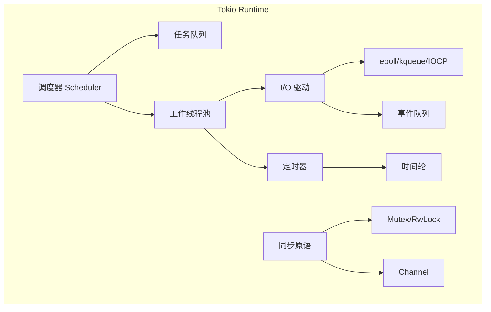
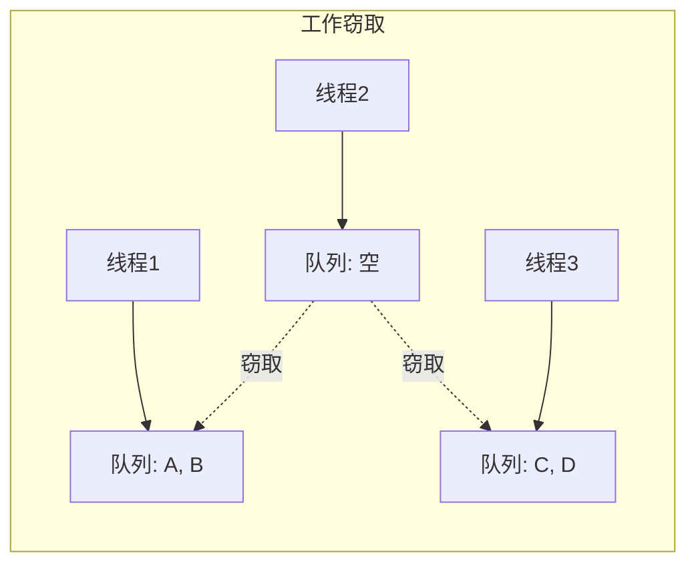
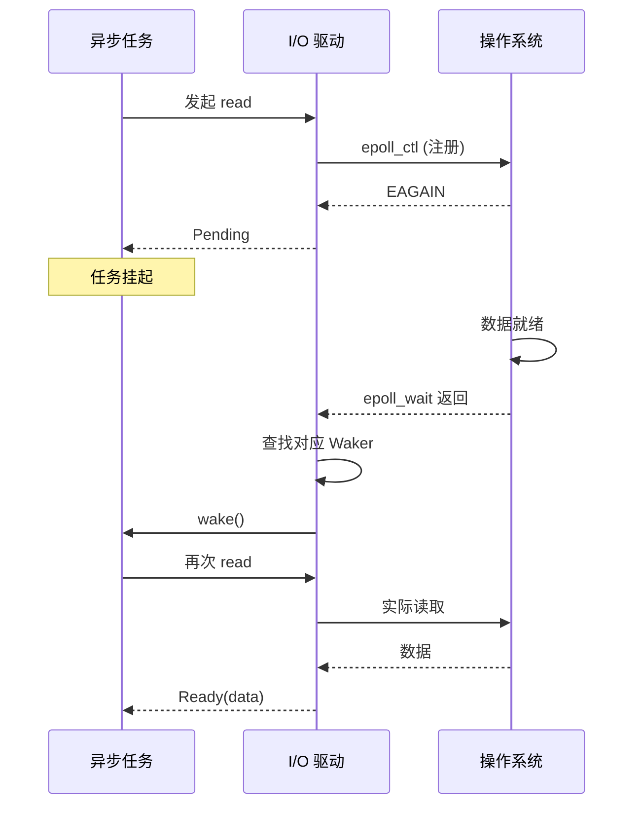
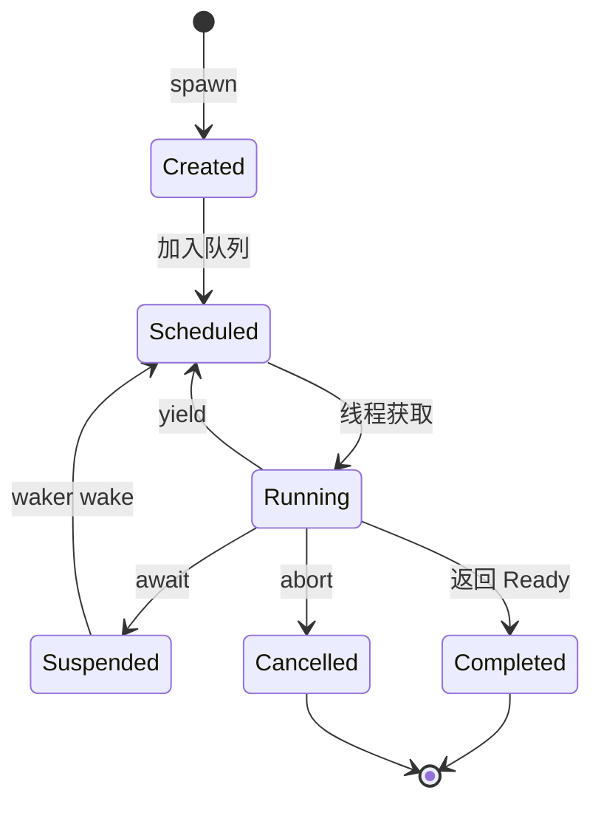

# 1. Tokio 运行时

---

📌 **内容摘要**

本文档深入探讨Tokio 运行时的核心原理和关键方法。内容涵盖异步编程领域的主要知识点，包括任务调度, 调度, 资源分配等关键主题。适合有一定基础的学习者系统学习。

**关键词**: 异步编程, 任务调度, 调度, 资源分配

📚 **学习目标**

- 掌握Tokio 运行时的核心概念和主要方法
- 理解相关理论的应用场景
- 建立该领域的系统性知识框架

🎯 **难度级别**: 中级

⏱️ **预计阅读时间**: 15分钟

**前置知识**: 相关领域的基础概念

---


## 目录

- [1. Tokio 运行时](#1-tokio-运行时)
  - [目录](#目录)
  - [1.1 Tokio 概述](#11-tokio-概述)
    - [1.1.1 Tokio 组件](#111-tokio-组件)
    - [1.1.2 基本使用](#112-基本使用)
  - [1.2 调度器架构](#12-调度器架构)
    - [1.2.1 工作窃取调度](#121-工作窃取调度)
    - [1.2.2 全局队列与本地队列](#122-全局队列与本地队列)
    - [1.2.3 调度器实现原理](#123-调度器实现原理)
  - [1.3 执行器实现](#13-执行器实现)
    - [1.3.1 轮询循环](#131-轮询循环)
    - [1.3.2 Waker 机制](#132-waker-机制)
  - [1.4 I/O 驱动](#14-io-驱动)
    - [1.4.1 异步 I/O 原理](#141-异步-io-原理)
    - [1.4.2 Tokio 的 I/O 实现](#142-tokio-的-io-实现)
    - [1.4.3 平台抽象](#143-平台抽象)
  - [1.5 任务管理](#15-任务管理)
    - [1.5.1 任务生命周期](#151-任务生命周期)
    - [1.5.2 任务 JoinHandle](#152-任务-joinhandle)
    - [1.5.3 任务组与作用域](#153-任务组与作用域)
  - [1.6 性能优化](#16-性能优化)
    - [1.6.1 批处理与合并](#161-批处理与合并)
    - [1.6.2 避免阻塞](#162-避免阻塞)
    - [1.6.3 内存优化](#163-内存优化)
    - [1.6.4 运行时配置](#164-运行时配置)
  - [📚 延伸阅读](#-延伸阅读)

## 1.1 Tokio 概述

### 1.1.1 Tokio 组件

**定义 1.1.1**：Tokio 是 Rust 的异步运行时，包含以下组件：

- 多线程调度器
- I/O 驱动（基于 epoll/kqueue/IOCP）
- 定时器
- 同步原语



### 1.1.2 基本使用

```rust
use tokio;

// 单线程运行时
#[tokio::main(flavor = "current_thread")]
async fn single_thread() {
    println!("Running on current thread");
}

// 多线程运行时
#[tokio::main(flavor = "multi_thread", worker_threads = 4)]
async fn multi_thread() {
    println!("Running on 4 threads");
}

// 手动创建运行时
fn manual_runtime() {
    let rt = tokio::runtime::Builder::new_multi_thread()
        .worker_threads(4)
        .enable_all()
        .build()
        .unwrap();

    rt.block_on(async {
        println!("Running in manual runtime");
    });
}
```

## 1.2 调度器架构

### 1.2.1 工作窃取调度

**定义 1.2.1**：工作窃取（Work-Stealing）允许空闲线程从其他线程的队列窃取任务。

形式化模型：
$$
\forall t_i, \text{if } Q_i = \emptyset \Rightarrow t_i.steal(Q_j), j \neq i
$$



### 1.2.2 全局队列与本地队列

```rust
// 任务调度策略
async fn scheduling_strategies() {
    // spawn：任务进入全局队列
    let handle1 = tokio::spawn(async {
        "from global queue"
    });

    // spawn_local：任务在本地执行（LocalSet）
    tokio::task::LocalSet::new().run_until(async {
        tokio::task::spawn_local(async {
            "from local queue"
        }).await
    }).await;

    // yield_now：让出当前任务
    tokio::task::yield_now().await;
}
```

### 1.2.3 调度器实现原理

```rust
use std::collections::VecDeque;
use std::sync::Arc;
use crossbeam::deque::{Stealer, Worker};

// 概念上的调度器实现
struct Scheduler {
    global_queue: Arc<std::sync::Mutex<VecDeque<Task>>>,
    workers: Vec<Worker<Task>>,
    stealers: Vec<Stealer<Task>>,
}

impl Scheduler {
    fn spawn(&self, task: Task) {
        // 优先放入本地队列
        self.workers[thread_id()].push(task);
    }

    fn next_task(&self) -> Option<Task> {
        let worker = &self.workers[thread_id()];

        // 1. 尝试从本地队列弹出
        worker.pop().or_else(|| {
            // 2. 尝试从全局队列窃取
            self.steal_from_global()
        }).or_else(|| {
            // 3. 尝试从其他工作线程窃取
            self.steal_from_others()
        })
    }

    fn steal_from_global(&self) -> Option<Task> {
        self.global_queue.lock().unwrap().pop_front()
    }

    fn steal_from_others(&self) -> Option<Task> {
        let start = rand::random::<usize>() % self.stealers.len();

        for i in 0..self.stealers.len() {
            let idx = (start + i) % self.stealers.len();
            if let Some(task) = self.stealers[idx].steal().success() {
                return Some(task);
            }
        }

        None
    }
}

type Task = Pin<Box<dyn Future<Output = ()> + Send>>;

fn thread_id() -> usize {
    // 获取当前线程 ID
    0
}
```

## 1.3 执行器实现

### 1.3.1 轮询循环

**定义 1.3.1**：执行器的主循环：获取任务 → 轮询 Future → 处理结果 → 重复。

```rust
// 简化的执行器循环
struct Executor {
    ready_queue: Receiver<Task>,
}

impl Executor {
    fn run(&self) {
        loop {
            // 获取就绪任务
            let task = self.ready_queue.recv().unwrap();

            // 创建 waker
            let waker = task.waker();
            let mut context = Context::from_waker(&waker);

            // 轮询任务
            match task.future.poll(&mut context) {
                Poll::Ready(()) => {
                    // 任务完成
                    task.complete();
                }
                Poll::Pending => {
                    // 任务挂起，等待唤醒
                }
            }
        }
    }
}
```

### 1.3.2 Waker 机制

**定义 1.3.2**：Waker 是通知执行器任务可以继续执行的句柄。

```rust
use std::sync::Arc;
use std::task::{Wake, Waker, RawWaker, RawWakerVTable};

struct TaskWaker {
    task: Arc<Task>,
    scheduler: Arc<Scheduler>,
}

impl Wake for TaskWaker {
    fn wake(self: Arc<Self>) {
        // 将任务重新加入就绪队列
        self.scheduler.schedule(self.task.clone());
    }

    fn wake_by_ref(self: &Arc<Self>) {
        self.scheduler.schedule(self.task.clone());
    }
}

struct Task {
    future: Mutex<Pin<Box<dyn Future<Output = ()> + Send>>>,
    state: AtomicUsize,
}

impl Task {
    fn waker(self: &Arc<Self>) -> Waker {
        Waker::from(Arc::new(TaskWaker {
            task: self.clone(),
            scheduler: self.scheduler.clone(),
        }))
    }
}
```

## 1.4 I/O 驱动

### 1.4.1 异步 I/O 原理

**定义 1.4.1**：异步 I/O 使用操作系统提供的非阻塞 I/O 和多路复用机制。



### 1.4.2 Tokio 的 I/O 实现

```rust
use tokio::io::{AsyncReadExt, AsyncWriteExt};
use tokio::net::TcpStream;

async fn io_operations() -> tokio::io::Result<()> {
    // TCP 连接
    let mut stream = TcpStream::connect("127.0.0.1:8080").await?;

    // 异步写
    stream.write_all(b"Hello, Server!").await?;

    // 异步读
    let mut buffer = [0u8; 1024];
    let n = stream.read(&mut buffer).await?;

    println!("Received: {:?}", &buffer[..n]);

    Ok(())
}

// 自定义异步 I/O
use std::pin::Pin;
use std::task::{Context, Poll};
use tokio::io::ReadBuf;

struct CustomAsyncReader {
    inner: std::fs::File,
}

impl tokio::io::AsyncRead for CustomAsyncReader {
    fn poll_read(
        self: Pin<&mut Self>,
        cx: &mut Context<'_>,
        buf: &mut ReadBuf<'_>,
    ) -> Poll<std::io::Result<()>> {
        // 注册到 I/O 驱动
        // 等待数据就绪
        // 实际读取
        Poll::Ready(Ok(()))
    }
}
```

### 1.4.3 平台抽象

```rust
// Tokio 内部的平台抽象
#[cfg(target_os = "linux")]
mod platform {
    pub use epoll::Epoll as Driver;
}

#[cfg(target_os = "macos")]
mod platform {
    pub use kqueue::Kqueue as Driver;
}

#[cfg(windows)]
mod platform {
    pub use iocp::Iocp as Driver;
}

// 统一的 Poll 接口
pub struct IoDriver {
    inner: platform::Driver,
}

impl IoDriver {
    pub fn register(&self, fd: RawFd, interest: Interest, waker: Waker) {
        self.inner.register(fd, interest, waker);
    }

    pub fn poll(&self, timeout: Option<Duration>) -> io::Result<()> {
        self.inner.poll(timeout)
    }
}
```

## 1.5 任务管理

### 1.5.1 任务生命周期

**定义 1.5.1**：Tokio 任务的生命周期：创建 → 调度 → 执行 → 完成/取消。



### 1.5.2 任务 JoinHandle

```rust
use tokio::task::JoinHandle;

async fn task_management() {
    // 创建任务
    let handle: JoinHandle<i32> = tokio::spawn(async {
        // 长时间运行的任务
        tokio::time::sleep(Duration::from_secs(10)).await;
        42
    });

    // 取消任务
    handle.abort();

    // 等待结果
    match handle.await {
        Ok(result) => println!("Task completed: {}", result),
        Err(e) if e.is_cancelled() => println!("Task was cancelled"),
        Err(e) => println!("Task panicked: {:?}", e),
    }
}
```

### 1.5.3 任务组与作用域

```rust
use tokio::task::JoinSet;

async fn task_groups() {
    let mut set = JoinSet::new();

    // 添加多个任务
    for i in 0..10 {
        set.spawn(async move {
            // 每个任务的工作
            tokio::time::sleep(Duration::from_millis(i * 100)).await;
            i
        });
    }

    // 等待所有任务完成
    while let Some(result) = set.join_next().await {
        match result {
            Ok(value) => println!("Task returned: {}", value),
            Err(e) => println!("Task failed: {:?}", e),
        }
    }
}

// 使用 tokio::select! 管理多个任务
async fn select_example() {
    let task1 = tokio::spawn(async {
        tokio::time::sleep(Duration::from_secs(1)).await;
        "task1"
    });

    let task2 = tokio::spawn(async {
        tokio::time::sleep(Duration::from_secs(2)).await;
        "task2"
    });

    tokio::select! {
        result = task1 => println!("Task1 finished: {:?}", result),
        result = task2 => println!("Task2 finished: {:?}", result),
    }
}
```

## 1.6 性能优化

### 1.6.1 批处理与合并

```rust
async fn batching() {
    // 使用 buffer_unordered 限制并发数
    let results: Vec<_> = futures::stream::iter(0..100)
        .map(|i| async move { process_item(i).await })
        .buffer_unordered(10)  // 最多 10 个并发
        .collect()
        .await;
}

async fn process_item(i: i32) -> i32 {
    i * 2
}
```

### 1.6.2 避免阻塞

```rust
async fn avoid_blocking() {
    // 错误：在异步代码中阻塞
    // std::thread::sleep(Duration::from_secs(1));  // 阻塞整个线程！

    // 正确：使用异步 sleep
    tokio::time::sleep(Duration::from_secs(1)).await;

    // CPU 密集型任务使用 spawn_blocking
    let result = tokio::task::spawn_blocking(|| {
        // 长时间 CPU 计算
        heavy_computation()
    }).await.unwrap();
}

fn heavy_computation() -> i32 {
    let mut sum = 0;
    for i in 0..1_000_000 {
        sum += i;
    }
    sum
}
```

### 1.6.3 内存优化

```rust
// 复用缓冲区
async fn buffer_reuse() {
    let mut buffer = vec![0u8; 8192];  // 预分配

    loop {
        let n = stream.read(&mut buffer).await.unwrap();
        if n == 0 {
            break;
        }
        process(&buffer[..n]).await;
    }
}

// 避免不必要的 Box
async fn avoid_boxing() {
    // 使用静态分发
    async fn process<T: AsyncRead>(stream: T) { }

    // 而不是动态分发（如果需要性能）
    // async fn process(stream: Box<dyn AsyncRead>) { }
}
```

### 1.6.4 运行时配置

```rust
fn optimized_runtime() {
    let rt = tokio::runtime::Builder::new_multi_thread()
        .worker_threads(num_cpus::get())  // 根据 CPU 核心数
        .max_blocking_threads(512)         // 限制阻塞线程数
        .thread_stack_size(2 * 1024 * 1024) // 2MB 栈大小
        .enable_io()
        .enable_time()
        .event_interval(61)  // 事件间隔调优
        .global_queue_interval(61)
        .build()
        .unwrap();

    rt.block_on(async {
        // 应用代码
    });
}
```

---

**参考文档**：

- [03.1_异步编程基础](./03.1_异步编程基础.md)
- [03.3_异步模式](./03.3_异步模式.md)
- [01.4_并发编程模型](../01_编程语言理论/01.4_并发编程模型.md)

---

## 📚 延伸阅读

- [04.3 任务调度](../../06_调度系统/04_分布式调度/04.3_任务调度.md)
- [1. 异步模式](../03_异步编程模型/03.3_异步模式.md)
- [03.3 Tokio运行时](../03_异步编程模型/03.3_Tokio运行时.md)
- [03.2 Future与Promise](../03_异步编程模型/03.2_Future与Promise.md)
- [03.2 线程调度](../../06_调度系统/03_OS调度/03.2_线程调度.md)
