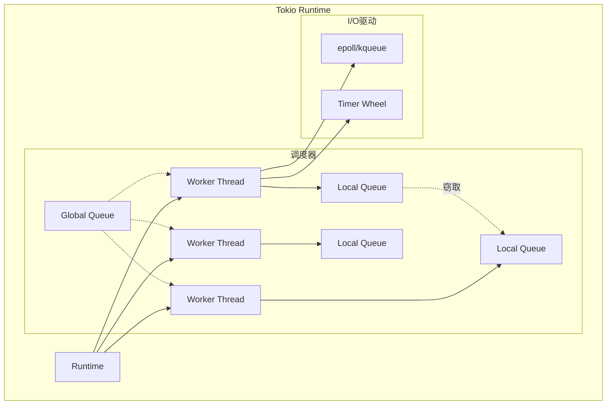

# 03.3 Tokio运行时

## 03.3.1 概述

**Tokio**是Rust生态中事实标准的异步运行时，提供：

- **任务调度**：多线程工作窃取调度器
- **I/O驱动**：基于epoll/kqueue/IOCP
- **定时器**：高效的时间管理
- **同步原语**：异步版本的Mutex、Channel等

### 03.3.1.1 架构概览



---

## 03.3.2 任务调度

### 03.3.2.1 任务类型

```rust
use tokio::task;

// 生成任务
let handle = task::spawn(async {
    // 异步任务
    42
});

// 阻塞任务（专用线程池）
task::spawn_blocking(|| {
    // CPU密集型或阻塞操作
    std::thread::sleep(Duration::from_secs(1));
});

// 本地任务（!Send）
task::spawn_local(async {
    // 使用Rc等非Send类型
});
```

### 03.3.2.2 工作窃取调度

```rust
// Tokio使用work-stealing算法
// 每个工作线程有自己的本地队列

struct Worker {
    local_queue: LocalQueue<Task>,
    injector: Injector<Task>,  // 全局队列
}

impl Worker {
    fn run(&self) {
        loop {
            // 1. 先处理自己的队列
            if let Some(task) = self.local_queue.pop() {
                task.poll();
                continue;
            }

            // 2. 尝试从全局队列获取
            if let Some(task) = self.injector.steal() {
                task.poll();
                continue;
            }

            // 3. 从其他工作线程窃取
            if let Some(task) = self.steal_from_others() {
                task.poll();
                continue;
            }

            // 4. 空闲，等待I/O事件
            self.park();
        }
    }
}
```

### 03.3.2.3 调度策略

| 策略 | 适用场景 | 配置 |
|------|----------|------|
| 多线程 | CPU密集型，默认 | `#[tokio::main]` |
| 单线程 | 简单场景，避免同步开销 | `current_thread` |
| 自定义 | 特定需求 | `Runtime::builder()` |

```rust
// 多线程运行时（默认）
#[tokio::main]
async fn main() { }

// 单线程运行时
#[tokio::main(flavor = "current_thread")]
async fn main() { }

// 自定义运行时
let runtime = tokio::runtime::Builder::new_multi_thread()
    .worker_threads(4)
    .max_blocking_threads(512)
    .thread_stack_size(3 * 1024 * 1024)
    .enable_all()
    .build()
    .unwrap();
```

---

## 03.3.3 I/O操作

### 03.3.3.1 异步I/O基础

```rust
use tokio::fs::File;
use tokio::io::{AsyncReadExt, AsyncWriteExt};

async fn file_io() -> std::io::Result<()> {
    // 异步文件操作
    let mut file = File::create("hello.txt").await?;
    file.write_all(b"Hello, world!").await?;

    // 异步读取
    let mut file = File::open("hello.txt").await?;
    let mut contents = vec![];
    file.read_to_end(&mut contents).await?;

    Ok(())
}
```

### 03.3.3.2 网络I/O

```rust
use tokio::net::{TcpListener, TcpStream};

async fn tcp_server() -> std::io::Result<()> {
    let listener = TcpListener::bind("127.0.0.1:8080").await?;

    loop {
        let (socket, addr) = listener.accept().await?;
        println!("新连接: {:?}", addr);

        // 每个连接一个任务
        tokio::spawn(handle_connection(socket));
    }
}

async fn handle_connection(mut socket: TcpStream) {
    let mut buf = [0; 1024];

    loop {
        match socket.read(&mut buf).await {
            Ok(0) => return,  // 连接关闭
            Ok(n) => {
                if socket.write_all(&buf[0..n]).await.is_err() {
                    return;
                }
            }
            Err(_) => return,
        }
    }
}
```

### 03.3.3.3 I/O多路复用

```rust
use tokio::io::Interest;

async fn multiplex_io() -> std::io::Result<()> {
    let stream = TcpStream::connect("127.0.0.1:8080").await?;

    loop {
        let ready = stream.ready(Interest::READABLE | Interest::WRITABLE).await?;

        if ready.is_readable() {
            let mut buf = [0; 1024];
            match stream.try_read(&mut buf) {
                Ok(n) => println!("读取 {} 字节", n),
                Err(ref e) if e.kind() == std::io::ErrorKind::WouldBlock => {}
                Err(e) => return Err(e),
            }
        }

        if ready.is_writable() {
            match stream.try_write(b"data") {
                Ok(n) => println!("写入 {} 字节", n),
                Err(ref e) if e.kind() == std::io::ErrorKind::WouldBlock => {}
                Err(e) => return Err(e),
            }
        }
    }
}
```

---

## 03.3.4 定时器

### 03.3.4.1 基本使用

```rust
use tokio::time::{sleep, timeout, interval, Duration};

async fn timer_examples() {
    // 简单延迟
    sleep(Duration::from_secs(1)).await;

    // 超时
    let result = timeout(
        Duration::from_millis(100),
        slow_operation()
    ).await;

    match result {
        Ok(v) => println!("完成: {:?}", v),
        Err(_) => println!("超时!"),
    }

    // 间隔定时器
    let mut interval = interval(Duration::from_secs(1));
    for _ in 0..5 {
        interval.tick().await;
        println!("tick!");
    }
}
```

### 03.3.4.2 时间轮算法

```rust
// 概念性时间轮实现
struct TimerWheel {
    // 分层时间轮
    wheels: [Vec<Bucket>; 4],
    // 精度
    tick_duration: Duration,
    current_tick: u64,
}

struct Bucket {
    timers: Vec<Timer>,
}

struct Timer {
    deadline: Instant,
    waker: Waker,
}

impl TimerWheel {
    fn insert(&mut self, timer: Timer) {
        let ticks = self.ticks_until(timer.deadline);
        let (wheel, slot) = self.position(ticks);
        self.wheels[wheel][slot].timers.push(timer);
    }

    fn advance(&mut self, now: Instant) {
        // 推进时间轮，触发到期定时器
        while self.current_tick <= self.ticks_at(now) {
            self.process_current_slot();
            self.current_tick += 1;
        }
    }
}
```

---

## 03.3.5 同步原语

### 03.3.5.1 异步Mutex

```rust
use tokio::sync::Mutex;

async fn mutex_example() {
    let data = Arc::new(Mutex::new(0));

    let mut handles = vec![];

    for i in 0..10 {
        let data = Arc::clone(&data);
        let handle = tokio::spawn(async move {
            // .await 在等待时不阻塞线程
            let mut num = data.lock().await;
            *num += 1;
            // 锁在此释放（Drop）
        });
        handles.push(handle);
    }

    for handle in handles {
        handle.await.unwrap();
    }

    println!("结果: {}", *data.lock().await);
}
```

**注意**：异步Mutex不适用于同步临界区（使用std::sync::Mutex）

### 03.3.5.2 Channel

```rust
use tokio::sync::mpsc;

async fn channel_example() {
    let (tx, mut rx) = mpsc::channel(100);  // 缓冲通道

    // 生产者
    let tx2 = tx.clone();
    tokio::spawn(async move {
        for i in 0..10 {
            tx.send(i).await.unwrap();
        }
    });

    tokio::spawn(async move {
        for i in 10..20 {
            tx2.send(i).await.unwrap();
        }
    });

    // 消费者
    drop(tx);  // 关闭发送端

    while let Some(msg) = rx.recv().await {
        println!("收到: {}", msg);
    }
}
```

### 03.3.5.3 信号量

```rust
use tokio::sync::Semaphore;

async fn semaphore_example() {
    let sem = Arc::new(Semaphore::new(3));  // 最多3个并发

    let mut handles = vec![];

    for i in 0..10 {
        let sem = Arc::clone(&sem);
        let handle = tokio::spawn(async move {
            let _permit = sem.acquire().await.unwrap();
            println!("任务 {} 开始", i);
            sleep(Duration::from_secs(1)).await;
            println!("任务 {} 结束", i);
            // permit在此释放
        });
        handles.push(handle);
    }

    for h in handles {
        h.await.unwrap();
    }
}
```

---

## 03.3.6 运行时配置与优化

### 03.3.6.1 线程池配置

```rust
use tokio::runtime::Runtime;

fn optimized_runtime() -> Runtime {
    tokio::runtime::Builder::new_multi_thread()
        .worker_threads(num_cpus::get())  // CPU核心数
        .max_blocking_threads(512)        // 阻塞线程上限
        .thread_stack_size(4 * 1024 * 1024)  // 4MB栈
        .thread_name("tokio-worker")
        .enable_io()
        .enable_time()
        .event_interval(61)               // 每61次poll检查I/O
        .global_queue_interval(61)        // 全局队列检查间隔
        .max_io_events_per_tick(1024)     // 每次I/O事件上限
        .build()
        .unwrap()
}
```

### 03.3.6.2 性能调优指南

| 场景 | 配置建议 |
|------|----------|
| 高并发I/O | 增加worker_threads |
| CPU密集型 | spawn_blocking分离 |
| 低延迟 | 减少thread_stack_size |
| 内存受限 | 限制max_blocking_threads |

---

## 03.3.7 形式化模型

### 03.3.7.1 任务状态机

```
任务状态:
    Created -> Pollable -> Running -> Completed
                  |          |
                  v          v
               Blocked <- Woken
```

### 03.3.7.2 调度不变式

**定理 03.3.1 (进度保证)**

若任务 $T$ 不是 Pending，则存在工作线程 $W$ 使得：

$$\exists t. \text{schedule}(W, T, t)$$

**定理 03.3.2 (公平性)**

对于任意两个任务 $T_1, T_2$：

$$\frac{\text{ready}(T_1) \land \text{ready}(T_2)}{\text{ eventual_exec}(T_1) \land \text{eventual_exec}(T_2)}$$

---

## 03.3.8 练习

1. 实现一个自定义的异步文件读取器
2. 用Semaphore实现速率限制器
3. 分析Tokio工作窃取的性能特征

---

## 03.3.9 参考文献与交叉引用

- [03.1 并发模型对比](./03.1_并发模型对比.md)
- [03.2 Future与Promise](./03.2_Future与Promise.md)
- [Tokio Docs] https://docs.rs/tokio/
- [Tokio Internals] https://tokio.rs/tokio/topics/runtime
