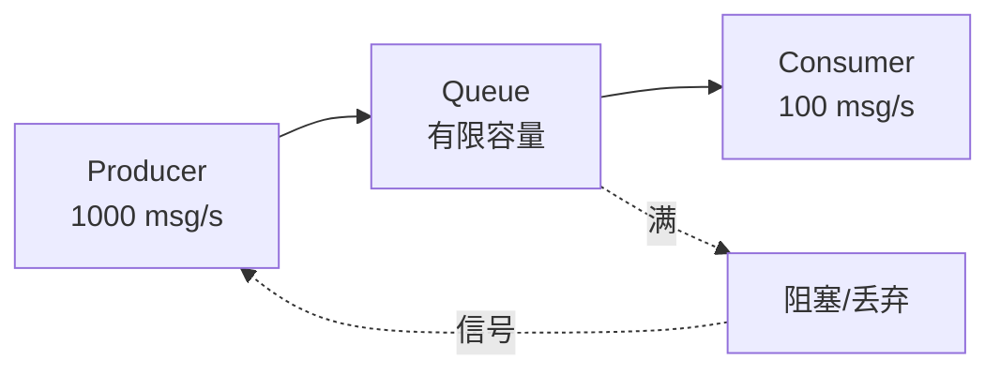

# 1. 异步模式

---

📌 **内容摘要**

本文档深入探讨异步模式的核心原理和关键方法。内容涵盖异步编程领域的主要知识点，包括同步, 并行, 并发编程等关键主题。适合有一定基础的学习者系统学习。

**关键词**: 异步编程, 同步, 并行, 并发编程

📚 **学习目标**
- 掌握异步模式的核心概念和主要方法
- 理解相关理论的应用场景
- 建立该领域的系统性知识框架

🎯 **难度级别**: 中级

⏱️ **预计阅读时间**: 15分钟

**前置知识**: 相关领域的基础概念

---


## 目录

- [1. 异步模式](#1-异步模式)
  - [目录](#目录)
  - [1.1 流处理模式](#11-流处理模式)
    - [1.1.1 Stream 基础](#111-stream-基础)
    - [1.1.2 流转换](#112-流转换)
    - [1.1.3 缓冲与并发](#113-缓冲与并发)
  - [1.2 背压控制](#12-背压控制)
    - [1.2.1 背压概念](#121-背压概念)
    - [1.2.2 基于 Channel 的背压](#122-基于-channel-的背压)
    - [1.2.3 令牌桶限流](#123-令牌桶限流)
  - [1.3 取消传播](#13-取消传播)
    - [1.3.1 取消机制](#131-取消机制)
    - [1.3.2 优雅关闭](#132-优雅关闭)
    - [1.3.3 Drop 与取消安全](#133-drop-与取消安全)
  - [1.4 超时与重试](#14-超时与重试)
    - [1.4.1 超时处理](#141-超时处理)
    - [1.4.2 指数退避重试](#142-指数退避重试)
    - [1.4.3 断路器模式](#143-断路器模式)
  - [1.5 资源管理](#15-资源管理)
    - [1.5.1 连接池](#151-连接池)
    - [1.5.2 信号量限流](#152-信号量限流)
  - [1.6 常见设计模式](#16-常见设计模式)
    - [1.6.1 扇出/扇入](#161-扇出扇入)
    - [1.6.2 管道模式](#162-管道模式)
    - [1.6.3 请求-响应模式](#163-请求-响应模式)

## 1.1 流处理模式

### 1.1.1 Stream 基础

**定义 1.1.1**：Stream 是异步的迭代器，产生一系列值。

形式化定义：
$$
\text{Stream}\langle T \rangle = \text{AsyncIterator} \rightarrow \text{Poll}\langle Option\langle T \rangle \rangle
$$

```rust
use futures::stream::{self, Stream, StreamExt};
use tokio_stream;

// 创建 Stream
async fn stream_basics() {
    // 从迭代器创建
    let mut stream = stream::iter(vec![1, 2, 3, 4, 5]);

    // 消费 Stream
    while let Some(value) = stream.next().await {
        println!("Got: {}", value);
    }
}

// 实现自定义 Stream
use std::pin::Pin;
use std::task::{Context, Poll};

struct IntervalStream {
    interval: tokio::time::Interval,
}

impl Stream for IntervalStream {
    type Item = tokio::time::Instant;

    fn poll_next(mut self: Pin<&mut Self>, cx: &mut Context<'_>) -> Poll<Option<Self::Item>> {
        self.interval.poll_tick(cx).map(Some)
    }
}
```

### 1.1.2 流转换

```rust
use futures::stream::StreamExt;

async fn stream_transformations() {
    let stream = tokio_stream::iter(vec![1, 2, 3, 4, 5]);

    // map：转换每个元素
    let doubled = stream.map(|x| x * 2);

    // filter：过滤元素
    let evens = doubled.filter(|x| x % 2 == 0);

    // fold：聚合
    let sum: i32 = evens.fold(0, |acc, x| acc + x).await;
    println!("Sum: {}", sum);

    // take：限制数量
    let limited = tokio_stream::iter(0..100).take(10);

    // skip：跳过元素
    let skipped = tokio_stream::iter(0..10).skip(5);

    // zip：合并两个流
    let names = tokio_stream::iter(vec!["Alice", "Bob"]);
    let ages = tokio_stream::iter(vec![30, 25]);
    let combined = names.zip(ages);
}
```

### 1.1.3 缓冲与并发

```rust
use futures::stream::StreamExt;

async fn buffered_processing() {
    let stream = futures::stream::iter(0..100);

    // buffer_unordered：无序并发处理
    let results: Vec<i32> = stream
        .map(|i| async move {
            // 模拟异步工作
            tokio::time::sleep(Duration::from_millis(10)).await;
            i * 2
        })
        .buffer_unordered(10)  // 最多 10 个并发
        .collect()
        .await;

    // buffered：有序并发处理
    let ordered: Vec<i32> = futures::stream::iter(0..100)
        .map(|i| async move {
            tokio::time::sleep(Duration::from_millis(10)).await;
            i * 2
        })
        .buffered(10)  // 保持顺序
        .collect()
        .await;
}
```

## 1.2 背压控制

### 1.2.1 背压概念

**定义 1.2.1**：背压（Backpressure）是当消费者跟不上生产者时，向生产者施加压力以减缓生产的机制。

形式化模型：
$$
\text{Rate}_{producer} > \text{Rate}_{consumer} \Rightarrow \text{Backpressure}
$$



### 1.2.2 基于 Channel 的背压

```rust
use tokio::sync::mpsc;

async fn backpressure_with_channel() {
    // 有界通道自动提供背压
    let (tx, mut rx) = mpsc::channel::<i32>(100);  // 容量为 100

    // 生产者任务
    let producer = tokio::spawn(async move {
        for i in 0..1000 {
            // 当通道满时，send 会等待（背压）
            if tx.send(i).await.is_err() {
                break;
            }
            println!("Produced: {}", i);
        }
    });

    // 消费者任务
    let consumer = tokio::spawn(async move {
        while let Some(item) = rx.recv().await {
            // 模拟慢速消费
            tokio::time::sleep(Duration::from_millis(100)).await;
            println!("Consumed: {}", item);
        }
    });

    tokio::join!(producer, consumer);
}
```

### 1.2.3 令牌桶限流

```rust
use std::sync::Arc;
use tokio::sync::Semaphore;
use tokio::time::{interval, Duration};

struct TokenBucket {
    semaphore: Arc<Semaphore>,
}

impl TokenBucket {
    fn new(rate: usize, capacity: usize) -> Self {
        let semaphore = Arc::new(Semaphore::new(capacity));
        let sem_clone = semaphore.clone();

        // 定期添加令牌
        tokio::spawn(async move {
            let mut ticker = interval(Duration::from_secs(1) / rate as u32);
            loop {
                ticker.tick().await;
                let _ = sem_clone.add_permits(1);
            }
        });

        TokenBucket { semaphore }
    }

    async fn acquire(&self) -> tokio::sync::SemaphorePermit<'_> {
        self.semaphore.acquire().await.unwrap()
    }
}

async fn rate_limited_requests() {
    let bucket = TokenBucket::new(10, 100);  // 每秒 10 个，最大 100

    for i in 0..1000 {
        let _permit = bucket.acquire().await;  // 等待令牌
        make_request(i).await;
    }
}

async fn make_request(id: i32) {
    println!("Making request {}", id);
}
```

## 1.3 取消传播

### 1.3.1 取消机制

**定义 1.3.1**：取消传播确保当父任务取消时，子任务也能正确清理。

```rust
use tokio::select;

async fn cancellation_propagation() {
    let parent = tokio::spawn(async {
        // 创建子任务
        let child = tokio::spawn(async {
            loop {
                tokio::select! {
                    _ = do_work() => {},
                    // 监听取消信号
                    _ = tokio::task::yield_now() => {
                        println!("Child received cancellation");
                        break;
                    }
                }
            }
        });

        // 父任务被取消时，子任务也会被取消
        child.await.ok();
    });

    // 取消父任务
    parent.abort();
    parent.await.ok();
}

async fn do_work() {
    tokio::time::sleep(Duration::from_secs(1)).await;
}
```

### 1.3.2 优雅关闭

```rust
use tokio::sync::mpsc;
use tokio::sync::watch;

struct Worker {
    shutdown_rx: watch::Receiver<bool>,
}

impl Worker {
    async fn run(&mut self) {
        loop {
            tokio::select! {
                work = receive_work() => {
                    if let Some(work) = work {
                        self.process(work).await;
                    }
                }
                // 监听关闭信号
                _ = self.shutdown_rx.changed() => {
                    if *self.shutdown_rx.borrow() {
                        println!("Shutting down gracefully...");
                        self.cleanup().await;
                        break;
                    }
                }
            }
        }
    }

    async fn process(&self, work: Work) {
        // 处理工作
    }

    async fn cleanup(&self) {
        // 清理资源
    }
}

async fn graceful_shutdown_example() {
    let (tx, rx) = watch::channel(false);

    let mut worker = Worker { shutdown_rx: rx };
    let handle = tokio::spawn(async move {
        worker.run().await;
    });

    // 发送关闭信号
    tx.send(true).unwrap();

    // 等待关闭完成
    handle.await.unwrap();
}
```

### 1.3.3 Drop 与取消安全

```rust
// 取消安全的操作
struct CancelGuard<F: FnOnce()> {
    callback: Option<F>,
}

impl<F: FnOnce()> CancelGuard<F> {
    fn new(callback: F) -> Self {
        CancelGuard {
            callback: Some(callback),
        }
    }

    fn complete(mut self) {
        self.callback.take();
    }
}

impl<F: FnOnce()> Drop for CancelGuard<F> {
    fn drop(&mut self) {
        if let Some(callback) = self.callback.take() {
            callback();
        }
    }
}

async fn cancel_safe_operation() {
    let guard = CancelGuard::new(|| {
        println!("Cleanup on cancel");
    });

    // 执行工作
    tokio::time::sleep(Duration::from_secs(1)).await;

    // 如果在这里被取消，Drop 会执行清理
    guard.complete();  // 正常完成，不执行清理
}
```

## 1.4 超时与重试

### 1.4.1 超时处理

```rust
use tokio::time::{timeout, Duration};

async fn timeout_patterns() {
    // 基本超时
    let result = timeout(Duration::from_secs(5), async {
        // 可能长时间运行的操作
        slow_operation().await
    }).await;

    match result {
        Ok(value) => println!("Success: {}", value),
        Err(_) => println!("Timeout!"),
    }

    // 带超时的 select
    tokio::select! {
        result = slow_operation() => println!("Completed: {}", result),
        _ = tokio::time::sleep(Duration::from_secs(5)) => {
            println!("Timeout!");
        }
    }
}

async fn slow_operation() -> &'static str {
    tokio::time::sleep(Duration::from_secs(10)).await;
    "done"
}
```

### 1.4.2 指数退避重试

```rust
use std::time::Duration;
use tokio::time::sleep;

async fn retry_with_backoff<F, Fut, T, E>(
    operation: F,
    max_retries: u32,
) -> Result<T, E>
where
    F: Fn() -> Fut,
    Fut: std::future::Future<Output = Result<T, E>>,
    E: std::fmt::Debug,
{
    let mut retries = 0;
    let mut delay = Duration::from_millis(100);

    loop {
        match operation().await {
            Ok(result) => return Ok(result),
            Err(e) if retries < max_retries => {
                retries += 1;
                println!("Attempt {} failed: {:?}, retrying in {:?}",
                    retries, e, delay);
                sleep(delay).await;
                delay *= 2;  // 指数退避
                delay = std::cmp::min(delay, Duration::from_secs(60));
            }
            Err(e) => return Err(e),
        }
    }
}

async fn example_usage() {
    let result = retry_with_backoff(
        || async {
            // 可能失败的操作
            make_request().await
        },
        5,  // 最多重试 5 次
    ).await;
}

async fn make_request() -> Result<String, reqwest::Error> {
    // HTTP 请求
    Ok("success".to_string())
}
```

### 1.4.3 断路器模式

```rust
use std::sync::Arc;
use tokio::sync::Mutex;
use tokio::time::{Duration, Instant};

enum CircuitState {
    Closed,      // 正常
    Open,        // 断开
    HalfOpen,    // 半开
}

struct CircuitBreaker {
    state: Arc<Mutex<CircuitState>>,
    failure_count: Arc<Mutex<u32>>,
    last_failure_time: Arc<Mutex<Option<Instant>>>,
    failure_threshold: u32,
    timeout: Duration,
}

impl CircuitBreaker {
    fn new(failure_threshold: u32, timeout: Duration) -> Self {
        CircuitBreaker {
            state: Arc::new(Mutex::new(CircuitState::Closed)),
            failure_count: Arc::new(Mutex::new(0)),
            last_failure_time: Arc::new(Mutex::new(None)),
            failure_threshold,
            timeout,
        }
    }

    async fn call<F, Fut, T, E>(&self, operation: F) -> Result<T, CircuitError<E>>
    where
        F: FnOnce() -> Fut,
        Fut: std::future::Future<Output = Result<T, E>>,
    {
        let mut state = self.state.lock().await;

        match *state {
            CircuitState::Open => {
                // 检查是否可以转为半开
                let last = *self.last_failure_time.lock().await;
                if let Some(time) = last {
                    if time.elapsed() > self.timeout {
                        *state = CircuitState::HalfOpen;
                    } else {
                        return Err(CircuitError::Open);
                    }
                }
            }
            _ => {}
        }

        drop(state);

        match operation().await {
            Ok(result) => {
                self.on_success().await;
                Ok(result)
            }
            Err(e) => {
                self.on_failure().await;
                Err(CircuitError::Inner(e))
            }
        }
    }

    async fn on_success(&self) {
        let mut state = self.state.lock().await;
        *self.failure_count.lock().await = 0;
        *state = CircuitState::Closed;
    }

    async fn on_failure(&self) {
        let mut count = self.failure_count.lock().await;
        *count += 1;

        if *count >= self.failure_threshold {
            let mut state = self.state.lock().await;
            *state = CircuitState::Open;
            *self.last_failure_time.lock().await = Some(Instant::now());
        }
    }
}

#[derive(Debug)]
enum CircuitError<E> {
    Open,
    Inner(E),
}
```

## 1.5 资源管理

### 1.5.1 连接池

```rust
use std::collections::VecDeque;
use std::sync::Arc;
use tokio::sync::{Mutex, Semaphore};

struct ConnectionPool<T> {
    connections: Arc<Mutex<VecDeque<T>>>,
    semaphore: Arc<Semaphore>,
    create_connection: Box<dyn Fn() -> T + Send + Sync>,
}

impl<T: Send + 'static> ConnectionPool<T> {
    fn new<F>(capacity: usize, create: F) -> Self
    where
        F: Fn() -> T + Send + Sync + 'static,
    {
        ConnectionPool {
            connections: Arc::new(Mutex::new(VecDeque::with_capacity(capacity))),
            semaphore: Arc::new(Semaphore::new(capacity)),
            create_connection: Box::new(create),
        }
    }

    async fn acquire(&self) -> PoolGuard<T> {
        let permit = self.semaphore.acquire().await.unwrap();

        let conn = {
            let mut pool = self.connections.lock().await;
            pool.pop_front()
        };

        let conn = conn.unwrap_or_else(|| (self.create_connection)());

        PoolGuard {
            connection: Some(conn),
            pool: Arc::clone(&self.connections),
            _permit: permit,
        }
    }
}

struct PoolGuard<T> {
    connection: Option<T>,
    pool: Arc<Mutex<VecDeque<T>>>,
    _permit: tokio::sync::SemaphorePermit<'static>,
}

impl<T> std::ops::Deref for PoolGuard<T> {
    type Target = T;

    fn deref(&self) -> &T {
        self.connection.as_ref().unwrap()
    }
}

impl<T> Drop for PoolGuard<T> {
    fn drop(&mut self) {
        let pool = Arc::clone(&self.pool);
        let conn = self.connection.take().unwrap();

        tokio::spawn(async move {
            pool.lock().await.push_back(conn);
        });
    }
}
```

### 1.5.2 信号量限流

```rust
use std::sync::Arc;
use tokio::sync::Semaphore;

struct RateLimiter {
    semaphore: Arc<Semaphore>,
}

impl RateLimiter {
    fn new(max_concurrent: usize) -> Self {
        RateLimiter {
            semaphore: Arc::new(Semaphore::new(max_concurrent)),
        }
    }

    async fn execute<F, Fut, T>(&self, f: F) -> T
    where
        F: FnOnce() -> Fut,
        Fut: std::future::Future<Output = T>,
    {
        let _permit = self.semaphore.acquire().await.unwrap();
        f().await
    }
}

// 使用示例
async fn semaphore_example() {
    let limiter = RateLimiter::new(10);  // 最多 10 个并发

    let handles: Vec<_> = (0..100)
        .map(|i| {
            let limiter = limiter.clone();
            tokio::spawn(async move {
                limiter.execute(|| async move {
                    // 受限制的操作
                    println!("Executing task {}", i);
                }).await;
            })
        })
        .collect();

    for handle in handles {
        handle.await.unwrap();
    }
}
```

## 1.6 常见设计模式

### 1.6.1 扇出/扇入

```rust
use tokio::sync::mpsc;

// 扇出：一个生产者，多个消费者
async fn fan_out() {
    let (tx, mut rx) = mpsc::channel::<i32>(100);

    // 多个消费者
    let mut handles = vec![];
    for worker_id in 0..4 {
        let rx = rx.clone();
        handles.push(tokio::spawn(async move {
            worker(rx, worker_id).await;
        }));
    }
    drop(rx);  // 关闭原始接收端

    // 生产者
    for i in 0..100 {
        tx.send(i).await.unwrap();
    }
    drop(tx);

    for handle in handles {
        handle.await.unwrap();
    }
}

async fn worker(mut rx: mpsc::Receiver<i32>, id: usize) {
    while let Some(item) = rx.recv().await {
        println!("Worker {} processing {}", id, item);
    }
}

// 扇入：多个生产者，一个消费者
async fn fan_in() {
    let (tx, mut rx) = mpsc::channel::<i32>(100);

    // 多个生产者
    for i in 0..4 {
        let tx = tx.clone();
        tokio::spawn(async move {
            producer(tx, i).await;
        });
    }
    drop(tx);

    // 消费者
    while let Some(item) = rx.recv().await {
        println!("Received: {}", item);
    }
}

async fn producer(tx: mpsc::Sender<i32>, id: usize) {
    for i in 0..10 {
        tx.send((id * 100 + i) as i32).await.unwrap();
    }
}
```

### 1.6.2 管道模式

```rust
use tokio::sync::mpsc;

async fn pipeline() {
    // Stage 1: 生成数据
    let (tx1, mut rx1) = mpsc::channel::<i32>(100);
    tokio::spawn(async move {
        for i in 0..100 {
            tx1.send(i).await.unwrap();
        }
    });

    // Stage 2: 处理数据
    let (tx2, mut rx2) = mpsc::channel::<i32>(100);
    tokio::spawn(async move {
        while let Some(item) = rx1.recv().await {
            tx2.send(item * 2).await.unwrap();
        }
    });

    // Stage 3: 输出结果
    while let Some(item) = rx2.recv().await {
        println!("Result: {}", item);
    }
}
```

### 1.6.3 请求-响应模式

```rust
use tokio::sync::oneshot;

struct Request {
    data: String,
    response_tx: oneshot::Sender<Response>,
}

struct Response {
    result: String,
}

async fn request_response() {
    let (req_tx, mut req_rx) = mpsc::channel::<Request>(100);

    // 服务端
    tokio::spawn(async move {
        while let Some(req) = req_rx.recv().await {
            let response = Response {
                result: format!("Processed: {}", req.data),
            };
            let _ = req.response_tx.send(response);
        }
    });

    // 客户端
    let (resp_tx, resp_rx) = oneshot::channel();
    let request = Request {
        data: "Hello".to_string(),
        response_tx: resp_tx,
    };

    req_tx.send(request).await.unwrap();

    let response = resp_rx.await.unwrap();
    println!("{}", response.result);
}
```

---

**参考文档**：

- [03.1_异步编程基础](./03.1_异步编程基础.md)
- [03.2_Tokio运行时](./03.2_Tokio运行时.md)
- [03.4_异步形式化](./03.4_异步形式化.md)
---

## 📚 延伸阅读

- [1. Tokio 运行时](../03_异步编程模型/03.2_Tokio运行时.md)
- [03.3 Tokio运行时](../03_异步编程模型/03.3_Tokio运行时.md)
- [03.2 Future与Promise](../03_异步编程模型/03.2_Future与Promise.md)
- [03.4 异步形式化](../03_异步编程模型/03.4_异步形式化.md)
- [1. 异步编程基础](../03_异步编程模型/03.1_异步编程基础.md)
