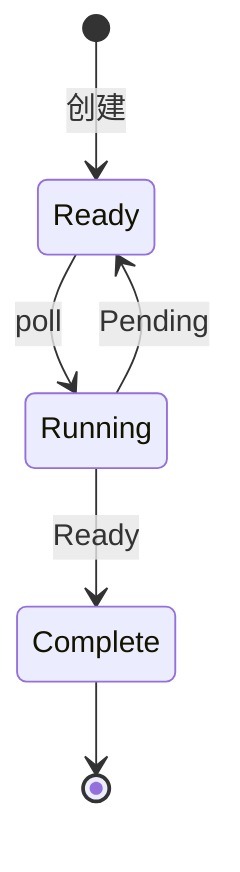

# 1. 异步形式化

## 目录

- [1. 异步形式化](#1-异步形式化)
  - [目录](#目录)
  - [1.1 异步计算模型](#11-异步计算模型)
    - [1.1.1 异步计算的形式化](#111-异步计算的形式化)
    - [1.1.2 计算图模型](#112-计算图模型)
  - [1.2 状态机语义](#12-状态机语义)
    - [1.2.1 async/await 的状态机转换](#121-asyncawait-的状态机转换)
    - [1.2.2 Pin 的形式化](#122-pin-的形式化)
  - [1.3 协同程序理论](#13-协同程序理论)
    - [1.3.1 协同程序定义](#131-协同程序定义)
    - [1.3.2 对称与非对称协程](#132-对称与非对称协程)
  - [1.4 CPS 变换](#14-cps-变换)
    - [1.4.1 续体传递风格](#141-续体传递风格)
    - [1.4.2 async/await 的 CPS 解释](#142-asyncawait-的-cps-解释)
    - [1.4.3 CPS 变换算法](#143-cps-变换算法)
  - [1.5 代数效应](#15-代数效应)
    - [1.5.1 效应处理器](#151-效应处理器)
    - [1.5.2 与 Monad 的关系](#152-与-monad-的关系)
  - [1.6 类型系统](#16-类型系统)
    - [1.6.1 Future 的类型理论](#161-future-的类型理论)
    - [1.6.2 异步子类型](#162-异步子类型)
    - [1.6.3 形式化证明](#163-形式化证明)

## 1.1 异步计算模型

### 1.1.1 异步计算的形式化

**定义 1.1.1**：异步计算可以形式化为状态转换系统。

形式化模型：
$$
\text{AsyncSystem} = (S, S_0, \rightarrow, A, O)
$$

其中：

- $S$：状态集合
- $S_0 \in S$：初始状态
- $\rightarrow \subseteq S \times A \times S$：转换关系
- $A$：动作集合
- $O$：可观察输出



### 1.1.2 计算图模型

**定义 1.1.2**：异步计算可表示为有向无环图（DAG）。

形式化：
$$
G = (V, E)
$$

其中：

- $V$：任务节点
- $E \subseteq V \times V$：依赖边

```rust
// Rust 中的计算图表示
use std::collections::HashMap;
use std::sync::Arc;

struct ComputationGraph<T> {
    nodes: HashMap<NodeId, Node<T>>,
    edges: Vec<(NodeId, NodeId)>,
}

struct Node<T> {
    id: NodeId,
    computation: Arc<dyn Fn() -> T + Send + Sync>,
    dependencies: Vec<NodeId>,
}

type NodeId = usize;

impl<T: Send + 'static> ComputationGraph<T> {
    async fn execute(&self) -> HashMap<NodeId, T> {
        let mut results: HashMap<NodeId, T> = HashMap::new();
        let mut completed: HashMap<NodeId, bool> = HashMap::new();

        // 拓扑排序执行
        while completed.len() < self.nodes.len() {
            for (id, node) in &self.nodes {
                if completed.contains_key(id) {
                    continue;
                }

                // 检查依赖是否完成
                let deps_satisfied = node.dependencies
                    .iter()
                    .all(|dep| completed.contains_key(dep));

                if deps_satisfied {
                    // 执行计算
                    let result = (node.computation)();
                    results.insert(*id, result);
                    completed.insert(*id, true);
                }
            }
        }

        results
    }
}
```

## 1.2 状态机语义

### 1.2.1 async/await 的状态机转换

**定理 1.2.1**：每个 async 函数被编译器转换为状态机。

形式化转换规则：

$$
\text{async fn } f() \rightarrow T \Rightarrow \text{enum } F \{ S_0, S_1, \ldots, S_n \}
$$

$$
\text{impl Future for } F \text{ {
    type Output = T;
    fn poll(...) -> Poll<T> { ... }
}}
$$

```rust
// 原始 async 函数
async fn example(x: i32) -> i32 {
    let a = step1(x).await;
    let b = step2(a).await;
    a + b
}

// 概念上的状态机转换
enum ExampleStateMachine {
    Start(i32),           // 初始状态，保存参数 x
    Waiting1(/* ... */),  // 等待 step1
    Waiting2(/* ... */),  // 等待 step2
    Done,
}

struct ExampleState {
    state: ExampleStateMachine,
    x: i32,
    a: Option<i32>,
    step1_future: Option<Step1Future>,
    step2_future: Option<Step2Future>,
}

impl Future for ExampleState {
    type Output = i32;

    fn poll(mut self: Pin<&mut Self>, cx: &mut Context<'_>) -> Poll<i32> {
        loop {
            match self.state {
                ExampleStateMachine::Start(x) => {
                    self.state = ExampleStateMachine::Waiting1;
                    self.step1_future = Some(step1(x));
                }
                ExampleStateMachine::Waiting1 => {
                    match self.step1_future.as_mut().unwrap().poll(cx) {
                        Poll::Ready(a) => {
                            self.a = Some(a);
                            self.state = ExampleStateMachine::Waiting2;
                            self.step2_future = Some(step2(a));
                        }
                        Poll::Pending => return Poll::Pending,
                    }
                }
                ExampleStateMachine::Waiting2 => {
                    match self.step2_future.as_mut().unwrap().poll(cx) {
                        Poll::Ready(b) => {
                            return Poll::Ready(self.a.unwrap() + b);
                        }
                        Poll::Pending => return Poll::Pending,
                    }
                }
                ExampleStateMachine::Done => panic!("polled after completion"),
            }
        }
    }
}
```

### 1.2.2 Pin 的形式化

**定义 1.2.2**：Pin 保证内存位置的稳定性。

形式化：
$$
\text{Pin}\langle P\langle T \rangle \rangle \Rightarrow \forall t, \text{addr}(t) = \text{const}
$$

```rust
use std::pin::Pin;
use std::marker::PhantomPinned;

// 自引用结构
struct SelfReferential {
    data: String,
    // 这个指针指向 data
    ptr_to_data: *const String,
    // 标记为 Unpin = false
    _pin: PhantomPinned,
}

impl SelfReferential {
    fn new(data: String) -> Pin<Box<Self>> {
        let mut boxed = Box::new(SelfReferential {
            data,
            ptr_to_data: std::ptr::null(),
            _pin: PhantomPinned,
        });

        let ptr = &boxed.data as *const String;
        boxed.ptr_to_data = ptr;

        Box::into_pin(boxed)
    }

    fn get_data(self: Pin<&Self>) -> &String {
        unsafe { &*self.ptr_to_data }
    }
}
```

## 1.3 协同程序理论

### 1.3.1 协同程序定义

**定义 1.3.1**：协同程序（Coroutine）是可以挂起和恢复执行的计算单元。

形式化：
$$
\text{Coroutine} = \text{State} \times (\text{Yield} \rightarrow \text{Resume})
$$

```rust
// Rust 中的生成器（Generator）
#![feature(generators, generator_trait)]

use std::ops::{Generator, GeneratorState};
use std::pin::Pin;

fn generator_example() {
    let mut gen = || {
        yield 1;
        yield 2;
        yield 3;
        return "done"
    };

    // 使用生成器
    match Pin::new(&mut gen).resume(()) {
        GeneratorState::Yielded(1) => println!("Yielded 1"),
        _ => {}
    }
}

// 手动实现协程
struct Coroutine {
    state: i32,
}

impl Coroutine {
    fn new() -> Self {
        Coroutine { state: 0 }
    }

    fn resume(&mut self) -> Option<i32> {
        self.state += 1;
        if self.state <= 3 {
            Some(self.state)
        } else {
            None
        }
    }
}
```

### 1.3.2 对称与非对称协程

**定义 1.3.2**：

- **非对称协程**：只能挂起到调用者（如 async/await）
- **对称协程**：可以在任意协程间切换

```rust
// 非对称协程（async/await）
async fn asymmetric_coroutine() {
    let result = sub_coroutine().await;  // 挂起，等待子协程
    println!("{}", result);
}

async fn sub_coroutine() -> i32 {
    42
}

// 对称协程（模拟）
use std::cell::RefCell;
use std::rc::Rc;

struct SymmetricCoroutine {
    id: usize,
    scheduler: Rc<RefCell<Scheduler>>,
}

impl SymmetricCoroutine {
    fn yield_to(&self, target: usize) {
        self.scheduler.borrow_mut().switch(self.id, target);
    }
}

struct Scheduler {
    coroutines: Vec<SymmetricCoroutine>,
    current: usize,
}

impl Scheduler {
    fn switch(&mut self, from: usize, to: usize) {
        self.current = to;
        // 保存 from 的状态，恢复 to 的状态
    }
}
```

## 1.4 CPS 变换

### 1.4.1 续体传递风格

**定义 1.4.1**：CPS（Continuation-Passing Style）将控制流显式化为函数参数。

形式化：
$$
\text{CPS}(f(x)) = \lambda k. f_{cps}(x, \lambda v. k(v))
$$

```rust
// 直接风格
fn add_direct(a: i32, b: i32) -> i32 {
    a + b
}

fn multiply_direct(a: i32, b: i32) -> i32 {
    a * b
}

fn compute_direct() -> i32 {
    let x = add_direct(1, 2);
    let y = multiply_direct(x, 3);
    y
}

// CPS 风格
type Continuation<T> = Box<dyn FnOnce(T)>;

fn add_cps(a: i32, b: i32, k: Continuation<i32>) {
    k(a + b);
}

fn multiply_cps(a: i32, b: i32, k: Continuation<i32>) {
    k(a * b);
}

fn compute_cps(k: Continuation<i32>) {
    add_cps(1, 2, Box::new(|x| {
        multiply_cps(x, 3, k);
    }));
}

// 使用 CPS
fn use_cps() {
    compute_cps(Box::new(|result| {
        println!("Result: {}", result);
    }));
}
```

### 1.4.2 async/await 的 CPS 解释

**定理 1.4.2**：async/await 是 CPS 的一种受限形式。

```rust
// async 函数的 CPS 解释

// async fn foo() -> T 等价于
// fn foo<K>(k: impl FnOnce(T) -> K) -> K

async fn async_example() -> i32 {
    let a = read_file("a.txt").await;
    let b = read_file("b.txt").await;
    a + b
}

// CPS 形式
fn cps_example<K>(k: impl FnOnce(i32) -> K) -> K {
    read_file_cps("a.txt", |a| {
        read_file_cps("b.txt", |b| {
            k(a + b)
        })
    })
}

fn read_file_cps<K>(path: &str, k: impl FnOnce(i32) -> K) -> K {
    // 异步读取，完成后调用 k
    k(42)  // 简化
}
```

### 1.4.3 CPS 变换算法

```rust
// 简化的 CPS 变换

enum Expr {
    Var(String),
    Lambda(String, Box<Expr>),
    Apply(Box<Expr>, Box<Expr>),
    Add(Box<Expr>, Box<Expr>),
}

fn cps_transform(expr: Expr, k: Box<dyn FnOnce(Expr) -> Expr>) -> Expr {
    match expr {
        Expr::Var(_) => k(expr),

        Expr::Lambda(param, body) => {
            // λx.M 变换为 λx.λk'.CPS(M, k')
            let k_param = fresh_var("k");
            let transformed_body = cps_transform(*body, Box::new(|v| {
                Expr::Apply(
                    Box::new(Expr::Var(k_param.clone())),
                    Box::new(v),
                )
            }));

            k(Expr::Lambda(param, Box::new(
                Expr::Lambda(k_param, Box::new(transformed_body))
            )))
        }

        Expr::Apply(func, arg) => {
            cps_transform(*func, Box::new(move |f| {
                cps_transform(*arg, Box::new(move |a| {
                    let cont = fresh_var("k");
                    let result = Expr::Apply(
                        Box::new(f),
                        Box::new(a),
                    );
                    // 包装在续体中
                    k(result)
                }))
            }))
        }

        Expr::Add(left, right) => {
            cps_transform(*left, Box::new(move |l| {
                cps_transform(*right, Box::new(move |r| {
                    k(Expr::Add(Box::new(l), Box::new(r)))
                }))
            }))
        }
    }
}

fn fresh_var(prefix: &str) -> String {
    format!("{}_{}", prefix, rand::random::<u32>())
}
```

## 1.5 代数效应

### 1.5.1 效应处理器

**定义 1.5.1**：代数效应（Algebraic Effects）将副作用建模为可处理的运算。

形式化：
$$
\text{Effect} = \text{Operation} \times \text{Parameter} \times \text{Continuation}
$$

```rust
// Rust 中的效应处理（模拟）
use std::pin::Pin;

// 效应定义
trait Effect {
    type Resume;
    type Result;
}

// 异步计算作为效应
struct AsyncEffect<T> {
    future: Pin<Box<dyn Future<Output = T>>>,
}

impl<T> Effect for AsyncEffect<T> {
    type Resume = T;
    type Result = T;
}

// 效应处理器
trait EffectHandler {
    fn handle<E: Effect>(&self, effect: E, k: impl FnOnce(E::Resume)) -> E::Result;
}

// 异步执行器作为效应处理器
struct AsyncHandler;

impl EffectHandler for AsyncHandler {
    fn handle<E: Effect>(&self, effect: E, k: impl FnOnce(E::Resume)) -> E::Result {
        // 执行效应并继续
        todo!()
    }
}
```

### 1.5.2 与 Monad 的关系

**定理 1.5.2**：代数效应与 Monad 是表达计算效应的两种等价方式。

```haskell
-- Haskell 风格的对比

-- Monad 方式
readFileM :: FilePath -> IO String

-- 效应方式
effect FileSystem where
    readFile :: FilePath -> String

handleFileSystem :: FileSystem a -> IO a
handleFileSystem = ...
```

```rust
// Rust 中的对应

// Monad 风格（Future）
fn read_file_monad(path: &str) -> impl Future<Output = String> {
    async move {
        // 异步读取
        tokio::fs::read_to_string(path).await.unwrap()
    }
}

// 效应风格（概念）
effect ReadFile {
    fn read_file(path: &str) -> String;
}

fn read_file_effect(path: &str) -> impl Effect<Resume = String> {
    ReadFileEffect { path: path.to_string() }
}
```

## 1.6 类型系统

### 1.6.1 Future 的类型理论

**定义 1.6.1**：Future 可以看作是一个特殊的 Monad。

形式化：
$$
\text{Future}\langle T \rangle = \text{Delay}\langle T \rangle
$$

Monad 定律：
$$
\begin{align}
\text{return} &: T \rightarrow \text{Future}\langle T \rangle \\
\text{bind} &: \text{Future}\langle T \rangle \times (T \rightarrow \text{Future}\langle U \rangle) \rightarrow \text{Future}\langle U \rangle \\
\end{align}
$$

```rust
// Future 实现 Monad 定律
trait FutureMonad: Future {
    fn bind<B, F>(self, f: F) -> impl Future<Output = B>
    where
        F: FnOnce(Self::Output) -> impl Future<Output = B>;

    fn return_(value: Self::Output) -> impl Future<Output = Self::Output>;
}

// 左单位元: return(a).bind(f) == f(a)
// 右单位元: m.bind(return) == m
// 结合律: m.bind(f).bind(g) == m.bind(|x| f(x).bind(g))
```

### 1.6.2 异步子类型

**定义 1.6.2**：异步类型的子类型关系。

形式化：
$$
T <: U \Rightarrow \text{Future}\langle T \rangle <: \text{Future}\langle U \rangle
$$

```rust
use std::pin::Pin;

// 协变示例
fn covariance_example() -> Pin<Box<dyn Future<Output = &'static str>>> {
    // &'static str 可以转换为 &str
    Box::pin(async { "hello" })
}

// 逆变示例（在输入位置）
fn contravariance_example<F>(f: F)
where
    F: Fn(&'static str),
{
    // F 接受 &'static str，可以接受更小的生命周期
}
```

### 1.6.3 形式化证明

```lean
-- Lean 形式化：异步计算的正确性

inductive Async (α : Type)
  | pure : α → Async α
  | bind : Async α → (α → Async β) → Async β
  | delay : (Unit → Async α) → Async α

-- Monad 定律
class AsyncLaws (M : Type → Type) [Monad M] where
  left_identity  : ∀ (a : α) (f : α → M β),
    (pure a) >>= f = f a

  right_identity : ∀ (m : M α),
    m >>= pure = m

  associativity  : ∀ (m : M α) (f : α → M β) (g : β → M γ),
    (m >>= f) >>= g = m >>= (λ x => f x >>= g)

-- Future 满足 Monad 定律
instance : AsyncLords Async where
  left_identity := by
    intros
    simp [bind, pure]

  right_identity := by
    intros
    simp [bind]
    induction m <;> simp

  associativity := by
    intros
    simp [bind]
    induction m <;> simp
```

---

**参考文档**：

- [03.1_异步编程基础](./03.1_异步编程基础.md)
- [03.2_Tokio运行时](./03.2_Tokio运行时.md)
- [04.2_单子与函子](../04_函数式编程/04.2_单子与函子.md)
- [04.1_函数式基础](../04_函数式编程/04.1_函数式基础.md)
