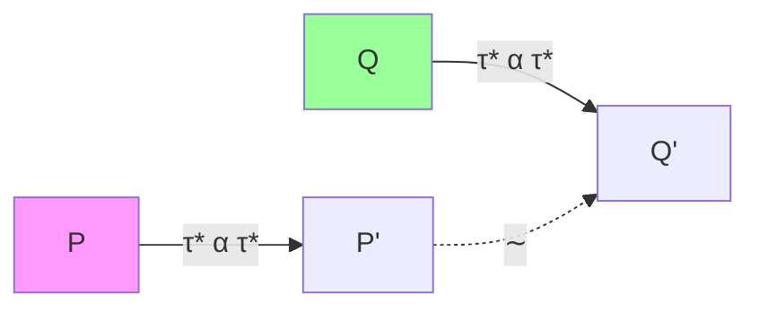

# 03.4 异步形式化

## 03.4.1 概述

异步计算的形式化语义为理解和验证并发程序提供数学基础。主要方法包括：

- **操作语义**：状态机转换
- **指称语义**：延续语义
- **进程代数**：CSP、CCS、π演算

---

## 03.4.2 操作语义

### 03.4.2.1 小步语义

**语法**

```
Expr ::= return(v) | await(e) | e1; e2 | async(e)
       | spawn(e) | yield | select{e1, e2}
```

**配置**

配置 $\langle E, \Theta, \Pi \rangle$ 包含：

- $E$：当前表达式
- $\Theta$：任务集合
- $\Pi$：挂起任务映射

**规则**

$$
\frac{e \not\in \text{Value}}{\langle \text{await}(e), \Theta, \Pi \rangle \to \langle \text{await}(e'), \Theta', \Pi \rangle} \text{(Await-Step)}
$$

$$
\frac{e \Downarrow v}{\langle \text{await}(e), \Theta, \Pi \rangle \to \langle \text{return}(v), \Theta, \Pi \rangle} \text{(Await-Ready)}
$$

### 03.4.2.2 状态机形式化

**定义 03.4.1 (异步状态机)**

异步状态机 $M = (S, s_0, \delta, F)$：

- $S$：状态集合
- $s_0$：初始状态
- $\delta : S \times \text{Event} \to S \times \text{Action}$：转移函数
- $F \subseteq S$：终态集合

```rust
// 概念表示
enum AsyncState<T> {
    Pending { waker: Option<Waker> },
    Polling { subtask: TaskId },
    Ready(T),
}

struct AsyncMachine<T> {
    state: AsyncState<T>,
    continuations: Vec<Box<dyn FnOnce(T) -> AsyncMachine<U>>>,
}
```

---

## 03.4.3 指称语义

### 03.4.3.1 延续语义

**定义 03.4.2 (延续)**

延续 $K$ 表示"剩余计算"：

$$K ::= \text{halt} \mid \lambda v. e; K$$

异步计算的指称：

$$\llbracket \text{async}(e) \rrbracket = \lambda K. \text{fork}(\lambda K'. \llbracket e \rrbracket(\text{halt}), K)$$

### 03.4.3.2 Monad Transformer

```haskell
-- 异步计算的Monad栈
newtype AsyncM a = AsyncM {
    runAsync :: ReaderT Env
                (StateT AsyncState
                  (ContT () IO)) a
}

-- 基本操作
spawn :: AsyncM () -> AsyncM TaskId
await :: TaskId -> AsyncM Result
yield :: AsyncM ()
```

---

## 03.4.4 进程代数

### 03.4.4.1 异步π演算

**语法**

$$
P, Q ::= \bar{x}\langle y \rangle \mid x(z).P \mid (\nu z)P \mid P \mid Q \mid !P \mid 0
$$

**规约规则**

$$
\overline{x}\langle y \rangle \mid x(z).P \to P[y/z] \quad \text{(Comm)}
$$

$$
\frac{P \to P'}{P \mid Q \to P' \mid Q} \quad \text{(Par)}
$$

$$
\frac{P \to P'}{(\nu z)P \to (\nu z)P'} \quad \text{(Res)}
$$

### 03.4.4.2 会话类型

```rust
// 线性通道协议
type Client = Send<String, Recv<i32, End>>;
type Server = Recv<String, Send<i32, End>>;

// 客户端实现
async fn client(ch: Chan<Client>) {
    let ch = ch.send("query".to_string()).await;
    let (result, ch) = ch.recv().await;
    ch.close();
}

// 服务器实现
async fn server(ch: Chan<Server>) {
    let (query, ch) = ch.recv().await;
    let ch = ch.send(42).await;
    ch.close();
}
```

---

## 03.4.5 双模拟理论

### 03.4.5.1 强双模拟

**定义 03.4.3 (强双模拟)**

关系 $R$ 是强双模拟，若 $P \ R \ Q$ 则：

$$
\forall \alpha. P \xrightarrow{\alpha} P' \Rightarrow \exists Q'. Q \xrightarrow{\alpha} Q' \land P' \ R \ Q'
$$

且反之亦然。

### 03.4.5.2 弱双模拟

**定义 03.4.4 (弱双模拟)**

$$
P \xRightarrow{\alpha} P' \iff P \to^* \xrightarrow{\alpha} \to^* P'
$$

弱双模拟允许内部动作（τ步）。



---

## 03.4.6 Lean4形式化

### 03.4.6.1 异步计算定义

```lean4
-- 异步计算归纳定义
inductive Async (m : Type → Type) (α : Type) : Type 1
  | pure : α → Async m α
  | bind : Async m α → (α → Async m β) → Async m β
  | await : m α → Async m α
  | race : Async m α → Async m α → Async m α
  | timeout : Async m α → Duration → Async m (Option α)

-- Monad实例
instance : Monad (Async m) where
  pure := Async.pure
  bind := Async.bind
```

### 03.4.6.2 操作语义

```lean4
-- 小步语义
inductive Step : Async m α → Event → Async m α → Prop
  | step_await {ma : m α} {a : α}
      (h : ma = pure a) :
      Step (await ma) Tau (pure a)

  | step_bind_pure {a e k} :
      Step (bind (pure a) k) Tau (k a)

  | step_bind {e e' k ev}
      (h : Step e ev e') :
      Step (bind e k) ev (bind e' k)

  | step_race_left {e1 e2} :
      Step (race e1 e2) Tau e1

  | step_race_right {e1 e2} :
      Step (race e1 e2) Tau e2
```

### 03.4.6.3 等价关系

```lean4
-- 强双模拟
def StrongBisimulation (R : Async m α → Async m α → Prop) : Prop :=
  ∀ e1 e2, R e1 e2 →
    (∀ e1' ev, Step e1 ev e1' →
      ∃ e2', Step e2 ev e2' ∧ R e1' e2') ∧
    (∀ e2' ev, Step e2 ev e2' →
      ∃ e1', Step e1 ev e1' ∧ R e1' e2')

-- 强等价
def StrongEquiv (e1 e2 : Async m α) : Prop :=
  ∃ R, StrongBisimulation R ∧ R e1 e2

notation:50 e1 " ∼ " e2 => StrongEquiv e1 e2
```

---

## 03.4.7 类型系统

### 03.4.7.1 效果类型

```haskell
-- 效果标注
async : Int -> Async <io, suspend> Int
spawn : Async e a -> Async e TaskId
await : TaskId -> Async e Result
```

### 03.4.7.2 线性类型保证

```lean4
-- 确保资源正确释放
inductive AsyncRes (r : Resource) (α : Type) : Type
  | acquire : AsyncRes r r
  | use : (r → m α) → AsyncRes r α
  | release : AsyncRes r Unit

-- 强制使用
scoped : AsyncRes r α → AsyncRes r α
```

---

## 03.4.8 验证应用

### 03.4.8.1 死锁检测

```rust
// 形式化证明无死锁
#[ensures(result.is_ok())]
async fn safe_lock_order() {
    let (lock_a, lock_b) = (Mutex::new(0), Mutex::new(0));

    // 固定顺序获取
    let a = lock_a.lock().await;
    let b = lock_b.lock().await;
    // ...
}
```

### 03.4.8.2 竞态条件分析

```lean4
-- 证明原子性
theorem atomic_increment_safe :
  ∀ counter,
    executes_atomically (increment counter) →
    final_value counter = initial_value counter + 1 := by
  -- 证明
```

---

## 03.4.9 练习

1. 证明 `async { await async { e } } ∼ async { e }`
2. 形式化分析select的公平性
3. 实现一个带形式化验证的异步队列

---

## 03.4.10 参考文献与交叉引用

- [03.1 并发模型对比](./03.1_并发模型对比.md)
- [03.2 Future与Promise](./03.2_Future与Promise.md)
- [03.3 Tokio运行时](./03.3_Tokio运行时.md)
- [Milner, 1989] "Communication and Concurrency"
- [Pierce, 2002] "Types and Programming Languages"
