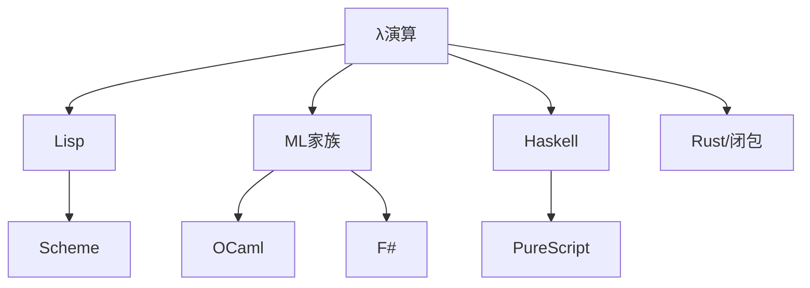

# 04.1 λ演算

## 04.1.1 概述

**λ演算 (Lambda Calculus)** 由Alonzo Church于1930年代提出，是函数式编程的理论基础。它与图灵机等价，是最小的通用计算模型。

### 04.1.1.1 核心概念

| 概念 | 符号 | 含义 |
|------|------|------|
| 抽象 | $\lambda x.e$ | 匿名函数 |
| 应用 | $e_1 \ e_2$ | 函数调用 |
| 变量 | $x$ | 绑定或自由变量 |

### 04.1.1.2 与编程语言关系



---

## 04.1.2 语法与基础

### 04.1.2.1 BNF语法

$$
\begin{aligned}
e ::= & \ x \quad \text{(变量)} \\
     & \mid \ \lambda x.e \quad \text{(抽象)} \\
     & \mid \ e \ e \quad \text{(应用)}
\end{aligned}
$$

### 04.1.2.2 Rust实现AST

```rust
// λ项的AST表示
enum Lambda {
    Var(String),                    // 变量
    Abs(String, Box<Lambda>),      // λx.e
    App(Box<Lambda>, Box<Lambda>), // e1 e2
}

impl Lambda {
    // 构造器
    fn var(name: &str) -> Self {
        Lambda::Var(name.to_string())
    }

    fn abs(param: &str, body: Lambda) -> Self {
        Lambda::Abs(param.to_string(), Box::new(body))
    }

    fn app(func: Lambda, arg: Lambda) -> Self {
        Lambda::App(Box::new(func), Box::new(arg))
    }
}

// 示例: λx.x (恒等函数)
let id = Lambda::abs("x", Lambda::var("x"));
```

### 04.1.2.3 自由变量与绑定变量

**定义 04.1.1 (自由变量)**

$$
\begin{aligned}
FV(x) &= \{x\} \\
FV(\lambda x.e) &= FV(e) \setminus \{x\} \\
FV(e_1 \ e_2) &= FV(e_1) \cup FV(e_2)
\end{aligned}
$$

**定义 04.1.2 (绑定变量)**

变量 $x$ 在 $\lambda x.e$ 中绑定，否则为自由变量。

```rust
impl Lambda {
    fn free_vars(&self) -> HashSet<String> {
        match self {
            Var(x) => {
                let mut set = HashSet::new();
                set.insert(x.clone());
                set
            }
            Abs(x, body) => {
                let mut vars = body.free_vars();
                vars.remove(x);
                vars
            }
            App(e1, e2) => {
                let mut vars = e1.free_vars();
                vars.extend(e2.free_vars());
                vars
            }
        }
    }
}
```

---

## 04.1.3 β规约

### 04.1.3.1 定义

**定义 04.1.3 (β规约)**

$$(\lambda x.e_1) \ e_2 \to_\beta e_1[e_2/x]$$

其中 $e_1[e_2/x]$ 表示将 $e_1$ 中所有自由出现的 $x$ 替换为 $e_2$。

### 04.1.3.2 替换定义

$$
\begin{aligned}
x[e/x] &= e \\
y[e/x] &= y \quad (y \neq x) \\
(e_1 \ e_2)[e/x] &= e_1[e/x] \ e_2[e/x] \\
(\lambda y.e_1)[e/x] &= \lambda y.(e_1[e/x]) \quad (y \notin FV(e) \land y \neq x)
\end{aligned}
$$

### 04.1.3.3 α转换

**定义 04.1.4 (α等价)**

重命名绑定变量不改变含义：

$$\lambda x.e =_\alpha \lambda y.(e[y/x]) \quad (y \notin FV(e))$$

```rust
impl Lambda {
    // 生成新变量名
    fn fresh_var(base: &str, used: &HashSet<String>) -> String {
        let mut i = 0;
        loop {
            let name = format!("{}_{}", base, i);
            if !used.contains(&name) {
                return name;
            }
            i += 1;
        }
    }

    // 替换（处理命名冲突）
    fn substitute(&self, var: &str, replacement: &Lambda) -> Lambda {
        match self {
            Var(x) if x == var => replacement.clone(),
            Var(_) => self.clone(),
            Abs(x, body) if x == var => self.clone(),
            Abs(x, body) => {
                // 避免变量捕获
                if replacement.free_vars().contains(x) {
                    let new_x = Self::fresh_var(x, &replacement.free_vars());
                    let new_body = body.substitute(x, &Var(new_x.clone()));
                    Abs(new_x, Box::new(new_body.substitute(var, replacement)))
                } else {
                    Abs(x.clone(), Box::new(body.substitute(var, replacement)))
                }
            }
            App(e1, e2) => App(
                Box::new(e1.substitute(var, replacement)),
                Box::new(e2.substitute(var, replacement)),
            ),
        }
    }
}
```

### 04.1.3.4 规约实现

```rust
impl Lambda {
    fn beta_reduce(&self) -> Option<Lambda> {
        match self {
            // β规约: (λx.e1) e2 -> e1[e2/x]
            App(e1, e2) => match e1.as_ref() {
                Abs(x, body) => Some(body.substitute(x, e2)),
                _ => {
                    // 尝试规约e1
                    if let Some(e1_reduced) = e1.beta_reduce() {
                        Some(App(Box::new(e1_reduced), e2.clone()))
                    } else {
                        // 尝试规约e2
                        e2.beta_reduce().map(|e2_reduced| {
                            App(e1.clone(), Box::new(e2_reduced))
                        })
                    }
                }
            },
            Abs(x, body) => {
                body.beta_reduce().map(|b| Abs(x.clone(), Box::new(b)))
            }
            _ => None,
        }
    }

    // 完全规约
    fn normalize(&self) -> Lambda {
        let mut current = self.clone();
        while let Some(reduced) = current.beta_reduce() {
            current = reduced;
        }
        current
    }
}
```

---

## 04.1.4 求值策略

### 04.1.4.1 正规序 vs 应用序

| 策略 | 名称 | 特点 | 保证 |
|------|------|------|------|
| 正规序 | 最左最外 | 先规约最外层 | 若有范式必达 |
| 应用序 | 最左最内 | 先求参数 | 可能不终止 |

```haskell
-- 示例：
let omega = (\x. x x) (\x. x x)  -- 无限循环
let const = \x. \y. x

-- 正规序
const 42 omega
--> (\y. 42) omega
--> 42

-- 应用序
const 42 omega
--> const 42 (omega omega)
--> const 42 (omega omega)
--> ... (不终止)
```

### 04.1.4.2 Rust实现

```rust
enum EvalStrategy {
    NormalOrder,   // 正规序
    ApplicativeOrder, // 应用序
}

impl Lambda {
    fn eval(&self, strategy: EvalStrategy) -> Lambda {
        match strategy {
            EvalStrategy::NormalOrder => self.normal_eval(),
            EvalStrategy::ApplicativeOrder => self.applicative_eval(),
        }
    }

    // 正规序：最左最外优先
    fn normal_eval(&self) -> Lambda {
        match self {
            App(e1, e2) => match e1.as_ref() {
                Abs(x, body) => {
                    body.substitute(x, e2).normal_eval()
                }
                _ => {
                    let e1_eval = e1.normal_eval();
                    if let Abs(x, body) = e1_eval {
                        body.substitute(x, e2).normal_eval()
                    } else {
                        App(Box::new(e1_eval), e2.clone())
                    }
                }
            },
            Abs(x, body) => {
                Abs(x.clone(), Box::new(body.normal_eval()))
            }
            _ => self.clone(),
        }
    }
}
```

---

## 04.1.5 Church编码

### 04.1.5.1 Church数

**定义 04.1.5 (Church数)**

$$
\begin{aligned}
\overline{0} &= \lambda f. \lambda x. x \\
\overline{1} &= \lambda f. \lambda x. f \ x \\
\overline{2} &= \lambda f. \lambda x. f \ (f \ x) \\
\overline{n} &= \lambda f. \lambda x. f^n \ x
\end{aligned}
$$

```rust
impl Lambda {
    // 创建Church数
    fn church_n(n: u32) -> Lambda {
        let f = Lambda::var("f");
        let x = Lambda::var("x");

        let mut body = x;
        for _ in 0..n {
            body = Lambda::app(f.clone(), body);
        }

        Lambda::abs("f", Lambda::abs("x", body))
    }
}
```

### 04.1.5.2 算术运算

**后继**

$$\text{SUCC} = \lambda n. \lambda f. \lambda x. f \ (n \ f \ x)$$

**加法**

$$\text{ADD} = \lambda m. \lambda n. \lambda f. \lambda x. m \ f \ (n \ f \ x)$$

**乘法**

$$\text{MUL} = \lambda m. \lambda n. \lambda f. m \ (n \ f)$$

```rust
// 后继
fn succ() -> Lambda {
    let n = Lambda::var("n");
    let f = Lambda::var("f");
    let x = Lambda::var("x");

    Lambda::abs("n", Lambda::abs("f", Lambda::abs("x",
        Lambda::app(f.clone(), Lambda::app(
            Lambda::app(n, f.clone()),
            x
        ))
    )))
}

// 加法
fn add() -> Lambda {
    let m = Lambda::var("m");
    let n = Lambda::var("n");
    let f = Lambda::var("f");
    let x = Lambda::var("x");

    Lambda::abs("m", Lambda::abs("n", Lambda::abs("f", Lambda::abs("x",
        Lambda::app(
            Lambda::app(m.clone(), f.clone()),
            Lambda::app(
                Lambda::app(n.clone(), f.clone()),
                x
            )
        )
    ))))
}
```

### 04.1.5.3 Church布尔

$$
\begin{aligned}
\text{TRUE} &= \lambda x. \lambda y. x \\
\text{FALSE} &= \lambda x. \lambda y. y \\
\text{IF} &= \lambda b. \lambda t. \lambda f. b \ t \ f \\
\text{AND} &= \lambda p. \lambda q. p \ q \ p \\
\text{OR} &= \lambda p. \lambda q. p \ p \ q \\
\text{NOT} &= \lambda p. p \ \text{FALSE} \ \text{TRUE}
\end{aligned}
$$

---

## 04.1.6 组合子

### 04.1.6.1 SK组合子

**定义 04.1.6 (SK组合子)**

$$
\begin{aligned}
S &= \lambda f. \lambda g. \lambda x. f \ x \ (g \ x) \\
K &= \lambda x. \lambda y. x \\
I &= \lambda x. x = S \ K \ K
\end{aligned}
$$

**定理 04.1.1 (SK完备性)**

任何λ项都可用S和K表示。

### 04.1.6.2 Y组合子

**定义 04.1.7 (Y组合子)**

$$Y = \lambda f. (\lambda x. f \ (x \ x)) \ (\lambda x. f \ (x \ x))$$

**不动点性质**

$$Y \ f =_\beta f \ (Y \ f)$$

```rust
// Y组合子
fn y_combinator() -> Lambda {
    let f = Lambda::var("f");
    let x = Lambda::var("x");

    let inner = Lambda::abs("x", Lambda::app(
        f.clone(),
        Lambda::app(x.clone(), x.clone())
    ));

    Lambda::abs("f", Lambda::app(inner.clone(), inner))
}

// 阶乘（使用Y组合子）
fn factorial() -> Lambda {
    let f = Lambda::var("f");
    let n = Lambda::var("n");

    // λf. λn. IF (ISZERO n) 1 (MUL n (f (PRED n)))
    Lambda::abs("f", Lambda::abs("n",
        // 简化的if表达式
        Lambda::app(
            Lambda::app(
                Lambda::app(is_zero(), n.clone()),
                Lambda::church_n(1)
            ),
            Lambda::app(
                Lambda::app(mul(), n.clone()),
                Lambda::app(f.clone(), Lambda::app(pred(), n.clone()))
            )
        )
    ))
}
```

---

## 04.1.7 Lean4形式化

### 04.1.7.1 λ项定义

```lean4
inductive Term : Type
  | var : String → Term
  | abs : String → Term → Term
  | app : Term → Term → Term

deriving Repr, BEq

open Term
```

### 04.1.7.2 替换与α等价

```lean4
def fv : Term → Finset String
  | var x => {x}
  | abs x t => fv t \ {x}
  | app t1 t2 => fv t1 ∪ fv t2

def subst (t : Term) (x : String) (s : Term) : Term :=
  match t with
  | var y => if y = x then s else var y
  | abs y t' =>
      if y = x then abs y t'
      else if y ∉ fv s then abs y (subst t' x s)
      else
        let y' := y ++ "'"
        abs y' (subst (subst t' y (var y')) x s)
  | app t1 t2 => app (subst t1 x s) (subst t2 x s)
```

### 04.1.7.3 β规约

```lean4
inductive BetaStep : Term → Term → Prop
  | beta {x t1 t2} :
      BetaStep (app (abs x t1) t2) (subst t1 x t2)
  | app_left {t1 t1' t2} :
      BetaStep t1 t1' → BetaStep (app t1 t2) (app t1' t2)
  | app_right {t1 t2 t2'} :
      BetaStep t2 t2' → BetaStep (app t1 t2) (app t1 t2')
  | abs_body {x t t'} :
      BetaStep t t' → BetaStep (abs x t) (abs x t')

notation:50 t " →β " t' => BetaStep t t'

-- Church-Rosser定理
theorem confluence {t t1 t2 : Term}
    (h1 : t →β* t1) (h2 : t →β* t2) :
    ∃ t', t1 →β* t' ∧ t2 →β* t' := by
  sorry  -- 复杂证明省略
```

---

## 04.1.8 练习

1. 实现λ项的De Bruijn索引表示
2. 证明 `ADD (church_n 2) (church_n 3) →β church_n 5`
3. 用SK组合子表示恒等函数

---

## 04.1.9 参考文献与交叉引用

- [04.2 高阶函数](./04.2_高阶函数.md)
- [04.3 单子与函子](./04.3_单子与函子.md)
- [Barendregt, 1984] "The Lambda Calculus: Its Syntax and Semantics"
- [Pierce, 2002] "Types and Programming Languages"
