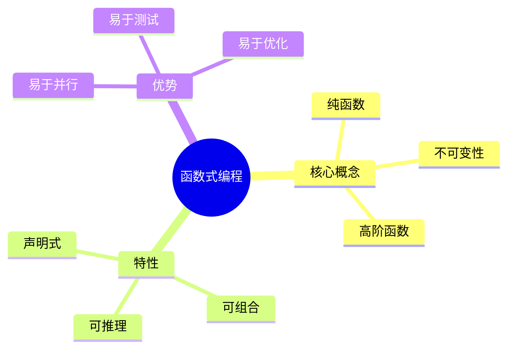

# 1. 函数式基础

## 目录

- [1. 函数式基础](#1-函数式基础)
  - [目录](#目录)
  - [1.1 函数式编程概述](#11-函数式编程概述)
    - [1.1.1 核心思想](#111-核心思想)
    - [1.1.2 与命令式编程对比](#112-与命令式编程对比)
  - [1.2 纯函数](#12-纯函数)
    - [1.2.1 纯函数定义](#121-纯函数定义)
    - [1.2.2 引用透明性](#122-引用透明性)
    - [1.2.3 Rust 中的纯函数](#123-rust-中的纯函数)
  - [1.3 不可变性](#13-不可变性)
    - [1.3.1 不可变性原则](#131-不可变性原则)
    - [1.3.2 持久化数据结构](#132-持久化数据结构)
  - [1.4 高阶函数](#14-高阶函数)
    - [1.4.1 高阶函数定义](#141-高阶函数定义)
    - [1.4.2 常用高阶函数](#142-常用高阶函数)
    - [1.4.3 闭包](#143-闭包)
  - [1.5 递归与尾递归](#15-递归与尾递归)
    - [1.5.1 递归基础](#151-递归基础)
    - [1.5.2 尾递归优化](#152-尾递归优化)
  - [1.6 函数式数据结构](#16-函数式数据结构)
    - [1.6.1 代数数据类型](#161-代数数据类型)
    - [1.6.2 函数式栈与队列](#162-函数式栈与队列)
    - [1.6.3 不可变映射](#163-不可变映射)

## 1.1 函数式编程概述

### 1.1.1 核心思想

**定义 1.1.1**：函数式编程（Functional Programming）是一种编程范式，将计算视为数学函数的求值，避免状态变化和可变数据。

形式化定义：
$$
\text{Program} = \{f_1, f_2, \ldots, f_n\}, \text{ where } f_i: Input \rightarrow Output
$$



### 1.1.2 与命令式编程对比

| 特性 | 命令式 | 函数式 |
|------|--------|--------|
| 基本单元 | 语句/指令 | 表达式/函数 |
| 状态 | 可变 | 不可变 |
| 控制流 | 循环/跳转 | 递归/组合 |
| 数据抽象 | 对象 | 代数数据类型 |
| 执行顺序 | 顺序重要 | 顺序无关（纯函数）|

```rust
// 命令式风格
fn imperative_sum(n: i32) -> i32 {
    let mut sum = 0;
    for i in 1..=n {
        sum += i;
    }
    sum
}

// 函数式风格
fn functional_sum(n: i32) -> i32 {
    (1..=n).fold(0, |acc, x| acc + x)
}

// Haskell 风格（伪代码）
-- sum [1..n] = foldl (+) 0 [1..n]
```

## 1.2 纯函数

### 1.2.1 纯函数定义

**定义 1.2.1**：纯函数（Pure Function）满足：

- **引用透明**：相同输入总是产生相同输出
- **无副作用**：不修改外部状态

形式化：
$$
\forall x, f(x) = f(x) \land \neg \text{SideEffect}(f)
$$

```rust
// 纯函数示例
fn pure_add(a: i32, b: i32) -> i32 {
    a + b  // 只依赖输入，无副作用
}

// 非纯函数示例
static mut COUNTER: i32 = 0;

fn impure_add(a: i32) -> i32 {
    unsafe {
        COUNTER += 1;  // 副作用：修改全局状态
        a + COUNTER
    }
}

// 另一个非纯函数例子
fn impure_random() -> f64 {
    rand::random()  // 相同输入，不同输出
}
```

### 1.2.2 引用透明性

**定义 1.2.2**：引用透明（Referential Transparency）指表达式可以被其值替换而不影响程序行为。

形式化：
$$
\forall E[x], x = v \Rightarrow E[x] = E[v]
$$

```rust
fn referential_transparency() {
    let x = pure_add(2, 3);  // x = 5

    // 可以替换为值
    let result1 = pure_add(x, 1);     // pure_add(5, 1) = 6
    let result2 = pure_add(5, 1);     // 直接替换

    assert_eq!(result1, result2);

    // 这种替换在纯函数中总是安全的
}
```

### 1.2.3 Rust 中的纯函数

```rust
// 纯函数在 Rust 中的实践

// 1. 显式声明纯函数风格
fn transform_data(input: &[i32]) -> Vec<i32> {
    input.iter()
        .map(|x| x * 2)
        .filter(|x| *x > 10)
        .collect()
}

// 2. 避免副作用
fn bad_example() {
    let mut data = vec![1, 2, 3];

    // 不好：修改外部状态
    data.push(4);

    println!("{:?}", data);
}

fn good_example() {
    let data = vec![1, 2, 3];

    // 好：创建新值
    let new_data: Vec<_> = data.iter()
        .chain(std::iter::once(&4))
        .copied()
        .collect();

    println!("Original: {:?}", data);      // [1, 2, 3]
    println!("New: {:?}", new_data);       // [1, 2, 3, 4]
}
```

## 1.3 不可变性

### 1.3.1 不可变性原则

**定义 1.3.1**：不可变性（Immutability）指数据一旦创建就不能被修改。

形式化：
$$
\forall d \in Data, \text{create}(d) \Rightarrow \neg \text{modify}(d)
$$

```rust
// Rust 中的不可变性

// 默认不可变
fn immutability_by_default() {
    let x = 5;
    // x = 6;  // 编译错误！

    // 显式可变
    let mut y = 5;
    y = 6;  // OK
}

// 不可变借用
fn immutable_borrowing() {
    let data = vec![1, 2, 3];

    // 多个不可变引用
    let ref1 = &data;
    let ref2 = &data;

    println!("{:?} {:?}", ref1, ref2);
}
```

### 1.3.2 持久化数据结构

**定义 1.3.2**：持久化数据结构通过共享结构实现高效的不变更新。

```rust
// Rust 中的持久化数据结构（使用 im crate）
use im::Vector;

fn persistent_data_structure() {
    let v1 = vector![1, 2, 3];
    let v2 = v1.push_back(4);  // v1 保持不变
    let v3 = v1.push_back(5);  // 共享 v1 的结构

    println!("v1: {:?}", v1);  // [1, 2, 3]
    println!("v2: {:?}", v2);  // [1, 2, 3, 4]
    println!("v3: {:?}", v3);  // [1, 2, 3, 5]
}

// 自定义不可变链表
#[derive(Debug, Clone)]
enum List<T> {
    Nil,
    Cons(T, Box<List<T>>),
}

impl<T> List<T> {
    fn new() -> Self {
        List::Nil
    }

    fn prepend(&self, value: T) -> Self {
        List::Cons(value, Box::new(self.clone()))
    }

    fn head(&self) -> Option<&T> {
        match self {
            List::Nil => None,
            List::Cons(h, _) => Some(h),
        }
    }

    fn tail(&self) -> Self {
        match self {
            List::Nil => List::Nil,
            List::Cons(_, t) => (**t).clone(),
        }
    }
}
```

## 1.4 高阶函数

### 1.4.1 高阶函数定义

**定义 1.4.1**：高阶函数（Higher-Order Function）是以函数为参数或返回值的函数。

形式化：
$$
\text{HOF}: (A \rightarrow B) \rightarrow C \quad \text{or} \quad \text{HOF}: A \rightarrow (B \rightarrow C)
$$

```rust
// 以函数为参数
fn apply_twice<F>(f: F, x: i32) -> i32
where
    F: Fn(i32) -> i32,
{
    f(f(x))
}

// 以函数为返回值
fn make_adder(n: i32) -> impl Fn(i32) -> i32 {
    move |x| x + n
}

// 组合函数
fn compose<A, B, C, F, G>(f: F, g: G) -> impl Fn(A) -> C
where
    F: Fn(B) -> C,
    G: Fn(A) -> B,
{
    move |x| f(g(x))
}

fn hof_examples() {
    let add_one = |x| x + 1;
    let multiply_by_two = |x| x * 2;

    // 使用 apply_twice
    let result = apply_twice(add_one, 5);  // 7

    // 使用 make_adder
    let add_five = make_adder(5);
    println!("{}", add_five(10));  // 15

    // 使用 compose
    let add_then_multiply = compose(multiply_by_two, add_one);
    println!("{}", add_then_multiply(5));  // 12 (5+1)*2
}
```

### 1.4.2 常用高阶函数

```rust
fn common_hofs() {
    let numbers = vec![1, 2, 3, 4, 5];

    // map: 转换每个元素
    let doubled: Vec<_> = numbers.iter().map(|x| x * 2).collect();

    // filter: 筛选元素
    let evens: Vec<_> = numbers.iter().filter(|x| *x % 2 == 0).collect();

    // fold（reduce）: 聚合
    let sum: i32 = numbers.iter().fold(0, |acc, x| acc + x);

    // any / all: 存在/全称量词
    let has_even = numbers.iter().any(|x| x % 2 == 0);
    let all_positive = numbers.iter().all(|x| *x > 0);

    // flat_map: 映射并展平
    let nested = vec![vec![1, 2], vec![3, 4]];
    let flat: Vec<_> = nested.iter().flat_map(|v| v.iter()).collect();

    // zip: 合并两个迭代器
    let names = vec!["Alice", "Bob"];
    let ages = vec![30, 25];
    let combined: Vec<_> = names.iter().zip(ages.iter()).collect();
}
```

### 1.4.3 闭包

**定义 1.4.2**：闭包（Closure）是捕获其环境的匿名函数。

```rust
fn closures() {
    let outer_var = 10;

    // 捕获环境
    let closure = |x| x + outer_var;
    println!("{}", closure(5));  // 15

    // 移动捕获
    let s = String::from("hello");
    let moving_closure = move || {
        println!("{}", s);  // s 被移动到闭包
    };
    moving_closure();
    // s 不能再使用

    // Fn, FnMut, FnOnce
    fn apply_fn<F>(f: F) where F: Fn() {
        f();
    }

    fn apply_fn_mut<F>(mut f: F) where F: FnMut() {
        f();
    }

    fn apply_fn_once<F>(f: F) where F: FnOnce() {
        f();
    }
}
```

## 1.5 递归与尾递归

### 1.5.1 递归基础

**定义 1.5.1**：递归函数在定义中调用自身。

形式化：
$$
f(x) = \begin{cases}
base(x) & \text{if } terminal(x) \\
combine(x, f(recurse(x))) & \text{otherwise}
\end{cases}
$$

```rust
// 阶乘的递归实现
fn factorial(n: u64) -> u64 {
    if n == 0 {
        1
    } else {
        n * factorial(n - 1)
    }
}

// 斐波那契数列
fn fibonacci(n: u64) -> u64 {
    match n {
        0 => 0,
        1 => 1,
        _ => fibonacci(n - 1) + fibonacci(n - 2),
    }
}

// 列表操作
fn list_length<T>(list: &[T]) -> usize {
    match list {
        [] => 0,
        [_, tail @ ..] => 1 + list_length(tail),
    }
}
```

### 1.5.2 尾递归优化

**定义 1.5.2**：尾递归（Tail Recursion）指递归调用是函数的最后一个操作，可被优化为循环。

形式化：
$$
f(x, acc) = \begin{cases}
acc & \text{if } terminal(x) \\
f(recurse(x), combine(acc, x)) & \text{otherwise}
\end{cases}
$$

```rust
// 尾递归优化的阶乘
fn factorial_tail(n: u64, acc: u64) -> u64 {
    if n == 0 {
        acc
    } else {
        factorial_tail(n - 1, n * acc)
    }
}

// 尾递归优化的斐波那契
fn fibonacci_tail(n: u64, a: u64, b: u64) -> u64 {
    match n {
        0 => a,
        1 => b,
        _ => fibonacci_tail(n - 1, b, a + b),
    }
}

// 使用 trampolining 处理尾递归
enum Trampoline<A> {
    Done(A),
    More(Box<dyn FnOnce() -> Trampoline<A>>),
}

fn run_trampoline<A>(mut f: Trampoline<A>) -> A {
    loop {
        match f {
            Trampoline::Done(a) => return a,
            Trampoline::More(f) => f = f(),
        }
    }
}
```

## 1.6 函数式数据结构

### 1.6.1 代数数据类型

**定义 1.6.1**：代数数据类型（ADT）由乘积类型和求和类型组成。

形式化：
$$
\text{Product}(A, B) = A \times B \\
\text{Sum}(A, B) = A + B
$$

```rust
// 乘积类型：结构体
struct Point {
    x: f64,
    y: f64,
}

// 求和类型：枚举
enum Shape {
    Circle { radius: f64 },
    Rectangle { width: f64, height: f64 },
    Triangle { a: f64, b: f64, c: f64 },
}

// 递归类型
enum Tree<T> {
    Leaf,
    Node(T, Box<Tree<T>>, Box<Tree<T>>),
}

// 使用代数数据类型
fn area(shape: &Shape) -> f64 {
    match shape {
        Shape::Circle { radius } => std::f64::consts::PI * radius * radius,
        Shape::Rectangle { width, height } => width * height,
        Shape::Triangle { a, b, c } => {
            let s = (a + b + c) / 2.0;
            (s * (s - a) * (s - b) * (s - c)).sqrt()
        }
    }
}
```

### 1.6.2 函数式栈与队列

```rust
// 函数式栈
#[derive(Debug, Clone)]
struct Stack<T> {
    list: List<T>,
}

#[derive(Debug, Clone)]
enum List<T> {
    Nil,
    Cons(T, Box<List<T>>),
}

impl<T> Stack<T> {
    fn new() -> Self {
        Stack { list: List::Nil }
    }

    fn push(&self, value: T) -> Self {
        Stack {
            list: List::Cons(value, Box::new(self.list.clone())),
        }
    }

    fn pop(&self) -> Option<(T, Self)> {
        match &self.list {
            List::Nil => None,
            List::Cons(head, tail) => {
                Some((head.clone(), Stack { list: (**tail).clone() }))
            }
        }
    }

    fn peek(&self) -> Option<&T> {
        match &self.list {
            List::Nil => None,
            List::Cons(head, _) => Some(head),
        }
    }
}

// 使用示例
fn stack_usage() {
    let s1 = Stack::new();
    let s2 = s1.push(1);
    let s3 = s2.push(2);

    // s1, s2, s3 都是有效的
    println!("{:?}", s3.peek());  // Some(2)
    println!("{:?}", s2.peek());  // Some(1)
}
```

### 1.6.3 不可变映射

```rust
use std::collections::HashMap;
use im::HashMap as ImHashMap;

fn immutable_map() {
    // 标准库的 HashMap（可变）
    let mut map1 = HashMap::new();
    map1.insert("key", 1);

    // im crate 的不可变 HashMap
    let map2 = ImHashMap::new();
    let map3 = map2.update("key", 1);  // map2 保持不变
    let map4 = map3.update("key2", 2);

    println!("{:?}", map2.get("key"));  // None
    println!("{:?}", map3.get("key"));  // Some(1)
    println!("{:?}", map4.get("key2")); // Some(2)
}
```

---

**参考文档**：

- [04.2_单子与函子](./04.2_单子与函子.md)
- [04.3_惰性求值](./04.3_惰性求值.md)
- [04.4_函数式设计模式](./04.4_函数式设计模式.md)
