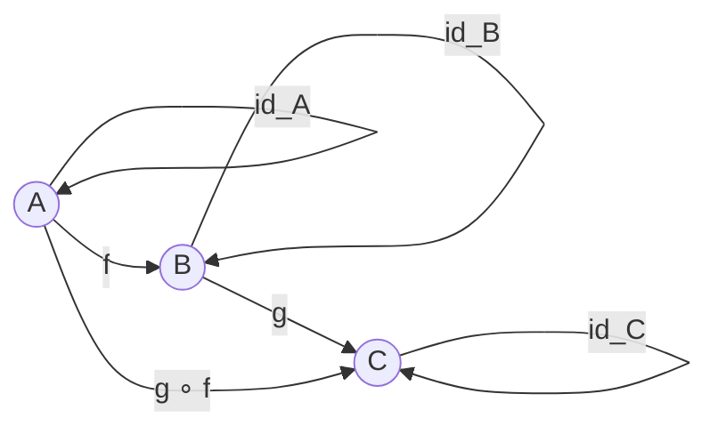

# 1. 单子与函子

## 目录

- [1. 单子与函子](#1-单子与函子)
  - [目录](#目录)
  - [1.1 范畴论基础](#11-范畴论基础)
    - [1.1.1 范畴的定义](#111-范畴的定义)
    - [1.1.2 编程中的范畴](#112-编程中的范畴)
  - [1.2 函子](#12-函子)
    - [1.2.1 函子定义](#121-函子定义)
    - [1.2.2 函子定律](#122-函子定律)
    - [1.2.3 协变与逆变](#123-协变与逆变)
  - [1.3 应用函子](#13-应用函子)
    - [1.3.1 应用函子定义](#131-应用函子定义)
    - [1.3.2 应用函子定律](#132-应用函子定律)
  - [1.4 单子](#14-单子)
    - [1.4.1 单子定义](#141-单子定义)
    - [1.4.2 单子定律](#142-单子定律)
    - [1.4.3 Kleisli 组合](#143-kleisli-组合)
  - [1.5 标准单子](#15-标准单子)
    - [1.5.1 Maybe 单子（Option）](#151-maybe-单子option)
    - [1.5.2 List 单子](#152-list-单子)
    - [1.5.3 State 单子](#153-state-单子)
    - [1.5.4 IO 单子](#154-io-单子)
  - [1.6 单子变换器](#16-单子变换器)
    - [1.6.1 单子变换器基础](#161-单子变换器基础)
    - [1.6.2 堆叠效果](#162-堆叠效果)

## 1.1 范畴论基础

### 1.1.1 范畴的定义

**定义 1.1.1**：范畴（Category）$\mathcal{C}$ 由以下组成：

- 对象集合 $\text{Obj}(\mathcal{C})$
- 态射集合 $\text{Hom}(A, B)$，其中 $A, B \in \text{Obj}(\mathcal{C})$
- 组合运算 $\circ: \text{Hom}(B, C) \times \text{Hom}(A, B) \rightarrow \text{Hom}(A, C)$

满足：

- 结合律：$(h \circ g) \circ f = h \circ (g \circ f)$
- 单位律：$\text{id}_B \circ f = f = f \circ \text{id}_A$



### 1.1.2 编程中的范畴

```rust
// Set 范畴：对象是类型，态射是函数
type Object = ();  // 占位符
type Morphism<A, B> = fn(A) -> B;

// 组合
fn compose<A, B, C>(g: fn(B) -> C, f: fn(A) -> B) -> impl Fn(A) -> C {
    move |x| g(f(x))
}

// 恒等态射
fn id<A>(x: A) -> A {
    x
}

// 验证定律
fn verify_laws() {
    let f: fn(i32) -> i32 = |x| x + 1;
    let g: fn(i32) -> i32 = |x| x * 2;

    // 结合律: (h ∘ g) ∘ f = h ∘ (g ∘ f)
    let h: fn(i32) -> i32 = |x| x - 3;

    let left = compose(h, compose(g, f));
    let right = compose(compose(h, g), f);

    assert_eq!(left(5), right(5));

    // 单位律: id ∘ f = f = f ∘ id
    let composed_id_left = compose(id::<i32>, f);
    let composed_id_right = compose(f, id::<i32>);

    assert_eq!(composed_id_left(5), f(5));
    assert_eq!(composed_id_right(5), f(5));
}
```

## 1.2 函子

### 1.2.1 函子定义

**定义 1.2.1**：函子（Functor）$F: \mathcal{C} \rightarrow \mathcal{D}$ 是范畴间的映射，满足：

- 对象映射：$A \mapsto F(A)$
- 态射映射：$f: A \rightarrow B \mapsto F(f): F(A) \rightarrow F(B)$
- 保持恒等：$F(\text{id}_A) = \text{id}_{F(A)}$
- 保持组合：$F(g \circ f) = F(g) \circ F(f)$

形式化：
$$
\begin{align}
F: \text{Obj}(\mathcal{C}) &\rightarrow \text{Obj}(\mathcal{D}) \\
F: \text{Hom}(A, B) &\rightarrow \text{Hom}(F(A), F(B))
\end{align}
$$

```rust
// Rust 中的函子：可以被 map 的类型
trait Functor {
    type Item;
    type Mapped<T>: Functor<Item = T>;

    fn map<F, B>(self, f: F) -> Self::Mapped<B>
    where
        F: FnMut(Self::Item) -> B;
}

// Option 是函子
impl<T> Functor for Option<T> {
    type Item = T;
    type Mapped<B> = Option<B>;

    fn map<F, B>(self, f: F) -> Option<B>
    where
        F: FnMut(T) -> B,
    {
        self.map(f)
    }
}

// Vec 是函子
impl<T> Functor for Vec<T> {
    type Item = T;
    type Mapped<B> = Vec<B>;

    fn map<F, B>(self, mut f: F) -> Vec<B>
    where
        F: FnMut(T) -> B,
    {
        self.into_iter().map(f).collect()
    }
}
```

### 1.2.2 函子定律

**定理 1.2.2**：函子必须满足以下定律：

1. **恒等定律**：$\text{map}(\text{id}) = \text{id}$
2. **组合定律**：$\text{map}(g \circ f) = \text{map}(g) \circ \text{map}(f)$

```rust
fn verify_functor_laws() {
    let v = vec![1, 2, 3];

    // 恒等定律
    let mapped_id: Vec<i32> = v.clone().map(|x| x);
    assert_eq!(v, mapped_id);

    // 组合定律
    let f = |x: i32| x + 1;
    let g = |x: i32| x * 2;

    // map(g ∘ f)
    let left: Vec<i32> = v.clone().map(|x| g(f(x)));

    // map(g) ∘ map(f)
    let right: Vec<i32> = v.clone().map(f).map(g);

    assert_eq!(left, right);
}
```

### 1.2.3 协变与逆变

**定义 1.2.3**：

- **协变函子**（Covariant）：保持态射方向
- **逆变函子**（Contravariant）：反转态射方向

```rust
// 协变（标准函子）
trait CovariantFunctor<A> {
    type Target<B>;
    fn map<B, F>(self, f: F) -> Self::Target<B>
    where
        F: Fn(A) -> B;
}

// 逆变
#[derive(Clone, Copy)]
struct Contravariant<A>(fn(A) -> bool);

impl<A> Contravariant<A> {
    fn contramap<B, F>(self, f: F) -> Contravariant<B>
    where
        F: Fn(B) -> A,
    {
        let g = self.0;
        Contravariant(move |b| g(f(b)))
    }
}

fn contravariant_example() {
    // 定义一个判断 i32 是否为正的函数
    let is_positive = Contravariant(|x: i32| x > 0);

    // 通过 contramap 转为判断字符串长度的函数
    let is_long = is_positive.contramap(|s: &str| s.len() as i32);

    println!("{}", (is_long.0)("hello"));  // true (len > 0)
}
```

## 1.3 应用函子

### 1.3.1 应用函子定义

**定义 1.3.1**：应用函子（Applicative Functor）是带有 `pure` 和 `apply`（或 `<*>`）的函子。

形式化：
$$
\begin{align}
\text{pure} &: A \rightarrow F(A) \\
\text{apply} &: F(A \rightarrow B) \rightarrow F(A) \rightarrow F(B)
\end{align}
$$

```rust
// 应用函子 trait
trait Applicative: Functor {
    fn pure<T>(value: T) -> Self::Mapped<T>;

    fn apply<F, B>(self, f: Self::Mapped<F>) -> Self::Mapped<B>
    where
        F: FnMut(Self::Item) -> B;
}

// Option 作为应用函子
impl<T> Applicative for Option<T> {
    fn pure<B>(value: B) -> Option<B> {
        Some(value)
    }

    fn apply<F, B>(self, f: Option<F>) -> Option<B>
    where
        F: FnMut(T) -> B,
    {
        match (f, self) {
            (Some(mut f), Some(v)) => Some(f(v)),
            _ => None,
        }
    }
}

fn applicative_example() {
    // pure
    let x: Option<i32> = Option::pure(5);

    // apply
    let add_one: Option<fn(i32) -> i32> = Some(|x| x + 1);
    let value: Option<i32> = Some(5);
    let result = value.apply(add_one);

    println!("{:?}", result);  // Some(6)
}
```

### 1.3.2 应用函子定律

**定理 1.3.2**：应用函子定律：

1. **恒等**：$\text{pure}(\text{id}) <*> v = v$
2. **组合**：$\text{pure}(\circ) <*> u <*> v <*> w = u <*> (v <*> w)$
3. **同态**：$\text{pure}(f) <*> \text{pure}(x) = \text{pure}(f(x))$
4. **交换**：$u <*> \text{pure}(y) = \text{pure}(\lambda f. f(y)) <*> u$

```rust
fn verify_applicative_laws() {
    // 恒等
    let v = Some(5);
    let id: fn(i32) -> i32 = |x| x;
    assert_eq!(v.clone().apply(Some(id)), v);

    // 同态
    let f = |x: i32| x + 1;
    let x = 5;
    let left = Option::pure(x).apply(Option::pure(f));
    let right = Option::pure(f(x));
    assert_eq!(left, right);
}
```

## 1.4 单子

### 1.4.1 单子定义

**定义 1.4.1**：单子（Monad）是带有 `return`（或 `pure`）和 `bind`（或 `>>=`）的应用函子。

形式化：
$$
\begin{align}
\text{return} &: A \rightarrow M(A) \\
\text{bind} &: M(A) \rightarrow (A \rightarrow M(B)) \rightarrow M(B)
\end{align}
$$

```rust
// 单子 trait
trait Monad: Applicative {
    fn bind<F, B>(self, f: F) -> Self::Mapped<B>
    where
        F: FnMut(Self::Item) -> Self::Mapped<B>;

    fn join<T>(mma: Self::Mapped<Self::Mapped<T>>) -> Self::Mapped<T>;
}

// Option 作为单子
impl<T> Monad for Option<T> {
    fn bind<F, B>(self, mut f: F) -> Option<B>
    where
        F: FnMut(T) -> Option<B>,
    {
        match self {
            Some(v) => f(v),
            None => None,
        }
    }

    fn join<B>(mma: Option<Option<B>>) -> Option<B> {
        mma.and_then(|x| x)
    }
}

fn monad_example() {
    let x: Option<i32> = Some(5);

    // bind (flat_map)
    let result = x.bind(|n| {
        if n > 0 {
            Some(n * 2)
        } else {
            None
        }
    });

    println!("{:?}", result);  // Some(10)
}
```

### 1.4.2 单子定律

**定理 1.4.2**：单子定律：

1. **左单位元**：$\text{return}(a) \bind f = f(a)$
2. **右单位元**：$m \bind \text{return} = m$
3. **结合律**：$(m \bind f) \bind g = m \bind (\lambda x. f(x) \bind g)$

```rust
fn verify_monad_laws() {
    let m = Some(5);
    let f = |x: i32| Some(x + 1);
    let g = |x: i32| Some(x * 2);

    // 左单位元
    let left_identity = Option::pure(5).bind(f);
    assert_eq!(left_identity, f(5));

    // 右单位元
    let right_identity = m.clone().bind(Option::pure);
    assert_eq!(right_identity, m);

    // 结合律
    let left = m.clone().bind(f).bind(g);
    let right = m.clone().bind(|x| f(x).bind(g));
    assert_eq!(left, right);
}
```

### 1.4.3 Kleisli 组合

**定义 1.4.3**：Kleisli 组合 $\gg= : (A \rightarrow M(B)) \rightarrow (B \rightarrow M(C)) \rightarrow (A \rightarrow M(C))$

```rust
// Kleisli 箭头
type Kleisli<A, B, M> = fn(A) -> M;

// Kleisli 组合 (>=>)
fn kleisli_compose<A, B, C, M, F, G>(f: F, g: G) -> impl Fn(A) -> M
where
    F: Fn(A) -> M,
    G: Fn(B) -> M,
    M: Monad<Item = B> + From<C>,
{
    move |a| f(a).bind(|b| g(b))
}

fn kleisli_example() {
    // parse :: String -> Option<i32>
    let parse = |s: String| s.parse::<i32>().ok();

    // reciprocal :: i32 -> Option<f64>
    let reciprocal = |n: i32| {
        if n != 0 {
            Some(1.0 / n as f64)
        } else {
            None
        }
    };

    // parseAndReciprocal :: String -> Option<f64>
    let parse_and_reciprocal = move |s: String| {
        parse(s).bind(|n| reciprocal(n))
    };

    println!("{:?}", parse_and_reciprocal("4".to_string()));   // Some(0.25)
    println!("{:?}", parse_and_reciprocal("0".to_string()));   // None
    println!("{:?}", parse_and_reciprocal("abc".to_string())); // None
}
```

## 1.5 标准单子

### 1.5.1 Maybe 单子（Option）

**定义 1.5.1**：Maybe 单子处理可能失败的计算。

形式化：
$$
\text{Maybe}(A) = \text{Just}(A) \mid \text{Nothing}
$$

```rust
// Option 作为 Maybe 单子
fn maybe_monad() {
    // 链式处理可能失败的操作
    let result = Some("5")
        .bind(|s| s.parse::<i32>().ok())
        .bind(|n| if n > 0 { Some(n * 2) } else { None })
        .bind(|n| Some(n.to_string()));

    println!("{:?}", result);  // Some("10")

    // 任一环节失败，整个链失败
    let result2 = Some("abc")
        .bind(|s| s.parse::<i32>().ok())
        .bind(|n| Some(n * 2));

    println!("{:?}", result2);  // None
}
```

### 1.5.2 List 单子

**定义 1.5.2**：List 单子处理非确定性计算。

形式化：
$$
\text{List}(A) = [A]
$$

```rust
// Vec 作为 List 单子
fn list_monad() {
    let list = vec![1, 2, 3];

    // bind = flat_map
    let result: Vec<i32> = list.iter()
        .flat_map(|&x| vec![x, x * 2])
        .collect();

    println!("{:?}", result);  // [1, 2, 2, 4, 3, 6]

    // List comprehension 风格
    let pairs: Vec<(i32, i32)> = vec![1, 2].iter()
        .flat_map(|&x| {
            vec!['a', 'b'].iter()
                .map(move |&y| (x, y as i32))
                .collect::<Vec<_>>()
        })
        .collect();

    println!("{:?}", pairs);  // [(1, 97), (1, 98), (2, 97), (2, 98)]
}
```

### 1.5.3 State 单子

**定义 1.5.3**：State 单子处理状态传递。

形式化：
$$
\text{State}(S, A) = S \rightarrow (A, S)
$$

```rust
// State 单子实现
struct State<S, A> {
    run: Box<dyn Fn(S) -> (A, S)>,
}

impl<S: Clone + 'static, A: 'static> State<S, A> {
    fn new<F>(f: F) -> Self
    where
        F: Fn(S) -> (A, S) + 'static,
    {
        State { run: Box::new(f) }
    }

    fn bind<B, F>(self, mut f: F) -> State<S, B>
    where
        F: FnMut(A) -> State<S, B> + 'static,
        B: 'static,
    {
        State::new(move |s| {
            let (a, s1) = (self.run)(s);
            let next = f(a);
            (next.run)(s1)
        })
    }

    fn pure(a: A) -> Self
    where
        A: Clone,
    {
        State::new(move |s| (a.clone(), s))
    }

    fn run(self, s: S) -> (A, S) {
        (self.run)(s)
    }
}

// State 操作
fn get<S: Clone + 'static>() -> State<S, S> {
    State::new(|s| (s.clone(), s))
}

fn put<S: Clone + 'static>(s: S) -> State<S, ()> {
    State::new(move |_| ((), s.clone()))
}

fn modify<S: Clone + 'static, F>(f: F) -> State<S, ()>
where
    F: Fn(S) -> S + 'static,
{
    State::new(move |s| ((), f(s)))
}

// 使用示例
fn state_example() {
    // 计数器状态
    let program = get::<i32>().bind(|count| {
        println!("Current count: {}", count);
        put(count + 1)
    }).bind(|_| {
        get::<i32>().bind(|new_count| {
            println!("New count: {}", new_count);
            State::pure(new_count)
        })
    });

    let (result, final_state) = program.run(0);
    println!("Result: {}, Final: {}", result, final_state);
}
```

### 1.5.4 IO 单子

**定义 1.5.4**：IO 单子封装副作用操作。

形式化：
$$
\text{IO}(A) = \text{RealWorld} \rightarrow (A, \text{RealWorld})
$$

```rust
// Rust 中的 IO 抽象（简化版）
struct IO<A>(Box<dyn FnOnce() -> A>);

impl<A> IO<A> {
    fn new<F>(f: F) -> Self
    where
        F: FnOnce() -> A + 'static,
    {
        IO(Box::new(f))
    }

    fn bind<B, F>(self, f: F) -> IO<B>
    where
        F: FnOnce(A) -> IO<B> + 'static,
        B: 'static,
    {
        IO::new(move || {
            let a = (self.0)();
            let io_b = f(a);
            (io_b.0)()
        })
    }

    fn pure(a: A) -> Self
    where
        A: Clone + 'static,
    {
        IO::new(move || a.clone())
    }

    fn run(self) -> A {
        (self.0)()
    }
}

// IO 操作
fn put_str_ln(s: String) -> IO<()> {
    IO::new(move || {
        println!("{}", s);
    })
}

fn get_line() -> IO<String> {
    IO::new(|| {
        let mut input = String::new();
        std::io::stdin().read_line(&mut input).unwrap();
        input.trim().to_string()
    })
}

fn io_example() {
    let program = put_str_ln("What's your name?".to_string())
        .bind(|_| get_line())
        .bind(|name| {
            put_str_ln(format!("Hello, {}!", name))
        });

    program.run();
}
```

## 1.6 单子变换器

### 1.6.1 单子变换器基础

**定义 1.6.1**：单子变换器（Monad Transformer）将单子组合在一起。

```rust
// OptionT 单子变换器
struct OptionT<M, A> {
    inner: M,
    _phantom: std::marker::PhantomData<A>,
}

// StateT 单子变换器
struct StateT<S, M, A> {
    run: Box<dyn Fn(S) -> M>,
    _phantom: std::marker::PhantomData<A>,
}

impl<S: 'static, M, A: 'static> StateT<S, M, A> {
    fn new<F>(f: F) -> Self
    where
        F: Fn(S) -> M + 'static,
    {
        StateT {
            run: Box::new(f),
            _phantom: std::marker::PhantomData,
        }
    }
}

// 组合：State + Option
// StateT<S, Option<A>, A>

fn monad_transformer_example() {
    // 带状态的可能失败计算
    type StatefulMaybe<S, A> = StateT<S, Option<A>, A>;

    // 使用：维护计数器状态，操作可能失败
    let increment = StatefulMaybe::new(|count: i32| {
        Some(((), count + 1))
    });

    // 运行
    let result = (increment.run)(0);
    println!("{:?}", result);  // Some(((), 1))
}
```

### 1.6.2 堆叠效果

```rust
// 多个效果的组合
// Reader + Writer + State + IO

struct App<A> {
    // 简化的组合效果
    run: Box<dyn Fn(Environment, State) -> (A, State, Log)>,
}

struct Environment {
    config: String,
}

struct State {
    counter: i32,
}

type Log = Vec<String>;

impl<A: 'static> App<A> {
    fn ask() -> App<Environment> {
        App::new(|env, state| (env, state, vec![]))
    }

    fn get() -> App<State> {
        App::new(|env, state| (state.clone(), state, vec![]))
    }

    fn put(s: State) -> App<()> {
        App::new(move |env, _| ((), s.clone(), vec![]))
    }

    fn tell(msg: String) -> App<()> {
        App::new(move |env, state| ((), state, vec![msg]))
    }

    fn new<F>(f: F) -> Self
    where
        F: Fn(Environment, State) -> (A, State, Log) + 'static,
    {
        App { run: Box::new(f) }
    }

    fn bind<B, F>(self, mut f: F) -> App<B>
    where
        F: FnMut(A) -> App<B> + 'static,
        B: 'static,
    {
        App::new(move |env, state| {
            let (a, s1, log1) = (self.run)(env.clone(), state);
            let next = f(a);
            let (b, s2, log2) = (next.run)(env, s1);
            let mut full_log = log1;
            full_log.extend(log2);
            (b, s2, full_log)
        })
    }

    fn run(self, env: Environment, state: State) -> (A, State, Log) {
        (self.run)(env, state)
    }
}

fn stacked_effects_example() {
    let program = App::ask().bind(|env| {
        App::tell(format!("Config: {}", env.config)).bind(|_| {
            App::get().bind(|state| {
                App::tell(format!("Counter: {}", state.counter)).bind(|_| {
                    App::put(State { counter: state.counter + 1 }).bind(|_| {
                        App::get()
                    })
                })
            })
        })
    });

    let env = Environment { config: "production".to_string() };
    let state = State { counter: 0 };

    let (final_state, final_state_obj, log) = program.run(env, state);

    println!("Final state: {:?}", final_state);
    println!("Final counter: {}", final_state_obj.counter);
    println!("Log: {:?}", log);
}
```

---

**参考文档**：

- [04.1_函数式基础](./04.1_函数式基础.md)
- [04.3_惰性求值](./04.3_惰性求值.md)
- [04.4_函数式设计模式](./04.4_函数式设计模式.md)
- [03.1_异步编程基础](../03_异步编程模型/03.1_异步编程基础.md)
