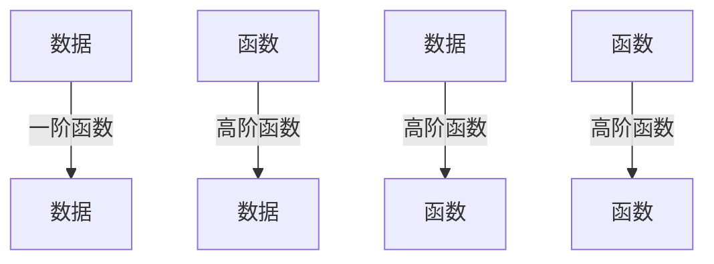

# 04.2 高阶函数

## 04.2.1 概述

**高阶函数 (Higher-Order Functions)** 是以函数为参数或返回函数的函数。它是函数式编程的核心抽象，使代码更具表达力和可组合性。

### 04.2.1.1 基本概念

| 类型 | 定义 | 示例 |
|------|------|------|
| 一阶函数 | 只操作数据 | `fn add(x: i32, y: i32) -> i32` |
| 高阶函数 | 操作函数 | `fn map(f: F, xs: Vec<T>) -> Vec<U>` |



---

## 04.2.2 映射 (Map)

### 04.2.2.1 定义

**定义 04.2.1 (Map)**

$$
\text{map} : (A \to B) \times \text{List}(A) \to \text{List}(B)
$$

$$
\text{map}(f, [x_1, \ldots, x_n]) = [f(x_1), \ldots, f(x_n)]
$$

### 04.2.2.2 实现

```rust
// 泛型实现
fn map<A, B, F>(f: F, xs: Vec<A>) -> Vec<B>
where
    F: FnMut(A) -> B
{
    xs.into_iter().map(f).collect()
}

// 递归定义（函数式风格）
fn map_rec<A, B, F>(f: &F, xs: &[A]) -> Vec<B>
where
    F: Fn(&A) -> B,
    A: Clone,
{
    match xs.split_first() {
        None => vec![],
        Some((head, tail)) => {
            let mut result = vec![f(head)];
            result.extend(map_rec(f, tail));
            result
        }
    }
}

// Haskell对比
-- map :: (a -> b) -> [a] -> [b]
-- map _ [] = []
-- map f (x:xs) = f x : map f xs
```

### 04.2.2.3 函子定律

**定理 04.2.1 (Map定律)**

```
1. 保持恒等: map(id, xs) = xs
2. 保持复合: map(f ∘ g, xs) = map(f, map(g, xs))
```

```rust
#[test]
fn test_map_laws() {
    let xs = vec![1, 2, 3, 4, 5];

    // 恒等律
    let id_mapped: Vec<i32> = xs.clone().into_iter().map(|x| x).collect();
    assert_eq!(id_mapped, xs);

    // 复合律
    let f = |x| x * 2;
    let g = |x| x + 1;

    let left: Vec<i32> = xs.clone().into_iter().map(|x| f(g(x))).collect();
    let right: Vec<i32> = xs.clone().into_iter().map(g).map(f).collect();
    assert_eq!(left, right);
}
```

---

## 04.2.3 折叠 (Fold)

### 04.2.3.1 左折叠与右折叠

**定义 04.2.2 (Fold)**

**左折叠 (foldl)**：

$$
\text{foldl}(f, z, [x_1, \ldots, x_n]) = f(\ldots f(f(z, x_1), x_2)\ldots, x_n)
$$

**右折叠 (foldr)**：

$$
\text{foldr}(f, z, [x_1, \ldots, x_n]) = f(x_1, f(x_2, \ldots f(x_n, z)\ldots))
$$

```rust
// 左折叠（迭代，尾递归）
fn foldl<A, B, F>(f: F, init: B, xs: &[A]) -> B
where
    F: Fn(B, &A) -> B,
{
    let mut acc = init;
    for x in xs {
        acc = f(acc, x);
    }
    acc
}

// 右折叠（递归）
fn foldr<A, B, F>(f: F, init: B, xs: &[A]) -> B
where
    F: Fn(&A, B) -> B,
    A: Clone,
{
    match xs.split_last() {
        None => init,
        Some((last, rest)) => f(last, foldr(f, init, rest)),
    }
}
```

### 04.2.3.2 应用示例

```rust
// 求和
let sum = foldl(|acc, x| acc + x, 0, &vec![1, 2, 3, 4, 5]);
assert_eq!(sum, 15);

// 反转
let rev = foldl(|acc, x| {
    let mut v = vec![*x];
    v.extend(acc);
    v
}, vec![], &vec![1, 2, 3]);
assert_eq!(rev, vec![3, 2, 1]);

// 拼接字符串
let concat = foldr(|x, acc| format!("{}{}", x, acc),
    String::new(), &vec!["a", "b", "c"]);
assert_eq!(concat, "abc");
```

### 04.2.3.3 折叠与原始递归

**定理 04.2.2 (原始递归)**

任何原始递归函数都可用fold表示：

```rust
// 阶乘
fn factorial(n: u32) -> u32 {
    foldl(|acc, x| acc * x, 1, &(1..=n).collect::<Vec<_>>())
}

// 斐波那契（用fold）
fn fibonacci(n: u32) -> u32 {
    if n == 0 { return 0; }
    let (_, result) = foldl(
        |(a, b), _| (b, a + b),
        (0, 1),
        &(1..n).collect::<Vec<_>>()
    );
    result
}
```

---

## 04.2.4 过滤 (Filter)

### 04.2.4.1 定义

**定义 04.2.3 (Filter)**

$$
\text{filter} : (A \to \text{Bool}) \times \text{List}(A) \to \text{List}(A)
$$

$$
\text{filter}(p, xs) = [x \mid x \leftarrow xs, p(x)]
$$

```rust
fn filter<A, P>(predicate: P, xs: Vec<A>) -> Vec<A>
where
    P: Fn(&A) -> bool,
{
    xs.into_iter().filter(predicate).collect()
}

// 递归实现
fn filter_rec<A, P>(p: &P, xs: &[A]) -> Vec<A>
where
    P: Fn(&A) -> bool,
    A: Clone,
{
    match xs.split_first() {
        None => vec![],
        Some((head, tail)) => {
            let rest = filter_rec(p, tail);
            if p(head) {
                let mut result = vec![head.clone()];
                result.extend(rest);
                result
            } else {
                rest
            }
        }
    }
}
```

### 04.2.4.2 列表推导式

```rust
// Rust中filter + map组合
let evens_squared: Vec<i32> = (1..=10)
    .filter(|x| x % 2 == 0)
    .map(|x| x * x)
    .collect();
// [4, 16, 36, 64, 100]

// Haskell对比
-- evensSquared = [x^2 | x <- [1..10], even x]
```

---

## 04.2.5 更多高阶函数

### 04.2.5.1 部分应用与柯里化

```rust
// 柯里化: (A × B → C) → (A → (B → C))
fn curry<A, B, C, F>(f: F) -> impl Fn(A) -> Box<dyn Fn(B) -> C>
where
    F: Fn(A, B) -> C + Clone + 'static,
    A: 'static,
    B: 'static,
    C: 'static,
{
    move |a| Box::new(move |b| f(a.clone(), b))
}

// 部分应用示例
fn add(x: i32) -> impl Fn(i32) -> i32 {
    move |y| x + y
}

let add5 = add(5);
assert_eq!(add5(3), 8);
assert_eq!(add5(10), 15);
```

### 04.2.5.2 组合函数

```rust
// 函数复合: (B → C) → (A → B) → (A → C)
fn compose<A, B, C, F, G>(f: F, g: G) -> impl Fn(A) -> C
where
    F: Fn(B) -> C,
    G: Fn(A) -> B,
{
    move |x| f(g(x))
}

// 使用
let double = |x: i32| x * 2;
let add_one = |x: i32| x + 1;
let double_then_add = compose(add_one, double);

assert_eq!(double_then_add(5), 11);  // 5*2+1
```

### 04.2.5.3 不动点组合子

```rust
// 递归函数的高阶定义
fn fix<A, F>(f: F) -> impl Fn(A) -> A
where
    F: Fn(&dyn Fn(A) -> A, A) -> A + 'static,
    A: 'static,
{
    use std::sync::Arc;

    let result: Arc<dyn Fn(A) -> A> = Arc::new(move |x| {
        let f = &f;
        let self_ref: Arc<dyn Fn(A) -> A> = Arc::new(move |y| {
            (result.clone())(y)
        });
        f(&*self_ref, x)
    });

    move |x| result(x)
}

// 阶乘
let factorial = fix(|f, n: u32| {
    if n == 0 { 1 } else { n * f(n - 1) }
});
```

---

## 04.2.6 Haskell实现

### 04.2.6.1 标准高阶函数

```haskell
-- 映射
map :: (a -> b) -> [a] -> [b]
map _ [] = []
map f (x:xs) = f x : map f xs

-- 折叠
foldl :: (b -> a -> b) -> b -> [a] -> b
foldl _ acc [] = acc
foldl f acc (x:xs) = foldl f (f acc x) xs

foldr :: (a -> b -> b) -> b -> [a] -> b
foldr _ acc [] = acc
foldr f acc (x:xs) = f x (foldr f acc xs)

-- 过滤
filter :: (a -> Bool) -> [a] -> [a]
filter _ [] = []
filter p (x:xs)
    | p x       = x : filter p xs
    | otherwise = filter p xs

-- 扫描（中间结果）
scanl :: (b -> a -> b) -> b -> [a] -> [b]
scanl _ acc [] = [acc]
scanl f acc (x:xs) = acc : scanl f (f acc x) xs

-- 示例: 斐波那契数列
fibs :: [Integer]
fibs = scanl (+) 0 (1:fibs)
-- 0, 1, 1, 2, 3, 5, 8, ...
```

### 04.2.6.2 函数组合

```haskell
-- 函数复合
(.) :: (b -> c) -> (a -> b) -> (a -> c)
(f . g) x = f (g x)

-- 应用
($) :: (a -> b) -> a -> b
f $ x = f x

-- 管道（反向复合）
(&) :: a -> (a -> b) -> b
x & f = f x

-- 使用示例
process :: [Int] -> Int
process = sum . filter (>0) . map (^2)

-- 或使用管道
process' xs = xs
    & map (^2)
    & filter (>0)
    & sum
```

---

## 04.2.7 Lean4形式化

### 04.2.7.1 高阶函数定义

```lean4
def map {α β : Type} (f : α → β) : List α → List β
  | [] => []
  | x :: xs => f x :: map f xs

def foldl {α β : Type} (f : β → α → β) : β → List α → β
  | acc, [] => acc
  | acc, x :: xs => foldl f (f acc x) xs

def foldr {α β : Type} (f : α → β → β) : β → List α → β
  | acc, [] => acc
  | acc, x :: xs => f x (foldr f acc xs)

def filter {α : Type} (p : α → Bool) : List α → List α
  | [] => []
  | x :: xs => if p x then x :: filter p xs else filter p xs
```

### 04.2.7.2 定律证明

```lean4
-- map保持长度
theorem map_length {α β : Type} (f : α → β) (xs : List α) :
    (map f xs).length = xs.length := by
  induction xs with
  | nil => simp [map]
  | cons x xs ih =>
    simp [map, ih]

-- map分配律
theorem map_map {α β γ : Type}
    (f : β → γ) (g : α → β) (xs : List α) :
    map f (map g xs) = map (f ∘ g) xs := by
  induction xs with
  | nil => simp [map]
  | cons x xs ih =>
    simp [map, ih]

-- foldl与foldr关系（f可交换时）
theorem foldl_eq_foldr {α : Type} {f : α → α → α}
    (h_comm : ∀ x y, f x y = f y x)
    (h_assoc : ∀ x y z, f (f x y) z = f x (f y z))
    (z : α) (xs : List α) :
    foldl f z xs = foldr f z xs := by
  induction xs with
  | nil => simp [foldl, foldr]
  | cons x xs ih =>
    simp [foldl, foldr, ih, h_comm, h_assoc]
```

---

## 04.2.8 练习

1. 用fold实现map和filter
2. 证明 `foldl f z xs = foldr (flip f) z (reverse xs)`
3. 实现zipWith并证明其与unzip的关系

---

## 04.2.9 参考文献与交叉引用

- [04.1 λ演算](./04.1_λ演算.md)
- [04.3 单子与函子](./04.3_单子与函子.md)
- [Bird & Wadler, 1988] "Introduction to Functional Programming"
- [Hutton, 2016] "Programming in Haskell"
