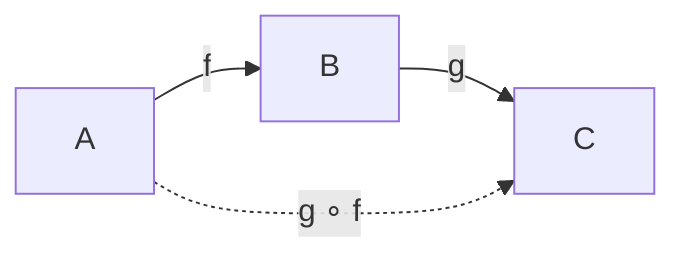

# 04.3 单子与函子

## 04.3.1 概述

**范畴论 (Category Theory)** 为函数式编程提供了统一的语言。函子、应用函子和单子是其中最强大的抽象。

### 04.3.1.1 范畴论基础

**定义 04.3.1 (范畴)**

范畴 $\mathcal{C}$ 包含：

- **对象**：$A, B, C, \ldots$
- **态射**：$f: A \to B$
- **复合**：$g \circ f: A \to C$（给定 $f: A \to B, g: B \to C$）
- **单位态射**：$\text{id}_A: A \to A$

满足：

- 结合律：$h \circ (g \circ f) = (h \circ g) \circ f$
- 单位律：$f \circ \text{id}_A = f = \text{id}_B \circ f$



---

## 04.3.2 函子 (Functor)

### 04.3.2.1 定义

**定义 04.3.2 (函子)**

函子 $F: \mathcal{C} \to \mathcal{D}$ 是范畴间的映射：

- 将对象 $A$ 映射到 $F(A)$
- 将态射 $f: A \to B$ 映射到 $F(f): F(A) \to F(B)$

满足：

- $F(\text{id}_A) = \text{id}_{F(A)}$
- $F(g \circ f) = F(g) \circ F(f)$

### 04.3.2.2 编程中的函子

```rust
// Rust中的Functor（概念上）
trait Functor<A, B> {
    type F<X>;

    fn map<F>(self, f: F) -> Self::F<B>
    where
        F: FnMut(A) -> B;
}

// 实际实现示例（Option）
impl<A, B> Functor<A, B> for Option<A> {
    type F<X> = Option<X>;

    fn map<F>(self, f: F) -> Option<B>
    where
        F: FnOnce(A) -> B,
    {
        match self {
            Some(x) => Some(f(x)),
            None => None,
        }
    }
}
```

### 04.3.2.3 函子定律

**定理 04.3.1 (函子定律)**

```
1. 恒等: map(id, fa) = fa
2. 复合: map(f ∘ g, fa) = map(f, map(g, fa))
```

```rust
#[test]
fn test_functor_laws() {
    let x: Option<i32> = Some(5);

    // 恒等律
    assert_eq!(x.clone().map(|v| v), x);

    // 复合律
    let f = |x| x * 2;
    let g = |x| x + 1;

    let left = x.clone().map(|v| f(g(v)));
    let right = x.clone().map(g).map(f);
    assert_eq!(left, right);
}
```

### 04.3.2.4 常见函子实例

| 类型 | map实现 | 作用 |
|------|---------|------|
| `Option<T>` | 空值传播 | 可空计算 |
| `Result<T, E>` | 错误传播 | 错误处理 |
| `Vec<T>` | 元素变换 | 批量操作 |
| `Box<T>` | 堆数据变换 | 递归类型 |

```haskell
-- Haskell中的Functor类
class Functor f where
    fmap :: (a -> b) -> f a -> f b

instance Functor Maybe where
    fmap _ Nothing = Nothing
    fmap f (Just x) = Just (f x)

instance Functor [] where
    fmap = map

instance Functor (Either e) where
    fmap _ (Left e) = Left e
    fmap f (Right x) = Right (f x)
```

---

## 04.3.3 应用函子 (Applicative Functor)

### 04.3.3.1 定义

**定义 04.3.3 (应用函子)**

应用函子扩展函子，支持函数在包装值中的应用：

```haskell
class Functor f => Applicative f where
    pure :: a -> f a
    (<*>) :: f (a -> b) -> f a -> f b
```

### 04.3.3.2 应用函子定律

```
1. 恒等: pure id <*> v = v
2. 复合: pure (.) <*> u <*> v <*> w = u <*> (v <*> w)
3. 同态: pure f <*> pure x = pure (f x)
4. 交换: u <*> pure y = pure ($ y) <*> u
```

### 04.3.3.3 Rust实现

```rust
// Rust中的应用函子模式
trait Applicative<A>: Functor<A> {
    fn pure(x: A) -> Self;
    fn ap<B, F>(self, f: Self::F<F>) -> Self::F<B>
    where
        F: FnMut(A) -> B;
}

// Option实现
impl<A> Applicative<A> for Option<A> {
    fn pure(x: A) -> Self {
        Some(x)
    }

    fn ap<B, F>(self, f: Option<F>) -> Option<B>
    where
        F: FnOnce(A) -> B,
    {
        match (f, self) {
            (Some(f), Some(x)) => Some(f(x)),
            _ => None,
        }
    }
}

// 使用示例
fn add(x: i32, y: i32) -> i32 { x + y }

let a = Some(1);
let b = Some(2);
let f = Some(add);

// Some(1 + 2) = Some(3)
let result = a.ap(f.map(|f| move |x| f(x, 2)));
```

### 04.3.3.4 应用函子 vs 单子

```
优势:
- 可以并行执行效果
- 语法更简单
- 推导更强大

局限:
- 不能依赖前面结果
- 不能短路
```

```rust
// 可以并行计算
let result = add
    <$> fetch_data_a().await  // 并行启动
    <*> fetch_data_b().await; // 并行启动

// 对比：必须顺序
let a = fetch_data_a().await?;  // 异步获取数据A
let b = fetch_data_b().await?;  // 然后启动
let result = add(a, b);
```

---

## 04.3.4 单子 (Monad)

### 04.3.4.1 定义

**定义 04.3.4 (单子)**

单子是支持顺序计算上下文的应用函子：

```haskell
class Applicative m => Monad m where
    return :: a -> m a                    -- 同 pure
    (>>=) :: m a -> (a -> m b) -> m b    -- bind
    (>>) :: m a -> m b -> m b             -- 忽略第一个结果
```

### 04.3.4.2 单子定律

**定理 04.3.2 (单子定律)**

```
1. 左单位: return a >>= f = f a
2. 右单位: m >>= return = m
3. 结合律: (m >>= f) >>= g = m >>= (\x -> f x >>= g)
```

```rust
#[test]
fn test_monad_laws() {
    let m = Some(5);
    let f = |x: i32| Some(x * 2);
    let g = |x: i32| Some(x + 1);

    // 左单位律
    let left = Some(5).and_then(f);
    let right = f(5);
    assert_eq!(left, right);

    // 右单位律
    let left = m.clone().and_then(Some);
    let right = m.clone();
    assert_eq!(left, right);

    // 结合律
    let left = m.clone().and_then(f).and_then(g);
    let right = m.clone().and_then(|x| f(x).and_then(g));
    assert_eq!(left, right);
}
```

### 04.3.4.3 Kleisli范畴

**定义 04.3.5 (Kleisli箭头)**

Kleisli箭头：$A \to M(B)$（即 `a -> m b`）

**Kleisli复合** ($\gg=$)：

$$(f \gg= g)(x) = f(x) \gg= g$$

```haskell
(>=>) :: Monad m => (a -> m b) -> (b -> m c) -> (a -> m c)
f >=> g = \x -> f x >>= g

-- Kleisli定律
return >=> f = f
f >=> return = f
(f >=> g) >=> h = f >=> (g >=> h)
```

---

## 04.3.5 常见单子实例

### 04.3.5.1 Maybe/Option 单子

```haskell
instance Monad Maybe where
    return = Just
    Nothing >>= _ = Nothing
    Just x >>= f = f x
```

```rust
// 链式可空计算
fn find_user(id: i32) -> Option<User> { ... }
fn get_department(user: &User) -> Option<Department> { ... }
fn get_manager(dept: &Department) -> Option<Employee> { ... }

// 使用单子风格
let manager = find_user(1)
    .and_then(|u| get_department(&u))
    .and_then(|d| get_manager(&d));

// 或使用 ? 操作符
fn get_manager_name(id: i32) -> Option<String> {
    let user = find_user(id)?;
    let dept = get_department(&user)?;
    let manager = get_manager(&dept)?;
    Some(manager.name)
}
```

### 04.3.5.2 Result 单子

```rust
// 错误传播
fn read_file(path: &str) -> Result<String, io::Error> { ... }
fn parse_data(content: &str) -> Result<Data, ParseError> { ... }
fn process(data: &Data) -> Result<Output, ProcessError> { ... }

// 使用 ? 自动转换错误类型
fn pipeline(path: &str) -> Result<Output, Box<dyn Error>> {
    let content = read_file(path)?;
    let data = parse_data(&content)?;
    let output = process(&data)?;
    Ok(output)
}
```

### 04.3.5.3 IO/Async 单子

```rust
// Rust的异步是单子
async fn read_user() -> User { ... }
async fn save_user(user: User) -> Result<(), Error> { ... }

async fn process() -> Result<(), Error> {
    let user = read_user().await;  // bind
    let user = transform(user);
    save_user(user).await          // bind
}
```

### 04.3.5.4 State 单子

```rust
struct State<S, A> {
    run: Box<dyn Fn(S) -> (A, S)>,
}

impl<S, A> State<S, A> {
    fn pure(x: A) -> Self
    where
        S: 'static,
        A: 'static,
    {
        State {
            run: Box::new(move |s| (x, s)),
        }
    }

    fn bind<B, F>(self, f: F) -> State<S, B>
    where
        F: Fn(A) -> State<S, B> + 'static,
        S: 'static,
        B: 'static,
        A: 'static,
    {
        State {
            run: Box::new(move |s| {
                let (a, s1) = (self.run)(s);
                f(a).run(s1)
            }),
        }
    }

    fn get() -> State<S, S>
    where
        S: Clone + 'static
    {
        State {
            run: Box::new(|s| (s.clone(), s)),
        }
    }

    fn put(s: S) -> State<S, ()>
    where
        S: 'static
    {
        State {
            run: Box::new(move |_| ((), s)),
        }
    }
}
```

---

## 04.3.6 Haskell单子

### 04.3.6.1 do语法

```haskell
-- 单子的do记法
getManagerName :: UserId -> IO (Maybe String)
getManagerName uid = do
    maybeUser <- findUser uid        -- bind
    case maybeUser of
        Nothing -> return Nothing
        Just user -> do
            maybeDept <- getDepartment user
            case maybeDept of
                Nothing -> return Nothing
                Just dept -> do
                    maybeManager <- getManager dept
                    return (fmap name maybeManager)

-- 使用 MaybeT 单子变换器
getManagerName' :: UserId -> MaybeT IO String
getManagerName' uid = do
    user <- MaybeT $ findUser uid
    dept <- MaybeT $ getDepartment user
    manager <- MaybeT $ getManager dept
    return $ name manager
```

### 04.3.6.2 常用单子函数

```haskell
-- 序列执行，收集结果
sequence :: Monad m => [m a] -> m [a]
sequence [] = return []
sequence (m:ms) = do
    x <- m
    xs <- sequence ms
    return (x:xs)

-- 映射并序列
mapM :: Monad m => (a -> m b) -> [a] -> m [b]
mapM f = sequence . map f

-- 过滤
filterM :: Monad m => (a -> m Bool) -> [a] -> m [a]
filterM _ [] = return []
filterM p (x:xs) = do
    b <- p x
    ys <- filterM p xs
    return (if b then x:ys else ys)

-- 折叠
foldM :: Monad m => (b -> a -> m b) -> b -> [a] -> m b
foldM _ acc [] = return acc
foldM f acc (x:xs) = f acc x >>= \acc' -> foldM f acc' xs
```

---

## 04.3.7 单子变换器

### 04.3.7.1 组合效果

```haskell
-- 多层效果：IO + 错误处理 + 状态
newtype App a = App {
    unApp :: StateT AppState (ExceptT AppError IO) a
}

deriving instance Functor App
deriving instance Applicative App
deriving instance Monad App
deriving instance MonadIO App
deriving instance MonadState AppState App
deriving instance MonadError AppError App

-- 使用
businessLogic :: App Result
businessLogic = do
    config <- get  -- State
    result <- liftIO $ fetchData config  -- IO
    when (invalid result) $
        throwError InvalidData  -- Error
    modify $ \s -> s { lastResult = result }  -- State
    return result
```

---

## 04.3.8 练习

1. 为 `Result<T, E>` 实现完整的单子接口
2. 证明 `Vec` 满足函子定律
3. 实现 `Writer` 单子用于日志记录

---

## 04.3.9 参考文献与交叉引用

- [04.1 λ演算](./04.1_λ演算.md)
- [04.2 高阶函数](./04.2_高阶函数.md)
- [04.4 惰性求值](./04.4_惰性求值.md)
- [Awodey, 2010] "Category Theory"
- [Milewski, 2017] "Category Theory for Programmers"
- [Wadler, 1995] "Monads for Functional Programming"
