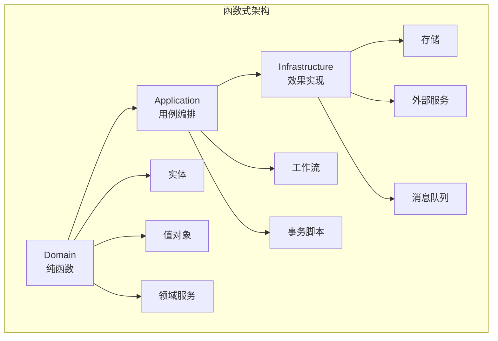

# 1. 函数式设计模式

---

📌 **内容摘要**

本文档深入探讨函数式设计模式的核心原理和关键方法。内容涵盖函数式编程领域的主要知识点，包括结构型, 创建型, 纯函数, 设计模式等关键主题。适合具备相关基础的学习者进行深入研究。

**关键词**: 结构型, 创建型, 函数式编程, 纯函数, 设计模式, 高阶函数

📚 **学习目标**
- 深入理解函数式设计模式的理论体系和形式化方法
- 能够进行相关定理的形式化证明
- 建立该领域的系统性知识框架

🎯 **难度级别**: 高级

⏱️ **预计阅读时间**: 15分钟

**前置知识**: 该领域的中级知识, 形式化方法基础

---


## 目录

- [1. 函数式设计模式](#1-函数式设计模式)
  - [目录](#目录)
  - [1.1 组合子模式](#11-组合子模式)
    - [1.1.1 组合子基础](#111-组合子基础)
    - [1.1.2 实用组合子](#112-实用组合子)
    - [1.1.3 解析器组合子](#113-解析器组合子)
  - [1.2 透镜模式](#12-透镜模式)
    - [1.2.1 透镜基础](#121-透镜基础)
    - [1.2.2 棱镜与遍历](#122-棱镜与遍历)
  - [1.3 箭头编程](#13-箭头编程)
    - [1.3.1 箭头类型类](#131-箭头类型类)
    - [1.3.2 箭头符号使用](#132-箭头符号使用)
  - [1.4 递归模式](#14-递归模式)
    - [1.4.1 不动点组合子](#141-不动点组合子)
    - [1.4.2 猫态射](#142-猫态射)
  - [1.5 类型类模式](#15-类型类模式)
    - [1.5.1 类型类作为接口](#151-类型类作为接口)
    - [1.5.2 类型类派生](#152-类型类派生)
  - [1.6 函数式架构](#16-函数式架构)
    - [1.6.1 纯函数核心](#161-纯函数核心)
    - [1.6.2 分层架构](#162-分层架构)
    - [1.6.3 依赖注入](#163-依赖注入)

## 1.1 组合子模式

### 1.1.1 组合子基础

**定义 1.1.1**：组合子（Combinator）是不含自由变量的纯函数，用于组合其他函数。

形式化：
$$
\text{Combinator}: f, g, \ldots \rightarrow h
$$

```rust
// 基本组合子

// I 组合子（恒等）
fn i<A>(x: A) -> A {
    x
}

// K 组合子（常量）
fn k<A, B>(x: A) -> impl Fn(B) -> A {
    move |_| x
}

// S 组合子（替换）
fn s<A, B, C, F, G>(f: F, g: G) -> impl Fn(A) -> C
where
    F: Fn(A) -> B,
    G: Fn(A) -> B,
    B: Fn(A) -> C,
{
    move |x| f(x)(g(x))
}

// B 组合子（组合）
fn b<A, B, C, F, G>(f: F, g: G) -> impl Fn(A) -> C
where
    F: Fn(B) -> C,
    G: Fn(A) -> B,
{
    move |x| f(g(x))
}

// C 组合子（交换）
fn c<A, B, C, F>(f: F) -> impl Fn(B) -> impl Fn(A) -> C
where
    F: Fn(A) -> impl Fn(B) -> C,
{
    move |y| move |x| f(x)(y)
}
```

### 1.1.2 实用组合子

```rust
// 管道组合子
fn pipe<A, B, C, F, G>(f: F, g: G) -> impl Fn(A) -> C
where
    F: Fn(A) -> B,
    G: Fn(B) -> C,
{
    move |x| g(f(x))
}

// 反向管道（Haskell 的 & 操作符）
trait Pipe: Sized {
    fn pipe<B, F>(self, f: F) -> B
    where
        F: FnOnce(Self) -> B,
    {
        f(self)
    }
}

impl<T> Pipe for T {}

// 使用示例
fn combinator_usage() {
    let add_one = |x: i32| x + 1;
    let double = |x: i32| x * 2;
    let square = |x: i32| x * x;

    // 函数组合
    let composed = |x| pipe(pipe(x, add_one), double);
    println!("{}", composed(5));  // (5 + 1) * 2 = 12

    // 管道风格
    let result = 5
        .pipe(add_one)
        .pipe(double)
        .pipe(square);
    println!("{}", result);  // ((5 + 1) * 2)^2 = 144
}

// 链式组合子
fn chain<A, B, C, D, F, G, H>(f: F, g: G, h: H) -> impl Fn(A) -> D
where
    F: Fn(A) -> B,
    G: Fn(B) -> C,
    H: Fn(C) -> D,
{
    move |x| h(g(f(x)))
}

// 并行组合子
fn fanout<A, B, C, F, G>(f: F, g: G) -> impl Fn(A) -> (B, C)
where
    F: Fn(A) -> B,
    G: Fn(A) -> C,
    A: Clone,
{
    move |x| (f(x.clone()), g(x))
}

fn both<A, B, F, G>(f: F, g: G) -> impl Fn((A, A)) -> (B, B)
where
    F: Fn(A) -> B,
    G: Fn(A) -> B,
{
    move |(x, y)| (f(x), g(y))
}
```

### 1.1.3 解析器组合子

```rust
// 简化的解析器组合子

struct Parser<'a, A> {
    run: Box<dyn Fn(&'a str) -> Option<(A, &'a str)> + 'a>,
}

impl<'a, A> Parser<'a, A> {
    fn new<F>(f: F) -> Self
    where
        F: Fn(&'a str) -> Option<(A, &'a str)> + 'a,
    {
        Parser { run: Box::new(f) }
    }

    fn parse(&self, input: &'a str) -> Option<(A, &'a str)> {
        (self.run)(input)
    }

    // 组合子：映射
    fn map<B, F>(self, f: F) -> Parser<'a, B>
    where
        F: Fn(A) -> B + 'a,
        A: 'a,
        B: 'a,
    {
        Parser::new(move |input| {
            self.parse(input).map(|(a, rest)| (f(a), rest))
        })
    }

    // 组合子：应用
    fn and_then<B, F>(self, f: F) -> Parser<'a, B>
    where
        F: Fn(A) -> Parser<'a, B> + 'a,
        A: 'a,
        B: 'a,
    {
        Parser::new(move |input| {
            self.parse(input)
                .and_then(|(a, rest)| f(a).parse(rest))
        })
    }

    // 组合子：或
    fn or(self, other: Parser<'a, A>) -> Parser<'a, A>
    where
        A: 'a,
    {
        Parser::new(move |input| {
            self.parse(input).or_else(|| other.parse(input))
        })
    }
}

// 基本解析器
fn char(c: char) -> Parser<'static, char> {
    Parser::new(move |input| {
        input.chars().next().and_then(|first| {
            if first == c {
                Some((c, &input[1..]))
            } else {
                None
            }
        })
    })
}

fn digit() -> Parser<'static, i32> {
    Parser::new(|input| {
        input.chars().next().and_then(|c| {
            c.to_digit(10).map(|d| (d as i32, &input[1..]))
        })
    })
}

// 使用组合子构建解析器
fn number() -> Parser<'static, i32> {
    digit().and_then(|first| {
        Parser::new(move |input| {
            let mut result = first;
            let mut rest = input;

            while let Some((d, new_rest)) = digit().parse(rest) {
                result = result * 10 + d;
                rest = new_rest;
            }

            Some((result, rest))
        })
    })
}

fn parser_example() {
    let parser = number();
    println!("{:?}", parser.parse("123abc"));  // Some((123, "abc"))
    println!("{:?}", parser.parse("abc"));     // None
}
```

## 1.2 透镜模式

### 1.2.1 透镜基础

**定义 1.2.1**：透镜（Lens）是一种函数式引用，用于聚焦数据结构的子部分。

形式化：
$$
\text{Lens}\langle S, A \rangle = (S \rightarrow A, S \rightarrow A \rightarrow S)
$$

```rust
// 透镜结构
struct Lens<S, A> {
    get: fn(&S) -> A,
    set: fn(A, &S) -> S,
}

impl<S: Clone, A: Clone> Lens<S, A> {
    fn new(get: fn(&S) -> A, set: fn(A, &S) -> S) -> Self {
        Lens { get, set }
    }

    // 修改
    fn modify<F>(&self, f: F, s: &S) -> S
    where
        F: Fn(A) -> A,
    {
        (self.set)(f((self.get)(s)), s)
    }

    // 组合透镜
    fn compose<B>(&self, other: Lens<A, B>) -> Lens<S, B> {
        Lens {
            get: |s| (other.get)(&(self.get)(s)),
            set: |b, s| {
                let a = (self.get)(s);
                let new_a = (other.set)(b, &a);
                (self.set)(new_a, s)
            },
        }
    }
}

// 示例数据结构
#[derive(Clone, Debug)]
struct Person {
    name: String,
    address: Address,
}

#[derive(Clone, Debug)]
struct Address {
    city: String,
    street: String,
}

// 创建透镜
fn person_name_lens() -> Lens<Person, String> {
    Lens::new(
        |p| p.name.clone(),
        |name, p| Person { name, ..p.clone() },
    )
}

fn person_address_lens() -> Lens<Person, Address> {
    Lens::new(
        |p| p.address.clone(),
        |address, p| Person { address, ..p.clone() },
    )
}

fn address_city_lens() -> Lens<Address, String> {
    Lens::new(
        |a| a.city.clone(),
        |city, a| Address { city, ..a.clone() },
    )
}

fn lens_example() {
    let person = Person {
        name: "Alice".to_string(),
        address: Address {
            city: "New York".to_string(),
            street: "123 Main St".to_string(),
        },
    };

    let name_lens = person_name_lens();
    let city_lens = person_address_lens().compose(address_city_lens());

    // 获取
    println!("Name: {}", (name_lens.get)(&person));
    println!("City: {}", (city_lens.get)(&person));

    // 修改
    let new_person = (city_lens.set)("Boston".to_string(), &person);
    println!("New city: {}", (city_lens.get)(&new_person));

    // 使用 modify
    let upper_person = name_lens.modify(|n| n.to_uppercase(), &person);
    println!("Upper name: {}", (name_lens.get)(&upper_person));
}
```

### 1.2.2 棱镜与遍历

```rust
// 棱镜（Prism）：用于 sum 类型
struct Prism<S, A> {
    preview: fn(&S) -> Option<A>,
    review: fn(A) -> S,
}

// 遍历（Traversal）：用于多焦点
struct Traversal<S, A> {
    traverse: fn(&S) -> Vec<A>,
    modify_all: fn(Vec<A>, &S) -> S,
}

// 示例：Option 的棱镜
fn some_prism<A: Clone>() -> Prism<Option<A>, A> {
    Prism {
        preview: |opt| opt.clone(),
        review: |a| Some(a),
    }
}

// 示例：Vec 的遍历
fn vec_traversal<A: Clone>() -> Traversal<Vec<A>, A> {
    Traversal {
        traverse: |v| v.clone(),
        modify_all: |new, _| new,
    }
}
```

## 1.3 箭头编程

### 1.3.1 箭头类型类

**定义 1.3.1**：箭头（Arrow）是函数的泛化，支持组合和并行。

形式化：
$$
\text{Arrow} = \{\text{arr}, (>>>), \text{first}, \text{second}, (&&&), (***), \ldots\}
$$

```rust
// 箭头 trait
trait Arrow<A, B>: Sized {
    // 提升函数到箭头
    fn arr<F>(f: F) -> Self
    where
        F: Fn(A) -> B;

    // 组合
    fn then<C, F>(self, other: F) -> impl Arrow<A, C>
    where
        F: Arrow<B, C>;

    // 第一个组件
    fn first<C>(self) -> impl Arrow<(A, C), (B, C)>;

    // 第二个组件
    fn second<C>(self) -> impl Arrow<(C, A), (C, B)>;

    // 并行组合
    fn parallel<C, D, F>(self, other: F) -> impl Arrow<(A, C), (B, D)>
    where
        F: Arrow<C, D>;

    //  fanout
    fn fanout<C, F>(self, other: F) -> impl Arrow<A, (B, C)>
    where
        F: Arrow<A, C>,
        A: Clone;
}

// 函数作为箭头
struct FunArrow<A, B>(Box<dyn Fn(A) -> B>);

impl<A: 'static, B: 'static> Arrow<A, B> for FunArrow<A, B> {
    fn arr<F>(f: F) -> Self
    where
        F: Fn(A) -> B + 'static,
    {
        FunArrow(Box::new(f))
    }

    fn then<C: 'static, F>(self, other: F) -> impl Arrow<A, C>
    where
        F: Arrow<B, C> + 'static,
    {
        FunArrow(Box::new(move |a| {
            let b = (self.0)(a);
            // other.apply(b)
            panic!("Simplified")
        }))
    }

    fn first<C: 'static>(self) -> impl Arrow<(A, C), (B, C)> {
        FunArrow(Box::new(move |(a, c)| ((self.0)(a), c)))
    }

    fn second<C: 'static>(self) -> impl Arrow<(C, A), (C, B)> {
        FunArrow(Box::new(move |(c, a)| (c, (self.0)(a))))
    }

    fn parallel<C: 'static, D: 'static, F: 'static>(self, _other: F) -> impl Arrow<(A, C), (B, D)>
    where
        F: Arrow<C, D>,
    {
        FunArrow(Box::new(move |(a, c)| {
            let b = (self.0)(a);
            // let d = other.apply(c);
            (b, panic!("Simplified"))
        }))
    }

    fn fanout<C: 'static, F: 'static>(self, _other: F) -> impl Arrow<A, (B, C)>
    where
        F: Arrow<A, C>,
        A: Clone,
    {
        FunArrow(Box::new(move |a| {
            let b = (self.0)(a.clone());
            // let c = other.apply(a);
            (b, panic!("Simplified"))
        }))
    }
}
```

### 1.3.2 箭头符号使用

```rust
// 箭头风格的管道
fn arrow_style() {
    let add_one = |x: i32| x + 1;
    let double = |x: i32| x * 2;

    // >>> : 顺序组合
    let composed = |x| double(add_one(x));

    // first : 应用于元组的第一个元素
    let on_first = |(x, y): (i32, i32)| (add_one(x), y);

    // second : 应用于元组的第二个元素
    let on_second = |(x, y): (i32, i32)| (x, add_one(y));

    // *** : 并行应用两个函数
    let parallel = |(x, y): (i32, i32)| (add_one(x), double(y));

    // &&& : fanout
    let fanout = |x: i32| (add_one(x), double(x));

    // 使用示例
    let input = (5, 3);
    println!("{:?}", on_first(input));
    println!("{:?}", on_second(input));
    println!("{:?}", parallel(input));
    println!("{:?}", fanout(5));
}
```

## 1.4 递归模式

### 1.4.1 不动点组合子

**定义 1.4.1**：Y 组合子允许匿名函数递归。

形式化：
$$
Y = \lambda f. (\lambda x. f(x x)) (\lambda x. f(x x))
$$

```rust
// Rust 中的递归模式

// 显式递归
fn factorial_explicit(n: u64) -> u64 {
    if n == 0 {
        1
    } else {
        n * factorial_explicit(n - 1)
    }
}

// 使用高阶函数的递归
fn fix<F, A>(f: F) -> impl Fn(A) -> A
where
    F: Fn(&dyn Fn(A) -> A, A) -> A,
    A: Clone,
{
    move |a| f(&fix(f), a)
}

// 另一种方式：使用结构体
struct Recurse<A> {
    f: Box<dyn Fn(&Recurse<A>, A) -> A>,
}

impl<A> Recurse<A> {
    fn call(&self, x: A) -> A {
        (self.f)(self, x)
    }
}

fn factorial_recurse() -> Recurse<u64> {
    Recurse {
        f: Box::new(|rec, n| {
            if n == 0 {
                1
            } else {
                n * rec.call(n - 1)
            }
        }),
    }
}

// 实际使用的模式
fn recursion_pattern() {
    let fact = factorial_recurse();
    println!("5! = {}", fact.call(5));
}
```

### 1.4.2 猫态射

**定义 1.4.2**：猫态射（Catamorphism）是折叠的推广。

形式化：
$$
\text{cata}: (F(A) \rightarrow A) \rightarrow \mu F \rightarrow A
$$

```rust
// 递归数据类型的固定点
enum Fix<F> {
    In(F),
}

// 函子 trait
trait Functor<A> {
    type Map<B>: Functor<B>;
    fn fmap<B, F>(self, f: F) -> Self::Map<B>
    where
        F: Fn(A) -> B;
}

// 列表函子
enum ListF<A, B> {
    Nil,
    Cons(A, B),
}

impl<A: Clone, B> Functor<B> for ListF<A, B> {
    type Map<C> = ListF<A, C>;

    fn fmap<C, F>(self, f: F) -> ListF<A, C>
    where
        F: Fn(B) -> C,
    {
        match self {
            ListF::Nil => ListF::Nil,
            ListF::Cons(a, b) => ListF::Cons(a, f(b)),
        }
    }
}

// 猫态射
type Algebra<F, A> = fn(F) -> A;

fn cata<F, A>(alg: Algebra<F, A>, fix: Fix<F>) -> A
where
    F: Functor<A>,
{
    let Fix::In(fa) = fix;
    let mapped = fa.fmap(|inner| cata(alg, Fix::In(inner)));
    alg(mapped)
}
```

## 1.5 类型类模式

### 1.5.1 类型类作为接口

**定义 1.5.1**：类型类（Type Class）定义类型的共享行为。

```rust
// 可比较类型类
trait Ord {
    fn compare(&self, other: &Self) -> Ordering;
    fn less_than(&self, other: &Self) -> bool {
        matches!(self.compare(other), Ordering::Less)
    }
}

// 可显示类型类
trait Show {
    fn show(&self) -> String;
}

// 可序列化类型类
trait Serialize {
    fn serialize(&self) -> Vec<u8>;
    fn deserialize(data: &[u8]) -> Option<Self>
    where
        Self: Sized;
}

// 实现类型类
impl Ord for i32 {
    fn compare(&self, other: &Self) -> Ordering {
        self.cmp(other)
    }
}

impl Show for i32 {
    fn show(&self) -> String {
        self.to_string()
    }
}

// 通用排序
fn generic_sort<T: Ord + Clone>(list: &mut [T]) {
    list.sort_by(|a, b| a.compare(b));
}
```

### 1.5.2 类型类派生

```rust
// 使用宏派生类型类

// 定义派生宏
trait Default {
    fn default() -> Self;
}

// 手动实现
trait MyTrait {
    fn do_something(&self);
}

// 为包含类型类成员的类型自动实现
impl<T: MyTrait> MyTrait for Vec<T> {
    fn do_something(&self) {
        for item in self {
            item.do_something();
        }
    }
}

impl<T: MyTrait> MyTrait for Option<T> {
    fn do_something(&self) {
        if let Some(item) = self {
            item.do_something();
        }
    }
}
```

## 1.6 函数式架构

### 1.6.1 纯函数核心

```rust
// 核心业务逻辑（纯函数）
mod core {
    #[derive(Clone, Debug)]
    pub struct User {
        pub id: u64,
        pub name: String,
        pub email: String,
    }

    // 纯函数：验证用户
    pub fn validate_user(user: &User) -> Result<(), ValidationError> {
        if user.name.is_empty() {
            return Err(ValidationError::EmptyName);
        }
        if !user.email.contains('@') {
            return Err(ValidationError::InvalidEmail);
        }
        Ok(())
    }

    // 纯函数：计算折扣
    pub fn calculate_discount(price: f64, user: &User) -> f64 {
        if user.id < 100 {
            price * 0.9  // VIP 折扣
        } else {
            price
        }
    }

    #[derive(Debug)]
    pub enum ValidationError {
        EmptyName,
        InvalidEmail,
    }
}

// 效果层（处理副作用）
mod effects {
    use super::core::*;

    // IO 效果
    pub fn load_user(id: u64) -> impl FnOnce() -> Option<User> {
        move || {
            // 实际的数据库查询
            println!("Loading user {}", id);
            Some(User {
                id,
                name: "Alice".to_string(),
                email: "alice@example.com".to_string(),
            })
        }
    }

    // 日志效果
    pub fn log(message: String) -> impl FnOnce() {
        move || {
            println!("[LOG] {}", message);
        }
    }

    // 组合效果
    pub fn process_user(id: u64) -> impl FnOnce() -> Result<User, String> {
        move || {
            let log_start = log(format!("Processing user {}", id));
            log_start();

            match load_user(id)() {
                Some(user) => {
                    match validate_user(&user) {
                        Ok(()) => {
                            let log_end = log(format!("Processed user {}", id));
                            log_end();
                            Ok(user)
                        }
                        Err(e) => Err(format!("Validation failed: {:?}", e)),
                    }
                }
                None => Err("User not found".to_string()),
            }
        }
    }
}
```

### 1.6.2 分层架构



### 1.6.3 依赖注入

```rust
// 使用类型类进行依赖注入

trait UserRepository {
    fn find_by_id(&self, id: u64) -> Option<User>;
    fn save(&self, user: &User) -> Result<(), Error>;
}

trait EmailService {
    fn send_email(&self, to: &str, subject: &str, body: &str) -> Result<(), Error>;
}

// 使用 trait 对象注入依赖
struct UserService<R, E>
where
    R: UserRepository,
    E: EmailService,
{
    repo: R,
    email: E,
}

impl<R: UserRepository, E: EmailService> UserService<R, E> {
    fn register_user(&self, name: String, email: String) -> Result<User, Error> {
        let user = User {
            id: generate_id(),
            name,
            email: email.clone(),
        };

        // 验证（纯函数）
        validate_user(&user)?;

        // 保存（效果）
        self.repo.save(&user)?;

        // 发送邮件（效果）
        self.email.send_email(
            &email,
            "Welcome!",
            "Thanks for registering!",
        )?;

        Ok(user)
    }
}

fn generate_id() -> u64 {
    42  // 简化
}

use std::fmt::Debug;
#[derive(Debug)]
struct Error;

#[derive(Clone)]
struct User {
    id: u64,
    name: String,
    email: String,
}

fn validate_user(user: &User) -> Result<(), Error> {
    Ok(())
}
```

---

**参考文档**：

- [04.1_函数式基础](./04.1_函数式基础.md)
- [04.2_单子与函子](./04.2_单子与函子.md)
- [04.3_惰性求值](./04.3_惰性求值.md)
- [02.2_Rust类型系统](../02_Rust语言深入/02.2_Rust类型系统.md)
---

## 📚 延伸阅读

- [1. 单子与函子](../04_函数式编程/04.2_单子与函子.md)
- [04.3 单子与函子](../04_函数式编程/04.3_单子与函子.md)
- [04.2 高阶函数](../04_函数式编程/04.2_高阶函数.md)
- [1. 惰性求值](../04_函数式编程/04.3_惰性求值.md)
- [04.4 惰性求值](../04_函数式编程/04.4_惰性求值.md)
