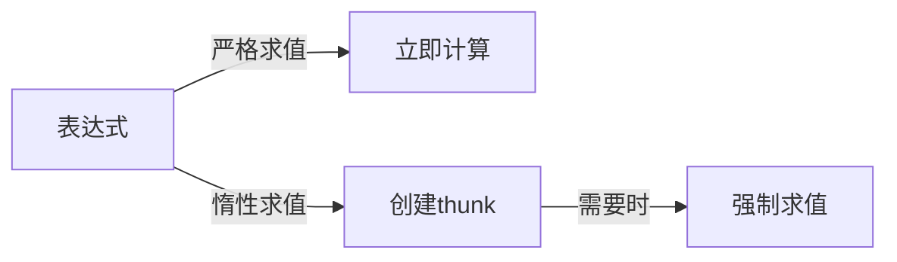

# 04.4 惰性求值

## 04.4.1 概述

n**惰性求值 (Lazy Evaluation)** 延迟计算直到结果真正需要。与严格求值（立即计算）相对，它允许：

- 无限数据结构
- 更精细的计算控制
- 潜在的内存优化

### 04.4.1.1 求值策略对比

| 策略 | 求值时机 | 代表语言 | 特点 |
|------|----------|----------|------|
| 严格/及早 | 立即 | Rust, OCaml | 可预测性能 |
| 按需惰性 | 需要时 | Haskell | 无限结构 |
| 乐观严格 | 推测执行 | GHC优化 | 平衡性能 |



---

## 04.4.2 惰性求值语义

### 04.4.2.1 thunk与弱首范式

**定义 04.4.1 (thunk)**

Thunk是延迟计算的表达式闭包：

```haskell
-- thunk: 延迟计算的 () -> a
 data Thunk a = Thunk (() -> a)
```

**定义 04.4.2 (弱首范式 WHNF)**

表达式处于WHNF若其为：

- 完全应用的数据构造器
- 带参数的lambda抽象
- 内置部分应用函数

```
\x -> x + 1        -- WHNF (lambda)
(1, 2+3)           -- WHNF (构造器)
Just (1+1)         -- WHNF (构造器)
1 + 2              -- 不是WHNF
head [1,2,3]       -- 不是WHNF
```

### 04.4.2.2 按需调用

```haskell
-- Haskell默认惰性
let x = expensive 1000000  -- 不立即计算
let y = x + 1              -- 仍不计算
print y                    -- 这里才强制求值
```

```rust
// Rust默认严格，需显式惰性
let x = || expensive(1_000_000);  // 闭包 = thunk
let y = || x() + 1;                // 仍不计算
println!("{}", y());                // 强制求值
```

### 04.4.2.3 共享与记忆化

```haskell
-- 共享同一个计算
let xs = replicate 1000000 (fib 30)  -- 创建100万个thunk
let ys = map (*2) xs
-- 每个fib 30只计算一次，结果共享

-- Rust中需显式实现
use std::cell::RefCell;
use std::rc::Rc;

struct Lazy<T> {
    thunk: RefCell<Option<T>>,
    compute: Box<dyn Fn() -> T>,
}

impl<T: Clone> Lazy<T> {
    fn force(&self) -> T {
        if self.thunk.borrow().is_none() {
            let value = (self.compute)();
            *self.thunk.borrow_mut() = Some(value);
        }
        self.thunk.borrow().as_ref().unwrap().clone()
    }
}
```

---

## 04.4.3 无限数据结构

### 04.4.3.1 无限列表

```haskell
-- 无限自然数列表
nats :: [Integer]
nats = [0..]

-- 无限斐波那契数列
fibs :: [Integer]
fibs = 0 : 1 : zipWith (+) fibs (tail fibs)

-- 取有限部分
first10 = take 10 fibs  -- [0,1,1,2,3,5,8,13,21,34]
```

### 04.4.3.2 Rust实现

```rust
// 迭代器模拟无限列表
fn nats() -> impl Iterator<Item = u64> {
    (0..).into_iter()
}

fn fibs() -> impl Iterator<Item = u64> {
    struct Fibs {
        a: u64,
        b: u64,
    }

    impl Iterator for Fibs {
        type Item = u64;

        fn next(&mut self) -> Option<Self::Item> {
            let result = self.a;
            self.a = self.b;
            self.b = result + self.b;
            Some(result)
        }
    }

    Fibs { a: 0, b: 1 }
}

// 使用
let first_10: Vec<u64> = fibs().take(10).collect();
```

### 04.4.3.3 流 (Stream)

```rust
// 惰性流定义
enum Stream<T> {
    Empty,
    Cons(T, Box<dyn FnOnce() -> Stream<T>>),
}

impl<T> Stream<T> {
    fn head(&self) -> Option<&T> {
        match self {
            Stream::Empty => None,
            Stream::Cons(h, _) => Some(h),
        }
    }

    fn tail(self) -> Stream<T> {
        match self {
            Stream::Empty => Stream::Empty,
            Stream::Cons(_, t) => t(),
        }
    }

    fn take(self, n: usize) -> Vec<T> {
        if n == 0 {
            return vec![];
        }
        match self {
            Stream::Empty => vec![],
            Stream::Cons(h, t) => {
                let mut result = vec![h];
                result.extend(t().take(n - 1));
                result
            }
        }
    }
}

// 构造无限流
fn ones() -> Stream<i32> {
    Stream::Cons(1, Box::new(|| ones()))
}

fn ints_from(n: i32) -> Stream<i32> {
    Stream::Cons(n, Box::new(move || ints_from(n + 1)))
}
```

---

## 04.4.4 严格性分析

### 04.4.4.1 严格性标记

```haskell
-- Haskell中的严格性
 data StrictPair a b = SPair !a !b  -- !标记严格字段

-- 强制求值
seq :: a -> b -> b  -- 先求值第一个参数，再返回第二个
($!) :: (a -> b) -> a -> b  -- 严格函数应用

-- 使用
let x = expensive ()
in seq x (x + x)  -- expensive只执行一次
```

### 04.4.4.2 Rust中的惰性模式

```rust
// 使用 once_cell 实现惰性静态变量
use std::sync::OnceLock;

fn expensive_static() -> &'static Vec<i32> {
    static DATA: OnceLock<Vec<i32>> = OnceLock::new();
    DATA.get_or_init(|| {
        // 只执行一次
        (0..1_000_000).map(|x| x * x).collect()
    })
}

// 惰性字段初始化
use std::cell::OnceCell;

struct Config {
    raw: String,
    parsed: OnceCell<ParsedConfig>,
}

impl Config {
    fn parsed(&self) -> &ParsedConfig {
        self.parsed.get_or_init(||
            parse_config(&self.raw)
        )
    }
}
```

---

## 04.4.5 形式化语义

### 04.4.5.1 操作语义

**配置**：$\langle e, S \rangle$，其中 $S$ 是存储（thunk表）

**规则**

$$
\frac{\langle e, S \rangle \to \langle e', S' \rangle}{\langle \text{delay}(e), S \rangle \to \langle \text{delay}(e'), S' \rangle}
$$

$$
\frac{\ell \notin \text{dom}(S)}{\langle \text{delay}(v), S \rangle \to \langle \ell, S[\ell \mapsto v] \rangle}
$$

$$
\frac{S(\ell) = v}{\langle \text{force}(\ell), S \rangle \to \langle v, S \rangle}
$$

### 04.4.5.2 指称语义

```haskell
-- 惰性值的域论模型
 Domain a = Lift (a_|_)

-- 严格函数
strict :: Domain a -> Domain b

-- 惰性函数
lazy :: (Domain a -> Domain b) -> Domain a -> Domain b
```

---

## 04.4.6 性能考量

### 04.4.6.1 空间泄漏

```haskell
-- 空间泄漏示例
sumFirstN :: Integer -> Integer
sumFirstN n = sum [1..n]

-- 问题: 构建完整列表再求和
-- 修复: 使用严格折叠
sumFirstN' :: Integer -> Integer
sumFirstN' n = foldl' (+) 0 [1..n]

-- 或使用公式
sumFirstN'' :: Integer -> Integer
sumFirstN'' n = n * (n + 1) `div` 2
```

### 04.4.6.2 流融合

```haskell
-- 在没有优化时，这会创建中间列表
result = sum (map (*2) (filter odd [1..n]))

-- GHC的流融合优化将其变为单循环
result = go 0 1
  where
    go acc i
        | i > n = acc
        | odd i = go (acc + i*2) (i+1)
        | otherwise = go acc (i+1)
```

---

## 04.4.7 练习

1. 实现一个带记忆化的惰性列表
2. 比较严格和惰性求值在树遍历中的性能
3. 用Rust实现Haskell的 `foldl'`（严格左折叠）

---

## 04.4.8 参考文献与交叉引用

- [04.1 λ演算](./04.1_λ演算.md)
- [04.2 高阶函数](./04.2_高阶函数.md)
- [04.3 单子与函子](./04.3_单子与函子.md)
- [Peyton Jones, 1987] "The Implementation of Functional Programming Languages"
- [Bird & Gibbons, 2020] "Algorithm Design with Haskell"
