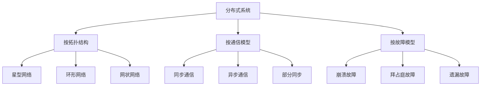

# 04. 分布式系统与共识理论：协调与一致性

## 目录

1. [4.1 分布式系统基础](#41-分布式系统基础)
2. [4.2 系统模型与故障](#42-系统模型与故障)
3. [4.3 共识问题形式化](#43-共识问题形式化)
4. [4.4 经典共识算法](#44-经典共识算法)
5. [4.5 拜占庭容错共识](#45-拜占庭容错共识)
6. [4.6 区块链共识机制](#46-区块链共识机制)
7. [4.7 分布式系统验证](#47-分布式系统验证)
8. [4.8 系统设计应用](#48-系统设计应用)

## 4.1 分布式系统基础

### 4.1.1 分布式系统定义

**定义 4.1.1** (分布式系统) 分布式系统是一个三元组 $\mathcal{D} = (N, C, P)$，其中：

- $N$ 是节点集
- $C$ 是通信网络
- $P$ 是进程集

**定义 4.1.2** (分布式系统特征) 分布式系统具有以下特征：

1. **并发性**：多个节点同时执行
2. **异步性**：消息传递时间不确定
3. **故障性**：节点可能发生故障
4. **部分失效**：系统部分功能失效

**定理 4.1.1** (分布式系统的复杂性) 分布式系统的复杂性源于节点间的协调需求。

**证明** 通过协调分析：

1. 多个节点需要协调行动
2. 协调需要通信和同步
3. 通信和同步引入复杂性

### 4.1.2 分布式系统的挑战

**定义 4.1.3** (故障模型) 故障模型描述节点可能的故障类型：

- **崩溃故障**：节点停止响应
- **拜占庭故障**：节点任意行为
- **遗漏故障**：节点丢失消息

**定义 4.1.4** (网络模型) 网络模型描述通信网络的特性：

- **同步网络**：消息传递时间有界
- **异步网络**：消息传递时间无界
- **部分同步网络**：消息传递时间有界但未知

**定理 4.1.2** (FLP不可能性) 在异步系统中，即使只有一个崩溃故障，也无法实现共识。

**证明** 通过反证法：

1. 假设存在解决共识的算法
2. 构造执行序列使得算法无法终止
3. 矛盾，因此不存在这样的算法

### 4.1.3 分布式系统分类

**定义 4.1.5** (系统分类) 分布式系统按不同维度分类：

## 4.2 系统模型与故障

### 4.2.1 系统模型

**定义 4.2.1** (系统状态) 系统状态是一个函数 $s: N \to S$，其中 $S$ 是节点状态集。

**定义 4.2.2** (系统配置) 系统配置是一个三元组 $C = (s, M, N)$，其中：

- $s$ 是系统状态
- $M$ 是消息集
- $N$ 是节点集

**定义 4.2.3** (系统执行) 系统执行是配置序列 $C_0, C_1, C_2, \ldots$，其中每个配置通过事件转换。

**定理 4.2.1** (系统执行的性质) 系统执行反映了分布式系统的所有可能行为。

**证明** 通过执行定义：

1. 每个执行对应系统的一种可能行为
2. 所有可能的执行构成系统行为空间
3. 因此执行完全描述系统行为

### 4.2.2 故障模型

**定义 4.2.4** (崩溃故障) 崩溃故障是节点永久停止响应。

**定义 4.2.5** (拜占庭故障) 拜占庭故障是节点任意行为，可能发送错误消息。

**定义 4.2.6** (故障阈值) 故障阈值是系统能够容忍的最大故障节点数。

**定理 4.2.2** (拜占庭容错条件) 在拜占庭故障下，系统需要至少 $3f+1$ 个节点才能容忍 $f$ 个故障。

**证明** 通过投票分析：

1. 正确节点需要形成多数
2. 拜占庭节点可能投票不一致
3. 因此需要 $3f+1$ 个节点

### 4.2.3 网络模型

**定义 4.2.7** (同步网络) 同步网络中消息传递时间有上界。

**定义 4.2.8** (异步网络) 异步网络中消息传递时间无上界。

**定义 4.2.9** (部分同步网络) 部分同步网络中消息传递时间有上界但未知。

**定理 4.2.3** (网络模型的影响) 网络模型影响分布式算法的设计。

**证明** 通过算法分析：

1. 同步网络允许基于时间的算法
2. 异步网络需要基于事件的算法
3. 因此网络模型决定算法设计

## 4.3 共识问题形式化

### 4.3.1 共识问题定义

**定义 4.3.1** (共识问题) 共识问题是多个节点对某个值达成一致。

**定义 4.3.2** (共识性质) 共识算法必须满足以下性质：

1. **一致性**：所有正确节点决定相同值
2. **有效性**：如果所有节点提议相同值，则决定该值
3. **终止性**：所有正确节点最终决定某个值

**定理 4.3.1** (共识的必要性) 共识是分布式系统的基础问题。

**证明** 通过问题归约：

1. 许多分布式问题可以归约为共识
2. 共识是分布式协调的核心
3. 因此共识是基础问题

### 4.3.2 共识问题的复杂性

**定义 4.3.3** (共识复杂度) 共识复杂度是解决共识问题所需的最少轮数。

**定义 4.3.4** (消息复杂度) 消息复杂度是解决共识问题所需的消息数量。

**定理 4.3.2** (共识下界) 在同步网络中，共识至少需要 $f+1$ 轮。

**证明** 通过轮数分析：

1. 每轮最多消除一个故障
2. 需要 $f$ 轮消除所有故障
3. 因此至少需要 $f+1$ 轮

### 4.3.3 共识变种

**定义 4.3.5** (弱共识) 弱共识允许部分节点不决定。

**定义 4.3.6** (随机共识) 随机共识以概率保证性质。

**定义 4.3.7** (最终共识) 最终共识允许临时不一致。

**定理 4.3.3** (共识变种的关系) 不同共识变种具有不同的复杂度。

**证明** 通过性质分析：

1. 弱化性质降低复杂度
2. 随机化可能降低复杂度
3. 因此变种影响复杂度

## 4.4 经典共识算法

### 4.4.1 Paxos算法

**定义 4.4.1** (Paxos算法) Paxos是一个三阶段共识算法。

**定义 4.4.2** (Paxos阶段) Paxos包含以下阶段：

1. **Prepare阶段**：提议者请求承诺
2. **Accept阶段**：提议者提议值
3. **Learn阶段**：学习者学习决定的值

**定理 4.4.1** (Paxos正确性) Paxos算法在异步系统中满足共识性质。

**证明** 通过不变式：

1. 每个阶段维护关键不变式
2. 不变式确保安全性
3. 终止性通过随机化保证

### 4.4.2 Raft算法

**定义 4.4.3** (Raft算法) Raft是一个基于领导者的共识算法。

**定义 4.4.4** (Raft角色) Raft包含以下角色：

- **Leader**：处理所有客户端请求
- **Follower**：响应Leader请求
- **Candidate**：参与领导者选举

**定理 4.4.2** (Raft安全性) Raft算法保证日志一致性。

**证明** 通过日志匹配：

1. 领导者选举保证唯一性
2. 日志复制保证一致性
3. 安全性通过选举约束保证

### 4.4.3 算法比较

**定理 4.4.3** (算法复杂度比较) 不同共识算法的复杂度：

| 算法 | 轮数复杂度 | 消息复杂度 | 故障容忍 |
|------|------------|------------|----------|
| Paxos | $O(f)$ | $O(n^2)$ | $f < n/2$ |
| Raft | $O(f)$ | $O(n)$ | $f < n/2$ |
| PBFT | $O(f)$ | $O(n^2)$ | $f < n/3$ |

**证明** 通过复杂度分析：

1. 轮数复杂度由故障数量决定
2. 消息复杂度由网络拓扑决定
3. 故障容忍由算法设计决定

## 4.5 拜占庭容错共识

### 4.5.1 拜占庭故障模型

**定义 4.5.1** (拜占庭故障) 拜占庭故障是节点可能任意行为的故障。

**定义 4.5.2** (拜占庭共识) 拜占庭共识是在拜占庭故障下的共识问题。

**定理 4.5.1** (拜占庭容错下界) 拜占庭共识需要至少 $3f+1$ 个节点才能容忍 $f$ 个故障。

**证明** 通过反证法：

1. 假设 $n \leq 3f$ 个节点可以容忍 $f$ 个故障
2. 将节点分为三组，每组最多 $f$ 个节点
3. 构造执行使得不同组决定不同值
4. 矛盾，因此需要 $n > 3f$

### 4.5.2 PBFT算法

**定义 4.5.3** (PBFT算法) PBFT是实用的拜占庭容错算法。

**定义 4.5.4** (PBFT阶段) PBFT包含以下阶段：

1. **Pre-prepare**：领导者提议请求
2. **Prepare**：节点准备请求
3. **Commit**：节点提交请求
4. **Reply**：节点回复客户端

**定理 4.5.2** (PBFT正确性) PBFT算法在拜占庭故障下满足共识性质。

**证明** 通过视图转换：

1. 每个视图有唯一领导者
2. 视图转换保证活性
3. 三阶段协议保证安全性

### 4.5.3 拜占庭容错变种

**定义 4.5.5** (弱拜占庭) 弱拜占庭故障有行为限制。

**定义 4.5.6** (自适应拜占庭) 自适应拜占庭故障可以改变行为。

**定理 4.5.3** (变种容错能力) 不同拜占庭变种具有不同的容错能力。

**证明** 通过故障分析：

1. 弱化故障模型降低容错要求
2. 自适应故障增加容错难度
3. 因此变种影响容错能力

## 4.6 区块链共识机制

### 4.6.1 区块链基础

**定义 4.6.1** (区块链) 区块链是一个分布式账本系统。

**定义 4.6.2** (区块) 区块是包含交易数据的结构。

**定义 4.6.3** (链) 链是区块通过哈希链接的序列。

**定理 4.6.1** (区块链一致性) 区块链需要共识机制保证一致性。

**证明** 通过分布式特性：

1. 区块链是分布式系统
2. 分布式系统需要共识
3. 因此区块链需要共识机制

### 4.6.2 工作量证明

**定义 4.6.4** (工作量证明) 工作量证明是通过计算难题证明工作。

**定义 4.6.5** (挖矿) 挖矿是寻找有效工作量证明的过程。

**定理 4.6.2** (PoW安全性) 工作量证明在诚实节点占多数时安全。

**证明** 通过最长链规则：

1. 诚实节点遵循最长链规则
2. 攻击者需要超过50%算力
3. 因此诚实多数保证安全

### 4.6.3 权益证明

**定义 4.6.6** (权益证明) 权益证明是通过质押代币证明权益。

**定义 4.6.7** (验证者) 验证者是参与权益证明的节点。

**定理 4.6.3** (PoS效率) 权益证明比工作量证明更高效。

**证明** 通过能源消耗：

1. 权益证明不需要大量计算
2. 计算消耗大量能源
3. 因此权益证明更高效

## 4.7 分布式系统验证

### 4.7.1 形式化验证

**定义 4.7.1** (形式化验证) 形式化验证是通过数学方法验证系统正确性。

**定义 4.7.2** (模型检查) 模型检查是自动验证有限状态系统的方法。

**定理 4.7.1** (验证的可靠性) 形式化验证的结果是可靠的。

**证明** 通过数学基础：

1. 形式化验证基于数学逻辑
2. 数学逻辑是可靠的
3. 因此形式化验证是可靠的

### 4.7.2 分布式系统模型

**定义 4.7.3** (分布式系统模型) 分布式系统模型是系统的抽象表示。

**定义 4.7.4** (状态空间) 状态空间是系统所有可能状态的集合。

**定理 4.7.2** (模型完备性) 如果模型完备，则验证结果适用于实际系统。

**证明** 通过模型对应：

1. 模型正确反映系统行为
2. 验证结果适用于模型
3. 因此验证结果适用于系统

### 4.7.3 验证技术

**定义 4.7.5** (不变式) 不变式是系统始终满足的性质。

**定义 4.7.6** (活性性质) 活性性质是系统最终满足的性质。

**定理 4.7.3** (性质分类) 系统性质可以分为安全性和活性。

**证明** 通过性质定义：

1. 安全性是"坏事不会发生"
2. 活性是"好事最终发生"
3. 因此性质可以分类

## 4.8 系统设计应用

### 4.8.1 分布式数据库

**定义 4.8.1** (分布式数据库) 分布式数据库是数据分布在多个节点的数据库。

**定义 4.8.2** (一致性级别) 一致性级别描述数据一致性的程度。

**定理 4.8.1** (CAP定理) 分布式系统最多同时满足一致性、可用性、分区容错性中的两个。

**证明** 通过反证法：

1. 假设同时满足三个性质
2. 网络分区时无法同时保证一致性和可用性
3. 矛盾，因此最多满足两个

### 4.8.2 微服务架构

**定义 4.8.3** (微服务) 微服务是小型、独立的服务。

**定义 4.8.4** (服务发现) 服务发现是定位服务实例的过程。

**定理 4.8.2** (微服务优势) 微服务架构提供更好的可扩展性和可维护性。

**证明** 通过架构特性：

1. 服务独立部署和扩展
2. 技术栈可以独立选择
3. 因此提供更好的灵活性

### 4.8.3 云原生系统

**定义 4.8.5** (云原生) 云原生是专为云环境设计的系统。

**定义 4.8.6** (容器化) 容器化是使用容器部署应用的技术。

**定理 4.8.3** (云原生优势) 云原生系统提供更好的弹性和可观测性。

**证明** 通过云特性：

1. 自动扩缩容提供弹性
2. 监控和日志提供可观测性
3. 因此云原生系统更优

---

**参考文献**：

1. Lamport, L. (1978). Time, clocks, and the ordering of events in a distributed system. *Communications of the ACM*, 21(7), 558-565.
2. Fischer, M. J., Lynch, N. A., & Paterson, M. S. (1985). Impossibility of distributed consensus with one faulty process. *Journal of the ACM*, 32(2), 374-382.
3. Lamport, L. (1998). The part-time parliament. *ACM Transactions on Computer Systems*, 16(2), 133-169.
4. Ongaro, D., & Ousterhout, J. (2014). In search of an understandable consensus algorithm. *USENIX Annual Technical Conference*, 305-319.
5. Castro, M., & Liskov, B. (1999). Practical Byzantine fault tolerance. *OSDI*, 99, 173-186.
