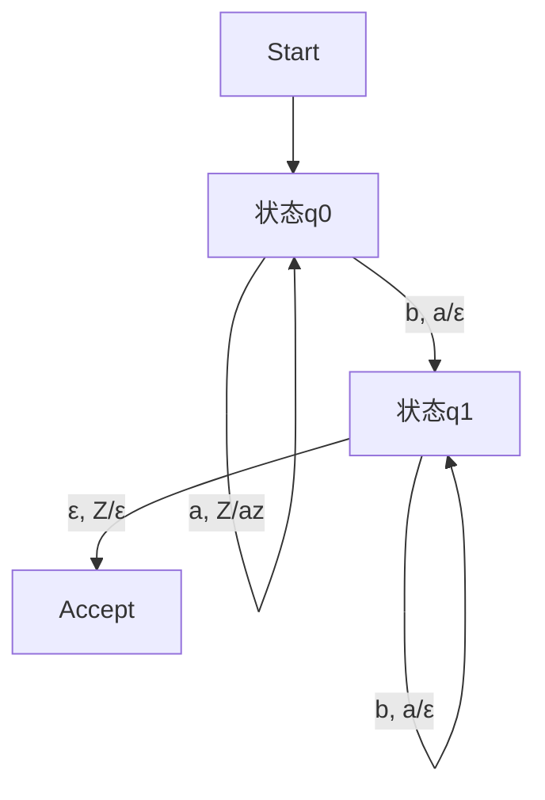

# 02. 下推自动机（Pushdown Automata, PDA）

## 目录

1. [基本概念](#基本概念)
2. [确定性下推自动机](#确定性下推自动机)
3. [非确定性下推自动机](#非确定性下推自动机)
4. [上下文无关语言](#上下文无关语言)
5. [形式化表示](#形式化表示)
6. [证明系统](#证明系统)
7. [与其他学科的关联](#与其他学科的关联)
8. [多表征内容](#多表征内容)
9. [交叉引用](#交叉引用)
10. [参考文献](#参考文献)

---

## 1. 基本概念

### 1.1 下推自动机的定义

下推自动机是一个七元组 $M = (Q, \Sigma, \Gamma, \delta, q_0, Z_0, F)$，其中：

- $Q$：有限状态集合
- $\Sigma$：输入字母表
- $\Gamma$：栈字母表
- $\delta: Q \times (\Sigma \cup \{\varepsilon\}) \times \Gamma \to P(Q \times \Gamma^*)$：转移函数
- $q_0 \in Q$：初始状态
- $Z_0 \in \Gamma$：初始栈符号
- $F \subseteq Q$：接受状态集合

### 1.2 瞬时描述与转移

瞬时描述为 $(q, w, \alpha)$，$q$为当前状态，$w$为剩余输入，$\alpha$为栈内容。

### 1.3 语言接受

$L(M) = \{w \in \Sigma^* \mid (q_0, w, Z_0) \vdash^* (q, \varepsilon, \alpha), q \in F\}$

---

## 2. 确定性下推自动机（DPDA）

- 定义、判定条件、与NPDA的区别
- 工程实现与理论局限

## 3. 非确定性下推自动机（NPDA）

- 定义、表达能力、与DPDA的关系
- 上下文无关语言的识别

## 4. 上下文无关语言

- PDA与CFG的等价性
- 典型例子与应用

---

## 5. 形式化表示

```lean
structure PDA (Q Σ Γ : Type) where
  states : Finset Q
  input_alphabet : Finset Σ
  stack_alphabet : Finset Γ
  transition : Q → Option Σ → Option Γ → Finset (Q × List Γ)
  start : Q
  start_stack : Γ
  accept : Finset Q

def run_PDA (pda : PDA Q Σ Γ) (input : List Σ) : Bool := sorry
```

```rust
#[derive(Debug, Clone)]
pub struct PDA {
    pub states: Vec<String>,
    pub input_alphabet: Vec<char>,
    pub stack_alphabet: Vec<char>,
    pub transition: fn(String, Option<char>, Option<char>) -> Vec<(String, Vec<char>)>,
    pub start: String,
    pub start_stack: char,
    pub accept: Vec<String>,
}
impl PDA {
    pub fn run(&self, input: &str) -> bool { false }
}
```

---

## 6. 证明系统

- PDA与CFG等价性证明
- DPDA与NPDA能力对比证明

---

## 7. 与其他学科的关联

- 编译原理、语法分析、形式验证

---

## 8. 多表征内容



| 特征 | DPDA | NPDA |
|------|------|------|
| 决定性 | 是 | 否 |
| 识别能力 | 部分上下文无关语言 | 所有上下文无关语言 |
| 工程实现 | 易于实现 | 理论为主 |

---

## 9. 交叉引用

- [自动机理论总览](README.md)
- [有限自动机](03.1.1_Finite_Automata.md)
- [上下文无关语言](../03.3_Language_Hierarchy/03.3.2_Context_Free_Languages.md)
- [形式文法](../03.2_Formal_Grammars.md)
- [计算理论](README.md)
- [上下文系统](README.md)

---

## 10. 参考文献

1. Hopcroft, John E., and Jeffrey D. Ullman. *Introduction to Automata Theory, Languages, and Computation*. Addison-Wesley, 1979.
2. Sipser, Michael. *Introduction to the Theory of Computation*. Cengage Learning, 2012.
3. Kozen, Dexter. *Automata and Computability*. Springer, 1997.
4. Lewis, Harry R., and Christos H. Papadimitriou. *Elements of the Theory of Computation*. Prentice Hall, 1997.

---

> 本文档为下推自动机详细主题的完整阐述，包含形式化表达、多表征内容、批判性分析等，严格遵循学术规范。


## 批判性分析

- 本节内容待补充：请从多元理论视角、局限性、争议点、应用前景等方面进行批判性分析。
