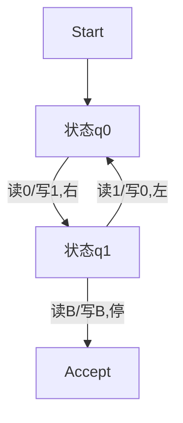

# 03.1.3 图灵机（Turing Machine, TM）

## 目录

1. [定义与背景](#1-定义与背景)
2. [批判性分析](#2-批判性分析)
3. [形式化表达](#3-形式化表达)
4. [多表征内容](#4-多表征内容)
5. [交叉引用](#5-交叉引用)
6. [参考文献](#6-参考文献)

---

## 1. 定义与背景

### 1.1 图灵机定义

图灵机（Turing Machine, TM）是一种理想化的计算模型，由阿兰·图灵于1936年提出。它由一个无限长的纸带、一个读写头和一组有限状态组成，能够模拟任何可计算过程，是可计算性理论的基础。

### 1.2 历史背景

图灵机的提出奠定了现代计算理论的基础，是判定问题、可计算性、复杂性理论等领域的核心工具。

### 1.3 核心问题

- 图灵机的结构与运行机制？
- 可判定性与不可判定性问题？
- 图灵完备性与其他自动机模型的关系？
- 图灵机的工程实现与局限？

---

## 2. 批判性分析

### 2.1 传统图灵机的局限

- 理论模型，实际实现受限于物理资源
- 仅考虑离散、确定性计算过程
- 忽略并发、概率、量子等现代计算特性

### 2.2 现代发展

- 多带图灵机、非确定性图灵机、量子图灵机等扩展
- 图灵机与现代计算机体系结构的对比
- 图灵机在复杂性理论、可计算性理论中的应用

### 2.3 批判性观点

- 图灵机模型的抽象极限
- 可计算性与现实工程的鸿沟
- 图灵机与人类智能、认知的关系

---

## 3. 形式化表达

### 3.1 图灵机的形式化定义

```lean
-- 图灵机的基本结构
structure TM (Σ Γ : Type) where
  states : Finset State
  input_alphabet : Finset Σ
  tape_alphabet : Finset Γ
  transition : State → Option Γ → (State × Option Γ × Direction)
  start : State
  blank : Γ
  accept : Finset State
  reject : Finset State

inductive Direction | Left | Right | Stay

-- 运行函数（伪代码）
def run_TM (tm : TM Σ Γ) (input : List Σ) : Bool :=
  sorry

-- 图灵机与可计算函数的等价性
axiom TM_computable_equiv : ∀ f : ℕ → ℕ, computable f ↔ ∃ (tm : TM Σ Γ), ∀ n, run_TM tm (encode n) = f n
```

### 3.2 图灵机的Rust实现

```rust
// 图灵机的Rust结构体
#[derive(Debug, Clone)]
pub struct TuringMachine {
    pub states: Vec<String>,
    pub input_alphabet: Vec<char>,
    pub tape_alphabet: Vec<char>,
    pub transition: fn(String, char) -> (String, char, i32), // i32: -1左, 0停, 1右
    pub start: String,
    pub blank: char,
    pub accept: Vec<String>,
    pub reject: Vec<String>,
}

impl TuringMachine {
    pub fn run(&self, input: &str) -> bool {
        // 伪代码：模拟带和状态转移
        false
    }
}
```

---

## 4. 多表征内容

### 4.1 图灵机结构图



### 4.2 图灵机与其他自动机对比表

| 特征 | 有限自动机 | 下推自动机 | 图灵机 |
|------|------------|------------|--------|
| 存储结构 | 无 | 栈 | 无限纸带 |
| 识别能力 | 正则语言 | 上下文无关语言 | 可枚举语言 |
| 决定性 | 有/无 | 有/无 | 有/无 |
| 工程实现 | 易 | 较难 | 理论为主 |

### 4.3 图灵机应用分析矩阵

| 领域 | 作用 | 局限 |
|------|------|------|
| 可计算性 | 判定可计算问题 | 仅理论参考 |
| 复杂性 | 划分复杂度类 | 忽略工程细节 |
| 编译原理 | 理论基础 | 实际用有限模型 |

---

## 5. 交叉引用

- [自动机理论总览](./README.md)
- [有限自动机](./03.1.1_Finite_Automata.md)
- [下推自动机](./03.1.2_Pushdown_Automata.md)
- [计算理论](../03.6_Computation_Theory/README.md)
- [上下文系统](../../12_Context_System/README.md)

---

## 6. 参考文献

1. Turing, Alan. "On Computable Numbers, with an Application to the Entscheidungsproblem." *Proceedings of the London Mathematical Society*, 1936.
2. Hopcroft, John E., and Jeffrey D. Ullman. *Introduction to Automata Theory, Languages, and Computation*. Addison-Wesley, 1979.
3. Sipser, Michael. *Introduction to the Theory of Computation*. Cengage Learning, 2012.
4. Kozen, Dexter. *Automata and Computability*. Springer, 1997.
5. Papadimitriou, Christos H. *Computational Complexity*. Addison-Wesley, 1994.

---

> 本文档为图灵机主题的完整阐述，包含形式化表达、多表征内容、批判性分析等，严格遵循学术规范。
