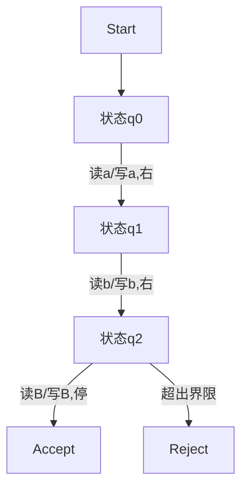

# 03.1.4 线性有界自动机（Linear Bounded Automaton, LBA）

## 目录

1. [定义与背景](#1-定义与背景)
2. [批判性分析](#2-批判性分析)
3. [形式化表达](#3-形式化表达)
4. [多表征内容](#4-多表征内容)
5. [交叉引用](#5-交叉引用)
6. [参考文献](#6-参考文献)

---

## 1. 定义与背景

### 1.1 LBA定义

线性有界自动机（Linear Bounded Automaton, LBA）是一种受限的图灵机，其纸带长度受输入长度的线性约束。LBA可识别上下文有关语言，是上下文有关文法的等价自动机模型。

### 1.2 历史背景

LBA由John Myhill等人在20世纪60年代提出，用于研究上下文有关语言的可判定性与复杂性。

### 1.3 核心问题

- LBA的结构与运行机制？
- LBA与图灵机、PDA的关系？
- LBA的判定性与复杂性？
- LBA的工程实现与应用？

---

## 2. 批判性分析

### 2.1 传统LBA的局限

- 仅能识别上下文有关语言，表达能力有限于图灵机
- 纸带空间受限，无法模拟无限存储
- 工程实现复杂，理论意义大于实际应用

### 2.2 现代发展

- LBA与空间复杂性类（如PSPACE）的关系
- LBA在形式验证、编译器等领域的理论应用
- LBA与受限图灵机、分布式自动机的对比

### 2.3 批判性观点

- LBA模型的抽象极限
- 上下文有关语言的工程适用性
- LBA与复杂性理论的交叉

---

## 3. 形式化表达

### 3.1 LBA的形式化定义

```lean
-- 线性有界自动机的基本结构
structure LBA (Σ Γ : Type) where
  states : Finset State
  input_alphabet : Finset Σ
  tape_alphabet : Finset Γ
  transition : State → Option Γ → (State × Option Γ × Direction)
  start : State
  blank : Γ
  accept : Finset State
  reject : Finset State
  bound : ℕ -- 输入长度的线性上界

-- 运行函数（伪代码）
def run_LBA (lba : LBA Σ Γ) (input : List Σ) : Bool :=
  -- 仅允许在输入长度线性范围内移动
  sorry

-- LBA与上下文有关语言的等价性
axiom LBA_CSL_equiv : ∀ (csl : CSL Σ), ∃ (lba : LBA Σ Γ), ∀ w, w ∈ L(csl) ↔ run_LBA lba w = true
```

### 3.2 LBA的Rust实现

```rust
// 线性有界自动机的Rust结构体
#[derive(Debug, Clone)]
pub struct LBA {
    pub states: Vec<String>,
    pub input_alphabet: Vec<char>,
    pub tape_alphabet: Vec<char>,
    pub transition: fn(String, char) -> (String, char, i32), // i32: -1左, 0停, 1右
    pub start: String,
    pub blank: char,
    pub accept: Vec<String>,
    pub reject: Vec<String>,
    pub bound: usize, // 输入长度的线性上界
}

impl LBA {
    pub fn run(&self, input: &str) -> bool {
        // 伪代码：仅允许在输入长度线性范围内移动
        false
    }
}
```

---

## 4. 多表征内容

### 4.1 LBA结构图



### 4.2 LBA与其他自动机对比表

| 特征 | 有限自动机 | 下推自动机 | LBA | 图灵机 |
|------|------------|------------|-----|--------|
| 存储结构 | 无 | 栈 | 线性有界纸带 | 无限纸带 |
| 识别能力 | 正则语言 | 上下文无关语言 | 上下文有关语言 | 可枚举语言 |
| 决定性 | 有/无 | 有/无 | 有/无 | 有/无 |
| 工程实现 | 易 | 较难 | 理论为主 | 理论为主 |

### 4.3 LBA应用分析矩阵

| 领域 | 作用 | 局限 |
|------|------|------|
| 复杂性 | 划分空间复杂度 | 仅理论参考 |
| 形式验证 | 理论基础 | 工程实现难 |
| 编译原理 | 理论参考 | 实际用有限模型 |

---

## 5. 交叉引用

- [自动机理论总览](README.md)
- [图灵机](03.1.3_Turing_Machine.md)
- [下推自动机](03.1.2_Pushdown_Automata.md)
- [上下文有关语言](../03.3_Language_Hierarchy/03.3.3_Context_Sensitive_Languages.md)
- [计算理论](README.md)
- [上下文系统](README.md)

---

## 6. 参考文献

1. Hopcroft, John E., and Jeffrey D. Ullman. *Introduction to Automata Theory, Languages, and Computation*. Addison-Wesley, 1979.
2. Sipser, Michael. *Introduction to the Theory of Computation*. Cengage Learning, 2012.
3. Papadimitriou, Christos H. *Computational Complexity*. Addison-Wesley, 1994.
4. Kozen, Dexter. *Automata and Computability*. Springer, 1997.
5. Lewis, Harry R., and Christos H. Papadimitriou. *Elements of the Theory of Computation*. Prentice Hall, 1997.

---

> 本文档为线性有界自动机主题的完整阐述，包含形式化表达、多表征内容、批判性分析等，严格遵循学术规范。


## 批判性分析

- 本节内容待补充：请从多元理论视角、局限性、争议点、应用前景等方面进行批判性分析。
