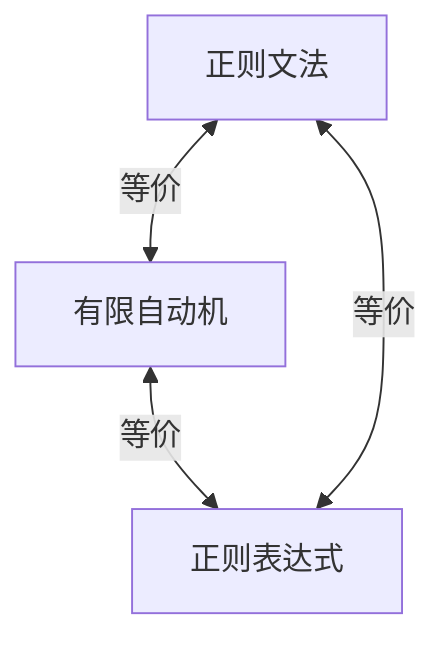

# 03.2.1 正则文法（Regular Grammars）

## 目录

- [03.2.1 正则文法（Regular Grammars）](#0321-正则文法regular-grammars)
  - [目录](#目录)
  - [1. 定义与背景](#1-定义与背景)
  - [2. 批判性分析](#2-批判性分析)
  - [3. 形式化表达](#3-形式化表达)
  - [4. 多表征内容](#4-多表征内容)
    - [与有限自动机的等价性](#与有限自动机的等价性)
  - [5. 交叉引用](#5-交叉引用)
  - [6. 参考文献](#6-参考文献)

---

## 1. 定义与背景

正则文法是生成正则语言的形式文法，分为左线性文法和右线性文法，与有限自动机等价。

---

## 2. 批判性分析

- **优点**: 结构简单，易于分析和实现，判定性好。
- **缺点**: 表达能力弱，无法处理非正则语言（如平衡括号）。

---

## 3. 形式化表达

**右线性文法**: 产生式形如 $A \to aB$ 或 $A \to a$。
**左线性文法**: 产生式形如 $A \to Ba$ 或 $A \to a$。

```lean
-- 正则文法的形式化定义 (以右线性为例)
inductive Production (N T : Type)
| terminal (n : N) (t : T) : Production
| nonterminal (n1 : N) (t : T) (n2 : N) : Production

-- 验证一个文法是否为正则文法
def is_regular (g : Grammar N T) : Bool :=
  ∀ p ∈ g.productions,
    match p with
    | (A, [Term t, NonTerm B]) => true
    | (A, [Term t]) => true
    | _ => false
```

---

## 4. 多表征内容

### 与有限自动机的等价性

- 任何右线性文法都可以转换为一个等价的NFA。
- 任何NFA都可以转换为一个等价的右线性文法。



---

## 5. 交叉引用

- [形式文法总览](../03.2_Formal_Grammars.md)
- [有限自动机](../01_Automata_Theory/03.1.1_Finite_Automata.md)
- [正则语言](../03.3_Language_Hierarchy/03.3.1_Regular_Languages.md)
- [计算理论](README.md)

---

## 6. 参考文献

1. Hopcroft, John E., et al. *Introduction to Automata Theory, Languages, and Computation*. 2006.
2. Sipser, Michael. *Introduction to the Theory of Computation*. 2012.


## 批判性分析

- 本节内容待补充：请从多元理论视角、局限性、争议点、应用前景等方面进行批判性分析。
