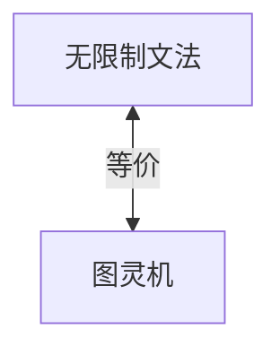

# 03.2.4 无限制文法（Unrestricted Grammars）

## 目录

- [03.2.4 无限制文法（Unrestricted Grammars）](#0324-无限制文法unrestricted-grammars)
  - [目录](#目录)
  - [1. 定义与背景](#1-定义与背景)
  - [2. 批判性分析](#2-批判性分析)
  - [3. 形式化表达](#3-形式化表达)
  - [4. 多表征内容](#4-多表征内容)
    - [与图灵机的等价性](#与图灵机的等价性)
  - [5. 交叉引用](#5-交叉引用)
  - [6. 参考文献](#6-参考文献)

---

## 1. 定义与背景

无限制文法对产生式没有任何限制（除了左侧非空），与图灵机等价，能生成所有递归可枚举语言。

---

## 2. 批判性分析

- **优点**: 拥有最强的表达能力，等价于通用计算模型。
- **缺点**: 判定问题不可解，几乎没有直接的工程应用，纯粹是理论工具。

---

## 3. 形式化表达

**产生式**: $\alpha \to \beta$，其中 $\alpha, \beta$ 是终结符和非终结符的任意串，且 $\alpha$ 非空。

```lean
-- 无限制文法的形式化定义
structure UnrestrictedGrammar (N T : Type) where
  nonterminals : Finset N
  terminals : Finset T
  start : N
  productions : Finset (List (Sum N T) × List (Sum N T))
  -- 约束: lhs 非空

def is_unrestricted (p : Production) : Bool :=
  -- 检查产生式左侧非空
  sorry
```

---

## 4. 多表征内容

### 与图灵机的等价性

任何无限制文法都存在一个等价的图灵机（TM）。



---

## 5. 交叉引用

- [形式文法总览](../03.2_Formal_Grammars.md)
- [图灵机](../01_Automata_Theory/03.1.3_Turing_Machine.md)
- [递归可枚举语言](../03.3_Language_Hierarchy/03.3.4_Recursively_Enumerable_Languages.md)
- [计算理论](README.md)

---

## 6. 参考文献

1. Turing, Alan. "On Computable Numbers, with an Application to the Entscheidungsproblem." 1936.
2. Hopcroft, John E., et al. *Introduction to Automata Theory, Languages, and Computation*. 2006.


## 批判性分析

- 本节内容待补充：请从多元理论视角、局限性、争议点、应用前景等方面进行批判性分析。
