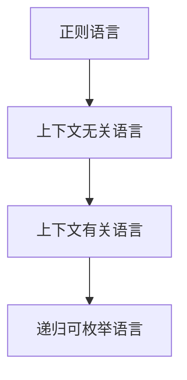

# 03.3.5 语言层级对比与应用

## 目录

- [03.3.5 语言层级对比与应用](#0335-语言层级对比与应用)
  - [目录](#目录)
  - [1. 语言层级结构](#1-语言层级结构)
  - [2. 模型与表达能力对比](#2-模型与表达能力对比)
  - [3. 工程应用与理论边界](#3-工程应用与理论边界)
  - [4. 多表征内容](#4-多表征内容)
  - [5. 交叉引用](#5-交叉引用)
  - [6. 参考文献](#6-参考文献)

---

## 1. 语言层级结构

- 正则语言 ⊂ 上下文无关语言 ⊂ 上下文有关语言 ⊂ 递归可枚举语言
- 每一层级均有对应的自动机模型

---

## 2. 模型与表达能力对比

| 层级 | 典型模型 | 表达能力 | 判定性 |
|------|----------|----------|--------|
| 正则语言 | 有限自动机 | 低 | 可判定 |
| 上下文无关语言 | 下推自动机 | 中 | 部分可判定 |
| 上下文有关语言 | 线性有界自动机 | 高 | PSPACE可判定 |
| 递归可枚举语言 | 图灵机 | 最强 | 不可判定 |

---

## 3. 工程应用与理论边界

- 正则语言：词法分析、模式匹配
- 上下文无关语言：编译器语法分析
- 上下文有关语言：理论研究、复杂性分析
- 递归可枚举语言：可计算性理论、不可判定性分析

---

## 4. 多表征内容

---

## 5. 交叉引用

- [自动机理论总览](../01_Automata_Theory/README.md)
- [正则语言](./03.3.1_Regular_Languages.md)
- [上下文无关语言](./03.3.2_Context_Free_Languages.md)
- [上下文有关语言](./03.3.3_Context_Sensitive_Languages.md)
- [递归可枚举语言](./03.3.4_Recursively_Enumerable_Languages.md)
- [形式文法](../03.2_Formal_Grammars.md)
- [计算理论](../03.6_Computation_Theory/README.md)

---

## 6. 参考文献

1. Hopcroft, John E., and Jeffrey D. Ullman. *Introduction to Automata Theory, Languages, and Computation*. Addison-Wesley, 1979.
2. Sipser, Michael. *Introduction to the Theory of Computation*. Cengage Learning, 2012.
3. Kozen, Dexter. *Automata and Computability*. Springer, 1997.
