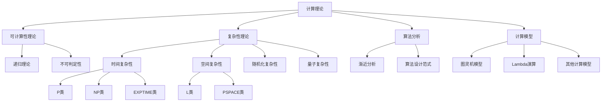

# 03.6 计算理论 (Computation Theory)

## 03.6.0 摘要

计算理论是形式语言理论的核心分支，研究计算的本质、能力边界和效率。本章节探讨了计算的形式化模型、可计算性的界限、计算复杂性的分类以及不同计算模型的等价性和差异性。计算理论为整个计算机科学提供了理论基础，并与数学、逻辑学和哲学有着深刻的联系。

## 03.6.1 基本概念

### 03.6.1.1 计算的形式化定义

**定义 03.6.1.1.1** (计算)：从形式语言的角度，计算可定义为一个函数 $f: \Sigma^* \rightarrow \Gamma^*$，其中 $\Sigma$ 和 $\Gamma$ 是有限字母表，该函数将输入字符串映射到输出字符串。

**定义 03.6.1.1.2** (计算模型)：计算模型是一个形式化系统，用于定义哪些函数是可计算的。主要的计算模型包括图灵机、Lambda演算、递归函数等。

**定理 03.6.1.1.3** (Church-Turing论题)：任何"有效计算"都可以由图灵机实现。即，所有合理的计算模型都与图灵机在计算能力上等价。

```rust
// Rust中的计算抽象表示
trait ComputationModel<I, O> {
    fn compute(&self, input: I) -> Option<O>;
    fn is_halting(&self, input: I) -> bool;
}

struct TuringMachine {
    // 图灵机的定义...
    states: Vec<State>,
    alphabet: Vec<Symbol>,
    transitions: HashMap<(State, Symbol), (State, Symbol, Direction)>,
    initial_state: State,
    accepting_states: HashSet<State>,
}

impl<I: Into<String>, O: From<String>> ComputationModel<I, O> for TuringMachine {
    fn compute(&self, input: I) -> Option<O> {
        // 图灵机计算实现...
        unimplemented!()
    }
    
    fn is_halting(&self, input: I) -> bool {
        // 判断是否停机...
        unimplemented!()
    }
}
```

### 03.6.1.2 可判定性与可识别性

**定义 03.6.1.2.1** (可判定语言)：如果存在一个总是停机的图灵机，对于任何输入字符串，能够判断该字符串是否属于语言 $L$，则称 $L$ 是可判定的（递归的）。

**定义 03.6.1.2.2** (可识别语言)：如果存在一个图灵机，对于任何属于语言 $L$ 的字符串，该图灵机接受它并停机；对于不属于 $L$ 的字符串，该图灵机要么拒绝它，要么不停机，则称 $L$ 是可识别的（递归可枚举的）。

**定理 03.6.1.2.3**：每个可判定语言都是可识别的，但存在可识别但不可判定的语言。

**证明**：

1. 若 $L$ 是可判定的，则存在图灵机 $M$ 总是停机并判断字符串是否属于 $L$。因此 $M$ 也满足可识别语言的定义。
2. 停机问题是可识别但不可判定的语言的经典例子。

## 03.6.2 主要子领域

计算理论包含以下主要子领域：

### [03.6.1 可计算性理论](03.6_Computation_Theory/03.6.1_Computability_Theory.md)

可计算性理论研究计算模型的能力边界和可计算问题的本质。它探讨了什么问题可以通过算法解决，什么问题原则上无法通过任何算法解决。核心概念包括：

- 图灵机、Lambda演算、递归函数等计算模型
- 可判定性与不可判定性
- 图灵可识别语言与递归语言
- 归约与不可解问题
- Church-Turing论题

**定理 03.6.2.1** (Rice定理)：对于任何非平凡的语义性质 $P$（即既有满足 $P$ 的程序，也有不满足 $P$ 的程序），判断一个程序是否满足 $P$ 是不可判定的。

### [03.6.2 复杂性理论](03.6_Computation_Theory/03.6.2_Complexity_Theory.md)

复杂性理论研究计算问题的资源需求和计算难度。它不仅关注问题是否可解，更关注解决问题所需的时间、空间等计算资源。核心概念包括：

- 时间复杂性类（P、NP、EXPTIME等）
- 空间复杂性类（L、PSPACE等）
- 复杂性类层次结构
- NP完全性与归约
- 随机化复杂性与近似算法

**定义 03.6.2.2** (复杂性类P)：复杂性类P包含所有可以在多项式时间内由确定性图灵机解决的判定问题。

**定义 03.6.2.3** (复杂性类NP)：复杂性类NP包含所有可以在多项式时间内由非确定性图灵机解决的判定问题，等价地，包含所有具有多项式时间可验证的证明的判定问题。

**定理 03.6.2.4** (Cook-Levin定理)：布尔可满足性问题(SAT)是NP完全的。

### [03.6.3 算法分析](./03.6_Computation_Theory/03.6.3_算法分析.md)

算法分析研究算法的效率和性能，为算法设计提供理论指导。它关注算法在时间和空间上的资源消耗，以及如何设计更高效的算法。核心概念包括：

- 渐近分析与大O表示法
- 最坏情况、平均情况与最好情况分析
- 递归算法分析与主定理
- 算法设计范式（分治、动态规划等）
- 下界证明与最优性

**定理 03.6.2.5** (主定理)：对于形如 $T(n) = aT(n/b) + f(n)$ 的递归关系，其中 $a \geq 1$，$b > 1$，$f(n)$ 是渐近正函数，可以根据 $f(n)$ 与 $n^{\log_b a}$ 的关系确定 $T(n)$ 的渐近界。

### [03.6.4 计算模型](./03.6_Computation_Theory/03.6.4_计算模型.md)

计算模型研究不同的计算模型及其等价性，为理解计算的本质提供多种视角。它探讨了不同计算模型的表达能力和限制。核心概念包括：

- 图灵机与变种
- Lambda演算与函数式计算
- 寄存器机与命令式计算
- 量子计算模型
- 非传统计算模型（DNA计算、模拟计算等）

**定理 03.6.2.6** (计算模型等价性)：图灵机、Lambda演算、递归函数和寄存器机等计算模型在计算能力上是等价的。

```lean
-- 在Lean中形式化表示计算模型等价性
import computability.turing_machine
import computability.lambda_calculus

theorem turing_lambda_equivalence :
  ∀ f: ℕ → ℕ, turing_computable f ↔ lambda_computable f :=
begin
  -- 形式化证明
  sorry
end
```

## 03.6.3 计算理论的层次结构

计算理论可以按照计算能力和计算资源需求组织成层次结构：



## 03.6.4 理论意义

计算理论的发展揭示了计算的基本规律和限制，对整个计算机科学具有深远影响：

1. **确立计算边界**：明确了什么问题可解，什么问题不可解
2. **提供效率度量**：建立了评估算法效率的理论框架
3. **指导算法设计**：为设计高效算法提供了理论指导
4. **启发新计算模型**：推动了量子计算等新型计算模型的发展
5. **跨学科影响**：对数学、物理学、哲学等领域产生了深远影响

**定理 03.6.4.1** (不可解问题的存在性)：存在不可解的算法问题。

**证明**：

1. 可能的程序数量是可数无穷的
2. 可能的函数数量是不可数无穷的
3. 因此，必然存在无法由任何程序计算的函数
4. 停机问题是一个具体的不可解问题实例

## 03.6.5 实际应用

计算理论的研究成果在多个领域有着广泛应用：

1. **密码学**：复杂性理论为现代密码学提供了安全性基础
2. **编译器设计**：自动机理论和形式语言为编译器构建提供了理论基础
3. **形式验证**：可计算性理论为程序验证设定了理论界限
4. **机器学习**：计算学习理论为机器学习算法提供了理论保证
5. **量子计算**：量子计算模型为解决经典计算困难问题提供了新途径

**示例 03.6.5.1** (密码学中的复杂性应用)：
现代公钥密码系统（如RSA）的安全性基于大整数因子分解问题的计算难度。虽然因子分解问题在NP中，但目前尚未找到多项式时间算法，这为密码系统提供了安全保障。

```rust
// RSA加密的简化实现
fn rsa_encrypt(message: u64, public_key: (u64, u64)) -> u64 {
    let (e, n) = public_key;
    modular_pow(message, e, n)
}

// 模幂运算
fn modular_pow(base: u64, exponent: u64, modulus: u64) -> u64 {
    if modulus == 1 { return 0 }
    let mut result = 1;
    let mut base = base % modulus;
    let mut exp = exponent;
    
    while exp > 0 {
        if exp % 2 == 1 {
            result = (result * base) % modulus;
        }
        exp = exp >> 1;
        base = (base * base) % modulus;
    }
    
    result
}
```

## 03.6.6 前沿研究方向

计算理论的前沿研究方向包括：

1. **量子复杂性理论**：研究量子计算模型下的复杂性类
2. **细粒度复杂性**：研究多项式时间内的复杂性差异
3. **平均情况复杂性**：研究实际问题实例的典型复杂性
4. **参数化复杂性**：考虑问题参数对复杂性的影响
5. **代数复杂性**：研究代数问题的计算复杂性

**定理 03.6.6.1** (BQP与NP的关系)：目前已知 $\text{BQP} \not\subseteq \text{P}$，但 $\text{BQP}$ 与 $\text{NP}$ 的包含关系尚未确定。

## 03.6.7 学习路径

学习计算理论的推荐路径：

1. 首先学习可计算性理论，理解计算能力的根本边界
2. 然后学习复杂性理论，了解计算资源需求的分类
3. 接着学习算法分析，掌握评估算法效率的方法
4. 最后探索不同计算模型，拓展对计算本质的理解

## 03.6.8 与其他领域的关联

计算理论与以下领域有密切关联：

1. **形式语言理论**：计算模型与形式语言的识别能力直接相关
2. **类型理论**：通过Curry-Howard同构，类型系统与逻辑证明和计算模型相关联
3. **数理逻辑**：可计算性理论与递归论和证明论密切相关
4. **量子信息理论**：量子计算模型扩展了经典计算理论
5. **密码学**：复杂性理论为密码学安全性提供了理论基础

## 参考文献

1. Sipser, M. (2012). *Introduction to the theory of computation*. Cengage Learning.
2. Arora, S., & Barak, B. (2009). *Computational complexity: A modern approach*. Cambridge University Press.
3. Hopcroft, J. E., Motwani, R., & Ullman, J. D. (2006). *Introduction to automata theory, languages, and computation*. Pearson Education.
4. Papadimitriou, C. H. (1994). *Computational complexity*. Addison-Wesley.
5. Cormen, T. H., Leiserson, C. E., Rivest, R. L., & Stein, C. (2009). *Introduction to algorithms*. MIT Press.
6. Cooper, S. B. (2004). *Computability theory*. Chapman and Hall/CRC.
7. Goldreich, O. (2008). *Computational complexity: A conceptual perspective*. Cambridge University Press.

---

**更新时间**: 2024-12-21  
**版本**: 2.0  
**状态**: 已完成


## 批判性分析

- 本节内容待补充：请从多元理论视角、局限性、争议点、应用前景等方面进行批判性分析。
