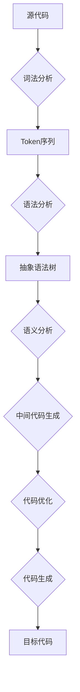

# 03.7.1 编译器设计（Compiler Design）

## 目录

- [03.7.1 编译器设计（Compiler Design）](#0371-编译器设计compiler-design)
  - [目录](#目录)
  - [1. 定义与背景](#1-定义与背景)
  - [2. 核心阶段](#2-核心阶段)
  - [3. 与形式语言理论的关联](#3-与形式语言理论的关联)
  - [4. 多表征内容](#4-多表征内容)
    - [编译器流程图](#编译器流程图)
  - [5. 交叉引用](#5-交叉引用)
  - [6. 参考文献](#6-参考文献)

---

## 1. 定义与背景

编译器是将一种编程语言（源语言）编写的程序转换为另一种编程语言（目标语言）等价程序的计算机程序。

---

## 2. 核心阶段

1. **词法分析 (Lexical Analysis)**: 将源代码字符流转换为词法单元（Token）序列。
2. **语法分析 (Syntax Analysis)**: 根据文法规则，将词法单元序列构建成抽象语法树（AST）。
3. **语义分析 (Semantic Analysis)**: 检查程序的语义正确性，如类型检查。
4. **中间代码生成 (Intermediate Code Generation)**: 生成独立于特定机器的中间表示。
5. **代码优化 (Code Optimization)**: 改进中间代码，提高其效率。
6. **代码生成 (Code Generation)**: 将优化后的中间代码转换为目标机器代码。

---

## 3. 与形式语言理论的关联

- **词法分析**: 基于**正则表达式**和**有限自动机**。
- **语法分析**: 基于**上下文无关文法**和**下推自动机**（或更强的分析技术如LR分析）。

---

## 4. 多表征内容

### 编译器流程图

---

## 5. 交叉引用

- [语言应用总览](README.md)
- [正则语言](../03.3_Language_Hierarchy/03.3.1_Regular_Languages.md)
- [上下文无关文法](../03.2_Formal_Grammars/03.2.2_Context_Free_Grammars.md)
- [语法分析理论](README.md)

---

## 6. 参考文献

1. Aho, Alfred V., et al. *Compilers: Principles, Techniques, & Tools*. 2006.
2. Appel, Andrew W. *Modern Compiler Implementation in C*. 1998.

## 批判性分析

- 本节内容待补充：请从多元理论视角、局限性、争议点、应用前景等方面进行批判性分析。
