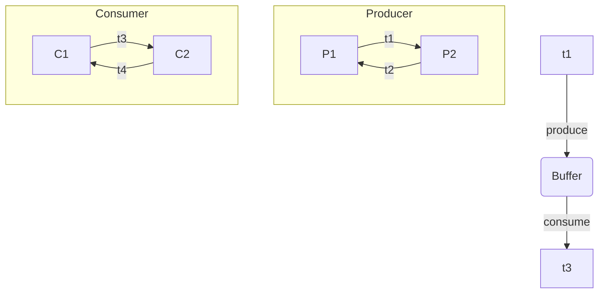

# 03.8.3 分布式与并发自动机（Distributed and Concurrent Automata）

## 目录

- [03.8.3 分布式与并发自动机（Distributed and Concurrent Automata）](#0383-分布式与并发自动机distributed-and-concurrent-automata)
  - [目录](#目录)
  - [1. 定义与背景](#1-定义与背景)
  - [2. 核心模型](#2-核心模型)
  - [3. 批判性分析](#3-批判性分析)
  - [4. 多表征内容](#4-多表征内容)
    - [Petri网示例](#petri网示例)
  - [5. 交叉引用](#5-交叉引用)
  - [6. 参考文献](#6-参考文献)

---

## 1. 定义与背景

分布式与并发自动机是用于为并发系统（多个计算单元同时运行并交互）建模的形式化工具。它们扩展了经典自动机理论，以处理并行、通信、同步和非确定性等问题。

---

## 2. 核心模型

- **Petri网 (Petri Nets)**: 一种图形化的数学建模语言，用于描述和分析并发系统的动态行为，特别适合于表示资源分配和流程控制。
- **进程代数 (Process Algebra)**: 如CSP、CCS、π-演算，它们使用代数表达式来描述和推理并发进程的交互。
- **输入/输出自动机 (I/O Automata)**: 将系统的行为建模为状态和动作序列，明确区分输入、输出和内部动作。

---

## 3. 批判性分析

- **优点**: 能够精确地描述和分析并发系统的复杂行为，如死锁、活锁和竞争条件。
- **缺点**: 状态空间爆炸问题，即随着组件数量的增加，系统的总状态数会指数级增长，使得分析非常困难。

---

## 4. 多表征内容

### Petri网示例

---

## 5. 交叉引用

- [语言前沿总览](./README.md)
- [自动机理论](../01_Automata_Theory/README.md)
- [并发理论](../../11_Concurrency_Theory/README.md)
- [分布式系统理论](../../09_Distributed_Systems_Theory/README.md)

---

## 6. 参考文献

1. Petri, Carl Adam. "Kommunikation mit Automaten." 1962.
2. Milner, Robin. *Communication and Concurrency*. 1989.
